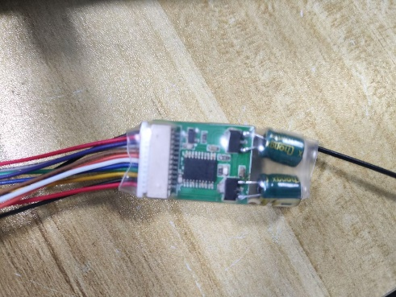
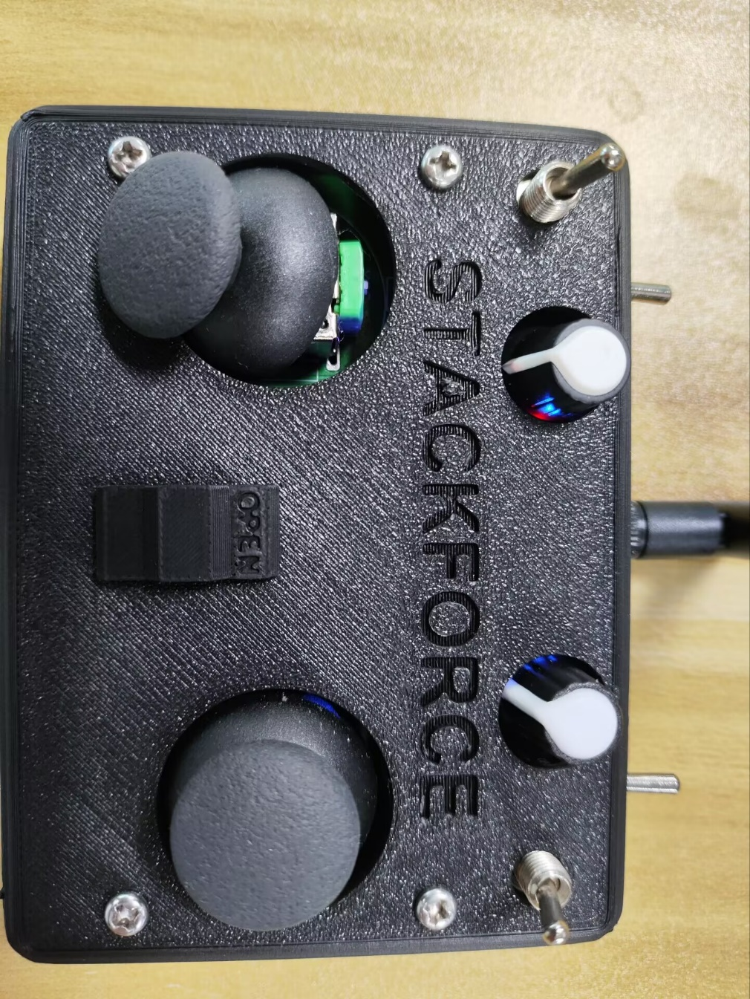

# E-DOC-001 — 遥控器与接收机原厂操作与对频接线指南

> 证据编号：`E-DOC-001-遥控器原厂操作与对频接线指南`  
> 认识论角色：`DOC / SPEC`（原厂操作与接线规程，所有工程声明标记为 `[SPECIFIED]` 或 `[PROCEDURE_DEFINED]`）  
> 状态：`VALID`（原厂技术物料完备，图文与操作定义忠实完整）  
> 规范：**A PATH IS NOT EVIDENCE.** 本文档纯粹记录原厂说明书所规定的接口规范、接线定义与对频操作规程，**严禁混入任何下位机源码实现推论**。

---

## 1. Scope（工程范围）

- **核心工程问题**：
  1. 航模 2.4GHz 接收机物理输出引脚线序、线色约定与极性是什么？
  2. 接收机与主控扩展板（40 引脚、GND、3V3）的物理接线定义是什么？
  3. 遥控器发射机与接收机配对绑定（Binding）的触发时序与双向 LED 状态机是什么？
  4. 遥控器开机与信号发射时，操作规程所要求的物理位姿（摇杆与拨杆初始状态）是什么？
- **应用范围**：StackForce 四轮足机器人原厂配发 2.4GHz 遥控器套件、接收机物理接插件与主控扩展板物理接口。
- **非目标**：
  - 不涵盖下位机 ESP32-S3 C/C++ 固件的中断驱动、脉宽采样与通道滤波实现（见后续独立的 `E-FW-xxx`）；
  - 不涵盖遥控指令在实机上的端到端响应延迟与停机测试（见后续独立的 `E-TEST-xxx`）；
  - 本文档不证明代码是否已正确编写，亦不证明物理通信是否永无丢包。

---

## 2. Source Summary（技术源清单）

| Source ID | 类型 | 规范便携路径 | 签发日期 | 角色与描述 |
|---|---|---|---|---|
| `SRC-PRC-004` | `PROCEDURE` | `doc/四足机器人-origin/0整机操作说明/遥控器对频说明.docx` | 2024-07-05 | 原厂整机操作说明第 0 分册，含 5 幅实物接线与面板操作图示 |

---

## 3. Evidence Parts（可独立引用的工程事实）

<a id="p01-receiver-pinout-polarity"></a>
### P01 — 接收机输出线序与供电极性规范

#### Raw Source Faithful Reproduction（原始证据忠实复刻）
> 原始物料来源：《遥控器对频说明.docx》第一节“接收机接线”图文摘录
> 
> ```text
> [原厂文档文字字面逐字摘录]
> 接收机接线
> 下图是接收机的输出线序，只需要使用到CH1/PPM、GND、VCC。
> 看下图最边是黑色是信号线，最边是红色是电源
> ```
> 
> 

#### Engineering Statement
> [SPECIFIED] 原厂规范规定航模 2.4GHz 接收机输出端仅需引出 3 条线路：外侧黑色线为 **CH1/PPM**（脉冲位置调制复合信号线），外侧红色线为 **VCC**（电源正极线），中间引出端为 **GND**（系统参考地）。

#### Source Observation
- 接收机插头定义明确，不需要接出多通道并行 PWM 排线，仅使用单条 `CH1/PPM`；
- 线色防呆约定清晰：外侧黑为信号、外侧红为电源、中间为地。

#### Engineering Interpretation
- 确立了系统采用单线串行复合脉冲（PPM）方式接入主控，为后续固件单引脚捕获中断提供了原厂规范依据；
- 明确了电源正负极排布，防止现场人员插反导致接收机芯片反向击穿。

#### Limitations
- 原厂文档未注明接收机信号输出电平标准（3.3V TTL 或 5V TTL 容限）与导线特征阻抗；
- 文档未提供接收机内部 RF 芯片型号与天线增益指标。

#### Source Trace
- 文档：《遥控器对频说明.docx》第 1 节第 1~3 段
- 资产：`image1_receiver_pinout.png`

---

<a id="p02-expansion-board-wiring"></a>
### P02 — 主控扩展板物理接口引脚连接定义

#### Raw Source Faithful Reproduction（原始证据忠实复刻）
> 原始物料来源：《遥控器对频说明.docx》第一节接线实物照片与指引
> 
> ```text
> [原厂文档文字字面逐字摘录]
> 将接收机的CH1/PPM、GND、VCC依次接到扩展板上的40引脚、GND、3V3（中间一排）。如下图所示。
> ```
> 
> 

#### Engineering Statement
> [SPECIFIED] 原厂规范明确指定接收机与主控扩展板的物理接线对应关系：**CH1/PPM 接入扩展板 40 号引脚**，**GND 接入扩展板中间排针 GND 端**，**VCC 接入扩展板中间排针 3V3（3.3V）电源轨**。

#### Source Observation
- 明确指出供电轨为中间一排的 `3V3`，绝非 5V 或外接动力电源；
- 信号输入端物理引脚编号为 `40`。

#### Engineering Interpretation
- 规定接收机必须由 3.3V 逻辑电源供电，从硬件上限定了与 ESP32 芯片 IO 容限的兼容性；
- 明确了整机线束的物理装配走线规范，使实机接线具备标准可重复性。

#### Limitations
- 原厂文档属于装配操作说明，未提供扩展板 40 号引脚在主板 PCB 上的原理图网络名称与 ESD 保护电路拓扑（硬件电路细节需由硬件原理图独立证明）；
- 本规范不证明实物插头是否存在虚焊或接触不良。

#### Source Trace
- 文档：《遥控器对频说明.docx》第 1 节第 4 段
- 资产：`image2_expansion_board_wiring.jpeg`

---

<a id="p03-binding-sequence-led-state-machine"></a>
### P03 — 10 秒通断电三次对频时序与双向 LED 指示状态机

#### Raw Source Faithful Reproduction（原始证据忠实复刻）
> 原始物料来源：《遥控器对频说明.docx》第二节“接收机与遥控器对频”
> 
> ```text
> [原厂文档文字字面逐字摘录]
> 接收机与遥控器对频
> 在对频前，先把遥控器关闭，然后接收机在10秒内通断电三次，进入对频状态接收机一秒亮一秒灭
> 然后遥控器使能拨杆往下打使能发送信号，
> 遥控器左遥杆往下拉到最低，
> 给遥控器上电即对频成功，
> 对频成功后接收机灯灭，遥控器蓝灯常亮。
> ```
> 
> 
> 
> 

#### Engineering Statement
> [PROCEDURE_DEFINED] 原厂规程规定 2.4GHz 遥控链路进入对频绑定模式的操作时序为：关闭遥控器发射端，并在 **10 秒窗口内对接收机连续执行 3 次通断电**；进入对频态后接收机 LED 呈 **1 Hz（1 秒亮 1 秒灭）** 闪烁。配对成功后硬件握手完成，**接收机 LED 熄灭，遥控器面板蓝色指示灯常亮**。

#### Source Observation
- 触发对频状态无需外置物理按键，完全依赖电源脉冲序列（10s 内通断电 3 次）；
- 指示灯状态机逻辑闭环：
  - 待配对态：接收机 LED 1 Hz 闪烁；
  - 配对成功态：接收机 LED 熄灭，遥控器蓝灯常亮。

#### Engineering Interpretation
- 证实了接收机采用 FHSS 免物理按键对频机制，避免了在紧凑机身内部开孔或按压微动开关；
- 双色/双端 LED 提供了确定性的现场目视检测判据，便于快速排查无线链路物理层故障。

#### Limitations
- 频繁通断电依赖操作员手动插拔插头，可能对板级供电电容产生充放电毛刺；
- 文档未给出 10 秒 3 次通断电中单次断电的最短持续时间容限（如放电复位电容耗时）。

#### Source Trace
- 文档：《遥控器对频说明.docx》第 2 节
- 资产：`image3_binding_led_before.jpeg`、`image4_binding_led_after.jpeg`

---

<a id="p04-transmitter-arming-safety-pose"></a>
### P04 — 发射机上电安全初始位姿与操作员规程

#### Raw Source Faithful Reproduction（原始证据忠实复刻）
> 原始物料来源：《遥控器对频说明.docx》图文结语
> 
> ```text
> [原厂文档文字字面逐字摘录]
> 然后遥控器使能拨杆往下打使能发送信号，
> 遥控器左遥杆往下拉到最低，
> 给遥控器上电即对频成功，
> 
> 左下摇杆打到最下
> 使能拨杆打到最下
> ```
> 
> 

#### Engineering Statement
> [PROCEDURE_DEFINED] 原厂规程在无线遥控发射机上电与使能发送时，强制要求两项操作员物理安全位姿约束：**使能拨杆置于最下方（使能信号发射）**，**左下摇杆拉至最底部（初始零位）**。

#### Source Observation
- 原始文档以大字号、重复文本及带红色下推箭头的实物面板照片，三重视角强调两项操作：“左下摇杆打到最下”、“使能拨杆打到最下”；
- 拨杆与摇杆的机械位置构成了开机建链的前置条件。

#### Engineering Interpretation
- 该规程构成了操作员层面的防飞车、防突跳安全互锁（Operator Arming Interlock）；
- 规定上电前摇杆拉至最底，确保了无线信号一经建立，发射端输出的是最低控制指令基准，防止机械结构在开机瞬间突跳打手或撞击机械硬限位。

#### Limitations
- 原厂文档定义的是**操作规程约束（Procedural Constraint）**，发射机物理层面无机械防呆锁或强制蜂鸣自锁；
- 若操作员疏忽在摇杆高位上电，发射机硬件层面仍能发射高位脉冲，需由接收端或主控固件提供二次防御（固件层面的防御需由固件证据独立证明）。

#### Source Trace
- 文档：《遥控器对频说明.docx》结语图文
- 资产：`image5_transmitter_stick_positions.jpeg`

---

## 4. Provenance & Artifacts（出处与衍生资产）

- **原始文档物理位置**：`doc/四足机器人-origin/0整机操作说明/遥控器对频说明.docx`
- **签发日期**：2024-07-05
- **解压归档图片资产**：
  - `docs/assets/images/E-DOC-001-遥控器原厂操作与对频接线指南/image1_receiver_pinout.png` (376,265 bytes)
  - `docs/assets/images/E-DOC-001-遥控器原厂操作与对频接线指南/image2_expansion_board_wiring.jpeg` (335,783 bytes)
  - `docs/assets/images/E-DOC-001-遥控器原厂操作与对频接线指南/image3_binding_led_before.jpeg` (96,036 bytes)
  - `docs/assets/images/E-DOC-001-遥控器原厂操作与对频接线指南/image4_binding_led_after.jpeg` (98,760 bytes)
  - `docs/assets/images/E-DOC-001-遥控器原厂操作与对频接线指南/image5_transmitter_stick_positions.jpeg` (612,149 bytes)
