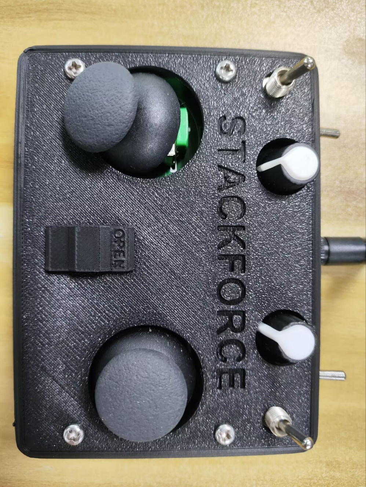
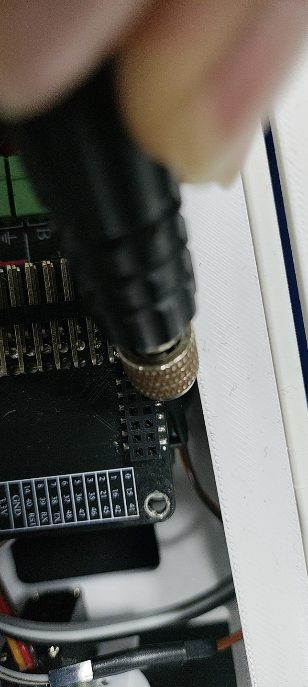
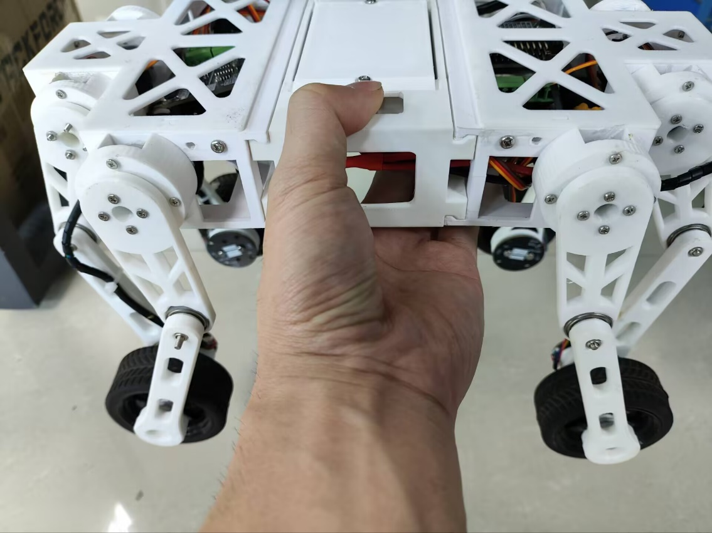
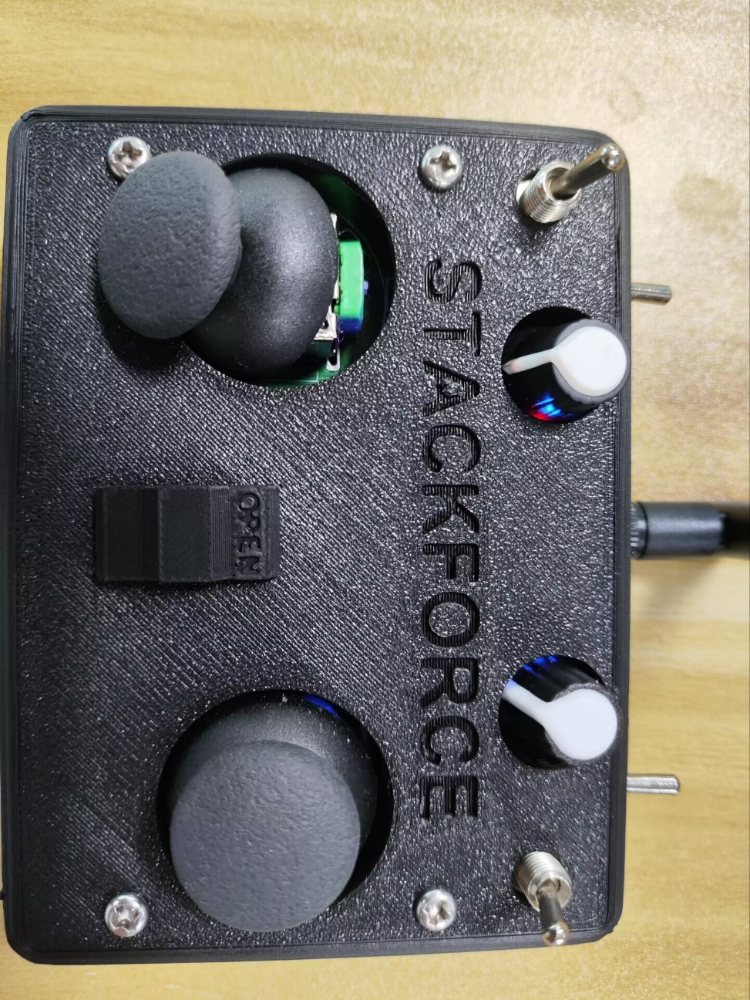
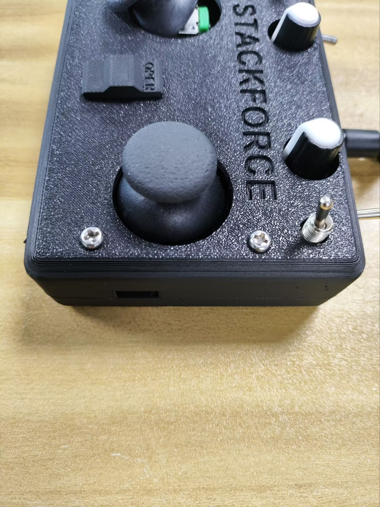

# E-DOC-002 — StackForce 四轮足机器狗出厂基本操作与运动模式规程

> 证据编号：`E-DOC-002-StackForce四足狗基本操作说明`  
> 认识论角色：`DOC / SPEC`（原厂整机操作规程，工程事实标记为 `[SPECIFIED]` 与 `[PROCEDURE_DEFINED]`）  
> 状态：`VALID`（原厂操作文档物料完备，图文与操作时序闭环）  
> 规范：**A PATH IS NOT EVIDENCE.** 本文档纯粹记录原厂手册规定的运动控制映射、模式切换真值表、悬空自检时序与陀螺仪硬件校准规程，**不包含任何固件实现推测或未测动态性能断言**。

---

## 1. Scope（工程范围）

- **核心工程问题**：
  1. 遥控器双摇杆（4 自由度）在原厂系统中的标准动作映射是什么？
  2. 左右双拨杆与滑块组合形成的离散工作模式真值表（车子模式、自稳定、交叉踏步、左右踏步）是什么？
  3. 实机开机冷启动、悬空电机校准与“收腿”确认时序是什么？
  4. 后驱动板 S3 按键触发陀螺仪重校准的规程与遥控器充电维护指标是什么？
- **应用范围**：StackForce 四轮足实机整机操作规程、遥控人机交互输入映射、操作员安全开机与陀螺仪水平标定。
- **非目标**：
  - 不涵盖下位机 C/C++ 固件代码内部的运动学逆解（IK）算法或 PID 参数（见独立的 `E-FW-xxx`）；
  - 不涵盖轮足接触动力学校准与实测最大爬坡/过障指标（见独立的 `E-TEST-xxx`）；
  - 本规程不能证明操作员在地面不平整时自平衡算法永不翻倒。

---

## 2. Source Summary（技术源清单）

| Source ID | 类型 | 规范便携路径 | 签发日期 | 角色与描述 |
|---|---|---|---|---|
| `SRC-PRC-002` | `PROCEDURE` | `doc/四足机器人-origin/0整机操作说明/StackForce四足狗基本操作说明.docx` | 2024-07-05 | 原厂整机操作说明指南，包含 11 幅操作标注图与实物照片 |
| `SRC-PRC-003` | `PROCEDURE` | `doc/四足机器人-origin/0整机操作说明/StackForce四足狗基本操作说明.pdf` | 2024-07-05 | 上述 DOCX 指南的原版对照 PDF 归档件 |

---

## 3. Evidence Parts（可独立引用的工程事实）

<a id="p01-dual-stick-teleop-mapping"></a>
### P01 — 遥控器双摇杆运动控制映射规范

#### Raw Source Faithful Reproduction（原始证据忠实复刻）
> 原始物料来源：《StackForce四足狗基本操作说明.docx》第 1 页图文
> 
> ```text
> [原厂文档文字字面逐字摘录]
> 四轮足机器狗遥控器操作说明
> 控制机器人前进后退
> 控制机器人腿高
> 控制机器人横滚倾角
> 控制机器人左转右转
> ```
> 
> 

#### Engineering Statement
> [SPECIFIED] 原厂规程定义了遥控器双操纵杆的 4 个独立连续控制自由度映射：**左下摇杆垂直方向控制整机腿部升高/降低（机身高度 $H$）**，**左下摇杆水平方向控制机身横滚（Roll）倾角**；**右下摇杆垂直方向控制机体前进/后退移动（线速度 $v_x$）**，**右下摇杆水平方向控制机体左转/右转（偏航角速度 $\omega_z$）**。

#### Source Observation
- 双摇杆完全解耦了机体姿态控制与平面运动控制：
  - 左摇杆专门负责机体姿态调节（腿高基线与横滚角）；
  - 右摇杆专门负责平面移动导航（前后平移与左右差速偏航）。

#### Engineering Interpretation
- 确立了机器人在实机操作层面属于直观的“姿态+运动”分体式控制体系；
- 明确了左手摇杆回中时机体处于名义设计高度与零横滚角，右手摇杆回中时整机速度指令归零。

#### Limitations
- 原厂文档未注明摇杆行程对应的绝对物理量程（如最大腿高升高毫米数、最大横滚角度度数或最大行进线速度 m/s）；
- 操纵杆死区（Deadband）与滤波时间常数未在操作手册中量化给出。

#### Source Trace
- 文档：《StackForce四足狗基本操作说明.docx》第 1 页
- 资产：`image1.jpeg`

---

<a id="p02-mode-switch-matrix"></a>
### P02 — 双拨杆离散状态机与四种工作模式真值表

#### Raw Source Faithful Reproduction（原始证据忠实复刻）
> 原始物料来源：《StackForce四足狗基本操作说明.docx》第 2 页图文
> 
> ```text
> [原厂文档文字字面逐字摘录]
> 四轮足机器狗遥控器操作说明
> 狗子模式下的轮速控制
> 滑到左边最高速
> 滑到最右边不转
> 
> 左边拨杆
> 打到最高：
> 右边拨杆为最低时，机器人关闭自平衡
> 右边拨杆为最高时，机器人左右踏步
> 打到最低：
> 右边拨杆为最低时，机器人开启自平衡
> 右边拨杆为最高时，机器人交叉踏步
> 
> 右边拨杆
> 打到最高：
> 狗子模式，机器人踏步
> 打到最低：
> 车子模式，机器人不踏步
> ```

#### Engineering Statement
> [SPECIFIED] 原厂规程定义了由**左边拨杆（二档）**与**右边拨杆（二档）**组合构成的 $2 	imes 2 = 4$ 种离散工作模式，并由**右上微调拨片**实现轮毂电机转速的无级限制（滑至最左为最高速，滑至最右为完全不转）。

#### 四种工作模式工程真值表（Mode Truth Table）
根据原厂规程原文逐行解析归纳：

| 模式名称 (Mode) | 左边拨杆位置 | 右边拨杆位置 | 踏步步态 (Gait) | 自平衡使能 (Balance) | 驱动轮行为 (Wheels) |
|---|---|---|---|---|---|
| **车子模式 (Car Mode)** | 打到最高 (UP) | 打到最低 (DOWN) | 静止不踏步 | **关闭** (Open-loop) | 纯轮式平移移动 |
| **自稳定模式 (Self-Stabilizing)** | 打到最低 (DOWN) | 打到最低 (DOWN) | 静止不踏步 | **开启** (Active IMU Balance) | 轮式移动 + 动态倾角平衡 |
| **左右踏步模式 (Side-Stepping)** | 打到最高 (UP) | 打到最高 (UP) | 左右腿轮流踏步 | **关闭** | 踏步步态 + 轮速滑块调节 |
| **交叉踏步模式 (Cross-Stepping)** | 打到最低 (DOWN) | 打到最高 (UP) | 对角交叉踏步 | **开启** | 交叉步态 + 轮速滑块调节 |

#### Source Observation
- 右边拨杆是“车”与“狗”的主分界线：最低为纯轮式车模式，最高为腿部踏步狗模式；
- 左边拨杆在车模式下作为“自平衡开关”（上关下开），在狗模式下作为“左右步态与对角交叉步态切换器”（上下切步态）。

#### Engineering Interpretation
- 澄清了整机在物理控制器中存在的 4 种主控状态机逻辑；
- 在 Sim2Real 阶段，仿真环境中的策略导入必须与该离散模式真值表进行严格匹配，防止将“车模式”与“自稳定模式”混淆。

#### Limitations
- 原厂文档未标明拨杆在中间悬空过渡态（若为三档拨片）时的系统响应；
- 文档未注明模式热切换（在运行中直接扳动拨杆）是否具有平滑插值过渡（Ramping）。

#### Source Trace
- 文档：《StackForce四足狗基本操作说明.docx》第 2 页
- 结构化表格：`Mode Truth Table`

---

<a id="p03-cold-start-arming-sequence"></a>
### P03 — 冷机上电初始化、悬空自检与收腿自稳时序

#### Raw Source Faithful Reproduction（原始证据忠实复刻）
> 原始物料来源：《StackForce四足狗基本操作说明.docx》第 3~4 页开机指南
> 
> ```text
> [原厂文档文字字面逐字摘录]
> 四轮足机器狗初次上手
> ① 左下摇杆拉到最低
> ② 使能档打到最低（前两步连接遥控器的操作）
> ③ 往上拨打开遥控电源开关
> ④ 将左上打到最上，右上打到最下
> 红灯表示上电了，蓝灯表示连接了
> 
> ⑤ 保持机器人腿部悬空并平行于地面，机器人腿部自然下垂，保证轮子转动顺畅以便进行校准，打开机器人电源开关，上电后遥控器就会亮蓝色灯表示连接成功
> 电机校准完成后会有一个收腿动作，然后将机器人放置地面
> ```
> 
> 
> 
> 

#### Engineering Statement
> [PROCEDURE_DEFINED] 原厂规程规定机器人冷启动与建链必须执行严格的五步初始化时序：**①左下摇杆拉至最低 $	o$ ②使能档打至最低 $	o$ ③开启遥控器电源 $	o$ ④设置拨杆为车子模式（左上最高/右上最低） $	o$ ⑤实机保持悬空平放且四腿自然下垂后开启机器人主电源**；实机开机后自动执行关节零位与轮电机自检，**必须在目视确认机械“收腿动作”完成后方可放置于平整地面**。

#### Source Observation
- 操作顺序具备强时序前后因果约束：必须先完成遥控器初始化（①~④）并确认红灯与初始档位，再开启机器人电源（⑤）；
- 实机开机必须处于**无负载悬空状态（Suspended State）**，严禁在着地受力状态下直接冷开机；
- 系统具备硬件动作级自检成功握手回馈（“收腿动作”）。

#### Engineering Interpretation
- 悬空开机是为了防止无刷电机 FOC 磁极辨识（Alignment）和舵机寻零时因地面静摩擦力阻碍导致电流过载或电机发烫；
- “收腿动作”是系统自检通过并进入就绪态的关键物理标志，为操作人员提供了无需连接上位机串口的可观测判据。

#### Limitations
- 该规程为**操作员人工操作约束**；若操作人员未悬空即在地面开机，电机可能发生初始震荡抖动，存在齿轮打齿风险。

#### Source Trace
- 文档：《StackForce四足狗基本操作说明.docx》第 3~4 页
- 资产：`image6.jpeg`, `image8.jpeg`

---

<a id="p04-gyro-s3-calibration-and-power-alert"></a>
### P04 — 后驱动板 S3 按键陀螺仪校准与低压声学告警

#### Raw Source Faithful Reproduction（原始证据忠实复刻）
> 原始物料来源：《StackForce四足狗基本操作说明.docx》第 4~5 页
> 
> ```text
> [原厂文档文字字面逐字摘录]
> 机器人放到平地上，然后后驱动按一下S3复位键，校准陀螺仪
> 如果不使用自稳定模式的话可以跳过这一页的操作
> 
> 如果遥控器发出滴滴响表示电池快没电了，可以用5V2A的USB插到下图充电
> ```
> 
> 
> 
> 
> 
> 

#### Engineering Statement
> [PROCEDURE_DEFINED] 在使用自稳定平衡模式前，原厂规程要求将机器人放置于平整地面，**物理按压后驱动板上的 S3 按键一次以触发板载陀螺仪零偏水平校准**；遥控器发射机配备电池低压检测硬件，**当发出连续“滴滴”蜂鸣声响时指示电量告警**，规定使用 **5V 2A USB 标准接口**接入充电。

#### Source Observation
- 陀螺仪零偏校准由硬件物理按键（S3 按键）触发，位于后驱动板上；
- 明确限定“平地上按一下 S3”作为自稳定模式的前置条件；
- 遥控器发射机通过声学蜂鸣器（Buzzer）进行低压报警，充电规格为 5V 2A。

#### Engineering Interpretation
- 证实了 IMU 的零偏偏移（Bias Offset）消除是在着地静止状态下通过局部硬件中断触发软件重采样的；
- 避免了直接使用出厂固定零偏导致的持续漂移倾斜；
- 规范了遥控器维护与充电电气安全参数。

#### Limitations
- S3 按键校准依赖操作员主观判断“地面是否水平”；若在斜坡上按动 S3，系统将把倾斜角度误校准为水平基准，导致起步自平衡倾倒；
- 文档未说明校准过程中的等待静止秒数（如需保持静止几秒）。

#### Source Trace
- 文档：《StackForce四足狗基本操作说明.docx》第 4~5 页
- 资产：`image7.jpeg`, `image9.jpeg`, `image11.jpeg`

---

## 4. Provenance & Artifacts（出处与衍生资产）

- **原始文档物理位置**：
  - `doc/四足机器人-origin/0整机操作说明/StackForce四足狗基本操作说明.docx`
  - `doc/四足机器人-origin/0整机操作说明/StackForce四足狗基本操作说明.pdf`
- **签发日期**：2024-07-05
- **解压归档图片资产**（保存在 `docs/assets/images/E-DOC-002-StackForce四足狗基本操作说明/`）：
  - `image1.jpeg` (585,547 bytes) — 遥控器双摇杆 4 自由度映射示意图
  - `image6.jpeg` (612,149 bytes) — 开机档位、开关与指示灯指引图
  - `image7.jpeg` (198,085 bytes) — 后驱动板 S3 陀螺仪校准按键指引图
  - `image8.jpeg` (346,252 bytes) — 车子模式实机姿态照片
  - `image9.jpeg` (575,406 bytes) — 自稳定模式非平整地面姿态照片
  - `image10.jpeg` (548,292 bytes) — 踏步步态实物照片
  - `image11.jpeg` (517,443 bytes) — 遥控器 5V 2A USB 充电插口指示图
