# E-DOC-003 — 四足机器人整机机械结构安装与硬件调试指南

> 证据编号：`E-DOC-003-四足机器人整机机械安装与调试指南`  
> 认识论角色：`DOC / SPEC`（原厂机械装配与硬件调试规程，工程事实标记为 `[SPECIFIED]` 与 `[PROCEDURE_DEFINED]`）  
> 状态：`VALID`（原厂 76 幅实物组装图解与步骤指引完整）  
> 规范：**A PATH IS NOT EVIDENCE.** 本文档忠实记录原厂安装手册中的紧固件规格、轴承压配、关节间隙套筒、电机磁铁安装、双 MCU 调试切换及舵机供电电位器调压限值，**严禁混入未经实测的动力学假设**。

---

## 1. Scope（工程范围）

- **核心工程问题**：
  1. 机器人各级机械关节、机身机架、舵机外环与轮轴的标准紧固件（螺丝、螺母、轴承）规格与配合要求是什么？
  2. 闭链腿部连杆关节中，白色尼龙套筒、垫片与 M3 防松螺母的装配防松与防抖动工艺要求是什么？
  3. BLDC 轮电机径向磁铁粘贴工艺、编码器固定间距与线束防刮擦规范是什么？
  4. 主控板与驱动板的双 MCU 硬件调试切换键位、指示灯状态机及舵机母线 DC-DC 电位器输出电压调节限制是什么？
- **应用范围**：StackForce 四轮足机器人机械本体硬件组装、闭链五杆关节销轴配合、轮电机总成装配与电气初调。
- **非目标**：
  - 不涵盖整机运动学正逆解数学建模（见 `E-SIM-xxx` / `T-KINEMATICS-xxx`）；
  - 不涵盖实际材料拉伸强度与打印件形变测量（见 `E-TEST-xxx`）；
  - 本规程不能替代实机上电前的电气短路测试。

---

## 2. Source Summary（技术源清单）

| Source ID | 类型 | 规范便携路径 | 签发日期 | 角色与描述 |
|---|---|---|---|---|
| `SRC-PRC-005` | `PROCEDURE` | `doc/四足机器人-origin/1教程/1安装文档.docx` | 2024-07-05 | 原厂整机机械安装与硬件调试教程，含 76 幅实物装配图与详尽工艺说明 |
| `SRC-PRC-006` | `PROCEDURE` | `doc/四足机器人-origin/1教程/1安装文档.pdf` | 2024-07-05 | 上述 DOCX 安装教程的原版对照 PDF 文件 |

---

## 3. Evidence Parts（可独立引用的工程事实）

<a id="p01-fasteners-and-bearings-bom"></a>
### P01 — 标准紧固件规格、轴承与关节辅助件清单

#### Raw Source Faithful Reproduction（原始证据忠实复刻）
> 原始物料来源：《1安装文档.docx》前言“四足轮安装图解”紧固件总表
> 
> ```text
> [原厂文档文字字面逐字摘录]
> 四足轮安装图解
> 垫片、铜柱、M4*18、磁铁、尼龙住（白色套筒）、圆头M3*8、圆头M3*16、平头M3*6、圆头M3*6、舵机盒子里的黑色舵机螺丝、平头M2*12、圆头M2*10、平头M2*6、M3防松螺母、M3螺母、M2螺母、粗一点的M3、细一点的M2
> ```
> 
> 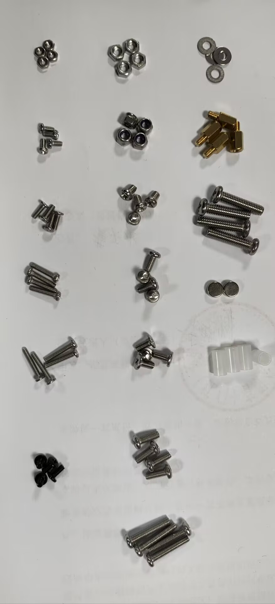

#### Engineering Statement
> [SPECIFIED] 原厂规范定义了整机机械结构的标准紧固件与轴承 BOM 清单：包含 **M4×18**（最大规格螺栓，专用于轮轴主承载销轴）、**M3×16**（用于大腿与外腿主旋转关节）、**平头/圆头 M3×6**、**平头 M2×12**（用于金属舵机片固定）、**圆头 M2×10**、**平头 M2×6**；紧固配套包含 **M3 防松螺母**、**M3 普通螺母**、**M2 螺母**、铜柱、微型垫片、**白色尼龙套筒**以及配套的大/小微型深沟球轴承。

#### 关键标准紧固件工程规格表
| 规格名称 | 螺纹与长度 | 头部形状 | 原厂指定装配位置 | 关键工艺要求 |
|---|---|---|---|---|
| **M4 轮轴螺栓** | $M4 	imes 18	ext{ mm}$ | 圆头内六角 | 外小腿末端穿入驱动轮六角套筒 | 整机最大受力螺栓，直接承载轮轴悬臂载荷 |
| **M3 关节连杆螺栓** | $M3 	imes 16	ext{ mm}$ | 圆头内六角 | 大腿与外腿主旋转铰接关节 | 必须配合垫片使用，拧紧后关节必须转动顺畅 |
| **M3 防松螺母** | M3 标准尼龙锁紧 | 六角带尼龙环 | 压入内腿与外腿关节安装沉孔 | **强制要求圆头朝外压入**，否则失去自锁防脱功能 |
| **M2 舵机盘螺栓** | $M2 	imes 12	ext{ mm}$ | 平头十字/内六角 | 金属舵机盘穿透大腿根部沉孔 | 从大腿背面锁紧金属舵盘齿轮凸台 |
| **M2 舵机外环螺栓** | $M2 	imes 10	ext{ mm}$ | 圆头十字/内六角 | 舵机固定与舵机外环支撑 | 上方配合 M2 螺母，机身下方直接旋入攻丝固定 |
| **M2 轴承压板螺栓** | $M2 	imes 6	ext{ mm}$ | 平头 | 舵机外环轴承压盖与联轴器 | 沉头紧固，表面需与轴承盖板齐平 |
| **关节尼龙套筒** | 白色圆柱阶梯衬套 | - | 大腿与外腿铰接内孔 | **强制放入**，作为轴向隔套消除间隙并抑制整机抖动 |

#### Limitations
- 原厂文档未标明紧固螺栓的材质标号（如 304 不锈钢或 12.9 级高强度碳钢）及标准拧紧力矩（$	ext{N}\cdot	ext{m}$）；
- 未提供深沟球轴承的标准工业型号编号（如 682ZZ / 688ZZ）。

#### Source Trace
- 文档：《1安装文档.docx》前言图文
- 资产：`image3.jpeg`

---

<a id="p02-chassis-and-servo-assembly"></a>
### P02 — 机身主干机架、舵机外环与金属舵盘固定规范

#### Raw Source Faithful Reproduction（原始证据忠实复刻）
> 原始物料来源：《1安装文档.docx》第二节“机架安装”
> 
> ```text
> [原厂文档文字字面逐字摘录]
> 二、机架安装
> 1. 取出舵机盒中的舵机，加上8颗圆头M2*10螺丝和4颗M2螺母。将舵机从机身外往里放，有线一边在上面。下面螺孔用M2*10固定（不用螺母），上面用M2*10螺丝拧上，用M2螺母固定，其他3个舵机同理。
> 3. 取出16颗M2*10圆头螺丝和4个舵机外环。将M2*10螺丝拧入舵机外环中（咬牙就行，暂时不用打太深）... 对准图中标注的孔位，上紧螺丝... 用M2螺母固定上面这两个M2*10螺丝。
> 将4个大轴承分别压入4个舵机外环，压到与舵机外环齐平。取出4个轴承盖板，16颗M2*6平头螺丝，将轴承盖板盖在舵机外环上。
> 
> 大腿安装：取出金属舵机片和大腿和4颗M2*12螺丝。将金属舵机片放在大腿凸起一边，注意要将舵机片齿轮一侧朝上。用M2*12螺丝从大腿背面将舵机片固定住。
> ```
> 
> 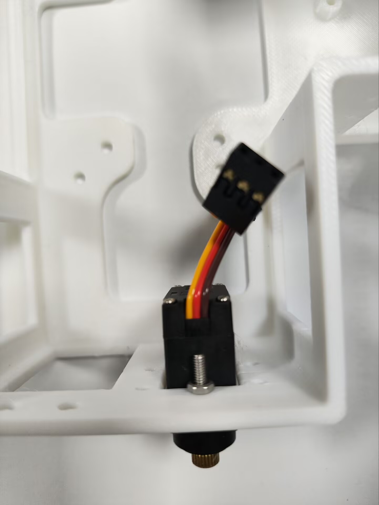
> 
> 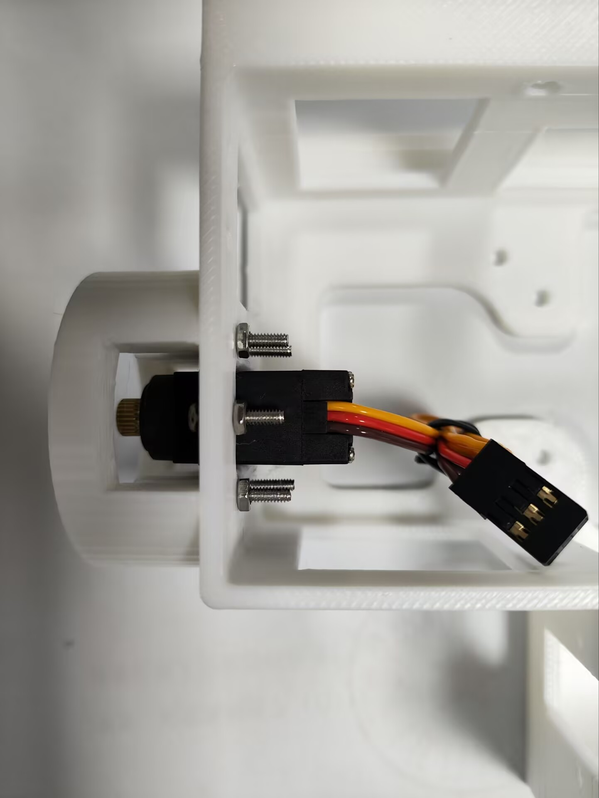
> 
> 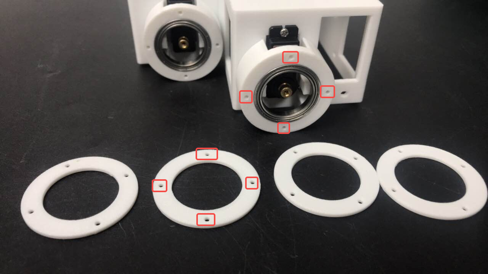

#### Engineering Statement
> [PROCEDURE_DEFINED] 原厂规程明确了机身主干骨架与大腿舵机的空间安装方位：**舵机必须从机身外侧向内侧插入，且出线端必须朝向机身上方**；大腿驱动外环包含**大轴承（必须压配至与外环端面齐平）**并由 M2×6 平头螺丝配合轴承盖板固封；大腿根部与舵机动力输出轴通过**金属齿轮舵盘**刚性连接，规定由背面穿入 4 颗 M2×12 螺丝锁固。

#### Source Observation
- 舵机安装具有明确的方向防呆（线缆必须朝上）；
- 大轴承外圈由舵机外环包裹，端面必须齐平，确保大腿旋转时的同轴度；
- 舵盘采用原厂金属定制加强片，齿轮花键朝外。

#### Engineering Interpretation
- 线缆朝上避免了腿部转动时与关节连杆产生机械干涉和线束拉扯磨损；
- 大轴承分担了大腿根部所受的横向倾覆弯矩（Bending Moment），避免舵机内部塑料/金属减速齿轮直接承受剪切载荷，显著提升关节刚度。

#### Limitations
- 原厂文档未注明轴承压装的过盈配合公差等级（如 H7/h6）；
- 未说明舵盘与舵机输出花键的初始安装角度对中规程（初始机械中位需结合标定进行）。

#### Source Trace
- 文档：《1安装文档.docx》第 2 节
- 资产：`image6.jpeg`, `image11.jpeg`, `image14.png`

---

<a id="p03-five-bar-joints-and-anti-loosening"></a>
### P03 — 闭链腿部关节装配、白色尼龙套筒与防松螺母方向约束

#### Raw Source Faithful Reproduction（原始证据忠实复刻）
> 原始物料来源：《1安装文档.docx》“内/外腿关节安装”
> 
> ```text
> [原厂文档文字字面逐字摘录]
> 内/外腿关节安装
> 将M3防松螺母压入外腿的小圆孔内（螺母的圆头朝外），如下图所示（图左为外腿，图右为內腿，均需要压入螺母）
> 一定要圆头朝外，不然起不到防松作用，可以借助锤子锤进去
> 
> 电机轴承安装，如果后面调试时极对数不通过就返回这里重新安装
> 这部分会影响电机自检，圆柱一定要能平滑转动
> 用张纸垫着，增加高度减少摩擦，也不能太高，不能有抖动，一定是要刚好契合并且转动圆柱时没有阻力
> 
> 取出装好的外腿以及预装的大腿，将零件包内的白色套筒放入图中框起来的孔内（一定要放，不放会机器人抖动），并放入小轴承。
> 4.如下图所示，将大腿和外腿的关节相连接
> 从大腿侧放入M3*16螺丝和垫片，并固定(注意螺丝下面要放垫片，放垫片，放垫片，拧好后活动一下关节，如果太紧则稍微拧松一点，转起来不费劲就行)
> ```
> 
> 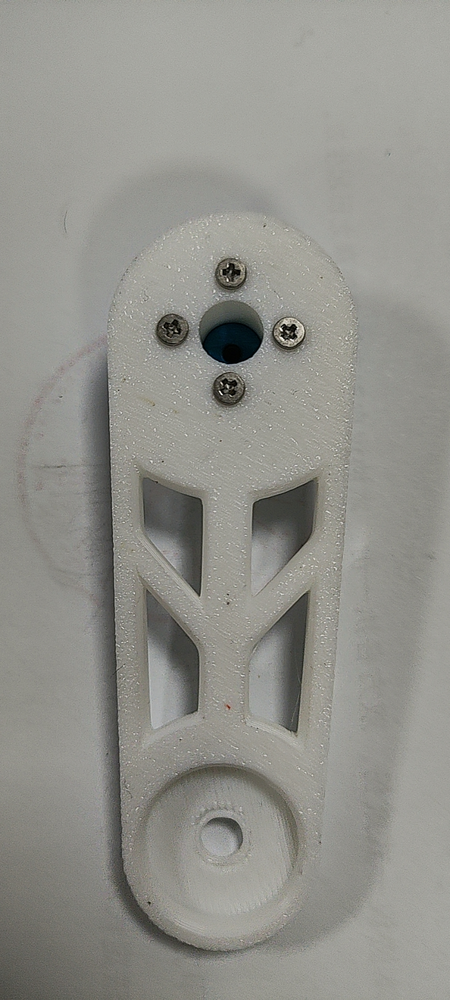
> 
> 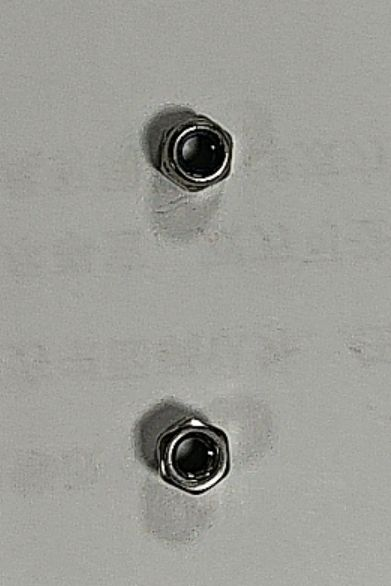
> 
> 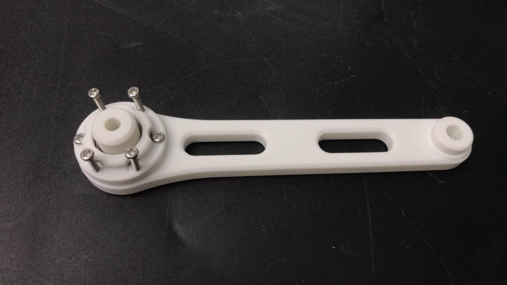

#### Engineering Statement
> [PROCEDURE_DEFINED] 原厂规程在闭链内外腿连杆装配中确立了三项强力装配防松与减振工艺约束：
> 1. **M3 防松螺母方向性**：必须**圆头朝外（尼龙圈朝外）**压入连杆沉孔，严禁方头朝外，否则完全丧失抗振防松功能；
> 2. **白色尼龙衬套强制性**：大腿与外腿连接孔内**必须装入白色尼龙套筒**与小轴承，原厂警示**若遗漏会导致整机严重高频抖动**；
> 3. **关节活动阻力手工校准**：M3×16 连接螺丝下方**必须加装金属垫片**，拧固后必须手动摆动连杆验证，要求“转起来不费劲，过紧需微调拧松”。

#### Source Observation
- 原厂文档多次使用加粗、红色叹号与重复词句（“放垫片，放垫片，放垫片”、“一定要圆头朝外”、“一定要放，不放会机器人抖动”）；
- 关节内部包含白色尼龙套筒与微型小轴承构成的复合回转副；
- 轴承转动阻力直接挂钩无刷电机极对数辨识自检。

#### Engineering Interpretation
- 解释了实机机械系统动力学抖动（Jitter）的结构根源：白色尼龙套筒作为轴向消隙垫圈（Axial Spacer），若缺失会导致轴向窜动，在足端着地冲击下激发机械共振；
- 强调螺栓不能锁死轴承内外套圈，必须依赖垫片与微调保证被动关节的自由转动阻尼极小化。

#### Limitations
- 关节阻力完全依赖操作员“手感”判断（转动不费劲），未给出定量的静态启动摩擦力矩（$	ext{N}\cdot	ext{mm}$）；
- 垫纸调整轴承高度属于手工装配补偿，不同操作员装配可能存在连杆平面度公差分散。

#### Source Trace
- 文档：《1安装文档.docx》“内/外腿关节安装”章节
- 资产：`image19.jpeg`, `image20.jpeg`, `image37.jpeg`

---

<a id="p04-bldc-magnet-and-encoder-mounting"></a>
### P04 — BLDC 轮电机径向磁铁粘接、磁编码器同心度与轮轴固定

#### Raw Source Faithful Reproduction（原始证据忠实复刻）
> 原始物料来源：《1安装文档.docx》“电机和编码器安装”与“车轮安装”
> 
> ```text
> [原厂文档文字字面逐字摘录]
> 电机和编码器安装
> 1.安装磁铁或磁环
> 磁铁安装：用502胶水将磁铁粘在电机底部（有线一端）。
> 胶水半滴即可，避免胶水过多粘住电机轴承！
> 将磁铁中心与电机中心对齐并贴紧，磁铁安装好后，要旋转一圈看下会不会偏心，用手戳一下看下会不会跌下来；平视看一下磁铁会不会一高一低
> 
> 3.清理好联轴器底部的支撑后，将电机对准联轴器凹槽，然后对准孔位拧上M2*6平头螺丝...
> 4.将电机装磁铁那一面，装到内腿的凹槽处，在对角线用4颗M3*6螺丝固定，拧紧一点防止抖动，注意要将电机线放到打印件内测
> 5.取出编码器，用两颗M3*6螺丝固定编码器(芯片靠近磁铁)，然后插上编码器线
> 6.用包线管包住电机线和编码器线...编码器线的另一端应留有一定的长度，建议保留3cm
> 7.最后用扎带固定编码器线和电机线...线尽量拉紧，线不能碰到电机，碰到后面轮子就会不转
> 
> 车轮安装：取出装好的内腿和两个轮子，将轮子六角凹槽对准电机连轴器连接...
> 取出外腿，将M4*18螺丝（最大的螺丝）对准轮子的孔位，然后将螺丝拧紧即可。
> ```
> 
> 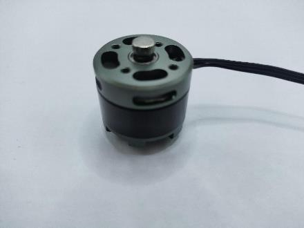
> 
> 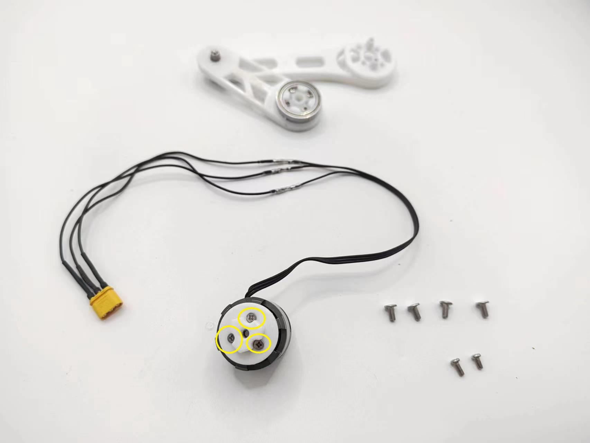
> 
> 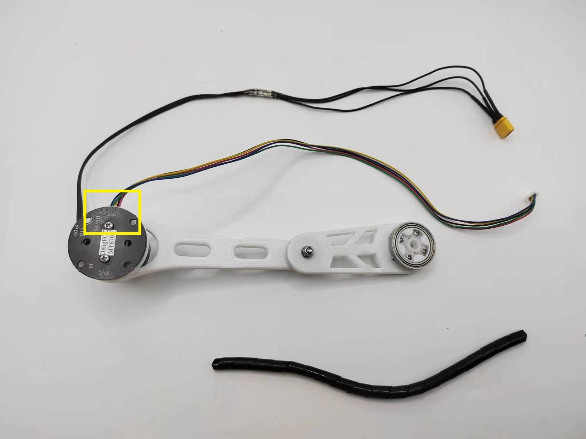
> 
> 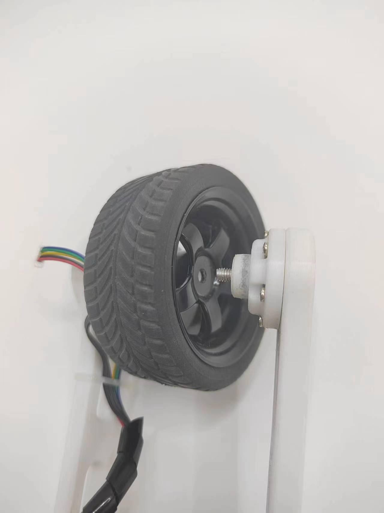

#### Engineering Statement
> [PROCEDURE_DEFINED] 原厂规程在轮电机总成装配中规定了高精度工艺标准：
> 1. **磁编码器径向磁铁安装**：使用微量（半滴）502 胶水贴装于电机轴中心，**严禁溢胶粘结轴承**；安装后必须手动旋转 $360^\circ$ 检查**无偏心、无一高一低翘曲**；
> 2. **编码器芯片感应间隙**：磁编码器板以两颗 M3×6 螺丝对准磁铁固定，线束端保留 **3 cm** 柔性弯曲余量，外层套接包线管并用扎带紧固；
> 3. **线束防干涉红线**：**线缆必须完全拉紧，严禁触碰无刷电机旋转外壳**（碰壳将直接阻滞电机旋转）；
> 4. **车轮主销轴固定**：轮毂六角槽与电机联轴器插接，外腿侧由 **M4×18 螺栓**贯穿并拧紧锁固。

#### Source Observation
- 径向充磁磁铁与磁编码器芯片（通常为 MT6816 或 AS5600 磁编）的同轴度直接决定角度测量线性度；
- 无刷电机为外转子结构，旋转时整个外壳高速旋转，线束若松垮会与外壳发生磨削干涉；
- 轮轴销轴由全机最大的 M4 螺栓承载。

#### Engineering Interpretation
- 阐明了轮电机 FOC 矢量控制初始化的硬件敏感性：磁铁若发生径向偏心或倾斜，会导致正弦/余弦磁场失真，造成 FOC 角度估算非线性抖动或电机校准报错；
- 明确了轮轴承力的机械路径：内侧由电机联轴器支撑，外侧由 M4 螺栓穿入外腿固死，形成了双支承悬臂轴系。

#### Limitations
- 磁铁安装完全依赖目视平视与手动戳动定性检查，缺少激光干涉仪或百分表测量的径向跳动量（Runout）定量公差；
- 502 氰基丙烯酸酯胶水耐温极限较低（约 $80^\circ	ext{C}$），在电机高负荷长时间运转过热时存在磁铁脱胶隐患。

#### Source Trace
- 文档：《1安装文档.docx》“电机和编码器安装”、“车轮安装”
- 资产：`image45.jpeg`, `image50.jpeg`, `image54.jpeg`, `image61.jpeg`

---

<a id="p05-dual-mcu-debug-and-bus-voltage-tuning"></a>
### P05 — S1/S3 双 MCU 硬件调试切换与舵机 7~7.5V 供电调压限值

#### Raw Source Faithful Reproduction（原始证据忠实复刻）
> 原始物料来源：《1安装文档.docx》第八节“主控板测试”与接线调试
> 
> ```text
> [原厂文档文字字面逐字摘录]
> 主控板测试（牢记以下步骤，不要错误烧录导致芯片烧坏）
> 打开串口助手，波特率为115200，查看串口信息
> 
> 2.设置与主控板的S1芯片通信
> 2.1连接USB，USB有缝隙一边朝上，无缝一边朝下,松开白色按键，切换至S1芯片（黄灯亮）
> 2.2打开vofa，1选择端口号...2设置波特率为115200...按一下S1复位键...最上面那一行是注册码
> 
> 3.设置与主控板的S3芯片通信
> 3.1连接USB...按开白色按键，切换至S3芯片（绿灯亮）
> 3.2打开vofa，选择串口，设置波特率为115200，打开串口，可以看到下面这个串口信息，这是S3芯片
> 
> 有万用表的话可以选择进行下方测试，万用表凤鸣档测试下面6条线两端焊点是否导通（舵机板和主控板之间）
> 如果不导通着按照下方图片将舵机板不导通的那一个引脚掰弯再插进主控板
> 
> 主控板和舵机板分开，将电源开关打开，图中板子的右上角为电位器，按照图中的步骤操作。
> 注意：顺时针旋转，输出电压升高，逆时针旋转输出电压降低，设置7~7.5V
> 注意：不可超过8V！！！
> （这步我们已经调了，可以忽略）
> ```
> 
> 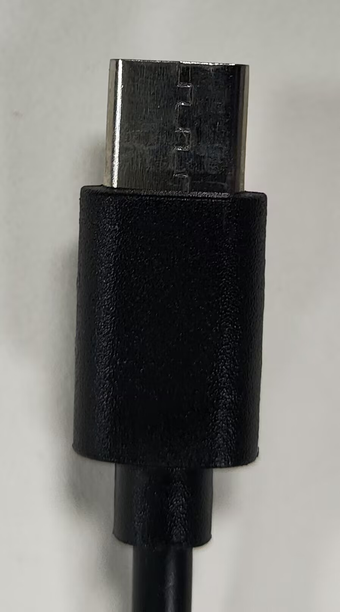
> 
> 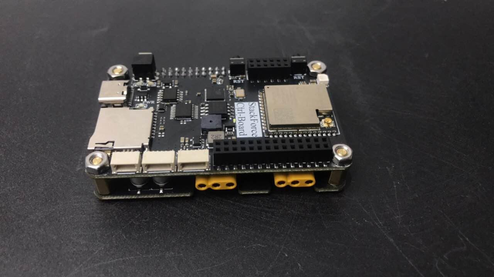
> 
> 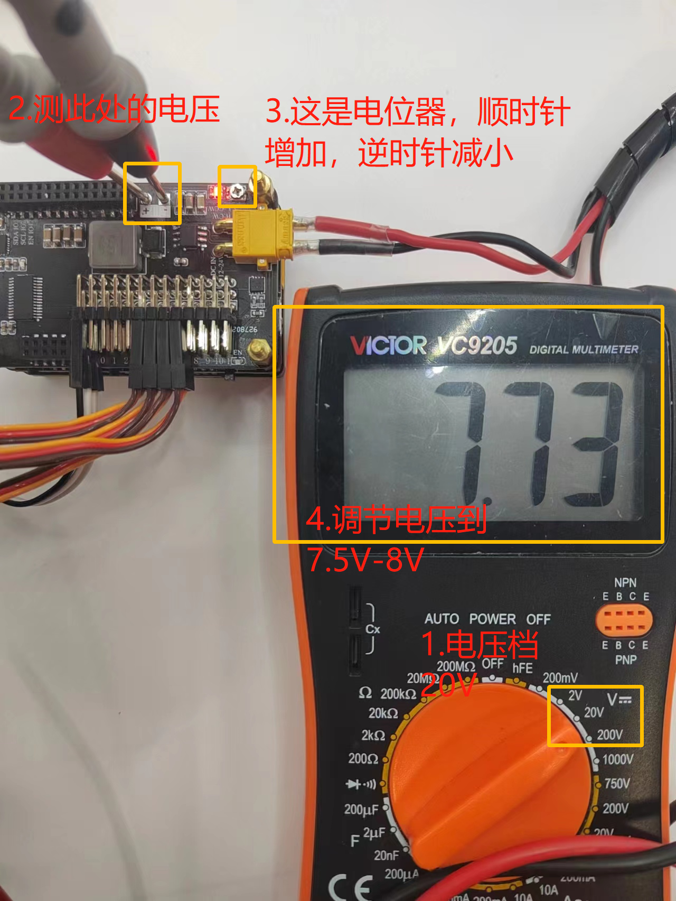

#### Engineering Statement
> [SPECIFIED] 原厂规范定义了主控板双微处理器调试切换机制与舵机动力母线电气电压调节红线：
> 1. **双 MCU 串口复用切换**：通过板载**物理白色自锁按键**切换单 Type-C 接口的通信路由：
>    - **松开按键（黄灯亮）**：USB 转串口连接至 **S1 芯片（小电流无刷电机驱动 MCU）**，波特率标称 **115200**；
>    - **按压锁入（绿灯亮）**：USB 转串口连接至 **S3 芯片（ESP32-S3 主控 MCU）**，波特率标称 **115200**；
> 2. **板间排针导通性检测**：主控板与舵机扩展板通过直插排针连通，要求使用万用表蜂鸣档验证 6 路核心连线双向导通；
> 3. **舵机母线电压红线**：板载 DC-DC 可调电位器顺时针升压、逆时针降压，**标称工作电压必须设置在 $7.0	ext{ V} \sim 7.5	ext{ V}$**；**原厂严正安全禁令：输出电压严禁超过 $8.0	ext{ V}$（超过即烧毁舵机电子元器件）**。

#### Source Observation
- 系统在单 USB 物理口上通过多路复用芯片和硬件按键切换与不同处理器的 UART 通信，避免了多根数据线；
- 状态指示清晰：黄灯指示 S1（驱动），绿灯指示 S3（主控）；
- 电位器具备明确的电压极限红线（$7.0\sim 7.5	ext{ V}$，上限 $8.0	ext{ V}$）。

#### Engineering Interpretation
- 揭示了机器人的电气架构并非单芯片控制，而是分布式的双 ESP32 架构（S3 运行主控与自平衡，S1 运行无刷轮机驱动）；
- 确立了舵机母线电源域的物理特性：舵机供电来自板载大电流 Buck 降压电路，设定在 7.4V（标称两串锂电全充电压附近），提供了舵机输出扭矩所必需的高电压，同时设定 8.0V 硬件安全边界。

#### Limitations
- 手动微调电位器（Trimpot）在强振动工况下可能发生机械滑变偏移，未采用精密固定分压电阻存在微量漂移风险；
- 原厂注明出厂已调好，但在更换降压板或排查故障时必须重新测量。

#### Source Trace
- 文档：《1安装文档.docx》第 8 节
- 资产：`image64.jpeg`, `image71.jpeg`, `image76.png`

---

## 4. Provenance & Artifacts（出处与衍生资产）

- **原始文档物理位置**：
  - `doc/四足机器人-origin/1教程/1安装文档.docx`
  - `doc/四足机器人-origin/1教程/1安装文档.pdf`
- **签发日期**：2024-07-05
- **解压全量图片资产**（76 幅已完整保存在 `docs/assets/images/E-DOC-003-四足机器人整机机械安装与调试指南/`）：
  - 核心代表图：`image1.jpeg`, `image3.jpeg`, `image6.jpeg`, `image11.jpeg`, `image14.png`, `image19.jpeg`, `image20.jpeg`, `image37.jpeg`, `image45.jpeg`, `image50.jpeg`, `image54.jpeg`, `image61.jpeg`, `image64.jpeg`, `image71.jpeg`, `image76.png`
