# E-DOC-004 — 四足机器人整机电气接线与总线拓扑指南

> 证据编号：`E-DOC-004-四足机器人整机电气接线与总线拓扑指南`  
> 认识论角色：`DOC / SPEC`（原厂电气接线与拓扑规程，工程事实标记为 `[SPECIFIED]` 与 `[PROCEDURE_DEFINED]`）  
> 状态：`VALID`（原厂 41 幅电气实物接线、板垛堆叠、线序图解与步骤指引完整）  
> 规范：**A PATH IS NOT EVIDENCE.** 本文档忠实记录原厂接线手册中的前后双分布式板垛分层、4 路 BLDC 电机与磁编码器接口映射、8 路舵机排针色谱与走线、动力电池 1 分 3 供电拓扑、双板 CAN 差分通信引脚与 120Ω 终端电阻配置，**严禁混入固件驱动代码与未经实测的总线协议假设**。

---

## 1. Scope（工程范围）

- **核心工程问题**：
  1. 机器人前驱与后驱分布式板垛（Stack-up）的物理层级划分、功能定位与固定方式是什么？
  2. 4 路 BLDC 轮电机与高精度磁编码器的接插件接口位置、防呆极性与对称/非对称插接规则是什么？
  3. 8 路腿部关节舵机在后驱舵机板上的引脚层级（GND/VCC/Signal）、延长线颜色映射及底盘过线槽走线规程是什么？
  4. 动力电池母线引出路径与 1 分 3 分支供电线束（前小电流板、后小电流板、后舵机板）的电气分配拓扑是什么？
  5. 前后主控板间 TWAI/CAN 差分总线的端子引脚定义（H/L）、物理拨码 120Ω 终端电阻设置及 RS485 接口防呆要求是什么？
- **应用范围**：StackForce 四轮足机器人整机电气线束装配、分布式板垛堆叠安装、动力电源布线与总线物理层调试。
- **非目标**：
  - 不涵盖 CAN 总线通信协议帧格式、波特率与报文 ID 分配（属于固件层证据 `E-FMW-xxx`）；
  - 不涵盖 ESP32-S3 底层 GPIO 寄存器配置与定时器 PWM 输出配置（见 `E-FMW-xxx`）；
  - 不涵盖整机稳态/动态工作电流测量与电池续航极限测试（见 `E-TEST-xxx`）。

---

## 2. Source Summary（技术源清单）

| Source ID | 类型 | 规范便携路径 | 签发日期 | 角色与描述 |
|---|---|---|---|---|
| `SRC-PRC-007` | `PROCEDURE` | `doc/四足机器人-origin/1教程/2接线文档.docx` | 2024-07-05 | 原厂整机电气接线与总线拓扑教程，含 41 幅实物高清接线图与步骤说明 |
| `SRC-PRC-008` | `PROCEDURE` | `doc/四足机器人-origin/1教程/2接线文档.pdf` | 2024-07-05 | 上述 DOCX 接线教程的原版对照 PDF 文件 |

---

## 3. Evidence Parts（可独立引用的工程事实）

<a id="p01-distributed-board-stackup"></a>
### P01 — 前后双分布式板垛（Board Stack-Up）物理分层与功能架构

#### Raw Source Faithful Reproduction（原始证据忠实复刻）
> 原始物料来源：《2接线文档.docx》第二节“电机线接线”、第三节“机器人后半身电机线接线”、第六节“CAN板接线”
> 
> ```text
> [原厂文档文字字面逐字摘录]
> 二、电机线接线
> 2、拿出小电流板，主控板，CAN板（记录这块前驱动的主控板注册码）
> 其中主控板要按照下图所示将四个角的孔都装上铜柱
> 3、将小电流板、主控板、can板按照从下到上顺序堆叠在一起
> 
> 三、机器人后半身电机线接线
> 2、准备好小电流板，主控板，舵机板，CAN板，IO拓展版
> （记录后驱动的主控板注册码）
> 3、按照小电流板，主控板，舵机板的顺序堆叠在一起，堆叠前要安装铜柱，如图中所示
> 
> 六、CAN板接线
> 将IO拓展板插在CAN板上
> CAN板插在后驱动的舵机板子上
> 插上去后效果如下所示，从下到上反别是
> 小电流板（驱动电机）—主控板（运行程序）—
> 舵机板（驱动舵机和陀螺仪数据读取）—
> CAN板（用来和前驱动的主控板通信）—
> IO拓展板（将主控板上的S3芯片的IO口引出接口，用来接收遥控器数据）
> 最后机器人下方使用M3*8螺丝将全部板子固定在机器人上
> ```
> 
> 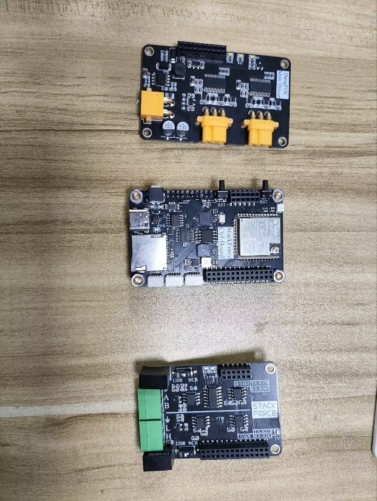
> 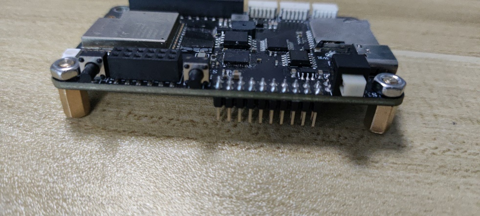
> 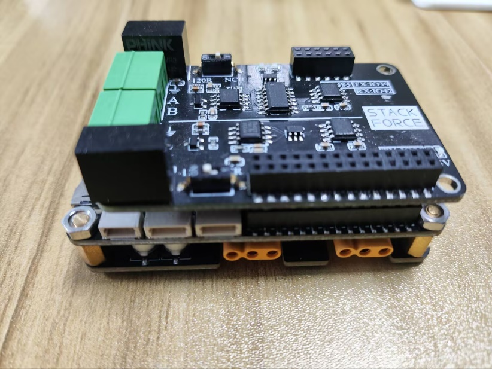
> 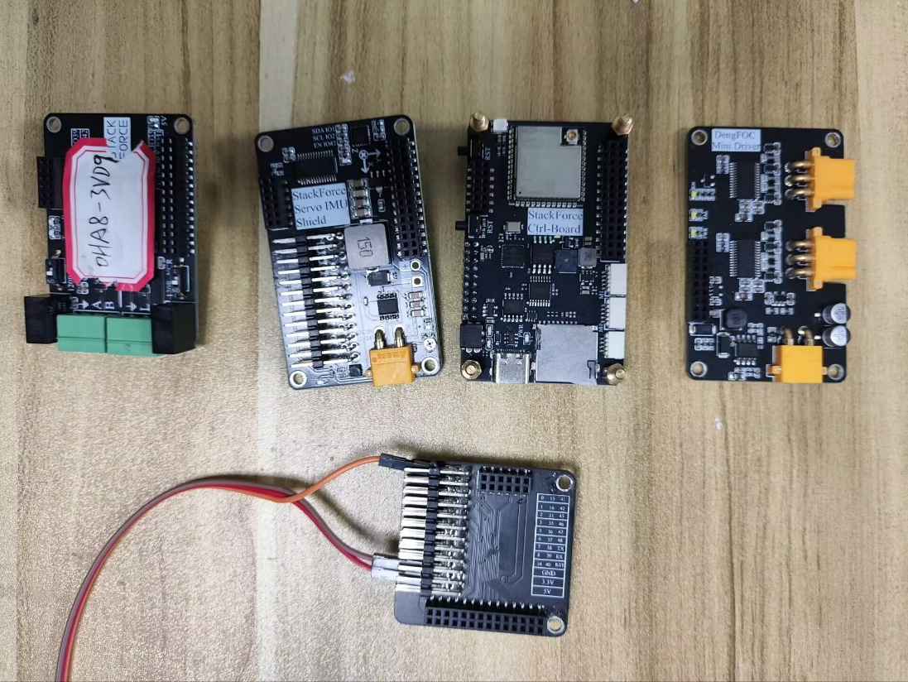
> 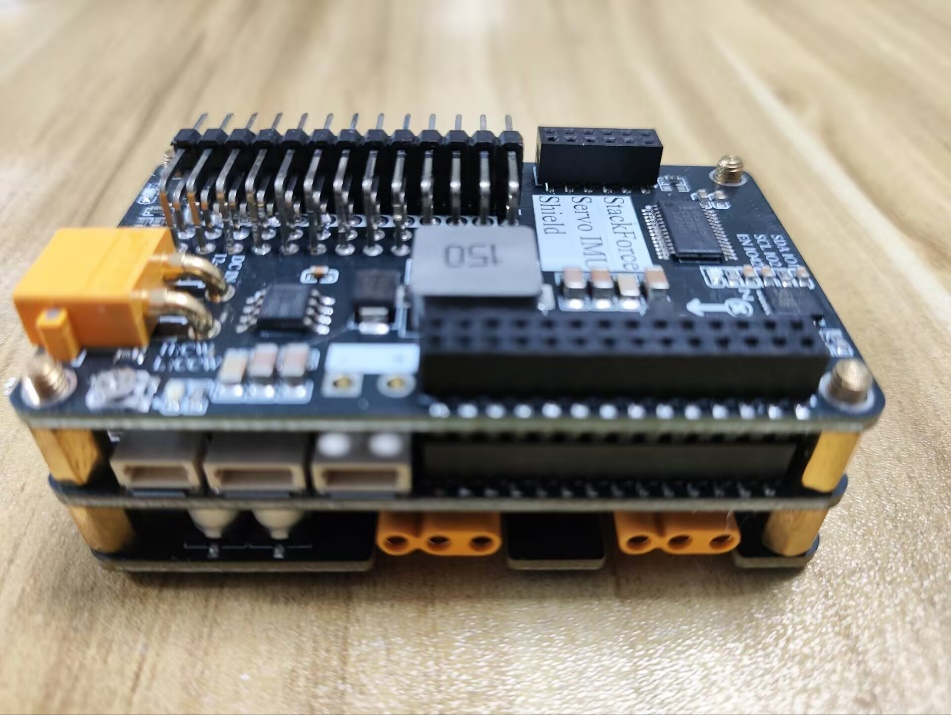
> 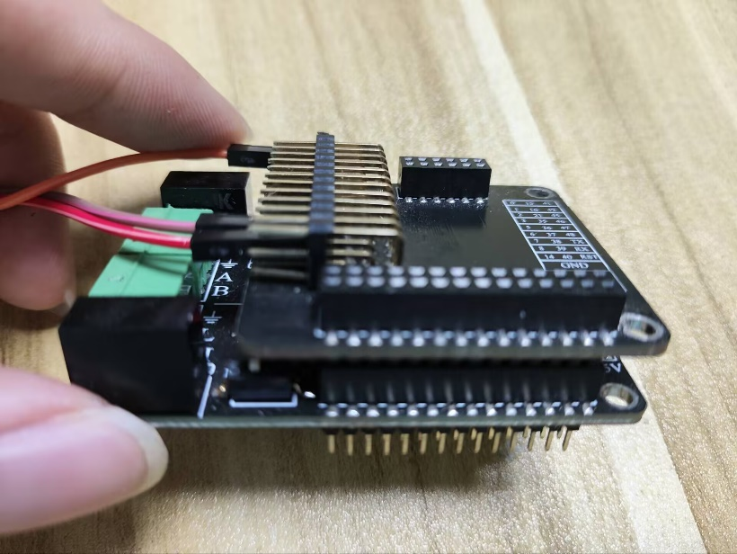
> 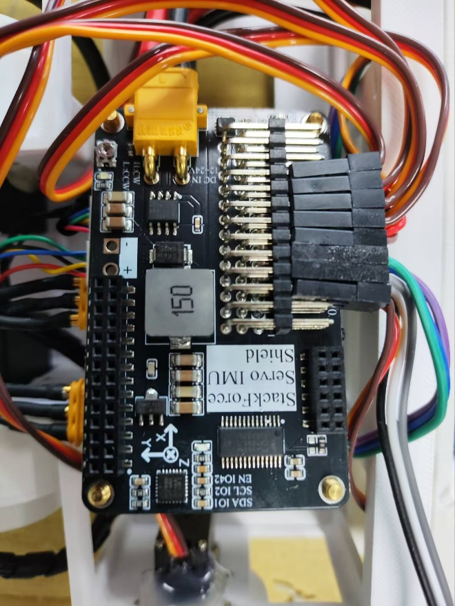
> 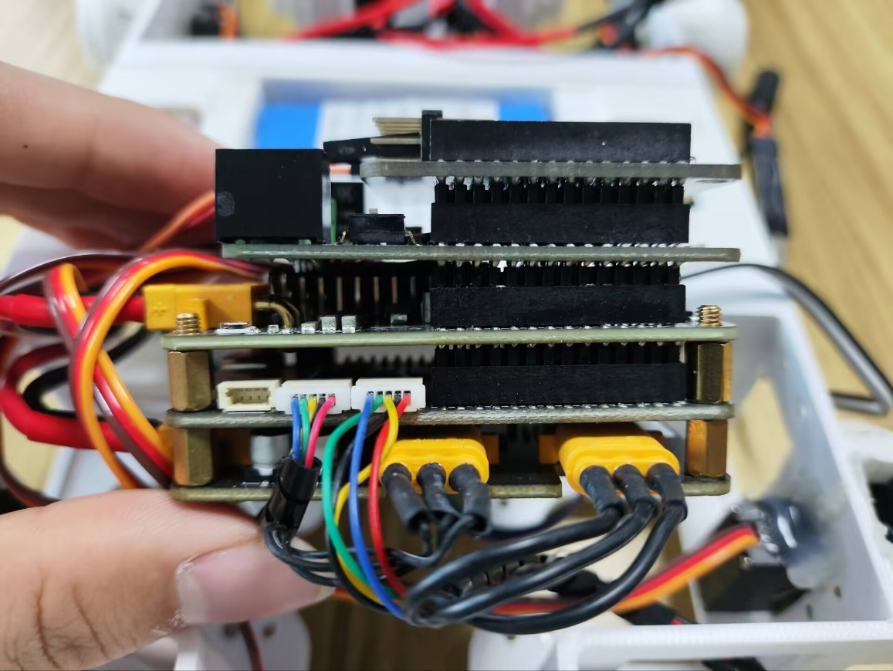
> 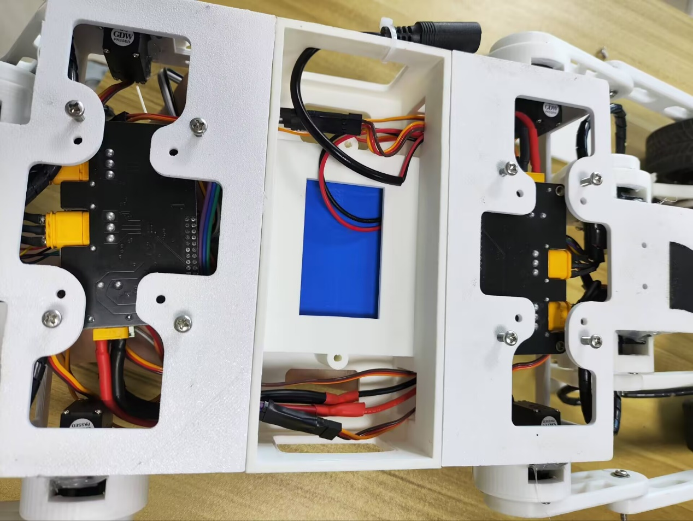

#### Engineering Statement
> [SPECIFIED] StackForce 整机采用**前后分布式双板垛（Stack-up）电气架构**：
> 1. **前驱板垛（3层堆叠）**：自底向上依次为 **小电流板（BLDC轮电机驱动）** $\to$ **主控板（前驱 MCU 控制器）** $\to$ **CAN 板（前驱总线通信接口）**；各层间通过四角黄铜支柱电气隔离并机械连接。
> 2. **后驱板垛（5层堆叠）**：自底向上依次为 **小电流板（BLDC轮电机驱动）** $\to$ **主控板（后驱 MCU 控制器）** $\to$ **舵机板（8路舵机驱动与车载 IMU 陀螺仪读取）** $\to$ **CAN 板（前后双板通信桥梁）** $\to$ **IO 拓展板（引出 ESP32-S3 引脚供遥控器接收机通信）**。
> 3. **底盘安装固定**：整机前后板垛均通过机身底盘下方的 **M3×8 螺钉** 锁入底层黄铜支柱牢固紧固。
> 4. **主控注册码规范**：堆叠前原厂规程强制要求逐一抄录并标记前驱主控板与后驱主控板的 **ESP32 唯一芯片注册码**，作为前后驱固件烧录与绑定的唯一凭据。

#### 前后分布式板垛层级与功能定义表
| 板垛位置 | 层级（自底向上） | 板卡名称 | 核心硬件功能 | 关键物理接口与连接 |
|---|---|---|---|---|
| **前驱板垛**<br>(3层) | 第1层（底层） | **小电流板** | 驱动左前/右前 2 路 BLDC 轮电机 | 2 组黄色大电流三相插座、3 组白色编码器插座、DC 电源输入端子 |
| | 第2层（中层） | **主控板** | 运行前驱电机 FOC 控制程序 | 四角安装黄铜支柱，排针贯穿连接底层小电流板 |
| | 第3层（顶层） | **CAN 板** | 与后驱主控板建立差分总线通信 | CAN 接口端子（H/L）、RS485 接口端子、120Ω 拨码开关 |
| **后驱板垛**<br>(5层) | 第1层（底层） | **小电流板** | 驱动左后/右后 2 路 BLDC 轮电机 | 2 组黄色大电流三相插座、3 组白色编码器插座、DC 电源输入端子 |
| | 第2层 | **主控板** | 运行后驱主控、运动解算与姿态解算程序 | 四角黄铜支柱支撑，排针贯通上下各层 |
| | 第3层 | **舵机板** | 集中驱动整机 8 路腿部舵机，板载 IMU 陀螺仪 | 8 组三层排针（GND/VCC/Signal）、独立高功率 DC-DC 降压电源输入 |
| | 第4层 | **CAN 板** | 与前驱主控板差分总线通信 | CAN 接口端子（H/L）、RS485 接口端子、120Ω 拨码开关 |
| | 第5层（顶层） | **IO 拓展板** | 引出后驱 S3 芯片 GPIO 接口 | 连接遥控器接收机（P40/GND/3V3，见 `E-DOC-001`） |

#### Limitations
- 原厂文档未公开层间排针的完整引脚走线定义（Pinout Header Matrix）；
- 原厂文档未标注板卡铜柱的高度公称尺寸（如 M3×10mm 或 M3×12mm）。

#### Source Trace
- 文档：《2接线文档.docx》第二节、第三节、第六节
- 资产：`image3.jpeg`, `image4.jpeg`, `image5.jpeg`, `image9.jpeg`, `image10.jpeg`, `image32.jpeg`, `image33.jpeg`, `image34.jpeg`, `image40.jpeg`

---

<a id="p02-bldc-and-encoder-pinout"></a>
### P02 — 4路BLDC轮电机与磁编码器接口极性分配规范

#### Raw Source Faithful Reproduction（原始证据忠实复刻）
> 原始物料来源：《2接线文档.docx》第二节“电机线接线”、第三节“机器人后半身电机线接线”
> 
> ```text
> [原厂文档文字字面逐字摘录]
> 二、电机线接线
> 1、将组装好的机器人拿出，将这个方向的机器人作为机器人的前半部分，将电机线和编码器线从图中方孔处穿到机器人内部
> 3、将小电流板电机接口一侧朝前，按照图示摆放板子，左前轮子的电机接在左侧黄色接口，左前轮编码器线接在最左侧白色接口
> 同理，右前轮接右侧黄色接口，编码器接在中间白色接口
> 
> 三、机器人后半身电机线接线
> 4、安装电机线和编码器线，板子按照图示摆放，左后电机接左侧黄色接口，右后电机接右侧黄色接口；
> 左后编码器接中间白色接口，右后编码器接右侧白色接口
> ```
> 
> 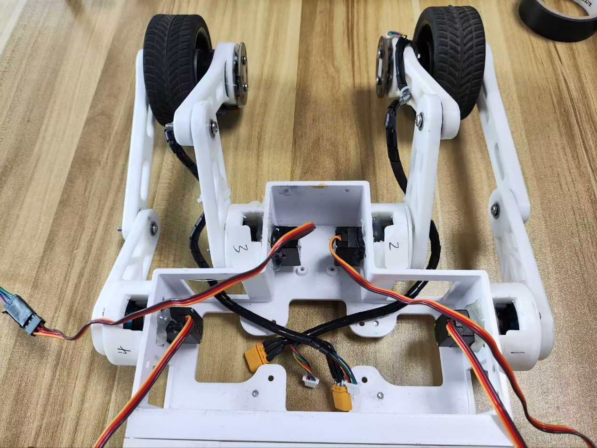
> 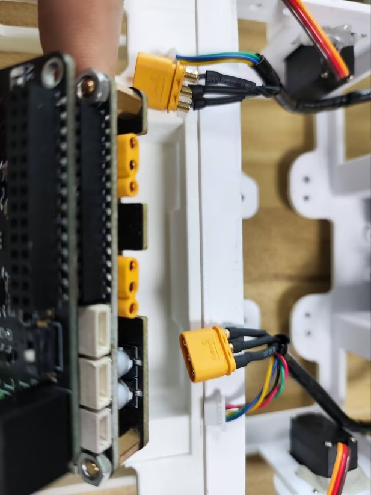
> 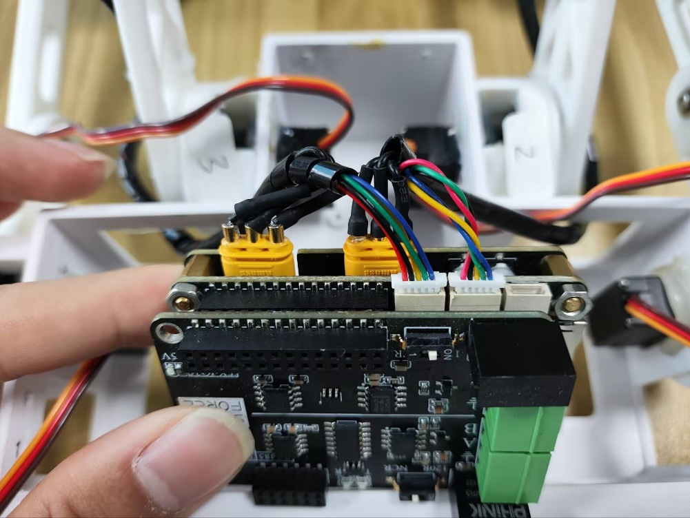
> 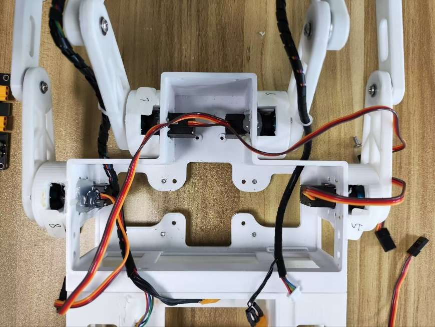
> 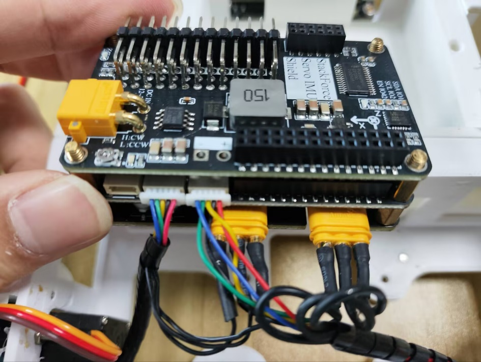

#### Engineering Statement
> [SPECIFIED] 4 路无刷轮电机与磁编码器线束由机身底盘前后方孔穿入内部，连接至前驱与后驱小电流板。板卡黄色三相大电流接口朝前摆放，插接映射存在严格的**不对称防呆与通道映射规则**：
> 1. **前驱轮电机与编码器**：
>    - **左前轮电机（LF Motor）** $\to$ 小电流板 **左侧黄色接口**；
>    - **左前轮编码器（LF Encoder）** $\to$ **最左侧白色接口**；
>    - **右前轮电机（RF Motor）** $\to$ 小电流板 **右侧黄色接口**；
>    - **右前轮编码器（RF Encoder）** $\to$ **中间白色接口**（最右侧白色接口空置）。
> 2. **后驱轮电机与编码器**：
>    - **左后轮电机（LH Motor）** $\to$ 小电流板 **左侧黄色接口**；
>    - **右后轮电机（RH Motor）** $\to$ 小电流板 **右侧黄色接口**；
>    - **左后轮编码器（LH Encoder）** $\to$ **中间白色接口**（最左侧白色接口空置）；
>    - **右后轮编码器（RH Encoder）** $\to$ **最右侧白色接口**。
> 3. **工程非对称性提示**：小电流板提供 3 组白色编码器接口，前板使用的是【最左】与【中间】，后板使用的是【中间】与【最右】。此硬件通道分配直接对应底层 FOC 驱动器中双 SPI / I2C / ABZ 编码器硬件引脚与电机相序的绑定关系，绝不可擅自变动。

#### 4 路 BLDC 轮电机与编码器接插件通道映射表
| 电机/轮组编号 | 机械物理位置 | 所属板垛 | 动力三相接口（黄色） | 编码器接口（白色端子） | 穿线路径 |
|---|---|---|---|---|---|
| **LF (左前轮)** | 前左侧外膝关节下端 | 前驱小电流板 | **左侧黄色接口** | **最左侧白色插座** | 前机架底部左侧方孔 |
| **RF (右前轮)** | 前右侧外膝关节下端 | 前驱小电流板 | **右侧黄色接口** | **中间白色插座** | 前机架底部右侧方孔 |
| **LH (左后轮)** | 后左侧外膝关节下端 | 后驱小电流板 | **左侧黄色接口** | **中间白色插座** | 后机架底部左侧方孔 |
| **RH (右后轮)** | 后右侧外膝关节下端 | 后驱小电流板 | **右侧黄色接口** | **最右侧白色插座** | 后机架底部右侧方孔 |

#### Limitations
- 原厂文档未注明黄色端子具体工业型号（外观符合 XT30 / MR30 规格）；
- 未提供白色编码器端子的引脚定义（如 VCC, GND, CLK, CS, MOSI, MISO 等引脚极性），插头带单向物理防呆卡扣。

#### Source Trace
- 文档：《2接线文档.docx》第二节第1-3条、第三节第4条
- 资产：`image2.jpeg`, `image6.jpeg`, `image7.jpeg`, `image8.jpeg`, `image11.jpeg`

---

<a id="p03-servo-pinout-and-wiring"></a>
### P03 — 8路舵机供电极性、延长线色谱映射与排针层级定义

#### Raw Source Faithful Reproduction（原始证据忠实复刻）
> 原始物料来源：《2接线文档.docx》第四节“舵机线接线”
> 
> ```text
> [原厂文档文字字面逐字摘录]
> 四、舵机线接线
> 1、杜邦线延长舵机线，图中最前方两个舵机线由于长度不足需要使用两组公对母杜邦线延长舵机线
> 将杜邦线公头插入舵机线母头，然后用胶带固定
> 2、将前车的4组舵机线从两侧通道穿到后车，如图所示
> 3、将舵机线按照下图顺序接到后车的舵机板上
> 将上述舵机线按照序号接到后驱动的舵机板上，舵机线棕色是GND接在舵机板最上一排，红色VCC接在舵机板中间一排，黄色是信号线，接在舵机板最下一排
> 舵机线延长线接线：舵机线棕色—杜邦线灰色（杜邦线颜色随机）—GND—接在舵机板最上一层
> 舵机线红色—杜邦线白色—VCC—接在舵机板中间
> 舵机线黄色—杜邦线黑色—信号线—接在舵机板最下一层
> 舵机线接线最终效果如下图所示
> ```
> 
> 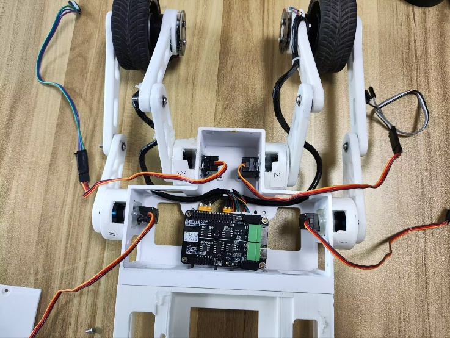
> 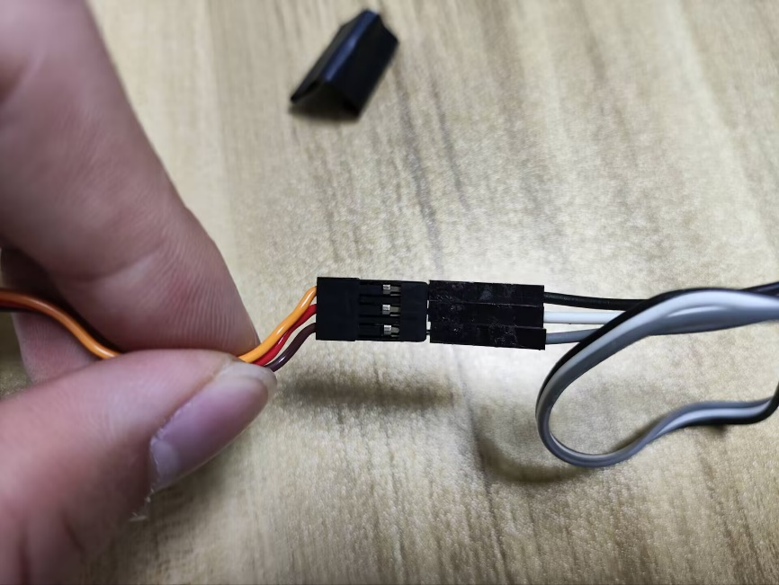
> 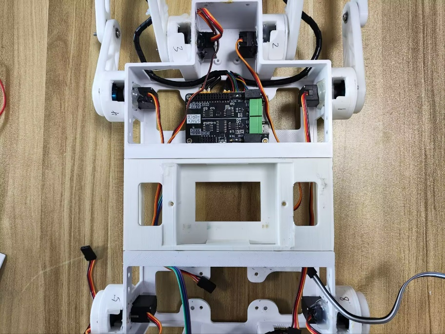
> 
> 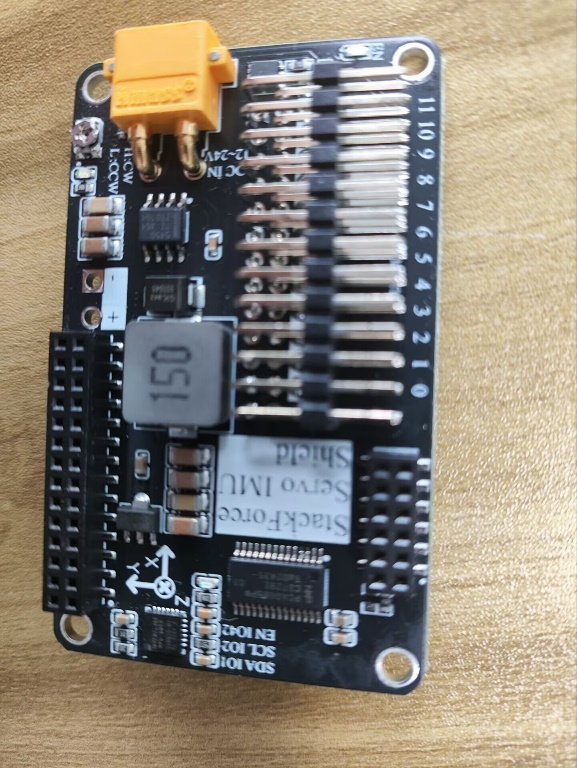
> 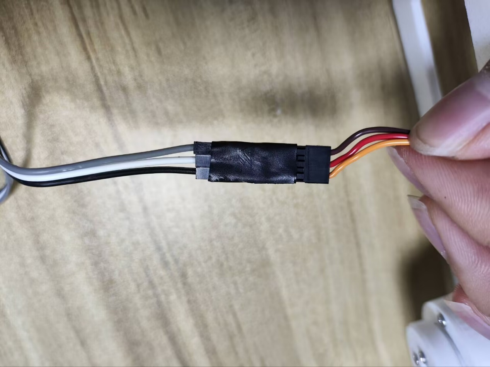
> 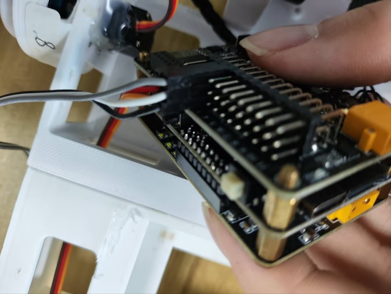
> 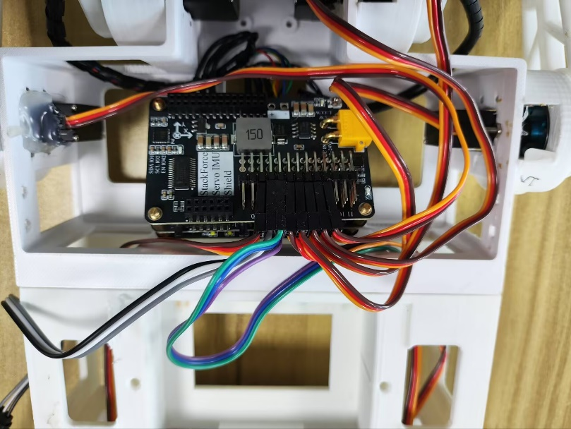

#### Engineering Statement
> [SPECIFIED] 整机 8 路腿部关节舵机采用**集中式驱动管理架构**，全部接入后驱板垛的 **舵机板**：
> 1. **前腿舵机走线与延长规程**：
>    - 前驱 4 组舵机线需贯穿机身两侧底盘过线通道引至后驱板垛；
>    - 针对最前方 2 只大腿/小腿舵机原生引线长度不足的物理限制，原厂规程采用 **公对母杜邦延长线** 进行接驳，且插接处必须使用 **绝缘胶带牢固包覆缠绕** 防脱。
> 2. **舵机板排针 3 层垂直极性结构**：
>    - **顶层排针（Top Row）**：电源地 `GND`，对接原厂舵机线 **棕色（Brown）**；
>    - **中层排针（Middle Row）**：舵机母线供电 `VCC`（典型 5V~8.4V 可调，见 `E-DOC-003`），对接原厂舵机线 **红色（Red）**；
>    - **底层排针（Bottom Row）**：PWM 控制信号线 `Signal`，对接原厂舵机线 **黄色（Yellow）**。
> 3. **延长线色谱转接映射表（严格防呆）**：
>    - 原厂舵机线棕色（GND） $\to$ 杜邦线灰色 $\to$ 舵机板 **顶层排针 (GND)**；
>    - 原厂舵机线红色（VCC） $\to$ 杜邦线白色 $\to$ 舵机板 **中层排针 (VCC)**；
>    - 原厂舵机线黄色（Signal） $\to$ 杜邦线黑色 $\to$ 舵机板 **底层排针 (Signal)**。

#### 舵机板 3 层排针电气特性与延长线色谱映射
| 物理排针层级 | 电气信号定义 | 原厂舵机原生线色 | 原厂推荐延长杜邦线色 | 电气说明与安全约束 |
|---|---|---|---|---|
| **最上一排（顶层）** | `GND`（系统共地） | **棕色 (Brown)** | 灰色 (Gray) | 与小电流板、电池负极共地 |
| **中间一排（中层）** | `VCC`（舵机驱动电源） | **红色 (Red)** | 白色 (White) | 受控于舵机板板载 DC-DC 降压输出（严防反接） |
| **最下一排（底层）** | `Signal`（PWM控制信号） | **黄色 (Yellow)** | 黑色 (Black) | 连接 ESP32-S3 定时器引脚输出高阻抗控制脉冲 |

#### Limitations
- 杜邦线颜色由组装者随机构建，规程给出的灰/白/黑为典型配线示例，关键准则是逐线对齐【棕-地、红-电、黄-信】；
- 原厂文档未注明 1~8 号舵机通道与前左、前右、后左、后右髋关节/膝关节的精确关节解算索引（见后续主题 `T-KINEMATICS-xxx` 与固件映射）。

#### Source Trace
- 文档：《2接线文档.docx》第四节第1-3条
- 资产：`image12.jpeg` ~ `image22.jpeg`

---

<a id="p04-power-distribution-topology"></a>
### P04 — 动力电池 1分3 母线并联供电拓扑与布线路径

#### Raw Source Faithful Reproduction（原始证据忠实复刻）
> 原始物料来源：《2接线文档.docx》第四节（注：原文小标题为“四、电源线接线”）
> 
> ```text
> [原厂文档文字字面逐字摘录]
> 电源线接线
> 1将电池和电源线拿出来
> 将电池线从下方穿过去
> 电池放入框里
> 电池线从四足狗机器人的右前腿后的孔穿出来
> 接上电源线
> 较为短的一根电源线接在前驱动的小电流板子上
> 将剩下两根电源线从左侧通道穿到机器人后侧
> 剩下两根电源线分别接在后驱动的小电流板和舵机板上（两块板子都要接）
> 在机器人下方的电源线接口用一个扎带将其固定在一侧
> ```
> 
> 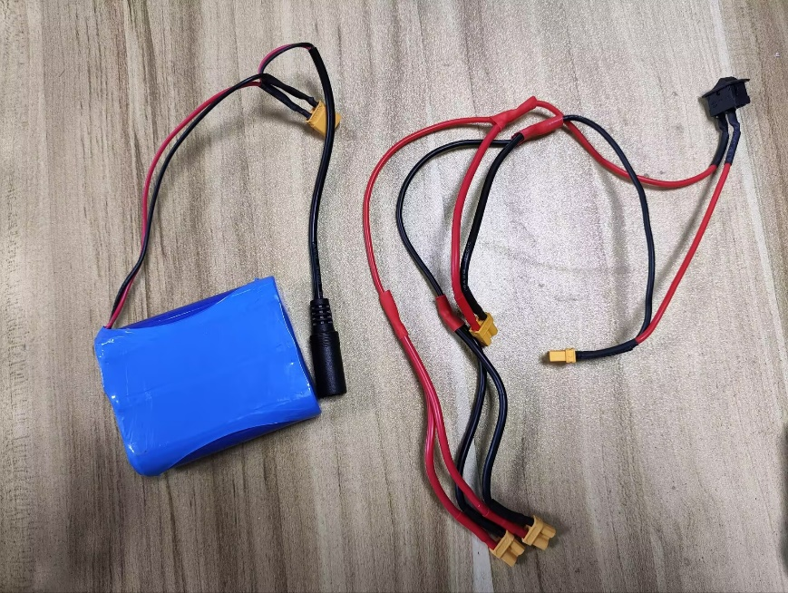
> 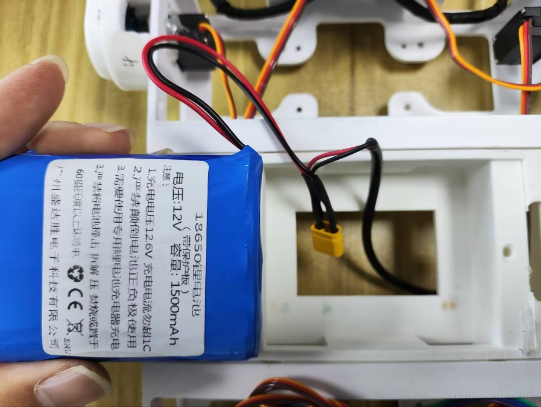
> 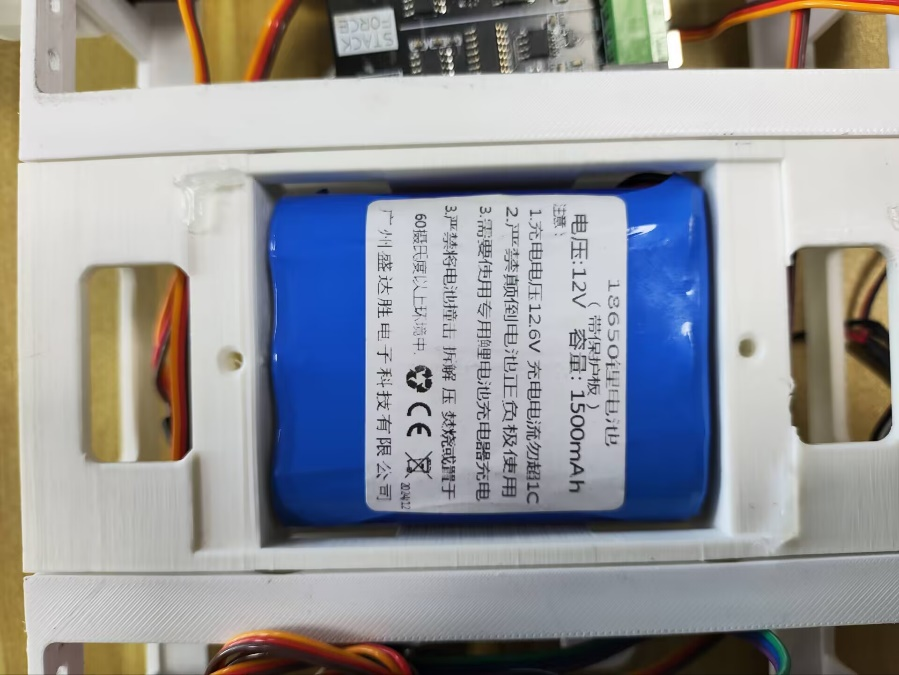
> 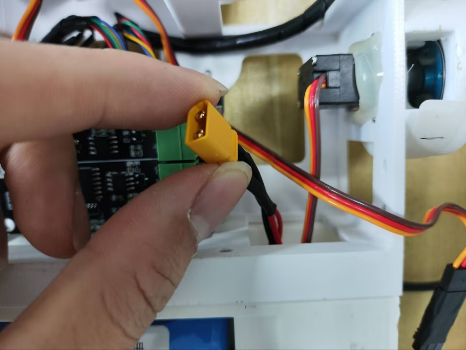
> 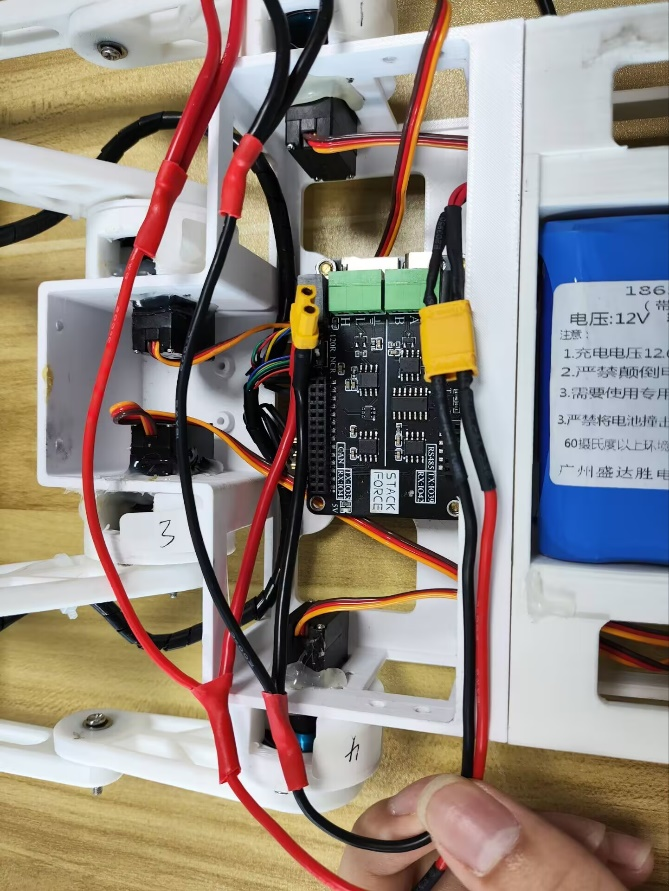
> 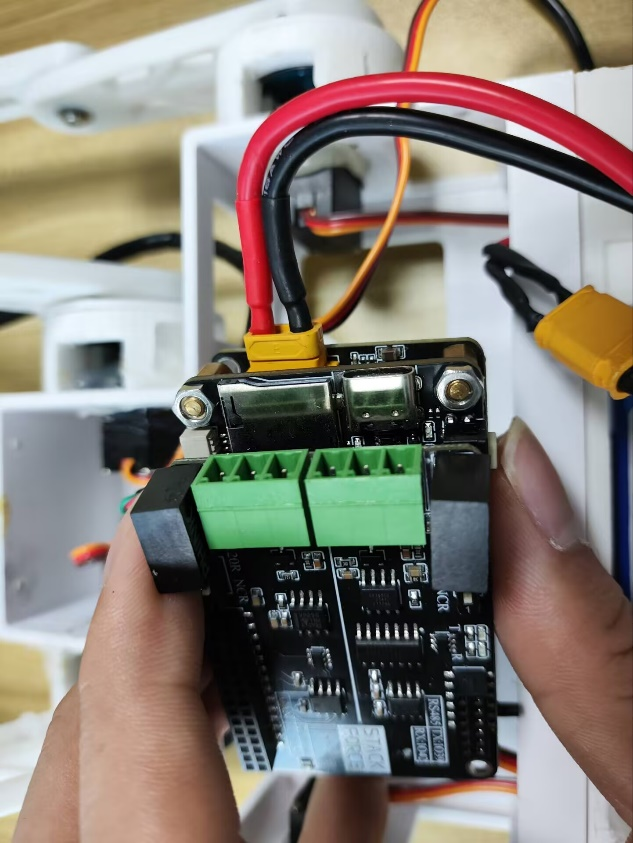
> 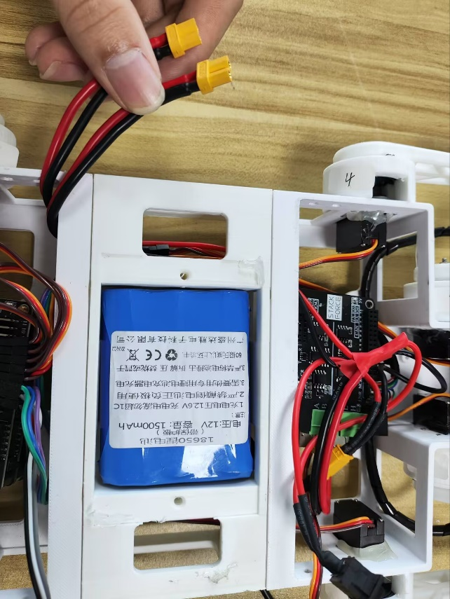
> 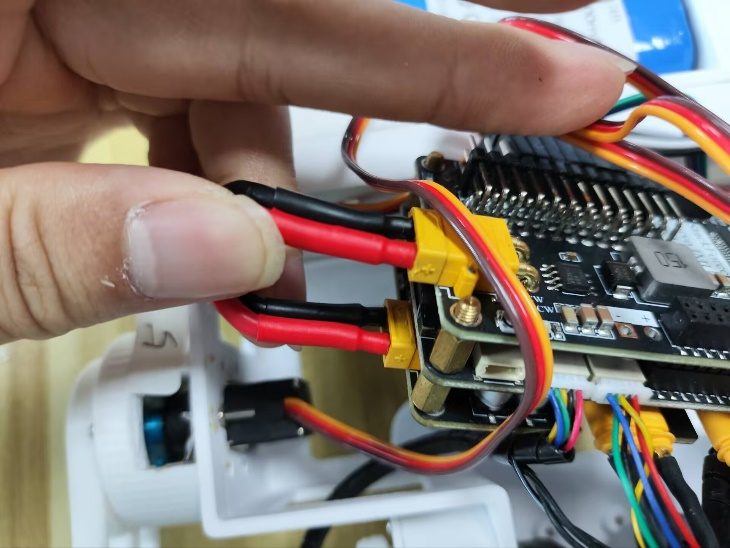
> 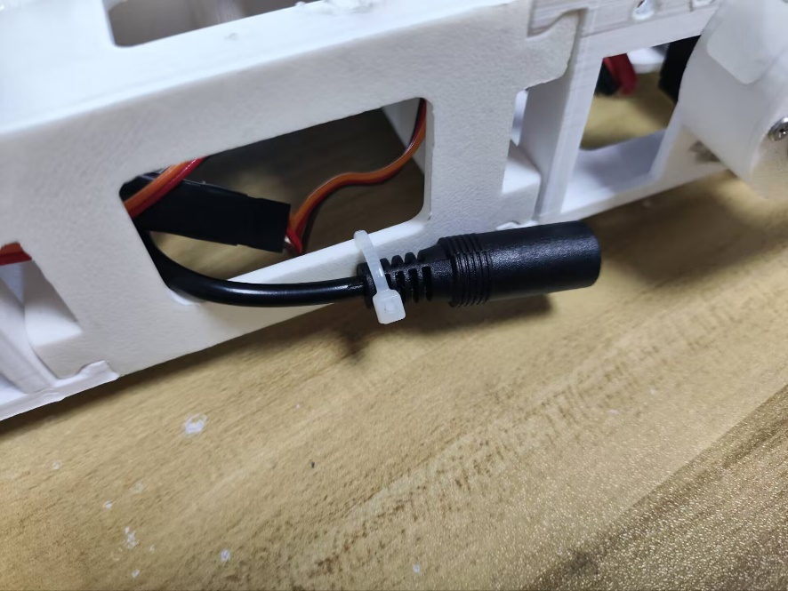

#### Engineering Statement
> [SPECIFIED] StackForce 机器人动力电源采用 **集中式单电池母线、物理 1 分 3 并联分支供电拓扑**：
> 1. **电池布局与引线规范**：动力电池安置于机身中心下沉式电池框中，电池主引出线从机身底盘穿入，并从 **右前腿后侧的专用走线孔** 穿出至机身上表面。
> 2. **1 分 3 母线拓扑分配**：
>    - **分支 1（短线）**：直接接入 **前驱动小电流板** 电源输入端子，供给前驱 2 只 BLDC 轮电机高功率逆变桥与主控 MCU LDO；
>    - **分支 2（长线）**：通过机身左侧底盘通道引至机器人后部，接入 **后驱动小电流板** 电源输入端子，供给后驱 2 只 BLDC 轮电机逆变桥；
>    - **分支 3（长线）**：同样通过机身左侧底盘通道引至后部，接入 **后驱动舵机板** 的大功率 DC-DC 降压输入端子。
> 3. **电气安全与应力消除规程**：
>    - 原厂规程特别强调：**后驱动的小电流板和舵机板两块板子都必须接上电源线**，舵机板不可借用主控板排针取电，必须直接从电池母线获得独立动力供电；
>    - 底盘下方的主电源对插接头必须使用 **尼龙扎带（Cable Tie）将其牢固绑定固定在机身一侧**，消除机器人运动颠簸中的插头拉扯与接触不良隐患。

#### 动力母线 1 分 3 供电拓扑矩阵
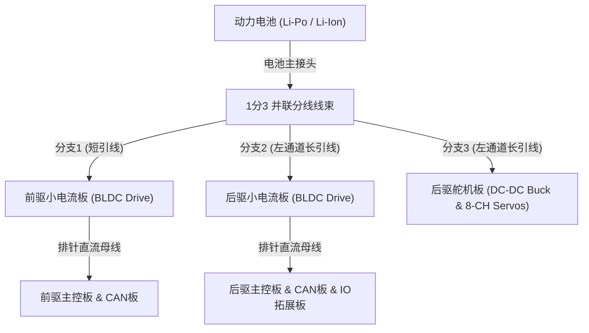
```mermaid
graph TD
    BATT["动力电池 (Li-Po / Li-Ion)"] -->|"电池主接头"| HARNESS["1分3 并联分线线束"]
    HARNESS -->|"分支1 (短引线)"| F_DRV["前驱小电流板 (BLDC Drive)"]
    HARNESS -->|"分支2 (左通道长引线)"| R_DRV["后驱小电流板 (BLDC Drive)"]
    HARNESS -->|"分支3 (左通道长引线)"| R_SRV["后驱舵机板 (DC-DC Buck & 8-CH Servos)"]
    
    F_DRV -->|"排针直流母线"| F_MCU["前驱主控板 & CAN板"]
    R_DRV -->|"排针直流母线"| R_MCU["后驱主控板 & CAN板 & IO拓展板"]
```

#### Limitations
- 原厂接线手册未标明电池公称电压等级（如 2S 7.4V、3S 11.1V 或 4S 14.8V）及推荐容量（mAh）；
- 未标注 1 分 3 分线线束的导线线径规格（AWG）与整机额定/峰值保险丝配置（熔断保护未在图示中体现）。

#### Source Trace
- 文档：《2接线文档.docx》第四节（电源线接线）、第六节末尾扎带固定说明
- 资产：`image23.jpeg` ~ `image30.jpeg`, `image39.jpeg`

---

<a id="p05-can-bus-and-termination"></a>
### P05 — 双板间 TWAI/CAN 差分总线拓扑、端口防呆与 120Ω 终端电阻配置

#### Raw Source Faithful Reproduction（原始证据忠实复刻）
> 原始物料来源：《2接线文档.docx》第五节“遥控器接收器接线”、第六节“CAN板接线”
> 
> ```text
> [原厂文档文字字面逐字摘录]
> 五、遥控器接收器接线
> 我们默认在发出前会焊接好
> 
> 六、CAN板接线
> CAN端子接线，拿出两个CAN端子和两根公对母杜邦线和两根公对公杜邦线，两个杜邦线接在一起延长杜邦线
> 或者使用两根很长的杜邦线
> 杜邦线两端都是接在端子的下面两个接口，对应CAN板的H和L，按照下图来接
> 一端插在前驱动的CAN板上，CAN板上有两个接口，
> 一个是CAN一个是RS485，注意不要接错了
> 将上面白色按钮打到ON档，另一块CAN板也是这样打到ON档
> Can线的另一端通过机器人两侧的通道穿到机器人后侧，接在后侧的can板上，如图所示
> 接完线后的最终效果图
> ```
> 
> 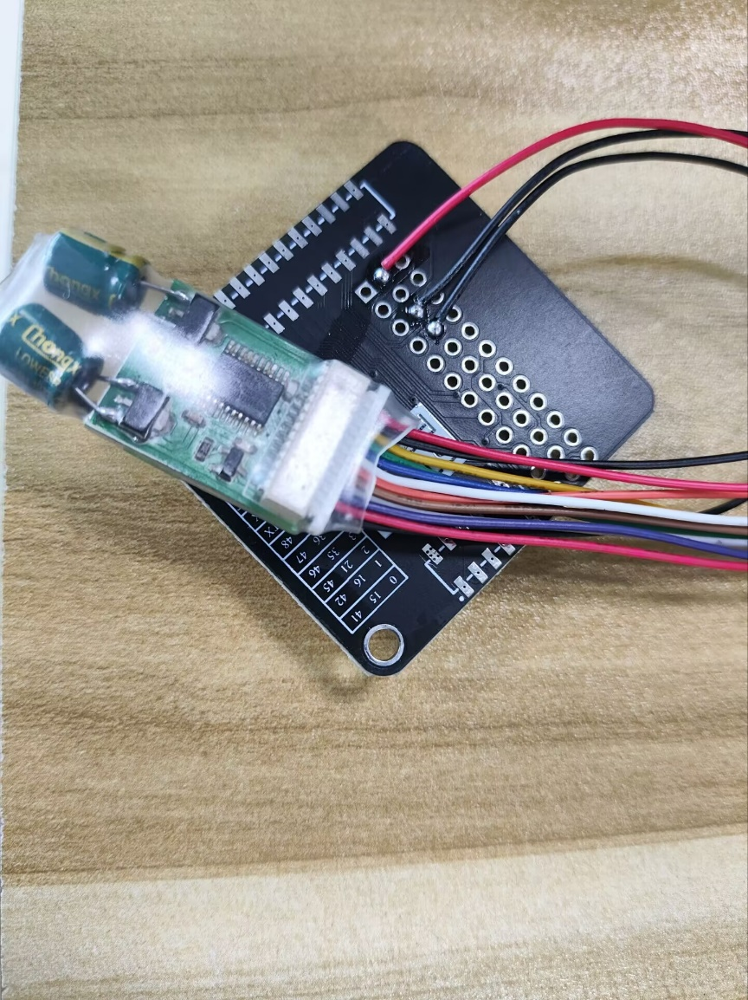
> 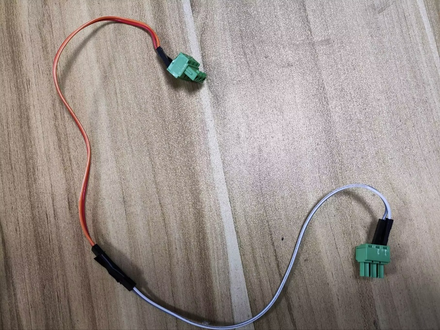
> 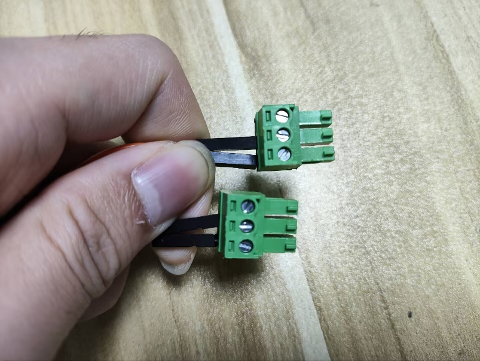
> 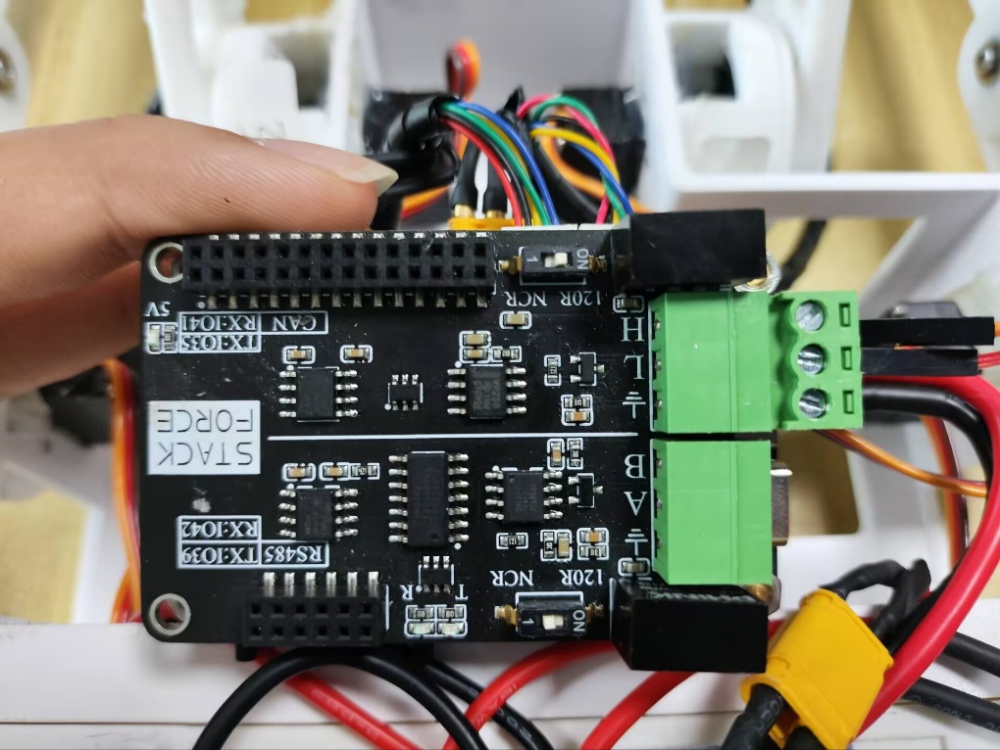
> 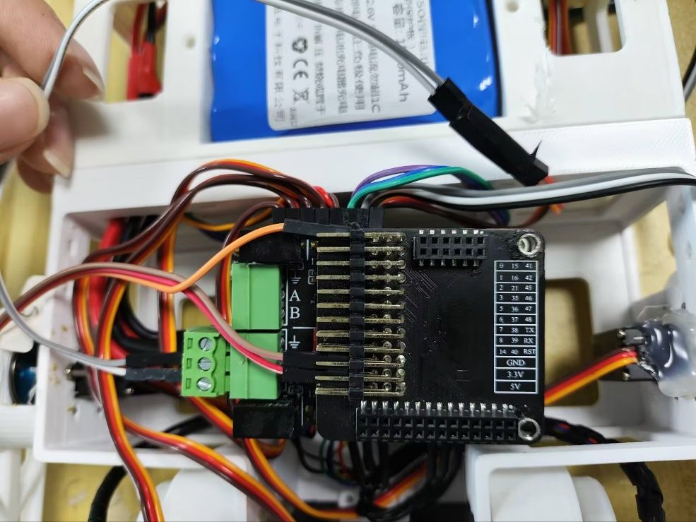
> 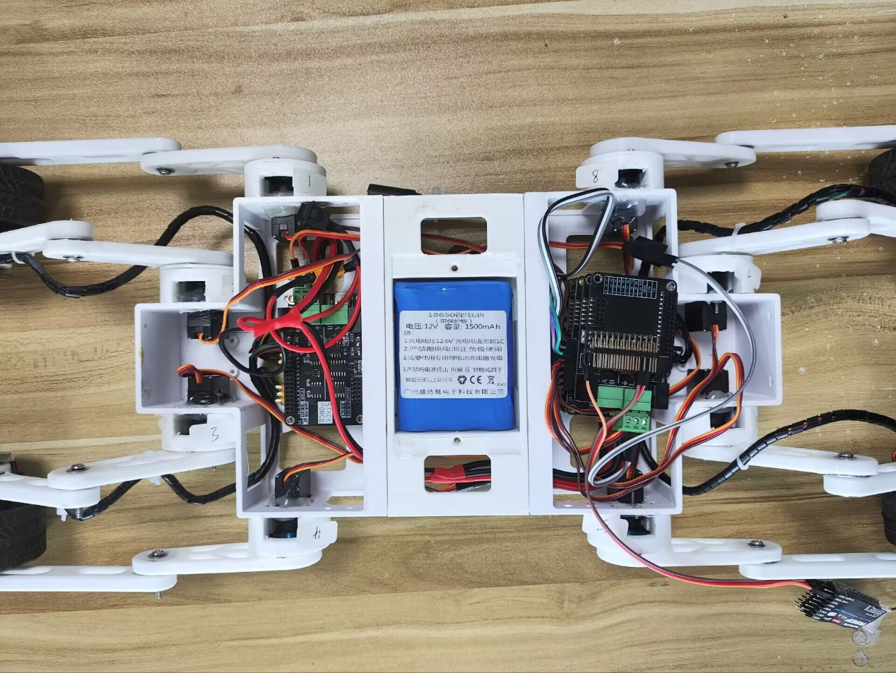
> 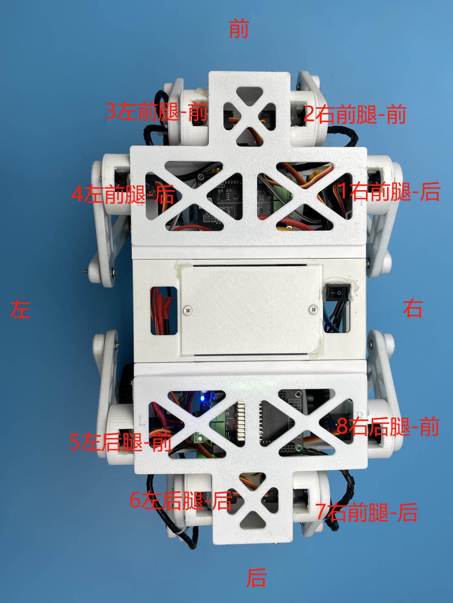

#### Engineering Statement
> [SPECIFIED] StackForce 前驱主控与后驱主控之间通过 **差分 CAN 总线（TWAI 物理层）** 实现跨板控制指令与状态反馈高速通信，具备严格的物理层连线与阻抗匹配规范：
> 1. **CAN 端子极性定义**：
>    - 专用可插拔端子的 **下方两孔** 严格对应 CAN 物理层差分对 **`CAN_H`** 与 **`CAN_L`**；
>    - 两根信号线采用杜邦线贯穿机身通道对接前驱 CAN 板与后驱 CAN 板的对应端子。
> 2. **接口防呆规范（严禁混插 RS485）**：
>    - 板卡设计同时集成了 `CAN` 与 `RS485` 两种工业总线接口；
>    - 原厂规程发出明确安全警告：**必须接入标有 CAN 的端口，严禁错插至 RS485 端口**，否则将引发差分收发器电气损坏或通信中断。
> 3. **120Ω 终端匹配电阻拨码（双端强制开启）**：
>    - 前驱 CAN 板与后驱 CAN 板各配备一个白色微型滑动开关，控制板载 120Ω 高频终端匹配电阻的接入；
>    - 原厂规程强制规定：**两块 CAN 板上的白色按钮必须全部打到“ON”档**；
>    - 在高频方波差分总线拓扑中，双端各并联 120Ω 形成整网 60Ω 等效特征阻抗，可彻底吸收总线末端反射波，避免通信误码与帧丢失。
> 4. **遥控接收链路集成**：无线遥控接收机（出厂预焊接好）安装于后驱板垛顶部的 IO 拓展板上，直接将 2.4GHz 射频控制信号通过后驱 ESP32-S3 解码后经由上述 CAN 总线分发至前驱执行机构。

#### CAN 物理层与终端电阻配置矩阵
| 总线节点 | 板垛层级 | 物理接口标示 | 信号引脚（端子下两孔） | 终端电阻拨码开关位置 | 等效拓扑网络阻抗 |
|---|---|---|---|---|---|
| **Node 1: 前驱板** | 顶层 CAN 板 | `CAN`（防呆避开RS485） | `CAN_H` / `CAN_L` | **拨至 "ON" 档** (接入 120Ω) | 两端并联后<br>$R_{eq} = 60\ \Omega$ |
| **Node 2: 后驱板** | 第4层 CAN 板 | `CAN`（防呆避开RS485） | `CAN_H` / `CAN_L` | **拨至 "ON" 档** (接入 120Ω) | 消除末端信号反射 |

#### Limitations
- 原厂文档未注明 CAN 通信默认物理波特率（如 500 kbps 或 1 Mbps，需在固件证据 `E-FMW-xxx` 中由初始化代码确证）；
- 未提供 RS485 端口的协议使用场景（当前架构中该端口预留闲置）。

#### Source Trace
- 文档：《2接线文档.docx》第五节、第六节
- 资产：`image1.png`, `image31.jpeg`, `image35.jpeg`, `image36.jpeg`, `image37.jpeg`, `image38.jpeg`, `image41.jpeg`

---

## 4. Cross-Validation & Consistency Rules（交叉验证与一致性约束）

1. **与 `E-DOC-001`（遥控器对频与接线指南）的交叉约束**：
   - `E-DOC-001` P01 详述了后驱板垛顶层 IO 拓展板上的遥控接收机具体引脚连线（40脚接信号、GND接地、3V3接电源）；
   - 本证据 `E-DOC-004` P01 与 P05 确证了该 IO 拓展板位于后驱 5 层板垛的最顶层，并经由后驱 S3 读取遥控信号。两份原厂规程在物理层面上完全闭合自洽。
2. **与 `E-DOC-002`（基本操作说明）的交叉约束**：
   - `E-DOC-002` P01 规程强调“先开遥控器，再插狗身电池；关机先拔狗身电池”；
   - 本证据 `E-DOC-004` P04 展示了电池主接头位于右前侧方孔外并用扎带固定的物理形态，确证了整机未设置独立船型大电流机械硬开关，通断电操作物理上直接依赖电池主插头的插拔。
3. **与 `E-DOC-003`（机械安装与调试指南）的交叉约束**：
   - `E-DOC-003` P04 明确记录了舵机板板载电位器负责将电池输入降压供给舵机排针（禁止调节超 8.4V）；
   - 本证据 `E-DOC-004` P03 与 P04 确证了该舵机板具有独立的动力电池分支供电，且 8 路舵机的中间排针为受控 `VCC`。两者对舵机独立高功率供电域的定义完全一致。

---

## 5. Artifact Audit Trail（文档资产审计线索）

- **归档本地图片资产清单**（41 幅）：
  - `docs/assets/images/E-DOC-004-四足机器人整机电气接线与总线拓扑指南/image1.png` (1,899,341 bytes)
  - `docs/assets/images/E-DOC-004-四足机器人整机电气接线与总线拓扑指南/image2.jpeg` (442,891 bytes)
  - `docs/assets/images/E-DOC-004-四足机器人整机电气接线与总线拓扑指南/image3.jpeg` (311,758 bytes)
  - `docs/assets/images/E-DOC-004-四足机器人整机电气接线与总线拓扑指南/image4.jpeg` (187,785 bytes)
  - `docs/assets/images/E-DOC-004-四足机器人整机电气接线与总线拓扑指南/image5.jpeg` (185,619 bytes)
  - `docs/assets/images/E-DOC-004-四足机器人整机电气接线与总线拓扑指南/image6.jpeg` (115,600 bytes)
  - `docs/assets/images/E-DOC-004-四足机器人整机电气接线与总线拓扑指南/image7.jpeg` (200,389 bytes)
  - `docs/assets/images/E-DOC-004-四足机器人整机电气接线与总线拓扑指南/image8.jpeg` (237,482 bytes)
  - `docs/assets/images/E-DOC-004-四足机器人整机电气接线与总线拓扑指南/image9.jpeg` (429,995 bytes)
  - `docs/assets/images/E-DOC-004-四足机器人整机电气接线与总线拓扑指南/image10.jpeg` (199,283 bytes)
  - `docs/assets/images/E-DOC-004-四足机器人整机电气接线与总线拓扑指南/image11.jpeg` (193,939 bytes)
  - `docs/assets/images/E-DOC-004-四足机器人整机电气接线与总线拓扑指南/image12.jpeg` (213,555 bytes)
  - `docs/assets/images/E-DOC-004-四足机器人整机电气接线与总线拓扑指南/image13.jpeg` (157,130 bytes)
  - `docs/assets/images/E-DOC-004-四足机器人整机电气接线与总线拓扑指南/image14.jpeg` (306,797 bytes)
  - `docs/assets/images/E-DOC-004-四足机器人整机电气接线与总线拓扑指南/image15.png` (1,465 bytes)
  - `docs/assets/images/E-DOC-004-四足机器人整机电气接线与总线拓扑指南/image16.png` (1,498 bytes)
  - `docs/assets/images/E-DOC-004-四足机器人整机电气接线与总线拓扑指南/image17.png` (1,805 bytes)
  - `docs/assets/images/E-DOC-004-四足机器人整机电气接线与总线拓扑指南/image18.jpeg` (400,222 bytes)
  - `docs/assets/images/E-DOC-004-四足机器人整机电气接线与总线拓扑指南/image19.jpeg` (200,599 bytes)
  - `docs/assets/images/E-DOC-004-四足机器人整机电气接线与总线拓扑指南/image20.jpeg` (206,175 bytes)
  - `docs/assets/images/E-DOC-004-四足机器人整机电气接线与总线拓扑指南/image21.jpeg` (106,536 bytes)
  - `docs/assets/images/E-DOC-004-四足机器人整机电气接线与总线拓扑指南/image22.jpeg` (166,041 bytes)
  - `docs/assets/images/E-DOC-004-四足机器人整机电气接线与总线拓扑指南/image23.jpeg` (323,803 bytes)
  - `docs/assets/images/E-DOC-004-四足机器人整机电气接线与总线拓扑指南/image24.jpeg` (157,565 bytes)
  - `docs/assets/images/E-DOC-004-四足机器人整机电气接线与总线拓扑指南/image25.jpeg` (152,981 bytes)
  - `docs/assets/images/E-DOC-004-四足机器人整机电气接线与总线拓扑指南/image26.jpeg` (118,062 bytes)
  - `docs/assets/images/E-DOC-004-四足机器人整机电气接线与总线拓扑指南/image27.jpeg` (231,664 bytes)
  - `docs/assets/images/E-DOC-004-四足机器人整机电气接线与总线拓扑指南/image28.jpeg` (155,526 bytes)
  - `docs/assets/images/E-DOC-004-四足机器人整机电气接线与总线拓扑指南/image29.jpeg` (199,969 bytes)
  - `docs/assets/images/E-DOC-004-四足机器人整机电气接线与总线拓扑指南/image30.jpeg` (128,342 bytes)
  - `docs/assets/images/E-DOC-004-四足机器人整机电气接线与总线拓扑指南/image31.jpeg` (428,467 bytes)
  - `docs/assets/images/E-DOC-004-四足机器人整机电气接线与总线拓扑指南/image32.jpeg` (154,990 bytes)
  - `docs/assets/images/E-DOC-004-四足机器人整机电气接线与总线拓扑指南/image33.jpeg` (214,790 bytes)
  - `docs/assets/images/E-DOC-004-四足机器人整机电气接线与总线拓扑指南/image34.jpeg` (248,482 bytes)
  - `docs/assets/images/E-DOC-004-四足机器人整机电气接线与总线拓扑指南/image35.jpeg` (368,122 bytes)
  - `docs/assets/images/E-DOC-004-四足机器人整机电气接线与总线拓扑指南/image36.jpeg` (174,025 bytes)
  - `docs/assets/images/E-DOC-004-四足机器人整机电气接线与总线拓扑指南/image37.jpeg` (231,960 bytes)
  - `docs/assets/images/E-DOC-004-四足机器人整机电气接线与总线拓扑指南/image38.jpeg` (222,105 bytes)
  - `docs/assets/images/E-DOC-004-四足机器人整机电气接线与总线拓扑指南/image39.jpeg` (164,579 bytes)
  - `docs/assets/images/E-DOC-004-四足机器人整机电气接线与总线拓扑指南/image40.jpeg` (300,699 bytes)
  - `docs/assets/images/E-DOC-004-四足机器人整机电气接线与总线拓扑指南/image41.jpeg` (496,900 bytes)
