# E-DOC-005 四足机器人整机固件烧录与出厂联调配置指南

## 证据元数据
- **证据唯一标识**：`E-DOC-005`
- **证据类型**：`DOC/SPEC`（出厂技术规程与固件调试指南）
- **认识论角色**：规格与操作规程事实（`[SPECIFIED]`、`[PROCEDURE_DEFINED]`）。记录原厂针对 StackForce 四足轮腿机器人整机烧录工具链配置、S1/S3 跨芯片硬件切换机制、BLDC 轮电机极对数辨识自检、8 通道舵机机械零位偏置标定、以及轮机速度反馈与控制极性双闭环调试规程。
- **技术领域**：CALIBRATION / FIRMWARE_DEPLOYMENT / COMM_DEBUG
- **原始文件路径**：
  - `CEG5003/doc/四足机器人-origin/1教程/3调试文档 .docx`
  - `CEG5003/doc/四足机器人-origin/1教程/3调试文档 .pdf`
- **归档静态资源**：`docs/assets/images/E-DOC-005-四足机器人整机固件烧录与联调配置指南/`（共提取 51 幅原厂截图与调试图解）

---

## 原始物料工程审计概述

本调试文档详细规定了四足机器人从单板固件编译烧录到整机动力学联调的闭环工序。文档明确揭示了四足机器人系统架构中最为关键的硬件复用与软件参数标定规则：
1. **单 Type-C 接口双 MCU 硬件复用拓扑**：每块板垛集成一颗 ESP32（标记为 S1，负责 BLDC 底层 FOC 换相）与一颗 ESP32-S3（标记为 S3，负责整机运动解算与总线控制），通过物理白色微动按键切换 Type-C 排针走线，实现单 USB 接口对双芯片的无缝切换烧录。
2. **BLDC 轮电机 FOC 极对数辨识与自检基准**：严格要求自检时机器人架空离地，以极对数识别值等于 **7** 作为硬件闭环正常判据，将 6 或 8 判为轴承过紧过阻故障。
3. **8 通道舵机连杆拆卸安全规程与角度符号极性**：要求标定前必须拆卸连杆防冲齿，定义“面向腿部顺时针为负、逆时针为正”的标定符号律，确立出厂基准偏置向量 `[3, 5, -5, -7, 3, -5, -8, 8]`。
4. **轮机速度反馈极性 (`SpdDir`) 与控制极性 (`Dir`) 双闭环标定**：通过固件宏变量 `flat = 1` 强制电机单向旋转，对比 VOFA+ 串口遥测与物理旋转方向确立速度反馈符号；通过 `flat = 0` 配合遥控器推杆确立四个轮机的运动控制极性。

---

## 拆解原子证据清单

### E-DOC-005#P01: Type-C 硬件排针复用与 S1/S3 双芯片物理切换机制
- **技术规格与物理事实**：
  1. **板载双芯片分工**：
     - **S1 芯片（ESP32-WROOM）**：专职执行电机 FOC 底层控制算法（对应固件 `E-FW-002`）；
     - **S3 芯片（ESP32-S3）**：专职执行五连杆运动学逆解、步态生成、PPM/CAN 总线协议（对应固件 `E-FW-003` 与 `E-FW-004`）。
  2. **Type-C 硬件通道物理复用**：
     - 主控板设计利用 Type-C 接口上下对称排针的物理独立通道，分别引出 S1 与 S3 的 USB-UART 通信引脚；
     - 板载白色自锁微动按键作为硬件多路选择器切换目标芯片。
  3. **按键状态与 LED 指示灯真值表**：
     | 白色按键状态 | 状态指示灯 | 激活芯片平台 | USB 线缆物理插入方向 | 对应固件项目 |
     |---|---|---|---|---|
     | **松开 (Released)** | **黄灯常亮** | **S1 (ESP32)** | **线缆有缝隙侧朝上**（无缝朝下） | `BLDC_Control` |
     | **按下 (Pressed)** | **绿灯常亮** | **S3 (ESP32-S3)** | **线缆无缝隙侧朝上**（无缝朝下） | `bipedal_calibrate` / `SF_serveo_control` |
  4. **跨芯片烧录硬件报错特征与排查**：
     - 若在 S3 模式下尝试烧录 S1 程序，esptool 将报出致命硬件类型冲突：
       ```text
       A fatal error occurred: This chip is ESP32-S3 not ESP32. Wrong --chip argument?
       *** [upload] Error 2
       ```
     - 排除准则：检查 USB 插头正反面极性，检查板载白色按键是否松开至黄色指示灯点亮。
     - 若报 `Could not open COM port, the port does not exist`，需关闭 VOFA+ 上位机串口占用。

- **原厂图证支撑**：
  - 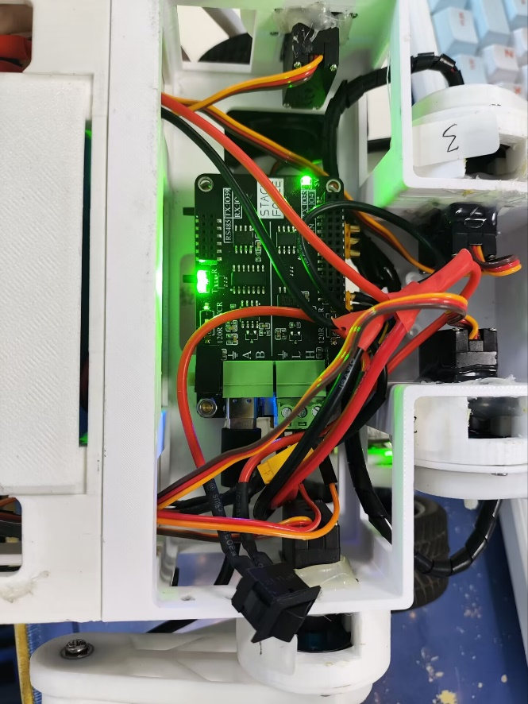
  - 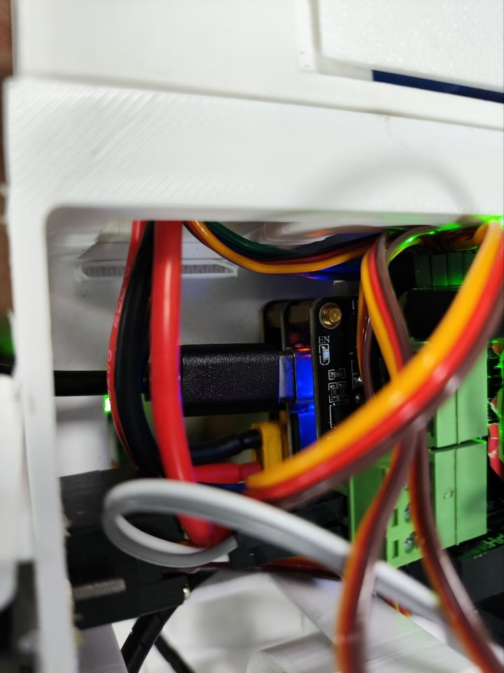
  - 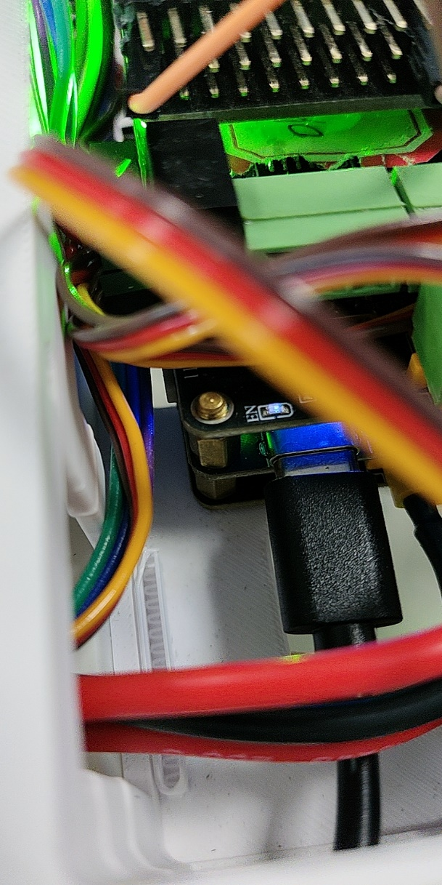

---

### E-DOC-005#P02: BLDC 轮电机 FOC 极对数辨识准则与启动自检校准
- **技术规格与物理事实**：
  1. **无负载离地自检约束**：
     - 上电或复位执行电机 FOC 辨识程序时，**必须用手扶持机器人使驱动轮完全悬空离地**，严禁轮面接触地面或受任何外部负载机械阻力。
  2. **上位机监控配置**：
     - 采用 VOFA+ 串口助手，波特率配置为 `115200 bps`；可通过板载 S1 复位键或双击 VOFA+ 控制界面的 `RTS` 引脚产生脉冲复位。
  3. **极对数（Pole Pairs）辨识结果判定真值表**：
     | 辨识输出极对数值 | 物理系统状态判定 | 根因机理分析 | 现场工程纠偏对策 |
     |---|---|---|---|
     | **`7`** | **辨识成功 (PASS)** | 14P 电机转子永磁体对数正确对齐，MT6701 磁编码器角度采样连续无失真 | 固化参数，进入舵机偏置标定 |
     | **`inf` / 字符串** | **致命通讯/供电故障** | 12V 动力电池未供电、小电流驱动板无电、磁铁脱落或间隙超差（$>1.5\,\text{mm}$） | 检查 12V 母线电压、电机排线极性与径向磁铁安装 |
     | **`6` 或 `8`** | **机械装配过阻故障** | 驱动轮装配同轴度不良、外侧法兰轴承压入过深导致转子轴向抱死、或离地不充分摩擦受阻 | 重新松动并校准轮电机轴承安装间隙，保持完全悬空并重测 |
  4. **分布式双板覆盖**：前驱动板与后驱动板均须逐一执行本极对数校准程序，确保 4 个轮电机全部辨识为 7。

- **原厂图证支撑**：
  - 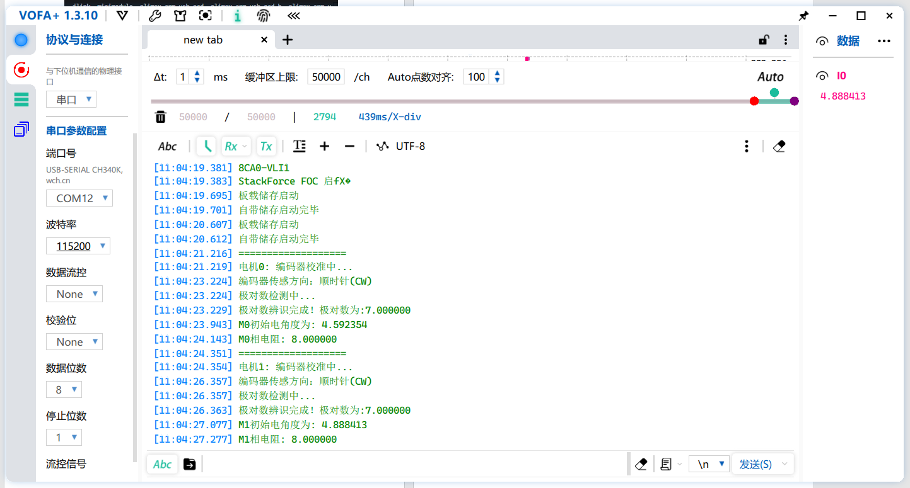
  - 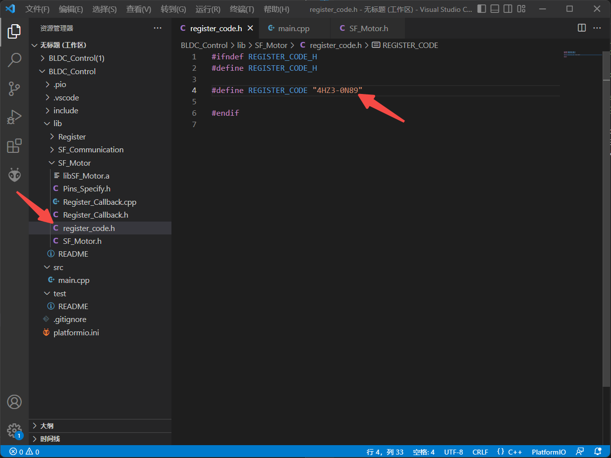

---

### E-DOC-005#P03: 8 通道舵机机械拆卸安全准则与交互式零位偏置标定规程
- **技术规格与物理事实**：
  1. **大腿机械拆卸强制安全准则**：
     - **在烧录标定或运动控制固件前，必须将全部大腿机械连杆从舵盘上彻底拆下**。
     - 物理机理：新芯片或重烧固件后，PCA9685/ESP32 PWM 输出通道在初始化瞬间会产生瞬态脉冲，若连杆处于未标定极限位置，舵机会发生大角度撞击机身死挡，引发连杆折断或金属舵机齿轮剧烈扫齿。
  2. **交互式标定固件与数据格式**：
     - 烧录 `bipedal_calibrate` 固件；VOFA+ 打开串口（`115200 bps`），接收基准数据包：
       `0, 0, 0, 0, 0, 0, 0, 0`，分别对应 1 号至 8 号舵机的角度偏置量（单位：度）。
  3. **连杆物理装配与垂直对齐操作**：
     - 电池接入动力供电，等待 8 路舵机完成初始化转动并稳定保持在电气中位；
     - 将大腿连杆装上金属舵盘，使连杆尽量垂直于机器人机身，拧入中心锁紧黑色螺钉固定；
  4. **角度微调与方向极性符号约定**：
     - 极性定义：**人眼正视腿部连杆表面，顺时针旋转补偿为负（-），逆时针旋转补偿为正（+）**；
     - 示例操作：若 4 号大腿安装时向右偏移，在 VOFA+ 中输入 `0,0,0,-7,0,0,0,0` 并发送，驱动 4 号舵机顺时针转动 7°，直至大腿连杆完全垂直接触水平线；
  5. **出厂基准偏置向量确立**：
     - 依次完成 1~8 号舵机微调，记录出厂最终偏置向量：
       $$\mathbf{\delta}_{\text{servo}} = [3, 5, -5, -7, 3, -5, -8, 8]^\top$$
     - 该偏置向量随后直接硬编码写入运动控制固件 `SF_serveo_control/src/main.cpp` 的 `servo_off[8]` 数组中。

- **原厂图证支撑**：
  - 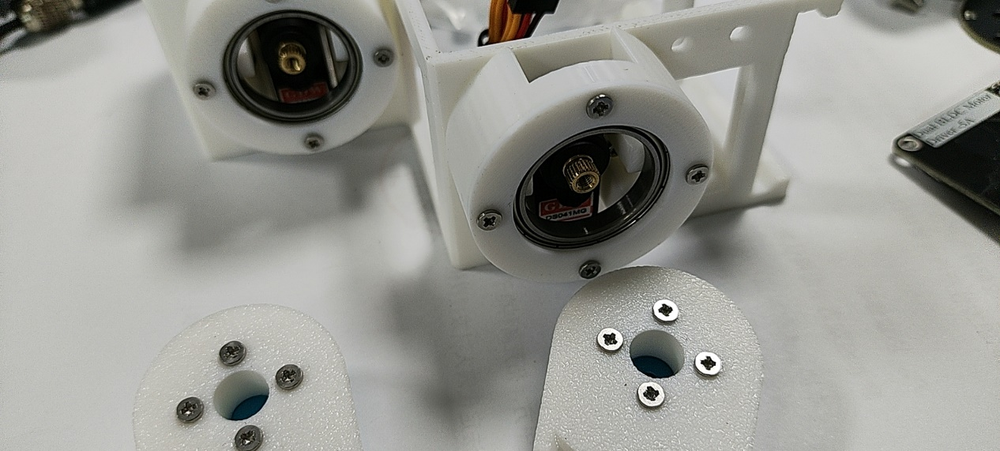
  - 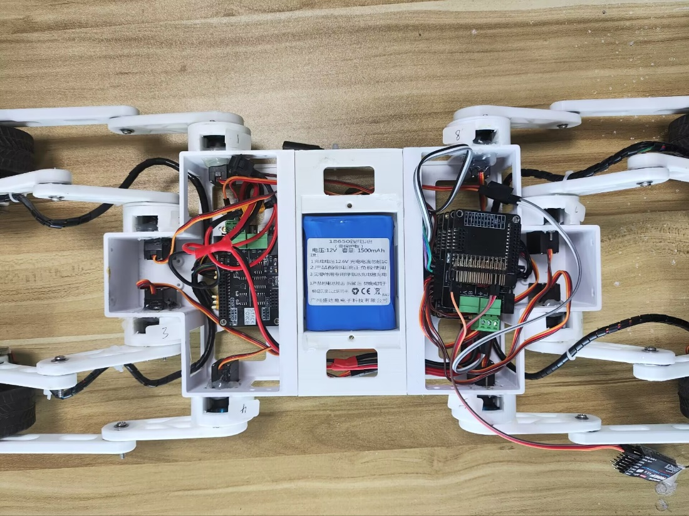
  - 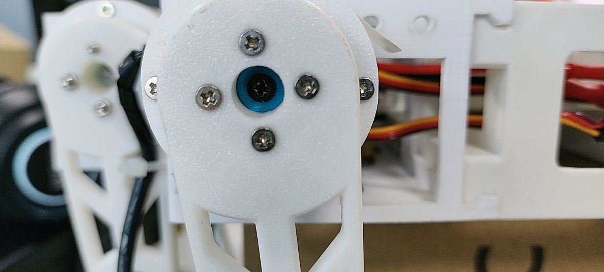
  - 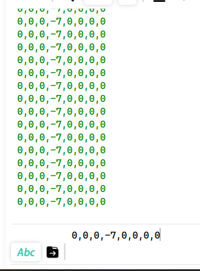
  - 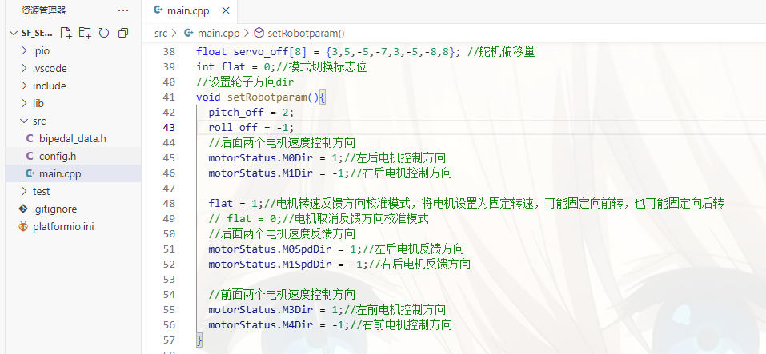

---

### E-DOC-005#P04: 前后主从双板固件烧录部署与整机遥控动作初检规程
- **技术规格与物理事实**：
  1. **全机固件部署矩阵**：
     | 板卡位置 | 目标 MCU | 切换按键与指示灯 | 部署工程目录 | 固件核心职责 |
     |---|---|---|---|---|
     | **后板垛（主控）** | **S1 (ESP32)** | 按键松开 / 黄灯 | `BLDC_Control` | 后轮双路底层 FOC 闭环驱动 |
     | **后板垛（主控）** | **S3 (ESP32-S3)** | 按键按下 / 绿灯 | `SF_serveo_control` | PPM 解码、五杆逆解、姿态 PID、CAN 广播 |
     | **前板垛（从控）** | **S1 (ESP32)** | 按键松开 / 黄灯 | `BLDC_Control` | 前轮双路底层 FOC 闭环驱动 |
     | **前板垛（从控）** | **S3 (ESP32-S3)** | 按键按下 / 绿灯 | `SF_serveo_control_device2` | 1Mbps CAN 从节点接收、前轮速度透传 |
  2. **整机上电缓冲与遥控器对频约束**：
     - 拔下全部 USB 烧录线，接入动力电池，开机后系统具备 10 秒硬延时保护（等待母线高压与板载 FOC 自检稳定）。
     - 按照 `E-DOC-001` 规程完成发射机与接收机 PPM 对频。
  3. **初始开环运动核验挡位设定**：
     - **拨杆 A（SW-A）**：拨至最上方（无陀螺仪车子模式，切断闭环姿态反馈扰动）；
     - **拨杆 C（SW-C）**：拨至最下方（车子轮式驱动模式）；
     - **拨杆 E（SW-E）**：拨至最上方（开机使能）；
     - **摇杆 B 检验**：前后推拉摇杆 B，核验整机腿高基准是否平稳升降；左右推拉摇杆 B，核验整机左右翻滚倾角是否对称响应。

- **原厂图证支撑**：
  - 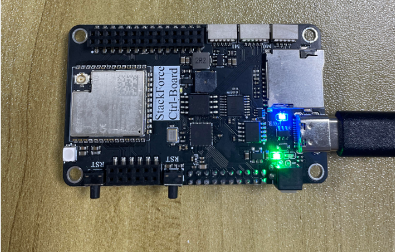
  - 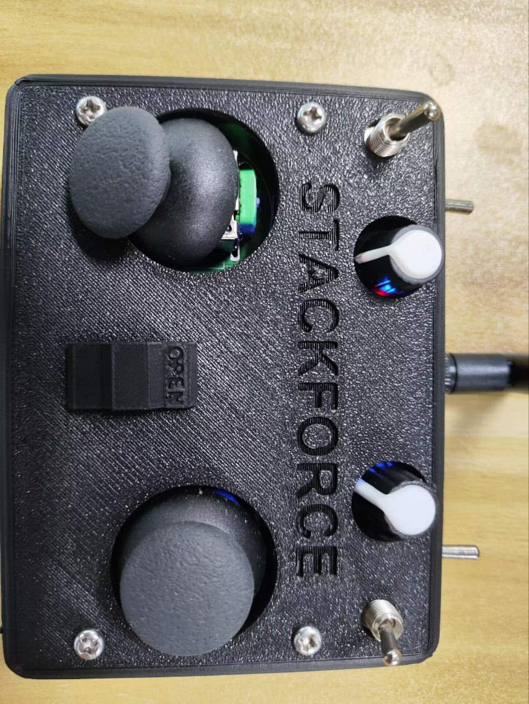

---

### E-DOC-005#P05: 轮电机速度反馈极性 (`SpdDir`) 与控制极性 (`Dir`) 双闭环标定规程
- **技术规格与物理事实**：
  1. **第一阶段：电机编码器速度反馈极性校准 (`SpdDir`)**：
     - **固件开关使能**：在 `SF_serveo_control` 的 `setRobotparam()` 函数中将 `flat` 变量置为 `1`（强制两个后轮以恒定正转速开环旋转）；
     - **正转方向定义**：朝向机器人前方（堆叠板较少的一侧）滚动为电机正转方向（速度标量为正）；
     - **左后轮（M0）判定规则**：
       - 观察电机向前转：若 VOFA+ 串口打印的第 2 项数据（`M0Speed`）为负数，则必须将代码中的 `motorStatus.M0SpdDir` 取反（$1 \to -1$ 或 $-1 \to 1$）；
       - 若 VOFA+ 打印为正数，则保持符号不变。
     - **右后轮（M1）判定规则**：
       - 观察右后轮转动方向与 VOFA+ 第 3 项数据（`M1Speed`），符号必须与实际前向旋转严格保持同号（向前为正，向后为负），反向则取反 `motorStatus.M1SpdDir`。
  2. **第二阶段：轮电机运动控制指令极性校准 (`Dir`)**：
     - **恢复正常控制**：将 `flat` 重新置为 `0` 并烧录，解除强制旋转模式；
     - **摇杆推杆前行测试**：遥控器 SW-A 打上、SW-C 打下，向前平稳推起右摇杆 D（前进线速度）；
     - **四轮旋转一致性检查与取反规则**：
       | 电机编号与物理位置 | 摇杆前推时物理旋转表现 | `motorStatus` 控制极性代码操作 |
       |---|---|---|
       | **M0（左后轮）** | 若轮子反向向后转 | `motorStatus.M0Dir` **取反**（$1 \leftrightarrow -1$） |
       | **M1（右后轮）** | 若轮子同向向前转 | `motorStatus.M1Dir` **保持不取反** |
       | **M3（左前轮）** | 若轮子同向向前转 | `motorStatus.M3Dir` **保持不取反** |
       | **M4（右前轮）** | 若轮子同向向前转 | `motorStatus.M4Dir` **保持不取反** |
     - 确保四轮在整机前进指令下物理旋转方向严格一致，杜绝对角反旋扭曲。

- **原厂图证支撑**：
  - 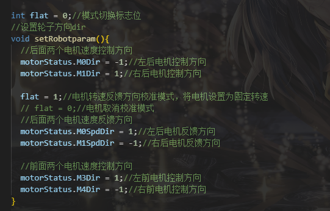
  - 
  - 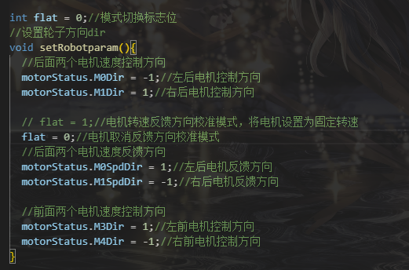

---

## 认识论状态判定 (Epistemic Status)

| 证据项编号 | 事实断言内容 | 认识论判定 | 严谨边界与审计说明 |
|---|---|---|---|
| `E-DOC-005#P01` | S1/S3 硬件多路按键切换、LED 指示灯及芯片类型冲突特征 | `[SPECIFIED]` | 明确由原厂硬件设计与测试文档规范，有明确按键真值表支撑 |
| `E-DOC-005#P02` | BLDC 电机离地架空、7 极对数成功判定及 6/8 轴承阻力异常 | `[PROCEDURE_DEFINED]` | 明确出厂 FOC 辨识检验流程，故障归因为经验与机理双重对应 |
| `E-DOC-005#P03` | 连杆拆卸安全规则、顺负逆正极性律及 `[3,5,-5,-7,3,-5,-8,8]` 偏置 | `[PROCEDURE_DEFINED]` | 具有严格装配防碰齿安全约束，与 `E-FW-003` 固件硬编码严格吻合 |
| `E-DOC-005#P04` | 四套固件跨板部署矩阵、开机 10 秒缓冲及遥控开环动作初验 | `[PROCEDURE_DEFINED]` | 跨前后板垛分布式固件烧录规程，限定为开环几何观察 |
| `E-DOC-005#P05` | 速度反馈极性 (`SpdDir`) 与运动控制极性 (`Dir`) 双闭环标定准则 | `[PROCEDURE_DEFINED]` | 严格区分解码器速度测量符号与执行器控制指令符号的物理一致性 |

---

## 交叉索引与依赖图

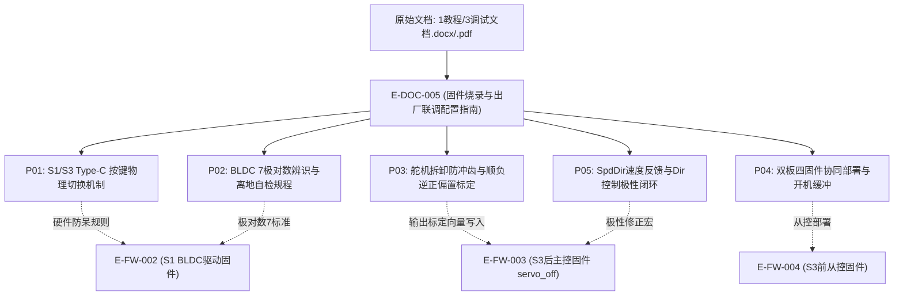
