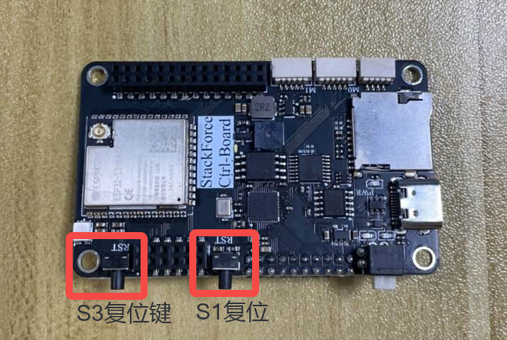
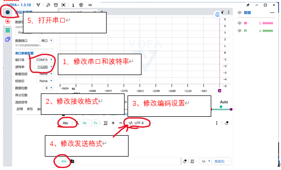
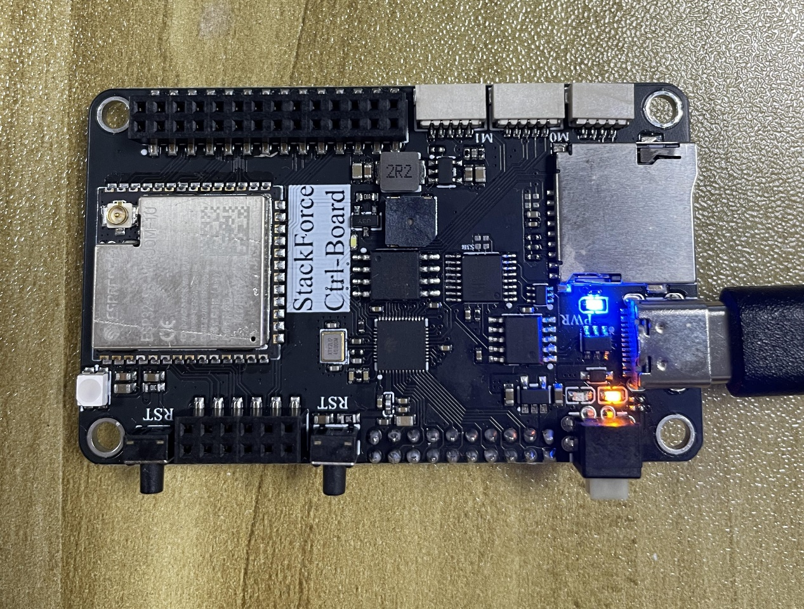
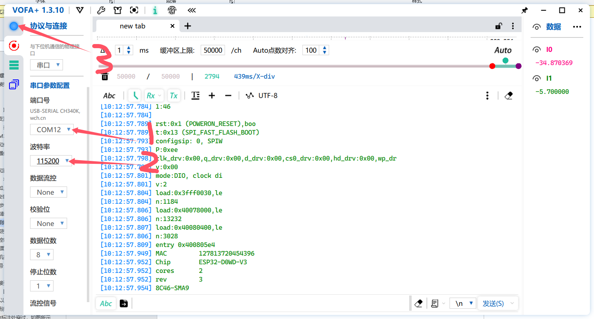
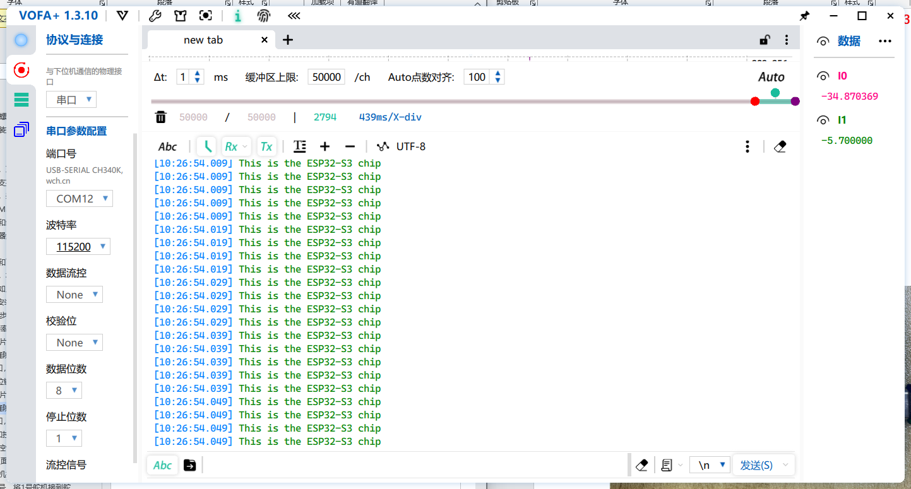
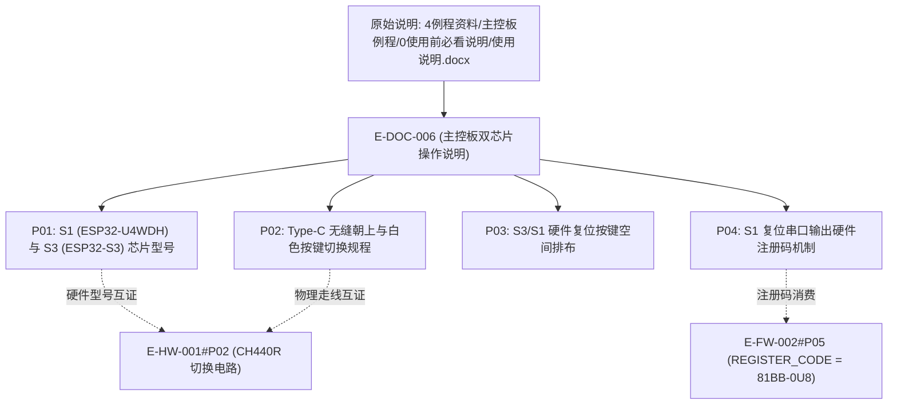

# E-DOC-006 主控板双芯片操作与例程使用必读说明

## 证据元数据
- **证据唯一标识**：`E-DOC-006`
- **证据类型**：`DOC/SPEC`（硬件操作说明与开发入门指南）
- **认识论角色**：规格与操作规程事实（`[SPECIFIED]`、`[PROCEDURE_DEFINED]`）。记录原厂针对 StackForce 主控板双芯片具体微处理器选型（ESP32-U4WDH 与 ESP32-S3-WROOM-1U-N16R2）、单 Type-C 端口硬件复用操作约束、三按键物理排布布局、以及出厂固件串口启动日志中提取硬件注册码的操作规程。
- **技术领域**：FIRMWARE / DUAL_MCU_OPERATION / FACTORY_REGISTRATION
- **原始文件路径**：`CEG5003/doc/四足机器人-origin/4例程资料/主控板例程/0使用前必看说明/使用说明.docx`
- **归档静态资源**：`docs/assets/images/E-DOC-006-主控板双芯片操作与例程使用必读说明/`（共提取 8 幅原厂图解与串口截屏）

---

## 原始物料工程审计概述

本使用说明作为“4例程资料”的核心前置指导文档，首次直接给出了主控板上 S1 芯片与 S3 芯片的确切原厂芯片型号，并对物理开发操作给出了严格的安全防呆指引：
1. **明确双芯片确切型号**：
   - **S1 芯片**：确认为乐鑫 **ESP32-U4WDH**（单核/双核嵌入式 Flash 芯片，封装紧凑，专职用于电机驱动底层算法）；
   - **S3 芯片**：确认为乐鑫 **ESP32-S3-WROOM-1U-N16R2**（双核 Xtensa LX7，16MB Flash + 2MB PSRAM，专职用于上层运动解算与姿态解算）。
2. **Type-C 单口硬件复用规程**：进一步明确了 USB 数据线插入方向约束（线缆接头无缝隙侧始终朝上），配合板载白色自锁微动开关实现硬件切换。
3. **出厂注册码直接获取规程**：文档揭示了出厂固件在 S1 芯片启动时，会通过串口直接输出机器唯一注册码（与贴纸一致），建立了出厂注册码的又一硬件级交叉验证通道。

---

## 拆解原子证据清单

### E-DOC-006#P01: 主控板 S1 (ESP32-U4WDH) 与 S3 (ESP32-S3) 芯片确切规格
- **技术规格与物理事实**：
  1. **S1 电机驱动芯片**：
     - 型号：**ESP32-U4WDH**；
     - 架构与内建存储：基于 Xtensa® 32-bit LX6 架构，内部晶圆级封装 4 MB SPI Flash；
     - 职责边界：专职运行 `BLDC_Control` 固件，独立完成双路三相高频 FOC 空间矢量调制与电流采集。
  2. **S3 核心运控芯片**：
     - 型号：**ESP32-S3-WROOM-1U-N16R2**；
     - 架构与内建存储：基于 Xtensa® 32-bit 双核 LX7 架构，板载 16 MB 外部 Flash 与 2 MB PSRAM，外接 IPEX 天线座；
     - 职责边界：专职运行 `SF_serveo_control` / `SF_serveo_control_device2`，完成 PPM 解码、五杆闭链逆解、MPU6050 滤波姿态解算及 1Mbps CAN 广播。

- **原厂图证支撑**：
  - 

---

### E-DOC-006#P02: Type-C 线缆插入极性与白色微动按键切换规程
- **技术规格与物理事实**：
  1. **USB 线缆物理方向红线**：
     - 操作规范：**USB 插口线缆始终要求无缝隙一侧朝上**（有缝隙一侧朝下）。
  2. **按键切换与指示灯真值表**：
     | 目标调试芯片 | 白色按键物理动作 | 硬件指示灯状态 | 激活通信信道 |
     |---|---|---|---|
     | **S1 驱动芯片** | **松开按键 (弹起)** | **黄色 LED 常亮** | 连通 ESP32-U4WDH 串口 |
     | **S3 运控芯片** | **按下按键 (锁定)** | **绿色 LED 常亮** | 连通 ESP32-S3 串口 |
  3. **安全操作约束**：严禁在未确认按键状态与目标芯片匹配的情况下盲目烧录，防止固件烧错导致引脚电平倒灌或芯片烧毁。

- **原厂图证支撑**：
  - 
  - 

---

### E-DOC-006#P03: 主控板物理三按键空间布局约束
- **技术规格与物理事实**：
  1. **板端物理按键排布序列**（正视板端接插件边缘，从左至右）：
     - **左侧按键**：**S3 芯片硬件复位按键（S3 RST）**；
     - **中间按键**：**S1 芯片硬件复位按键（S1 RST）**；
     - **右侧接口**：**Type-C USB 通信与供电母座**；
     - **板中按键**：白色自锁多路切换微动按键（CH440R 控制）。
  2. **操作意义**：独立硬件复位按键允许开发人员在不断电的情况下分别对电机控制核心或运动解算核心进行热重启。

- **原厂图证支撑**：
  - 

---

### E-DOC-006#P04: 出厂固件启动日志与 S1 复位硬件注册码获取机制
- **技术规格与物理事实**：
  1. **出厂固件串口自检行为**：
     - 在 2024 年 10 月 21 日之后出厂的板卡，S1 芯片均预烧录了带身份验证的底层出厂自检程序。
  2. **获取注册码具体操作时序**：
     - 连接 USB 线（无缝朝上），松开白色按键切换至 S1（黄灯常亮）；
     - 打开上位机 VOFA+，串口波特率配置为 `115200 bps`（明确要求不要误设为 1152000）；
     - 按下主控板**中间的 S1 复位按键**，串口监视器即时输出芯片初始化日志；
     - **日志最末行即为该板对应的唯一硬件注册码**（与防静电袋外标签粘贴的注册码字符串完全一致，例如 `"81BB-0U8"`）。
  3. **工程价值**：为固件重烧、用户授权恢复以及丢失标签纸情况提供了不可篡改的板级读取凭据。

- **原厂图证支撑**：
  - 
  - 
  - 

---

## 认识论状态判定 (Epistemic Status)

| 证据项编号 | 事实断言内容 | 认识论判定 | 严谨边界与审计说明 |
|---|---|---|---|
| `E-DOC-006#P01` | S1 芯片为 ESP32-U4WDH，S3 芯片为 ESP32-S3-WROOM-1U-N16R2 | `[SPECIFIED]` | 原厂使用说明明确记录芯片具体芯片型号与内嵌 Flash 规格 |
| `E-DOC-006#P02` | Type-C 无缝朝上约束与白色按键松开(S1黄)/按下(S3绿)规则 | `[PROCEDURE_DEFINED]` | 规范明确操作步骤，与硬件原理图 `E-HW-001#P02` 形成互证 |
| `E-DOC-006#P03` | 从左到右依次为 S3复位键、S1复位键、Type-C 物理接口布局 | `[SPECIFIED]` | 原厂图解清晰标定物理按键空间排布 |
| `E-DOC-006#P04` | S1 出厂固件在复位时通过 115200 串口最末行直接输出注册码 | `[PROCEDURE_DEFINED]` | 建立软硬件注册码获取规程，与 `E-FW-002` 授权码实现闭环 |

---

## 交叉索引与依赖图

