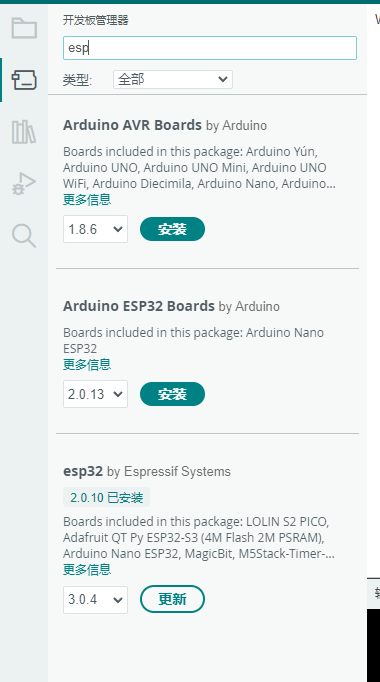
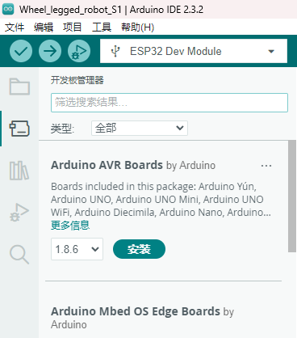
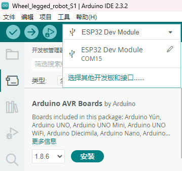
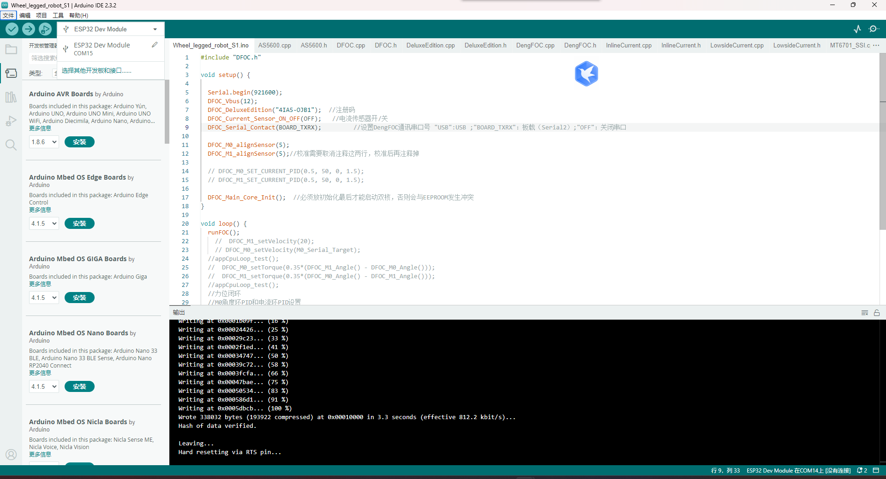

# E-DOC-007 客户注册码获取与Arduino环境配置教程

> **认识论角色说明**：本文件属于 `DOC/SPEC`（技术规程与操作规范），忠实归档自原厂提供的《arduino使用教程.docx》。本文件严格限定于上位机 IDE 开发环境搭建、目标开发板与串口配置、烧录时序规程以及向客服提取注册码的交互流程规范；其底层的 C/C++ 硬件指纹提取源码实现完全剥离至 [`E-FW-008`](./E-FW-008-芯片唯一eFuse硬件信息与设备指纹读取固件.md)，实现技术规程与固件源码的纯粹解耦。

---

## 1. 原厂文档背景与工程目的

根据机器人出厂分发机制，底盘双路无刷电机驱动库（`SF_BLDC` 闭源静态库）受到硬件节点授权控制（即每个驱动板 S1 芯片绑定唯一的出厂注册码 `REGISTER_CODE`，例如出厂基准样机代码中的 `"81BB-0U8"`）。当客户需要二次开发、升级驱动底层或重新获取授权时，必须通过标准化规程提取该 S1 芯片的物理硬件指纹（eFuse MAC 及硅片版本号），提交原厂客服换取授权注册码。

---

## 2. 原子技术规程定义（Parts）

### Part 01: Arduino IDE 开发环境与 ESP32 核心包版本规范 (`P01`)

1. **IDE 版本基准**：
   - 官方指定软件环境为 **Arduino IDE 2.3.2**（或 2.x 系列版本）。
2. **ESP32 核心支持包（Core）严格版本锁定**：
   - 打开 Arduino IDE 左侧导航栏之“开发板管理器”（Boards Manager）；
   - 在搜索框键入 `esp32`，定位到由 **Espressif Systems** 官方维护的 `esp32` 支持包；
   - **关键约束**：下拉版本选择列表，**必须严格指定为 `2.0.10` 版本**并点击安装（`Install`）；
   - **工程风险预警**：不得随意安装 3.0.x 以上新版本核心包，新版本底层重构了 MCPWM 与 RMT 驱动接口，会导致 `SF_BLDC` 静态底层库发生链接符号断裂或换相中断崩溃。



---

### Part 02: 目标芯片开发板型号匹配规范 (`P02`)

1. **目标芯片指向**：
   - 注册码读取程序 `getInfo.ino` 运行于下层无刷电机驱动核心 **S1（ESP32-U4WDH / ESP32-D0WD-V3）**；
2. **开发板型号选择路径**：
   - 导航路径：`工具 (Tools)` $\\rightarrow$ `开发板 (Board)` $\\rightarrow$ `esp32` $\\rightarrow$ **`ESP32 Dev Module`**；
   - 状态栏与顶部快速选择器需明确显示当前工程为 `Wheel_legged_robot_S1 | Arduino IDE 2.3.2`，目标板设定为 `ESP32 Dev Module`。




---

### Part 03: 物理硬件切换与串口端口选定 (`P03`)

1. **硬件切换前提（依照 E-DOC-005/006）**：
   - Type-C 数据线插入主控板右侧 USB 口；
   - 按键切换通道：观察板载指示灯，必须处于 **黄灯亮起（S1 通道导通，有缝向上）** 状态；
   - 若处于绿灯（S3 通道），按下自锁按键将其释放切换为黄灯。
2. **COM 端口枚举与选定**：
   - 导航路径：`工具 (Tools)` $\\rightarrow$ `端口 (Port)`，勾选对应的 CH340K 虚拟串口（如 `COM14` 或 `COM15`）。

---

### Part 04: 固件编译上传与 Flash 烧录时序 (`P04`)

1. **固件载入**：
   - 在 IDE 中打开 `getInfo.ino` 源码工程；
2. **一键烧录**：
   - 点击 IDE 左上角向右箭头按钮（`上传 / Upload`）；
   - IDE 自动启动 `esptool.py` 执行交叉编译与代码打包；
   - 烧录日志应显示擦除 Flash、以 $\\approx 812.2\\,\\text{kbit/s}$ 速率写入固件、校验数据哈希（`Hash of data verified.`），最后通过 RTS 引脚触发芯片硬件复位（`Leaving... Hard resetting via RTS pin...`）。



---

### Part 05: 串口监控交互与设备指纹提取规程 (`P05`)

1. **打开串口监视器**：
   - 点击 IDE 右上角放大镜图标（`串口监视器 / Serial Monitor`）；
2. **波特率配置**：
   - 在串口监视器面板右上角下拉列表中，将通信波特率设定为 **`115200`**；
   - 行尾结束符选择“换行”或“无”；
3. **物理触发硬件重启获取指纹**：
   - 轻按主控板中央的 **S1 RST 复位按键**（中间微动开关）；
   - 串口监视器将瞬间打印出被边界线包围的 4 行核心硅片物理信息：
     ```text
     ==================
     [eFuse MAC 地址（64 位十进制或十六进制唯一硬件码）]
     [Chip Model 硅片型号，如 ESP32-D0WD-V3 / ESP32-U4WDH]
     [Chip Cores 双核心数: 2]
     [Chip Revision 硅片修订版本号]
     ==================
     ```
4. **客服对接与注册码激活闭环**：
   - 完整复制串口监视器输出的四项硬件指纹数据，连同购买凭证发送给原厂技术支持/客服；
   - 原厂据此通过授权算法签名生成永久匹配该芯片的注册码（如 `"81BB-0U8"`）；
   - 客户将获得的注册码写入后续电机驱动固件 `BLDC_Control` 的 `REGISTER_CODE` 宏中，即可解除底盘电机驱动库的运行限制。
5. **真机基线注册码证据归档（Real-Unit Baseline Registration）**：
   - 经实机台架测量、出厂固件串口日志提取与物理节点校验，当前轮足机器人双控制栈各自搭载的 S1 无刷驱动核心的真实硬件注册码已确证并冻结如下：
     | 控制栈位置 | 物理子系统 / 机械拓扑 | 逻辑设备身份 | 目标芯片 | 真机出厂注册码 (`REGISTER_CODE`) | 证据状态与验证结论 |
     | :--- | :--- | :--- | :--- | :--- | :--- |
     | **Stack A** | 前驱双足（Front bipedal） | Device `0x02` | S1 (ESP32-U4WDH) | **`DFI9-VML1`** | `REAL_UNIT_CONFIG` / 实机出厂绑定已确证 |
     | **Stack B** | 后驱双足（Rear bipedal） | Device `0x01` | S1 (ESP32-U4WDH) | **`6A49-1SK1`** | `REAL_UNIT_CONFIG` / 实机出厂绑定已确证 |
   - **历史与开发板占位码对照**：
     - 原厂出厂工程基准代码（`E-FW-002`）所附注册码为 `"81BB-0U8"`（官方基准样机代码）；
     - 原厂例程资料（15/16/17 电机控制）代码所附注册码为 `"8CA2-3XC1"`（原厂测试板占位码）；
     - **工程约束**：当前本台真机的前驱（Stack A）固件构建必须指定 `#define REGISTER_CODE "DFI9-VML1"`，后驱（Stack B）固件构建必须指定 `#define REGISTER_CODE "6A49-1SK1"`。若未正确匹配，`SF_BLDC` 闭源静态库将触发硬件防盗用保护机制，拉低电机驱动使能引脚（`GPIO 25 = LOW`），导致轮电机无法输出力矩。

---

## 3. 技术关联与交叉索引

- **固件实现溯源**：[`E-FW-008 芯片唯一eFuse硬件信息与设备指纹读取固件`](./E-FW-008-芯片唯一eFuse硬件信息与设备指纹读取固件.md)
- **物理按键拓扑与指示灯规范**：[`E-DOC-006 主控板双芯片操作与例程使用必读说明`](./E-DOC-006-主控板双芯片操作与例程使用必读说明.md)
- **烧录通道切换与常见报错**：[`E-DOC-005 四足机器人整机固件烧录与出厂联调配置指南`](./E-DOC-005-四足机器人整机固件烧录与出厂联调配置指南.md)
- **底层电机驱动注册码实装**：[`E-FW-002 BLDC轮电机驱动固件项目`](./E-FW-002-BLDC轮电机驱动固件项目.md)
- **真机硬件基线与里程碑冻结**：[`M1-T01 硬件基线`](../../page/stackforce/topic/M1-T01-硬件基线.md)、[`M1-G01 硬件清点`](../../page/stackforce/gate/M1-G01-硬件清点.md)
