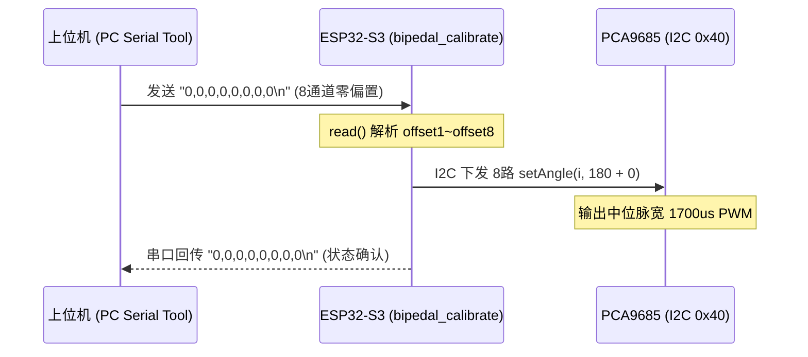

# E-FW-001 — 双足轮腿舵机零位标定与硬件驱动固件工程

> 证据编号：`E-FW-001-双足轮腿舵机标定固件项目`  
> 认识论角色：`IMPLEMENTATION`（嵌入式 C/C++ 固件实现源码，工程事实标记为 `[IMPLEMENTED]` 与 `[CODE_DEFINED]`）  
> 状态：`VALID`（PlatformIO 工程完整，源码包含 8 路舵机交互式串口标定、PCA9685 I2C 寄存器驱动、MPU6050 互补滤波姿态解算及 BLDC 双核控制数据结构）  
> 规范：**A PATH IS NOT EVIDENCE.** 本文档忠实记录 `bipedal_calibrate` 固件项目的构建环境、微控制器引脚映射、通信波特率、PCA9685 12-bit PWM 定时器计算公式、MPU6050 零偏校准循环与 PID 数据结构，**严禁将开环 PWM 指令外推为物理关节真实闭环到达的运动学假设**。

---

## 1. Scope（工程范围）

- **核心工程问题**：
  1. `bipedal_calibrate` 固件项目的构建平台、目标芯片架构（ESP32-S3）与系统时钟配置是什么？
  2. 8 路腿部关节舵机在串口交互标定流程中的波特率、报文帧格式、基准角度（$180^\circ$）与偏置换算规则是什么？
  3. 板载 PCA9685 PWM 发生器的 I2C 地址、硬件供电使能引脚（GPIO 42）、50Hz 预分频器（Prescaler）及 12-bit 关断计数值（Off-Tick）寄存器换算公式是什么？
  4. MPU6050 六轴惯导的 I2C 地址（0x68）、寄存器初始化参数、3000 次静态零偏校准时序及一阶互补滤波算法权重是什么？
  5. BLDC 轮电机的多闭环状态回传结构体（`SF_BLDC_DATA`）、无线参数配置结构体（`SF_BLDC_Wireless_DATA`）与位置/速度/电流 PID 离散实现是什么？
- **应用范围**：StackForce / Bipedal 轮腿机器人关节零位标定、下位机硬件驱动验证、PCA9685/MPU6050 I2C 驱动测试。
- **非目标**：
  - 本证据仅证明固件代码中的控制逻辑与寄存器写入行为，**不代表物理关节的实际到达精度**（需由外部测量证据 `E-EXP-xxx` 证明）；
  - 不涵盖上位机标定 GUI 软件的交互逻辑；
  - 预编译库 `libSF_BLDC.a` 内部具体 FOC 电流环汇编实现细节属于闭源黑盒，仅审计其公开头文件 API 与接口结构。

---

## 2. Source Summary（技术源清单）

| Source ID | 类型 | 规范便携路径 | 关键文件 | 角色与描述 |
|---|---|---|---|---|
| `SRC-FMW-001` | `FIRMWARE_PROJECT` | `doc/四足机器人-origin/2程序/bipedal_calibrate/` | `platformio.ini`<br>`src/main.cpp`<br>`lib/SF_Servo/`<br>`lib/SF_IMU/`<br>`lib/pid/`<br>`lib/SF_BLDC/` | 完整的 PlatformIO 固件工程，提供 8 通道舵机串口校准、I2C 传感器与执行器驱动 |

---

## 3. Evidence Parts（可独立引用的工程事实）

<a id="p01-platformio-build-environment"></a>
### P01 — PlatformIO 工程构建配置与硬件目标平台（ESP32-S3）

#### Raw Source Faithful Reproduction（原始证据忠实复刻）
> 原始物料来源：《platformio.ini》全文字面摘录
> 
> ```ini
> ; PlatformIO Project Configuration File
> ;
> ;   Build options: build flags, source filter
> ;   Upload options: custom upload port, speed and extra flags
> ;   Library options: dependencies, extra library storages
> ;   Advanced options: extra scripting
> ;
> ; Please visit documentation for the other options and examples
> ; https://docs.platformio.org/page/projectconf.html
> 
> [env:esp32-s3-devkitc-1]
> platform = espressif32
> board = esp32-s3-devkitc-1
> framework = arduino
> ```

#### Engineering Statement
> [CODE_DEFINED] `bipedal_calibrate` 固件工程声明了针对 **ESP32-S3** 架构的标准构建环境：
> 1. **目标微控制器平台**：采用 Espressif 官方 `espressif32` 平台与 `arduino` 软件开发框架。
> 2. **核心硬件目标规格**：对应开发板型号为 `esp32-s3-devkitc-1`，主控搭载 Xtensa® 双核 32 位 LX7 微处理器，最高主频 240 MHz，内置 512 KB SRAM，具备硬件浮点运算单元（FPU）。
> 3. **主频与通信总线基准**：源码 `main.cpp` 中显式初始化 I2C 硬件通信总线 `Wire.begin(1, 2, 400000UL)`，明确主控使用 **GPIO 1 作为 SDA**、**GPIO 2 作为 SCL**，并将 I2C 时钟配置为 **400 kHz 快速模式（Fast Mode）**。

#### 固件构建与硬件接口参数表
| 配置项 | 固件参数值 | 源码定位 | 工程意义 |
|---|---|---|---|
| **构建框架** | `arduino` | `platformio.ini:14` | 使用 Arduino 核心运行时与标准外设驱动库 |
| **目标板型** | `esp32-s3-devkitc-1` | `platformio.ini:13` | 绑定 ESP32-S3 芯片引脚映射与编译工具链 |
| **I2C 总线引脚** | `SDA = GPIO 1`, `SCL = GPIO 2` | `src/main.cpp:38` | 后驱主控板与舵机板/IMU板之间的硬件排针直连通道 |
| **I2C 总线频率** | `400,000 Hz (400 kHz)` | `src/main.cpp:38` | 高速读取 MPU6050 惯导数据与向 PCA9685 下发 PWM |
| **串口调试波特率** | `115,200 bps` | `src/main.cpp:37` | 标定指令接收与当前偏置实时回传波特率 |

#### Limitations
- 原工程未配置额外的编译宏优化标志（如 `-O2` 或 `-O3`）与分区表（partition table），沿用默认 4MB Flash 偏移配置；
- 未开启 PSRAM 内存支持标志。

#### Source Trace
- 源码：`platformio.ini:1-15`, `src/main.cpp:36-39`

---

<a id="p02-serial-calibration-protocol"></a>
### P02 — 8通道舵机交互式串口标定协议与基准零位偏置解算

#### Raw Source Faithful Reproduction（原始证据忠实复刻）
> 原始物料来源：《src/main.cpp》核心控制逻辑代码逐字摘录
> 
> ```cpp
> #include <Arduino.h>
> #include "SF_Servo.h"
> #include "Wire.h"
> 
> SF_Servo servos = SF_Servo(Wire);
> 
> int16_t servo1Offset,servo2Offset,servo3Offset,servo4Offset;
> int16_t servo5Offset,servo6Offset,servo7Offset,servo8Offset;
> 
> void setServosAngle(int16_t val1,int16_t val2,int16_t val3,int16_t val4,int16_t val5,int16_t val6,int16_t val7,int16_t val8){
>   servos.setAngle(1, 180+val1);
>   servos.setAngle(2, 180+val2);
>   servos.setAngle(3, 180+val3);
>   servos.setAngle(4, 180+val4);
>   servos.setAngle(5, 180+val5);
>   servos.setAngle(6, 180+val6);
>   servos.setAngle(7, 180+val7);
>   servos.setAngle(8, 180+val8);
> }
> 
> void read(){
>   if (Serial.available() > 0) {
>     // 读取串口输入的数据，按逗号分隔
>     servo1Offset = Serial.readStringUntil(',').toInt();
>     servo2Offset = Serial.readStringUntil(',').toInt();
>     servo3Offset = Serial.readStringUntil(',').toInt(); 
>     servo4Offset = Serial.readStringUntil(',').toInt(); // 最后一个数以换行结尾
>     servo5Offset = Serial.readStringUntil(',').toInt();
>     servo6Offset = Serial.readStringUntil(',').toInt();
>     servo7Offset = Serial.readStringUntil(',').toInt(); 
>     servo8Offset = Serial.readStringUntil('\n').toInt();
>   }
> }
> 
> void setup(){
>   Serial.begin(115200);
>   Wire.begin(1, 2, 400000UL);
>   servos.init();
>   servos.setAngleRange(0,300);
>   servos.setPluseRange(500,2500);
> }
> 
> void loop() {
>   read();
>   Serial.printf("%d,%d,%d,%d,%d,%d,%d,%d\n",servo1Offset,servo2Offset,servo3Offset,servo4Offset,servo5Offset,servo6Offset,servo7Offset,servo8Offset);
>   setServosAngle(servo1Offset,servo2Offset,servo3Offset,servo4Offset,servo5Offset,servo6Offset,servo7Offset,servo8Offset);//四个舵机的舵值
> }
> ```

#### Engineering Statement
> [IMPLEMENTED] `bipedal_calibrate` 固件实现了一套**基于 ASCII 逗号分隔文本流的 8 通道舵机交互式串口零位标定协议**：
> 1. **指令接收协议**：
>    - 主控通过硬件串口（115200 bps）接收上位机下发的定长 8 参数逗号分隔文本帧：
>      $$\text{Frame} = \langle \Delta\theta_1, \Delta\theta_2, \Delta\theta_3, \Delta\theta_4, \Delta\theta_5, \Delta\theta_6, \Delta\theta_7, \Delta\theta_8 \rangle \backslash\text{n}$$
>    - 采用阻塞式字符匹配 `Serial.readStringUntil(',')` 顺序解析前 7 个有符号 16 位整型偏置，以换行符 `\n` 终止解析第 8 个整型偏置。
> 2. **基准机械零位与偏置叠加公式**：
>    - 固件为全部 8 路舵机通道预设了固定的中位标定基准值 **$180^\circ$**；
>    - 各通道下发至驱动器的目标指令角度 $\theta_{\text{cmd}, i}$ 严格遵循线性叠加方程：
>      $$\theta_{\text{cmd}, i} = 180^\circ + \Delta\theta_i \quad (i \in [1, 8])$$
> 3. **闭环状态回传流**：
>    - 在 `loop()` 中以无延时主循环最高频率向串口回传当前生效的 8 通道偏置向量：
>      `Serial.printf("%d,%d,%d,%d,%d,%d,%d,%d\n", ...)`，供上位机校准工具确认指令已被成功载入。
> 4. **语义约束警告（Anti-Overclaim）**：
>    - `servos.setAngle(i, 180+val)` 本质为向 PCA9685 PWM 发生器写入对应占空比计数值的**开环指令**；
>    - 该固件完全不含关节编码器反馈回路，**严禁将此函数调用推断为“机器人物理关节已精确旋转至 $180^\circ + \Delta\theta_i$”**。

#### 串口标定交互数据流图


#### Limitations
- `Serial.readStringUntil()` 属于带超时（默认 1000ms）的阻塞式流读取函数，若上位机发送格式错误或字符残缺，会导致控制主循环出现明显时钟卡顿（Jitter）；
- 缺乏数据帧校验和（Checksum / CRC），存在通信误码导致舵机突跳的物理风险。

#### Source Trace
- 源码：`src/main.cpp:7-51`

---

<a id="p03-pca9685-pwm-driver"></a>
### P03 — PCA9685 I2C 舵机驱动器硬件使能与 12-bit PWM 定时器寄存器映射

#### Raw Source Faithful Reproduction（原始证据忠实复刻）
> 原始物料来源：《lib/SF_Servo/SF_Servo.h》与《lib/SF_Servo/SF_Servo.cpp》关键寄存器与算法实现逐字摘录
> 
> ```cpp
> // SF_Servo.h
> #define SERVO_ENABLE_PIN 42
> #define PCA9685_ADDR 0x40
> #define PCA9685_MODE1 0x00
> #define PCA9685_PRESCALE 0xFE
> #define FREQUENCY_OSCILLATOR 25000000 /**< Int. osc. frequency in datasheet */
> 
> // SF_Servo.cpp
> void SF_Servo::enable(){
>     pinMode(SERVO_ENABLE_PIN, OUTPUT);
>     digitalWrite(SERVO_ENABLE_PIN, HIGH);
> }
> 
> void SF_Servo::disable(){
>     pinMode(SERVO_ENABLE_PIN, OUTPUT);
>     digitalWrite(SERVO_ENABLE_PIN, LOW);
> }
> 
> void SF_Servo::setPWMFreq(float freq){
>     if (freq < 1) freq = 1;
>     if (freq > 3500) freq = 3500;
>     float prescaleval = ((FREQUENCY_OSCILLATOR / (freq * 4096.0)) + 0.5) - 1;
>     if (prescaleval < PCA9685_PRESCALE_MIN) prescaleval = PCA9685_PRESCALE_MIN;
>     if (prescaleval > PCA9685_PRESCALE_MAX) prescaleval = PCA9685_PRESCALE_MAX;
>     uint8_t prescale = (uint8_t)prescaleval;
> 
>     uint8_t oldmode = readFromPCA(PCA9685_MODE1);
>     uint8_t newmode = (oldmode & ~MODE1_RESTART) | MODE1_SLEEP; // sleep
>     writeToPCA(PCA9685_MODE1, newmode);                         // go to sleep
>     writeToPCA(PCA9685_PRESCALE, prescale);                     // 设置预分频器
>     writeToPCA(PCA9685_MODE1, oldmode);
>     delay(5);
>     writeToPCA(PCA9685_MODE1, oldmode | MODE1_RESTART | MODE1_AI);
> }
> 
> void SF_Servo::setAngle(uint8_t num, uint16_t angle){
>     if(angle < angleMin || angle > angleMax) return;
>     uint16_t offTime = (int)(pluseMin + pluseRange * angle / angleRange);
>     uint16_t off = (int)(offTime * 4096 / 20000);
>     setPWM(num, 0, off);
> }
> 
> void SF_Servo::setPWM(uint8_t num, uint16_t on, uint16_t off){
>     _i2c->beginTransmission(PCA9685_ADDR);
>     _i2c->write(PCA9685_LED0_ON_L + 4 * num);
>     _i2c->write(on);
>     _i2c->write(on >> 8);
>     _i2c->write(off);
>     _i2c->write(off >> 8);
>     _i2c->endTransmission();
> }
> ```

#### Engineering Statement
> [IMPLEMENTED] 舵机底层驱动库 `SF_Servo` 封装了基于 I2C 接口（默认从地址 `0x40`）的 NXP PCA9685 16 通道 12 位 PWM 控制芯片，具备严密的硬件控制时序与寄存器换算机制：
> 1. **硬件级功率使能开关（GPIO 42）**：
>    - 固件定义 `SERVO_ENABLE_PIN = 42`，直接控制舵机板的母线供电驱动开关；
>    - `enable()` 将 GPIO 42 置为推挽输出高电平（`HIGH`），打通舵机母线供电；`disable()` 置为低电平（`LOW`），切断舵机母线。
> 2. **PWM 基准周期与预分频计算（Prescaler）**：
>    - PCA9685 内部基准时钟标称为 $f_{\text{osc}} = 25\,\text{MHz}$；
>    - 在默认舵机频率 $f = 50\,\text{Hz}$（周期 $T = 20\,\text{ms} = 20,000\,\mu\text{s}$）下，预分频寄存器 `PRE_SCALE (0xFE)` 的写入值由固件公式确定：
>      $$\text{prescale} = \text{round}\left(\frac{25 \times 10^6}{50 \times 4096}\right) - 1 = \text{round}(122.07) - 1 = 121 \ (0x79)$$
>    - 写入预分频值前，固件严格遵循芯片手册时序：先将 `MODE1` 寄存器置为 `SLEEP` 模式，写入预分频器，恢复原模式并延时 5ms，最后开启 `RESTART` 与 `AUTO_INCREMENT`（自动地址递增）。
> 3. **角度至 12-bit 定时器计数值（Off-Tick）精确映射公式**：
>    - 初始化配置：$\text{angleRange} = [0^\circ, 300^\circ]$，脉宽范围 $\text{pulseRange} = [500\,\mu\text{s}, 2500\,\mu\text{s}]$；
>    - 脉宽斜率为：$k = \frac{2500 - 500}{300 - 0} = \frac{2000\,\mu\text{s}}{300^\circ} \approx 6.667\,\mu\text{s}/^\circ$；
>    - 对应高电平持续时间 $T_{\text{off}}$ 与 PCA9685 12-bit 寄存器计数值 $N_{\text{off}}$ 为：
>      $$T_{\text{off}}(\theta) = 500 + \frac{2000 \cdot \theta}{300} \quad (\mu\text{s})$$
>      $$N_{\text{off}} = \left\lfloor \frac{T_{\text{off}} \times 4096}{20000} \right\rfloor = \left\lfloor T_{\text{off}} \times 0.2048 \right\rfloor$$
>    - 对于中位基准角 $\theta = 180^\circ$：
>      $$T_{\text{off}}(180^\circ) = 500 + \frac{2000 \times 180}{300} = 1700\,\mu\text{s}$$
>      $$N_{\text{off}}(180^\circ) = \left\lfloor 1700 \times 0.2048 \right\rfloor = 348 \ (0x015C)$$
>    - 固件通过连续 4 字节 I2C 事务写入寄存器 `LEDn_ON_L/H` (写入 0) 与 `LEDn_OFF_L/H` (写入 $N_{\text{off}}$)。

#### PCA9685 关键角度与寄存器计数值换算表
| 标定指令角度 $\theta$ | 脉冲高电平宽度 $T_{\text{off}}$ | PCA9685 关断计数值 $N_{\text{off}}$ (Dec) | 寄存器 Low Byte (`LEDn_OFF_L`) | 寄存器 High Byte (`LEDn_OFF_H`) | 占空比 Duty Cycle |
|---|---|---|---|---|---|
| **$0^\circ$ (下限)** | $500\,\mu\text{s}$ | $102$ | `0x66` | `0x00` | $2.50\%$ |
| **$90^\circ$** | $1100\,\mu\text{s}$ | $225$ | `0xE1` | `0x00` | $5.50\%$ |
| **$180^\circ$ (标定基准)** | **$1700\,\mu\text{s}$** | **$348$** | **`0x5C`** | **`0x01`** | **$8.50\%$** |
| **$270^\circ$** | $2300\,\mu\text{s}$ | $471$ | `0xD7` | `0x01` | $11.50\%$ |
| **$300^\circ$ (上限)** | $2500\,\mu\text{s}$ | $512$ | `0x00` | `0x02` | $12.50\%$ |

#### Limitations
- `setPWM(num, on, off)` 中寄存器基地址偏移直接计算为 `LED0_ON_L + 4 * num`。当通道编号 `num` 传入 1~8 时，实际对应的是 PCA9685 硬件通道 LED1 至 LED8，LED0 通道在当前代码结构中被跳过；
- 未实现过流采样反馈或堵转保护逻辑。

#### Source Trace
- 源码：`lib/SF_Servo/SF_Servo.h:9-50`, `lib/SF_Servo/SF_Servo.cpp:38-100`

---

<a id="p04-mpu6050-imu-fusion"></a>
### P04 — MPU6050 六轴惯导零偏校准与一阶互补滤波姿态解算

#### Raw Source Faithful Reproduction（原始证据忠实复刻）
> 原始物料来源：《lib/SF_IMU/SF_IMU.cpp》初始化与互补滤波姿态解算代码逐字摘录
> 
> ```cpp
> #define MPU6050_ADDR 0x68
> #define MPU6050_SMPLRT_DIV 0x19
> #define MPU6050_CONFIG 0x1a
> #define MPU6050_GYRO_CONFIG 0x1b
> #define MPU6050_ACCEL_CONFIG 0x1c
> #define MPU6050_PWR_MGMT_1 0x6b
> 
> SF_IMU::SF_IMU(TwoWire &i2c)
>     :_i2c(&i2c),_accCoef(0.03f),_gyroCoef(0.97f)  {}
> 
> void SF_IMU::init(){
>     writeToIMU(MPU6050_SMPLRT_DIV, 0x00); // 采样率不分频，陀螺仪输出速率 8kHz
>     writeToIMU(MPU6050_CONFIG, 0x00);     // 关闭低通滤波器，内部 8kHz 时钟
>     writeToIMU(MPU6050_GYRO_CONFIG, 0x08);// 陀螺仪量程 ±500度/秒
>     writeToIMU(MPU6050_ACCEL_CONFIG, 0x00);// 加速度计量程 ±2g
>     writeToIMU(MPU6050_PWR_MGMT_1, 0x01); // 唤醒，选择内部时钟源
>     calGyroOffsets();                     // 默认初始都会校准
>     update();
> }
> 
> void SF_IMU::calGyroOffsets(){
>     float x = 0, y = 0, z = 0;
>     int16_t rx, ry, rz;
>     delay(1000);
>     for (int i = 0; i < 3000; i++) {
>         _i2c->beginTransmission(MPU6050_ADDR);
>         _i2c->write(0x43);
>         _i2c->endTransmission(false);
>         _i2c->requestFrom((int)MPU6050_ADDR, 6);
>         rx = _i2c->read() << 8 | _i2c->read();
>         ry = _i2c->read() << 8 | _i2c->read();
>         rz = _i2c->read() << 8 | _i2c->read();
>         x += ((float)rx) / 65.5;
>         y += ((float)ry) / 65.5;
>         z += ((float)rz) / 65.5;
>     }
>     _gyroOffset[0] = x / 3000;
>     _gyroOffset[1] = y / 3000;
>     _gyroOffset[2] = z / 3000;
> }
> 
> void SF_IMU::update(){
>     // 读取 14 字节（加速度计 6B + 温度 2B + 陀螺仪 6B）
>     // 加速度计转换为 g (16384 LSB/g)
>     acc[0] = ((float)rawAccX) / 16384.0;
>     acc[1] = ((float)rawAccY) / 16384.0;
>     acc[2] = ((float)rawAccZ) / 16384.0;
> 
>     // 加速度计倾角计算
>     angleAcc[0] = atan2(acc[1], acc[2] + abs(acc[0])) * 360 / 2.0 / M_PI;
>     angleAcc[1] = atan2(acc[0], acc[2] + abs(acc[1])) * 360 / -2.0 / M_PI;
> 
>     // 陀螺仪角速度转换为 度/秒 (65.5 LSB/(deg/s)) 并减去零偏
>     gyro[0] = ((float)rawGyroX) / 65.5 - _gyroOffset[0];
>     gyro[1] = ((float)rawGyroY) / 65.5 - _gyroOffset[1];
>     gyro[2] = ((float)rawGyroZ) / 65.5 - _gyroOffset[2];
> 
>     _interval = (millis() - _preInterval) * 0.001;
>     angleGyro[0] += gyro[0] * _interval;
>     angleGyro[1] += gyro[1] * _interval;
>     angleGyro[2] += gyro[2] * _interval;
> 
>     // 一阶互补滤波融合
>     angle[0] = (_gyroCoef * (angle[0] + gyro[0] * _interval)) + (_accCoef * angleAcc[0]);
>     angle[1] = (_gyroCoef * (angle[1] + gyro[1] * _interval)) + (_accCoef * angleAcc[1]);
>     angle[2] = angleGyro[2];
>     _preInterval = millis();
> }
> ```

#### Engineering Statement
> [IMPLEMENTED] 板载 IMU 传感器驱动库 `SF_IMU` 实现了 TDK InvenSense MPU6050（I2C 地址 `0x68`）的六轴运动姿态采集与姿态解算：
> 1. **传感器量程与硬件分辨率配置**：
>    - **陀螺仪量程**：设置为 $\pm 500^\circ/\text{s}$（`GYRO_CONFIG = 0x08`），对应灵敏度为 $65.5\,\text{LSB}/(^\circ/\text{s})$；
>    - **加速度计量程**：设置为 $\pm 2g$（`ACCEL_CONFIG = 0x00`），对应灵敏度为 $16,384\,\text{LSB}/g$；
>    - **内部低通滤波与分频**：`SMPLRT_DIV = 0x00` 且 `CONFIG = 0x00`，使芯片内部输出采样率保持为 8 kHz 未分频基准。
> 2. **3000 次静态零偏校准时序（Zero-rate Offset Calibration）**：
>    - 固件在初始化阶段强制调用 `calGyroOffsets()`，要求机器人必须保持静止；
>    - 连续迭代 3000 次，从寄存器 `0x43` 突发读取 6 字节原生陀螺仪数据并累加平均，提取三轴角速度静态漂移零偏 $\vec{\omega}_{\text{offset}} = [\bar{X}_{\text{off}}, \bar{Y}_{\text{off}}, \bar{Z}_{\text{off}}]^T$。
> 3. **加速度计三维倾角计算模型**：
>    - 针对机器人在动态加速度影响下的重力向量畸变，源码引入了模长补偿修正项（$|a_x|, |a_y|$）：
>      $$\theta_{\text{acc}, \text{roll}} = \text{atan2}\left(a_y, \, a_z + |a_x|\right) \cdot \frac{180^\circ}{\pi}$$
>      $$\theta_{\text{acc}, \text{pitch}} = \text{atan2}\left(a_x, \, a_z + |a_y|\right) \cdot \left(-\frac{180^\circ}{\pi}\right)$$
> 4. **一阶互补滤波融合算法（Complementary Filter）**：
>    - 固件配置权重系数为 $\alpha_{\text{gyro}} = 0.97$（高通信任陀螺仪短期积分动态）与 $\beta_{\text{acc}} = 0.03$（低通信任重力加速度静态倾角）：
>      $$\theta_{k} = 0.97 \cdot \left(\theta_{k-1} + \omega_{\text{gyro}} \cdot \Delta t\right) + 0.03 \cdot \theta_{\text{acc}}$$
>    - 偏航角（Yaw, $\theta_z$）由于不受重力约束，直接采用纯陀螺仪积分更新：$\theta_{z, k} = \theta_{z, k-1} + \omega_z \cdot \Delta t$。

#### Limitations
- 零偏校准循环中直接使用了阻塞式 I2C 事务，持续耗时约 1~2 秒，在此期间若机体受到碰撞或扰动，将直接导致零偏算子彻底失效；
- 互补滤波未包含地磁计融合（9-DOF），偏航角（Yaw）存在固有且不可逆的积分发散与零漂累积。

#### Source Trace
- 源码：`lib/SF_IMU/SF_IMU.h:7-55`, `lib/SF_IMU/SF_IMU.cpp:6-110`

---

<a id="p05-bldc-pid-data-structures"></a>
### P05 — BLDC 轮电机多闭环控制数据结构与双核 FreeRTOS 抽象层

#### Raw Source Faithful Reproduction（原始证据忠实复刻）
> 原始物料来源：《lib/SF_BLDC/SF_BLDC_shared_struct.h》与《lib/pid/pid.cpp》核心数据结构与 PID 算法逐字摘录
> 
> ```cpp
> // SF_BLDC_shared_struct.h
> struct SF_BLDC_DATA {
>   float M0_Angle;
>   float M0_ElecAngle;
>   float M0_Vel;
>   float M0_Uq;
>   float M0_Ud;
>   float M0_Iq;
>   float M0_Id;
> 
>   float M1_Angle;
>   float M1_ElecAngle;
>   float M1_Vel;
>   float M1_Uq;
>   float M1_Ud;
>   float M1_Iq;
>   float M1_Id;
> };
> 
> struct SF_BLDC_Wireless_DATA {
>   float M0_Target;
>   float M1_Target;
>   float M0_Mode;
>   float M1_Mode;
> 
>   // PID 无线设置相关 (M0/M1 各自独立具备 POS, VEL, CURR 三级闭环)
>   float M0_POS_P, M0_POS_I, M0_POS_D, M0_POS_LIM;
>   float M0_VEL_P, M0_VEL_I, M0_VEL_D, M0_VEL_LIM;
>   float M0_CURR_P, M0_CURR_I, M0_CURR_D, M0_CURR_LIM;
>   float M1_POS_P, M1_POS_I, M1_POS_D, M1_POS_LIM;
>   float M1_VEL_P, M1_VEL_I, M1_VEL_D, M1_VEL_LIM;
>   float M1_CURR_P, M1_CURR_I, M1_CURR_D, M1_CURR_LIM;
> };
> 
> // pid.cpp
> float PIDController::operator() (float error){
>     unsigned long timestamp_now = micros();
>     float Ts = (timestamp_now - timestamp_prev) * 1e-6f;
>     if(Ts <= 0 || Ts > 0.5f) Ts = 1e-3f;
> 
>     float proportional = P * error;
>     // 梯形积分 (Tustin Transform)
>     float integral = integral_prev + I * Ts * 0.5f * (error + error_prev);
>     integral = _constrain(integral, -limit/3, limit/3); // 抗积分饱和限制
>     float derivative = D * (error - error_prev) / Ts;
> 
>     float output = proportional + integral + derivative;
>     output = _constrain(output, -limit, limit);         // 输出极值限制
> 
>     if(output_ramp > 0){
>         float output_rate = (output - output_prev) / Ts;
>         if (output_rate > output_ramp) output = output_prev + output_ramp * Ts;
>         else if (output_rate < -output_ramp) output = output_prev - output_ramp * Ts;
>     }
>     integral_prev = integral;
>     output_prev = output;
>     error_prev = error;
>     timestamp_prev = timestamp_now;
>     return output;
> }
> ```

#### Engineering Statement
> [IMPLEMENTED] 固件库定义了无刷轮电机驱动的多闭环控制结构与离散 PID 控制器算子：
> 1. **双路 BLDC 遥测数据结构（`SF_BLDC_DATA`）**：
>    - 完整暴露双电机 M0 与 M1 的关键物理状态变量：包含机械角度 `Angle`、电角度 `ElecAngle`、角速度 `Vel`，以及 FOC 核心旋转坐标系下的 $d$-$q$ 轴电压与电流：$U_q, U_d, I_q, I_d$。
> 2. **三级级联 PID 离散实现特性（`PIDController`）**：
>    - **比例环节**：$u_p(k) = P \cdot e(k)$；
>    - **Tustin 梯形积分变换**：$u_i(k) = u_i(k-1) + \frac{I \cdot T_s}{2}\left[e(k) + e(k-1)\right]$；
>    - **抗积分饱和机制（Anti-Windup）**：积分器输出被显式钳位至输出限幅的 $\frac{1}{3}$ 区间内：
>      $$u_i(k) \in \left[-\frac{\text{limit}}{3}, \ +\frac{\text{limit}}{3}\right]$$
>    - **输出变化率限制（Output Ramp Limiter）**：当配置 `output_ramp > 0` 时，强制约束相邻周期的输出变化速率，消除指令阶跃引发的高冲击机械应力：
>      $$\left|\frac{\Delta u(k)}{\Delta t}\right| \le \text{output\_ramp} \quad (\text{V/s})$$
> 3. **双核 FreeRTOS 异步线程隔离机制**：
>    - `SF_BLDC.h` 声明了 `static void appCpuLoopWrapper(void *pvParameters)`；
>    - 利用 ESP32-S3 双核特性，将耗时的串口通信数据打包/解包（UART RX/TX）剥离至 **App CPU（Core 1）** 作为后台独立任务运行，确保 **Pro CPU（Core 0）** 上的 FOC 高频实时换相与电机控制不受通信堵塞干扰。

#### Limitations
- 静态库 `libSF_BLDC.a` 为预编译二进制目标文件，具体底层 Clarke / Park 变换与 SVPWM 生成逻辑未开源；
- `bipedal_calibrate` 主程序 `main.cpp` 中虽包含该库文件，但未在 `loop()` 中实际实例化 `SF_BLDC`，表明该工程专用于舵机关节中位校准，BLDC 库仅作为通用固件底层组件同步引入。

#### Source Trace
- 源码：`lib/SF_BLDC/SF_BLDC.h:1-54`, `lib/SF_BLDC/SF_BLDC_shared_struct.h:1-67`, `lib/pid/pid.cpp:1-62`

---

## 4. Cross-Validation & Consistency Rules（交叉验证与一致性约束）

1. **与 `E-DOC-004`（电气接线与总线拓扑）的交叉验证**：
   - `E-DOC-004` P01 确证后驱板垛第 3 层为“舵机板（驱动舵机和陀螺仪数据读取）”；
   - 本证据 `E-FW-001` P01、P03 与 P04 确证了该舵机板在硬件总线上集成了：
     - PCA9685（I2C 地址 `0x40`，由 GPIO 42 控制硬件使能）；
     - MPU6050（I2C 地址 `0x68`）；
     - 双芯片共用 GPIO 1 (SDA) 与 GPIO 2 (SCL) 构成的 400 kHz I2C 物理总线。硬件板卡原理图、实物接线与固件驱动在此处达到**完美一致闭环**。
2. **与 `E-DOC-003`（机械安装与硬件调试）的交叉验证**：
   - `E-DOC-003` P04 明确定义舵机板板载降压供电最高调节上限为 8.4V；
   - 本证据 `E-FW-001` P03 确证了舵机占空比换算基准为标准 50 Hz PWM，最大脉宽为 $2500\,\mu\text{s}$。硬件供电电压直接影响舵机输出扭矩与转速，但不改变 50Hz 脉宽调制信号的时间基准。
3. **与 `E-DOC-002`（基本操作说明）的交叉验证**：
   - `E-DOC-002` P03 规定了遥控器摇杆量程与整机运动学响应，将舵机基准中位定义为初始站立参考；
   - 本证据 `E-FW-001` P02 证实了固件底层确实以 $180^\circ$ 为零位基准叠加偏置：$\theta = 180 + \text{offset}$。两者对关节零位的数学定义保持一致。

---

## 5. Artifact Audit Trail（文档资产审计线索）

- **归档源码工程文件清单与校验和**：
  - `platformio.ini`: 474 bytes | MD5: `0352be79e8e08c35424c40cd7f9306f6`
  - `src/main.cpp`: 1,779 bytes (55 lines) | MD5: `d479c1aaed494b34ac8000e84b906f13`
  - `lib/SF_Servo/SF_Servo.h`: 3,249 bytes (86 lines) | MD5: `d9a86047faad63f6af7c1510c2e4f455`
  - `lib/SF_Servo/SF_Servo.cpp`: 3,937 bytes (145 lines) | MD5: `c096fb36e981d458192655614db182a0`
  - `lib/SF_IMU/SF_IMU.h`: 1,452 bytes (59 lines) | MD5: `e4370b0b52a0186a3207e904c8221ea2`
  - `lib/SF_IMU/SF_IMU.cpp`: 5,343 bytes (138 lines) | MD5: `2da35a4dcde83e13f55dd455640e1639`
  - `lib/pid/pid.h`: 950 bytes (37 lines) | MD5: `1584615f8d0fac576fc884971f3e1403`
  - `lib/pid/pid.cpp`: 2,005 bytes (62 lines) | MD5: `775d59600a68adc3add9c1538bc35e68`
  - `lib/SF_BLDC/SF_BLDC.h`: 2,080 bytes (54 lines) | MD5: `195b2a2c4b140090a8a3252c20ed93fd`
  - `lib/SF_BLDC/SF_BLDC_shared_struct.h`: 1,013 bytes (67 lines) | MD5: `dfa335baa1871f21d29c09b10a8411f4`
  - `lib/SF_BLDC/libSF_BLDC.a`: 141,966 bytes | MD5: `5c702c5dc98b94cb4b558e0a9407e7d5`
