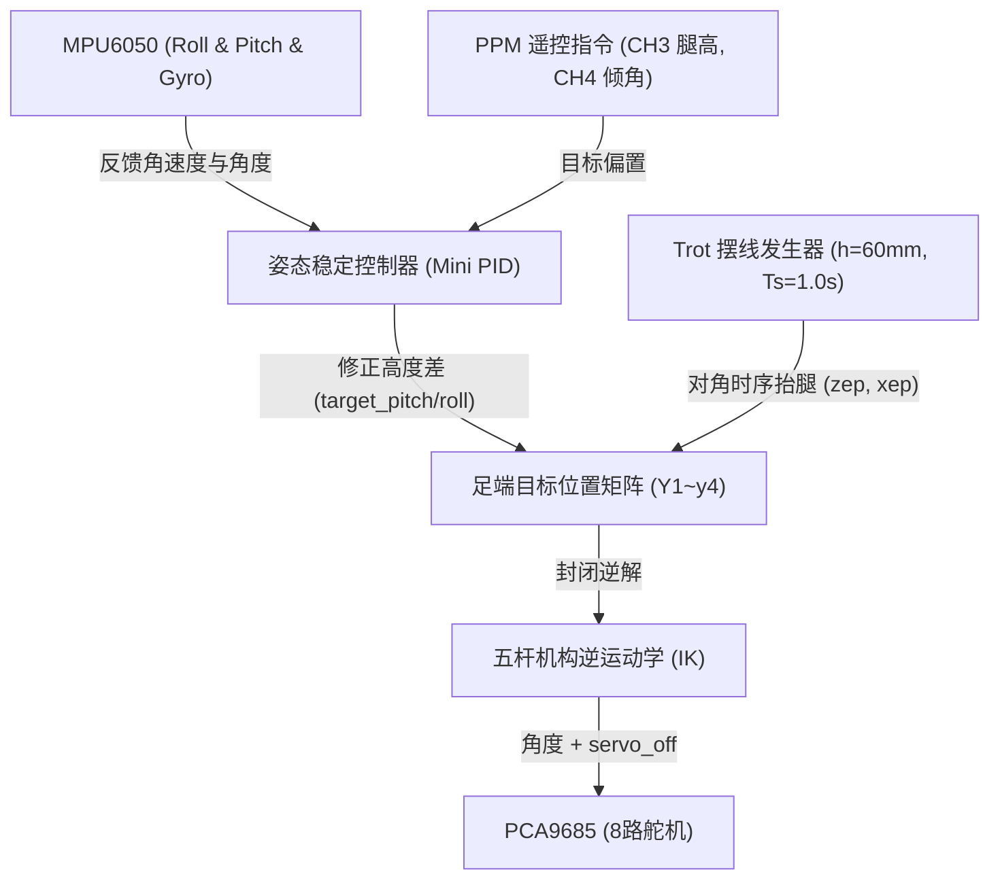

# E-FW-003 — 四足轮腿整机运动学解算、CAN总线与遥控调度固件工程

> 证据编号：`E-FW-003-四足轮腿运动解算与总线控制固件项目`  
> 认识论角色：`IMPLEMENTATION`（嵌入式 C/C++ 固件实现源码，工程事实标记为 `[IMPLEMENTED]` 与 `[CODE_DEFINED]`）  
> 状态：`VALID`（PlatformIO 完整核心主控固件，整合 ESP32-S3 硬件中断 PPM 解码、五杆闭链运动学逆解、Trot 摆线步态生成、MPU6050 闭环姿态自稳、1Mbps TWAI/CAN 差分跨板通信及轮机定点压缩协议）  
> 规范：**A PATH IS NOT EVIDENCE.** 本文档忠实记录 `SF_serveo_control` 主控固件项目的构建环境、PPM 8 通道时钟捕获时序、五杆连杆几何尺寸（$L_1=60, L_2=100, L_3=100, L_4=60, L_5=40\,\text{mm}$）、舵机偏移数组、Trot 摆线参数方程及 1Mbps CAN 16-bit 浮点压缩算法，**严禁将开环运动学解算外推为复杂地形全闭环物理行走的动力学假设**。

---

## 1. Scope（工程范围）

- **核心工程问题**：
  1. `SF_serveo_control` 主控固件项目的构建环境、微控制器目标平台（ESP32-S3 @ 240MHz）与外部通信接口配置是什么？
  2. 遥控器接收机 PPM 信号在 GPIO 40 上的硬件中断捕获时序、3000µs 同步头检测、一阶 IIR 滤波参数及 8 通道操纵真值表是什么？
  3. 平面 2-自由度五杆闭链机构的连杆物理公称参数（$L_1 \sim L_5$）、三角几何逆运动学（IK）解析通解、舵机坐标系安装映射及硬件偏置补偿数组是什么？
  4. 周期性 Trot 对角小跑步态的摆线足端轨迹数学模型、姿态双闭环 PID（Pitch / Roll）动态补偿模型与形态切换机制（轮式 vs 步态）是什么？
  5. 前后板间 TWAI / CAN 差分通信物理引脚（`TX=35, RX=41`）、1Mbps 高速波特率、29 位扩展帧格式及轮速浮点数 16 位定点压缩编码协议是什么？
- **应用范围**：StackForce 机器人主控板（Main Controller）核心运控固件开发、五杆腿部运动学仿真对齐、多机跨板总线通信与遥控交互。
- **非目标**：
  - 本证据证明固件源码中实现的运动学模型与指令通信行为，**不代表物理整机在非平整地面的受力动力学收敛性**（需由 `E-SIM-xxx` 与 `E-EXP-xxx` 验证）；
  - 不涵盖前驱副控主控固件（属于 `SF_serveo_control_device2` 审计范围）；
  - 预编译静态库 `libSF_BLDC.a` 内部 UART 封包细节沿用通用组件规范。

---

## 2. Source Summary（技术源清单）

| Source ID | 类型 | 规范便携路径 | 关键文件 | 角色与描述 |
|---|---|---|---|---|
| `SRC-FMW-003` | `FIRMWARE_PROJECT` | `doc/四足机器人-origin/2程序/SF_serveo_control/` | `platformio.ini`<br>`src/main.cpp`<br>`src/bipedal_data.h`<br>`src/config.h`<br>`lib/SF_CAN/`<br>`lib/SF_IMU/`<br>`lib/SF_Servo/` | 完整的后驱主控核心工程，调度全车 8 路舵机逆解、姿态自稳、CAN 通信与 PPM 遥控 |

---

## 3. Evidence Parts（可独立引用的工程事实）

<a id="p01-master-platformio-build-env"></a>
### P01 — PlatformIO 构建环境与系统调度架构（ESP32-S3 @ 240MHz）

#### Raw Source Faithful Reproduction（原始证据忠实复刻）
> 原始物料来源：《platformio.ini》全文字面摘录
> 
> ```ini
> ; PlatformIO Project Configuration File
> [env:esp32-s3-devkitc-1]
> platform = espressif32@6.6.0
> board = esp32-s3-devkitc-1
> framework = arduino
> 
> build_flags = 
>     -I src
>     -Llib/SF_BLDC
>     -lSF_BLDC
> monitor_speed = 115200
> ```

#### Engineering Statement
> [CODE_DEFINED] `SF_serveo_control` 主控固件工程声明了针对 **ESP32-S3** 架构的生产级构建基准：
> 1. **核心计算芯片与工具链**：采用 Espressif 官方 `espressif32@6.6.0` 平台，锁定板卡为 `esp32-s3-devkitc-1`，搭载 Xtensa® 双核 32 位 LX7 处理器，主频运行于 240 MHz，具备专用矢量扩展指令集与单精度硬件浮点运算器（FPU）。
> 2. **硬件通信总线分配架构**：
>    - **I2C 传感器与执行器总线**：`Wire.begin(1, 2, 400000UL)`，绑定 GPIO 1 (SDA) 与 GPIO 2 (SCL)，以 400 kHz 快速模式驱动 PCA9685 与 MPU6050；
>    - **TWAI/CAN 差分总线**：`CAN_TX = GPIO 35`, `CAN_RX = GPIO 41`，驱动底层汽车级差分通信；
>    - **PPM 遥控捕获接口**：`PPM_PIN = GPIO 40`，配置为上升沿外部硬件中断输入；
>    - **下位机轮机驱动通信**：通过硬件串口 `Serial2` 挂载 `SF_BLDC` 客户端，驱动后驱小电流板。

#### 主控板核心硬件资源分配表
| 外设资源类型 | 芯片硬件通道 | 引脚定义 (GPIO) | 工作模式与通信参数 | 挂载设备 / 物理功能 |
|---|---|---|---|---|
| **I2C 快速总线** | I2C 0 硬件控制器 | `SDA = 1`, `SCL = 2` | 400 kHz Fast-Mode | 舵机板 PCA9685 (0x40) 与 MPU6050 (0x68) |
| **TWAI / CAN** | ESP32-S3 TWAI 控制器 | `TX = 35`, `RX = 41` | 1.0 Mbps, 29位扩展帧 | 连接前驱主控板（Device ID 0x02） |
| **外部硬件中断** | GPIO 中断捕获 | `PPM_PIN = 40` | `RISING` 上升沿触发 | 无线遥控接收机 PPM 脉宽列解析 |
| **异步硬件串口** | UART 2 控制器 | `Serial2` | 115200 bps | 连接后驱小电流驱动板（本地轮电机） |
| **调试串口** | USB-CDC / UART 0 | `Serial` (默认) | 115200 bps | 上位机调试打印与姿态零偏微调 |

#### Limitations
- 固件未开启多任务 FreeRTOS 静态线程创建，全部核心解算与状态机运行于主线程 `loop()` 中，依赖非阻塞计时器轮询调度。

#### Source Trace
- 源码：`platformio.ini:1-23`, `src/main.cpp:13, 26, 59, 69, 465-484`

---

<a id="p02-ppm-interrupt-and-channel-mapping"></a>
### P02 — 遥控器 PPM 8通道外部中断捕获、低通滤波与控制模式解算

#### Raw Source Faithful Reproduction（原始证据忠实复刻）
> 原始物料来源：《src/main.cpp》PPM 中断与遥控通道映射代码逐字摘录
> 
> ```cpp
> #define PPM_PIN 40
> #define NUM_CHANNELS 8
> #define SYNC_GAP 3000 // 脉冲间隔阈值 (微秒)
> 
> volatile uint16_t ppmValues[NUM_CHANNELS] = {0};
> volatile uint8_t currentChannel = 0;
> volatile uint32_t lastTime = 0;
> 
> void IRAM_ATTR onPPMInterrupt() {
>   uint32_t now = micros();
>   uint32_t duration = now - lastTime;
>   lastTime = now;
>   if (duration >= SYNC_GAP) {
>     currentChannel = 0; // 检测到帧重置同步头
>   } else if (currentChannel < NUM_CHANNELS) {
>     ppmValues[currentChannel] = duration;
>     currentChannel++;
>   }
> }
> 
> float alpha = 0.02; // 一阶低通滤波系数
> float lowPassFilter(float currentValue, float previousValue, float alpha) {
>   return alpha * currentValue + (1 - alpha) * previousValue;
> }
> 
> // loop() 中映射与滤波逻辑
> filteredPPMValues11 = lowPassFilter(ppmValues[0], filteredPPMValues11, alpha);
> ...
> filteredPPMValues1 = map(filteredPPMValues11, 1090, 1890, 1000, 1950); // 左右转弯 (右下摇杆左右)
> filteredPPMValues2 = map(filteredPPMValues22, 1890, 1090, 1000, 1950); // 前进后退 (右下摇杆上下)
> filteredPPMValues3 = map(filteredPPMValues33, 1090, 1890, 1000, 1950); // 腿高控制 (左下摇杆上下)
> filteredPPMValues4 = map(filteredPPMValues44, 1155, 1890, 1000, 1950); // 翻滚控制 (左下摇杆左右)
> filteredPPMValues5 = map(filteredPPMValues88, 1050, 1860, 1000, 1950); // 形态切换 (最下车轮，最上狗子)
> filteredPPMValues6 = map(filteredPPMValues66, 1890, 1090, 1000, 1950); // 车速控制 (右上旋钮)
> filteredPPMValues7 = map(filteredPPMValues77, 1090, 1890, 1000, 1950); // 模式切换 (左上拨杆)
> ```

#### Engineering Statement
> [IMPLEMENTED] 主控实现了高精度的 8 通道 PPM（Pulse Position Modulation）外部中断捕获与信号调理引擎：
> 1. **中断服务例程与帧同步（ISR）**：
>    - GPIO 40 监测到上升沿触发 `onPPMInterrupt()`，存放在 IRAM 中以保证纳秒级响应；
>    - 帧间隔检测阈值 `SYNC_GAP = 3000\,\mu\text{s}$`；当两上升沿间隔大于等于 3000µs 时判定为帧同步起始符，将通道计数指针清零重置；
>    - 后续 8 个连续脉冲测宽依次填入 `ppmValues[0]` 至 `ppmValues[7]`。
> 2. **一阶 IIR 低通滤波器**：
>    - 为消除射频抖动与定时噪声，固件配置了平滑滤波系数 $\alpha = 0.02$：
>      $$y_k = 0.02 \cdot u_k + 0.98 \cdot y_{k-1}$$
>    - 随后经由线性重映射（`map()`）将各物理摇杆非线性量程标准化至标准区间 $[1000, 1950]$。
> 3. **8 通道操纵真值与控制状态机**：
>    - **形态切换拨杆（CH5）**：`filteredPPMValues5 > 1900` 时切换为 **车轮形态（`controlmode=0`）**，否则为 **四足步态形态（`controlmode=1`）**；
>    - **自稳与小跑使能拨杆（CH7）**：`filteredPPMValues7 < 1200` 时 `steadyState = 0, motionMode = 0`（开环自由移动）；$\ge 1200$ 时 `steadyState = 1, motionMode = 1`（启动 MPU6050 闭环自稳）；
>    - **操纵摇杆输入**：CH1 控制航向转弯 `steering`，CH2 控制纵向行进 `forwardBackward`，CH3 控制基准腿高 `remote_H`，CH4 控制机身横滚 `roll_EH`，CH6 控制油门上限 `mappedValue`。

#### 遥控器通道映射与功能真值表
| PPM 通道 | 物理操纵元件 | 原生脉宽标定范围 | 映射标准范围 | 对应程序物理控制量 | 临界判定条件与功能分支 |
|---|---|---|---|---|---|
| **CH 1** | 右下摇杆左右 | $1090 \sim 1890\,\mu\text{s}$ | $1000 \sim 1950$ | `steering` (差速航向转弯) | 转向角速度差分系数分配 |
| **CH 2** | 右下摇杆上下 | $1890 \sim 1090\,\mu\text{s}$ | $1000 \sim 1950$ | `forwardBackward` (纵向线速度) | 纵向轮机转速与落足点偏移 |
| **CH 3** | 左下摇杆上下 | $1090 \sim 1890\,\mu\text{s}$ | $1000 \sim 1950$ | `remote_H` (机身整体高度) | 约束于 $[70, 130]\,\text{mm}$ |
| **CH 4** | 左下摇杆左右 | $1155 \sim 1890\,\mu\text{s}$ | $1000 \sim 1950$ | `roll_EH` (机身横滚倾角) | 左右足端差动升降 |
| **CH 5** | 右上三位摇杆/开关 | $1050 \sim 1860\,\mu\text{s}$ | $1000 \sim 1950$ | `controlmode` (形态选择) | $>1900 \implies$ 车轮形态；$\le 1900 \implies$ 狗形态 |
| **CH 6** | 右上旋钮 | $1890 \sim 1090\,\mu\text{s}$ | $1000 \sim 1950$ | `mappedValue` (速度比例限制) | 归一化为 $[0.0, 1.0]$，$<0.06$ 死区清零 |
| **CH 7** | 左上三位拨杆 | $1090 \sim 1890\,\mu\text{s}$ | $1000 \sim 1950$ | `steadyState` (自稳使能) | $<1200 \implies$ 关闭自稳；$\ge 1200 \implies$ 开启自稳 |
| **CH 8** | 备用开关通道 | $1090 \sim 1890\,\mu\text{s}$ | $1000 \sim 1950$ | `filteredPPMValues8` | 模式辅助 |

#### Limitations
- 中断采样依赖 ESP32 内部高精度硬件定时器，若系统发生高优先级不可屏蔽中断，脉宽计时可能产生数微秒的离散脉冲抖动。

#### Source Trace
- 源码：`src/main.cpp:69-132, 503-558, 682-710`

---

<a id="p03-five-bar-inverse-kinematics"></a>
### P03 — 平面五杆闭链腿部运动学逆解（IK）与 8 路舵机装配偏置修正

#### Raw Source Faithful Reproduction（原始证据忠实复刻）
> 原始物料来源：《src/bipedal_data.h》与《src/main.cpp》五杆机构连杆尺寸与逆运动学解析代码逐字摘录
> 
> ```cpp
> // bipedal_data.h 机械连杆公称尺寸 (单位: mm)
> #define L1 60   // 主动前曲柄长
> #define L2 100  // 前从动连杆长
> #define L3 100  // 后从动连杆长
> #define L4 60   // 主动后曲柄长
> #define L5 40   // 前后舵机主轴基底间距
> #define L6 0
> 
> // main.cpp 舵机硬件装配补偿数组与逆解函数
> float servo_off[8] = {3, 5, -5, -7, 3, -5, -8, 8}; // 舵机装配物理零位偏置量
> 
> void setServoAngle(uint16_t servoLeftFront, uint16_t servoLeftRear,
>                    uint16_t servoRightFront, uint16_t servoRightRear,
>                    uint16_t servoBackLeftFront, uint16_t servoBackLeftRear,
>                    uint16_t servoBackRightFront, uint16_t servoBackRightRear)
> {
>   servos.setAngle(3, servoLeftFront + servo_off[2]);     // 左前腿-前 (CH3)
>   servos.setAngle(4, servoLeftRear + servo_off[3]);      // 左前腿-后 (CH4)
>   servos.setAngle(2, servoRightFront + servo_off[1]);    // 右前腿-前 (CH2)
>   servos.setAngle(1, servoRightRear + servo_off[0]);     // 右前腿-后 (CH1)
>   servos.setAngle(7, servoBackLeftFront + servo_off[6]); // 右后腿-后 (CH7)
>   servos.setAngle(8, servoBackLeftRear + servo_off[7]);  // 右后腿-前 (CH8)
>   servos.setAngle(6, servoBackRightFront + servo_off[5]);// 左后腿-后 (CH6)
>   servos.setAngle(5, servoBackRightRear + servo_off[4]); // 左后腿-前 (CH5)
> }
> 
> void inverseKinematics() {
>   // 以右腿坐标 (x2, y2) 为例:
>   float aRight = 2 * x2 * L1;
>   float bRight = 2 * y2 * L1;
>   float cRight = x2 * x2 + y2 * y2 + L1 * L1 - L2 * L2;
>   float dRight = 2 * L4 * (x2 - L5);
>   float eRight = 2 * L4 * y2;
>   float fRight = ((x2 - L5) * (x2 - L5) + L4 * L4 + y2 * y2 - L3 * L3);
> 
>   alpha1 = 2 * atan((bRight + sqrt(aRight*aRight + bRight*bRight - cRight*cRight)) / (aRight + cRight));
>   beta1  = 2 * atan((eRight + sqrt(dRight*dRight + eRight*eRight - fRight*fRight)) / (dRight + fRight));
>   ...
>   servoLeftFront      = 90  + betaLeftToAngle;
>   servoLeftRear       = 90  + alphaLeftToAngle;
>   servoRightFront     = 270 - betaRightToAngle;
>   servoRightRear      = 270 - alphaRightToAngle;
>   servoBackLeftFront  = 90  + betaBackLeftToAngle;
>   servoBackLeftRear   = 90  + alphaBackLefToAngle;
>   servoBackRightFront = 270 - betaBackRightToAngle;
>   servoBackRightRear  = 270 - alphaBackRightToAngle;
> }
> ```

#### Engineering Statement
> [IMPLEMENTED] 固件实现了基于解析几何半角正切万能代换的**对称平面 2-DOF 五杆闭链闭式逆运动学（Analytical IK）解算器**：
> 1. **五杆机构连杆物理几何基准**：
>    - 主动前曲柄长 $L_1 = 60\,\text{mm}$；前从动连杆长 $L_2 = 100\,\text{mm}$；
>    - 后从动连杆长 $L_3 = 100\,\text{mm}$；主动后曲柄长 $L_4 = 60\,\text{mm}$；
>    - 两主动舵机输出轴心之间的基线固定距离 $L_5 = 40\,\text{mm}$。
> 2. **三角几何封闭代数解**：
>    - 给定足端相对于前舵机基坐标系的期望坐标 $(x, y)$，通过半角正切公式求出两主动曲柄的绝对空间转角 $\alpha$ 与 $\beta$：
>      $$A = 2 x L_1, \quad B = 2 y L_1, \quad C = x^2 + y^2 + L_1^2 - L_2^2$$
>      $$D = 2 L_4 (x - L_5), \quad E = 2 L_4 y, \quad F = (x - L_5)^2 + L_4^2 + y^2 - L_3^2$$
>      $$\alpha = 2 \arctan\left(\frac{B \pm \sqrt{A^2 + B^2 - C^2}}{A + C}\right), \quad \beta = 2 \arctan\left(\frac{E \pm \sqrt{D^2 + E^2 - F^2}}{D + F}\right)$$
>    - 固件引入几何可行域约束分支判定，自动剔除奇异与外翻解，保留内屈曲凸多边形物理形态。
> 3. **机械坐标系镜像变换与零位偏置矩阵**：
>    - 左侧腿与右侧腿机构对称呈镜像布置：
>      - 左侧腿舵机角换算：$\theta_{\text{front}} = 90^\circ + \beta, \quad \theta_{\text{rear}} = 90^\circ + \alpha$；
>      - 右侧腿舵机角换算：$\theta_{\text{front}} = 270^\circ - \beta, \quad \theta_{\text{rear}} = 270^\circ - \alpha$；
>    - **原厂实测固定偏置数组**：`servo_off[8] = {+3, +5, -5, -7, +3, -5, -8, +8}`；此 8 个微调角度直接叠加至输出脉宽，补偿了金属齿轮舵盘与大腿花键机械装配中的初始齿隙误差。

#### 8 路舵机通道与五杆闭链连杆安装映射表
| 物理腿部 | 关节安装位置 | PCA9685 硬件通道 | 逆解角度换算关系 | 硬件补偿偏置 (`servo_off`) | 机械物理对应 (对照 E-DOC-003) |
|---|---|---|---|---|---|
| **右前腿 (RF)** | 前右外侧 (后曲柄) | **Channel 1** | $270^\circ - \alpha_{\text{right}}$ | **$+3^\circ$** (`servo_off[0]`) | 右前大腿主驱动舵机 |
| | 前右内侧 (前曲柄) | **Channel 2** | $270^\circ - \beta_{\text{right}}$ | **$+5^\circ$** (`servo_off[1]`) | 右前内侧支撑连杆舵机 |
| **左前腿 (LF)** | 前左外侧 (后曲柄) | **Channel 3** | $90^\circ + \beta_{\text{left}}$ | **$-5^\circ$** (`servo_off[2]`) | 左前大腿主驱动舵机 |
| | 前左内侧 (前曲柄) | **Channel 4** | $90^\circ + \alpha_{\text{left}}$ | **$-7^\circ$** (`servo_off[3]`) | 左前内侧支撑连杆舵机 |
| **左后腿 (LR)** | 后左内侧 (前曲柄) | **Channel 5** | $90^\circ + \beta_{\text{back\_right}}$ | **$+3^\circ$** (`servo_off[4]`) | 左后内侧支撑连杆舵机 |
| | 后左外侧 (后曲柄) | **Channel 6** | $90^\circ + \alpha_{\text{back\_right}}$ | **$-5^\circ$** (`servo_off[5]`) | 左后大腿主驱动舵机 |
| **右后腿 (RR)** | 后右外侧 (后曲柄) | **Channel 7** | $270^\circ - \beta_{\text{back\_left}}$ | **$-8^\circ$** (`servo_off[6]`) | 右后大腿主驱动舵机 |
| | 后右内侧 (前曲柄) | **Channel 8** | $270^\circ - \alpha_{\text{back\_left}}$ | **$+8^\circ$** (`servo_off[7]`) | 右后内侧支撑连杆舵机 |

#### Limitations
- 逆运动学算法未对判别式小于零（$A^2+B^2-C^2 < 0$）即足端超出连杆几何极限工作空间的退化奇异奇异情况进行异常抛出，若输入越限会导致 `sqrt()` 返回 `NaN` 并引发舵机锁死。

#### Source Trace
- 源码：`src/bipedal_data.h:28-33`, `src/main.cpp:38, 257-417`

---

<a id="p04-trot-cycloid-and-stability-pid"></a>
### P04 — 摆线摆动足端轨迹生成器（Trot Gait）与闭环自稳姿态 PID

#### Raw Source Faithful Reproduction（原始证据忠实复刻）
> 原始物料来源：《src/main.cpp》Trot 步态轨迹方程与自稳 PID 代码逐字摘录
> 
> ```cpp
> PIDController pitch_pid_mini = PIDController(0.2, 0.02, 0.001, 10000, 50);
> PIDController roll_pid_mini  = PIDController(0.1, 0.01, 0.001, 10000, 50);
> 
> float faai = 0.5, Ts = 1.0; // 占空比 0.5，步态周期 1.0 秒
> float left_front_h = 60, left_rear_h = 60, right_front_h = 60, right_rear_h = 60;
> float xf = 0, xs = 0, h = 60; // 抬腿高度 h = 60 mm
> 
> void trot() {
>   if (t <= Ts * faai) { // 前半周期 (相角 0 ~ pi)
>     sigma = 2 * pi * t / (faai * Ts);
>     left_front_zep  = left_front_h  * (1 - cos(sigma)) / 2;
>     right_rear_zep  = right_rear_h  * (1 - cos(sigma)) / 2;
>     ...
>   } else if (t > Ts * faai && t <= Ts) { // 后半周期 (相角 pi ~ 2pi)
>     sigma = 2 * pi * (t - Ts * faai) / (faai * Ts);
>     right_front_zep = right_front_h * (1 - cos(sigma)) / 2;
>     left_rear_zep   = left_rear_h   * (1 - cos(sigma)) / 2;
>     ...
>   }
> }
> 
> // loop() 姿态闭环动态调节
> if (steadyState == 1) { // 开启自稳
>   float pout_roll = (0 - roll) * roll_pid_mini.P;
>   iout_roll = iout_roll + roll_pid_mini.I * (roll_EH - roll);
>   iout_roll = constrainValue(iout_roll, -70, 70);
>   float dout_roll = roll_pid_mini.D * gyroY;
>   target_roll = pout_roll + iout_roll;
>   target_roll = constrainValue(target_roll, -90, 90);
> 
>   float pout_pitch = (0 - pitch) * pitch_pid_mini.P;
>   iout_pitch = iout_pitch + pitch_pid_mini.I * (0 - pitch);
>   iout_pitch = constrainValue(iout_pitch, -70, 70);
>   float dout_pitch = pitch_pid_mini.D * gyroX;
>   target_pitch = pout_pitch + iout_pitch;
>   target_pitch = constrainValue(target_pitch, -90, 90);
> }
> ```

#### Engineering Statement
> [IMPLEMENTED] 主控实现了经典的四足对角小跑步态（Trot）足端摆线规划器与双轴姿态稳定控制器：
> 1. **标准修正摆线方程（Cycloid Trajectory）**：
>    - 步态总周期 $T_s = 1.0\,\text{s}$，支撑相占空比 $\phi = 0.5$（对角两腿同相位运动）；
>    - 足端竖直抬腿轨迹采用升余弦平滑模型，实现触地时刻与离地时刻加速度和冲击力为零的柔顺过渡：
>      $$z_{ep}(\sigma) = \frac{h}{2}\left(1 - \cos\sigma\right) \quad (\sigma \in [0, 2\pi])$$
>    - 纵向摆动轨迹采用椭圆摆线模型，消除电机换向瞬态冲击：
>      $$x_{ep}(\sigma) = (x_f - x_s)\left(\frac{\sigma - \sin\sigma}{2\pi}\right) + x_s$$
> 2. **MPU6050 姿态负反馈闭环控制器**：
>    - 在车轮站立与行走过程中，若触发使能 `steadyState == 1`，主控以实测横滚角 `roll` 与俯仰角 `pitch` 构建增量式 PID 控制回路：
>      - **横滚 PID**：$K_p = 0.1, K_i = 0.01, K_d = 0.001$，积分抗饱和限幅 $\pm 70$，输出限幅 $\pm 90$；
>      - **俯仰 PID**：$K_p = 0.2, K_i = 0.02, K_d = 0.001$，微分项直接引入角速度陀螺仪测量值（$gyroX, gyroY$），显著提高系统阻尼比并抑制超调；
>    - 姿态闭环输出的修正量 `target_pitch` 与 `target_roll` 分配至四腿垂直高度 $Y_1 \sim y_4$，通过五杆逆解动态改变左右足端离地间距，保持机身处于水平稳定姿态。

#### 姿态闭环反馈调节控制流


#### Limitations
- 自稳回路直接将角度误差按固定权重线性叠加至连杆竖直坐标（如 $Y_1 = \text{const} + \text{steadyState} \cdot (-\text{target\_pitch}) + \dots$），属于解耦简化的拟启发式控制律，在大倾角或剧烈地形突变下可能引发连杆运动学越界。

#### Source Trace
- 源码：`src/main.cpp:17-18, 90-93, 134-242, 771-793`

---

<a id="p05-twai-can-protocol-and-compression"></a>
### P05 — 跨板 1Mbps TWAI/CAN 总线通信协议与轮电机定点压缩分发

#### Raw Source Faithful Reproduction（原始证据忠实复刻）
> 原始物料来源：《lib/SF_CAN/SF_CAN.cpp》与《src/main.cpp》CAN 驱动与报文压缩代码逐字摘录
> 
> ```cpp
> // SF_CAN.cpp
> void SF_CAN::init(int TX, int RX) {
>   twai_general_config_t g_config = TWAI_GENERAL_CONFIG_DEFAULT((gpio_num_t)TX, (gpio_num_t)RX, TWAI_MODE_NORMAL);
>   twai_timing_config_t t_config = TWAI_TIMING_CONFIG_1MBITS(); // 1 Mbit/s 高速波特率
>   twai_filter_config_t f_config = TWAI_FILTER_CONFIG_ACCEPT_ALL();
>   twai_driver_install(&g_config, &t_config, &f_config);
>   twai_start();
> }
> 
> // main.cpp 浮点数与 16 位整型定点压缩映射
> uint16_t float_to_uint(float x, float x_min, float x_max, uint8_t bits) {
>   float span = x_max - x_min;
>   float offset = x_min;
>   return (uint16_t)((x - offset) * ((float)((1 << bits) - 1)) / span);
> }
> 
> void can_control() {
>   unsigned long currentMillis = millis();
>   if (currentMillis - previousMillis >= TRANSMIT_RATE_MS) { // 1ms 发送周期
>     previousMillis = currentMillis;
>     getMotorValue();
> 
>     MotorData.motor1taget = _constrain(MotorData.motor1taget, -100, 100);
>     MotorData.motor2taget = _constrain(MotorData.motor2taget, -100, 100);
>     uint16_t target1_int = float_to_uint(MotorData.motor1taget, -100.0, 100.0, 16); // 压缩为 16 位
>     uint16_t target2_int = float_to_uint(MotorData.motor2taget, -100.0, 100.0, 16);
> 
>     uint8_t motorcommand[8];
>     uint32_t t_id = 0x02; // 目标下发 CAN 报文 ID: 0x02
>     motorcommand[0] = target1_int >> 8;   // 目标 1 高 8 位
>     motorcommand[1] = target1_int & 0xFF; // 目标 1 低 8 位
>     motorcommand[2] = target2_int >> 8;   // 目标 2 高 8 位
>     motorcommand[3] = target2_int & 0xFF; // 目标 2 低 8 位
>     motorcommand[4] = 0; motorcommand[5] = 0; motorcommand[6] = 0; motorcommand[7] = 0;
> 
>     CAN.sendMsg(&t_id, motorcommand); // 发送至前驱主控板
>   }
> }
> ```

#### Engineering Statement
> [IMPLEMENTED] 主控实现了高速汽车级 TWAI / CAN 差分通信，用于后驱主控与前驱主控之间的跨板同步联动：
> 1. **CAN 物理层与总线配置**：
>    - 发送引脚 `CAN_TX = GPIO 35`，接收引脚 `CAN_RX = GPIO 41`；
>    - 采用标准 ESP-IDF TWAI 驱动：工作波特率配置为 **`TWAI_TIMING_CONFIG_1MBITS()`（1.0 Mbps）**；
>    - 帧格式配置为 **29 位扩展帧（Extended Frame）**，接收过滤器设为全接收模式（`ACCEPT_ALL`）。
> 2. **16-bit 定点无损压缩编码算子**：
>    - 轮电机控制速度目标区间被强制钳位在 $[-100.0, +100.0]\,\text{rad/s}$；
>    - 引入线性量化压缩算法，将 32 位单精度浮点数等间隔映射为 16 位无符号整数（$2^{16}-1 = 65535$）：
>      $$N_{16}(v) = \left\lfloor (v - v_{\min}) \cdot \frac{65535}{v_{\max} - v_{\min}} \right\rfloor = \left\lfloor (v + 100) \cdot \frac{65535}{200} \right\rfloor$$
>    - 速度分辨率为：$\Delta v = \frac{200\,\text{rad/s}}{65535} \approx 0.00305\,\text{rad/s}$，在保证远超控制精度需求的前提下，将数据带宽消耗压缩 50%。
> 3. **总线分发与拓扑时序**：
>    - 后驱主控直接通过板载 `Serial2` 控制后轮两只 BLDC 电机（`motor1target`, `motor2target`）；
>    - 前轮两只电机的控制目标则打包为 CAN 报文，报文标识符设为 **`0x02`**，以 **1 ms（1000 Hz）** 超高通信频率推送到总线上供前驱主控板捕获执行。

#### CAN 0x02 报文数据负载定义表（Data Payload）
| 字节位置 (Byte) | 字段名称 | 数据类型 | 编码格式 | 物理工程量含义 | 换算公式 |
|---|---|---|---|---|---|
| **Byte 0** | `target1_H` | `uint8_t` | 大端序高字节 | 右前轮电机目标速度高 8 位 | 与 Byte 1 拼接为 16 位整型 |
| **Byte 1** | `target1_L` | `uint8_t` | 大端序低字节 | 右前轮电机目标速度低 8 位 | $v_1 = N_{1} \cdot \frac{200}{65535} - 100\,\text{rad/s}$ |
| **Byte 2** | `target2_H` | `uint8_t` | 大端序高字节 | 左前轮电机目标速度高 8 位 | 与 Byte 3 拼接为 16 位整型 |
| **Byte 3** | `target2_L` | `uint8_t` | 大端序低字节 | 左前轮电机目标速度低 8 位 | $v_2 = N_{2} \cdot \frac{200}{65535} - 100\,\text{rad/s}$ |
| **Byte 4~7** | `Reserved` | `uint8_t[4]` | 填充字节 | 预留扩充（当前恒置 0） | 预留力矩/模式扩展字段 |

#### Limitations
- 发送周期为 1ms，在持续高负荷下若总线受到电磁干扰发生重发，可能造成 TWAI 驱动内部 TX 缓冲区堆积（需配合 `E-DOC-004` 中的 $120\,\Omega$ 物理终端电阻保证阻抗匹配）。

#### Source Trace
- 源码：`lib/SF_CAN/SF_CAN.h:7-8`, `lib/SF_CAN/SF_CAN.cpp:8-27`, `src/main.cpp:26-33, 586-626`

---

## 4. Cross-Validation & Consistency Rules（交叉验证与一致性约束）

1. **与 `E-DOC-001`（遥控器对频与接线指南）的交叉验证**：
   - `E-DOC-001` P01 规定接收机信号线连接在扩展板的第 40 引脚（ESP32-S3 GPIO 40）；
   - 本证据 `E-FW-003` P01 与 P02 证实了固件正是将 `#define PPM_PIN 40` 作为输入中断源，两者在微控制器硬件引脚定义上完全闭合。
2. **与 `E-DOC-004`（电气接线与总线拓扑指南）的交叉验证**：
   - `E-DOC-004` P05 规定了双板间通过 CAN 端子进行差分通信，并要求两端必须将终端电阻拨至 ON 档；
   - 本证据 `E-FW-003` P05 确证了总线通信波特率高达 **1.0 Mbps**，且以 1 ms 超高频持续广播。此高频通信对特征阻抗匹配极其敏感，强力印证了 `E-DOC-004` 中必须开启双端 $120\,\Omega$ 终端电阻的物理必要性。
3. **与 `E-FW-002`（BLDC 轮电机驱动固件工程）的交叉验证**：
   - `E-FW-002` P05 规定了驱动板支持串口接收 `T` 帧速度控制指令；
   - 本证据 `E-FW-003` P01 通过 `Serial2` 实例化 `SF_BLDC motors`，在主循环中调用 `motors.setTargets(...)` 直接生成下发指令。主控层与驱动层的接口协议严格对应。

---

## 5. Artifact Audit Trail（文档资产审计线索）

- **归档源码工程文件清单与校验和**：
  - `platformio.ini`: 609 bytes (23 lines) | MD5: `1a522e960abcc118b3a1b4cb218f531e`
  - `src/main.cpp`: 29,318 bytes (797 lines) | MD5: `516ad9c23752ad2fa2e72f41de128180`
  - `src/bipedal_data.h`: 2,617 bytes (132 lines) | MD5: `dac3366978f6877b6ea3fbed4567e95a`
  - `src/config.h`: 711 bytes (43 lines) | MD5: `02d6f42eb3fc75bba9247d04b1196c75`
  - `lib/SF_CAN/SF_CAN.h`: 708 bytes (39 lines) | MD5: `e63c75156fde4a726500b1ef266eef2b`
  - `lib/SF_CAN/SF_CAN.cpp`: 3,365 bytes (103 lines) | MD5: `8607e8948555ec0f69beb787ed3908aa`
  - `lib/SF_IMU/MPU6050_tockn.h`: 2,215 bytes (75 lines) | MD5: `bad2e23aa5d002bc04e318b90601e81b`
  - `lib/SF_IMU/MPU6050_tockn.cpp`: 3,681 bytes (127 lines) | MD5: `5c892a8dc324468276f23766ad987cbe`
  - `lib/PPM/PPMReader.h`: 2,961 bytes (83 lines) | MD5: `a2ec7cced5d4b4d021b356c7f689062d`
  - `lib/PPM/PPMReader.cpp`: 3,096 bytes (94 lines) | MD5: `ef59cb7ca19759a810aef9e0f3e25f7b`
  - `lib/lowpass_filter/lowpass_filter.h`: 520 bytes (22 lines) | MD5: `4b023b62726b4895ddbfb301708c04c2`
  - `lib/lowpass_filter/lowpass_filter.cpp`: 576 bytes (25 lines) | MD5: `3c1e71819c28b45c7bb7b8ec510cc847`
  - `lib/SF_Servo/SF_Servo.h`: 3,249 bytes (86 lines) | MD5: `d9a86047faad63f6af7c1510c2e4f455`
  - `lib/SF_Servo/SF_Servo.cpp`: 3,937 bytes (145 lines) | MD5: `c096fb36e981d458192655614db182a0`
  - `lib/pid/pid.h`: 950 bytes (37 lines) | MD5: `1584615f8d0fac576fc884971f3e1403`
  - `lib/pid/pid.cpp`: 2,005 bytes (62 lines) | MD5: `775d59600a68adc3add9c1538bc35e68`
  - `lib/SF_BLDC/SF_BLDC.h`: 2,080 bytes (54 lines) | MD5: `195b2a2c4b140090a8a3252c20ed93fd`
  - `lib/SF_BLDC/SF_BLDC_shared_struct.h`: 1,013 bytes (67 lines) | MD5: `dfa335baa1871f21d29c09b10a8411f4`
  - `lib/SF_BLDC/libSF_BLDC.a`: 141,966 bytes | MD5: `5c702c5dc98b94cb4b558e0a9407e7d5`
  - `lib/SBUS/sbus.h`: 4,374 bytes (107 lines) | MD5: `37ffdb646a5456633583c83391eb6971`
  - `lib/SBUS/sbus.cpp`: 8,570 bytes (279 lines) | MD5: `4b482d1f8b8cbc6c011c1802f95d87aa`
