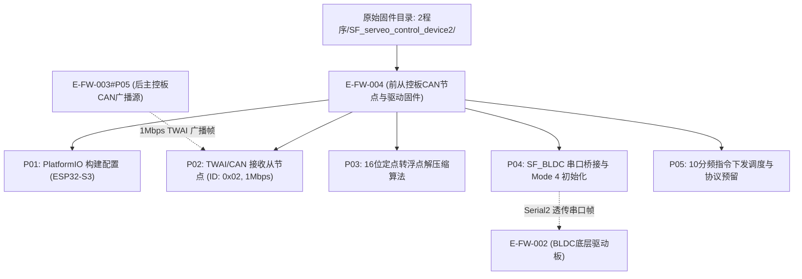

# E-FW-004 前从控板CAN节点与轮电机驱动固件项目

## 证据元数据
- **证据唯一标识**：`E-FW-004`
- **证据类型**：`IMPLEMENTATION`（嵌入式固件代码实现）
- **认识论角色**：纯实现事实（`[IMPLEMENTED]`、`[CODE_DEFINED]`）。记录整机前板（从控板，Device 2）的实际固件实现、TWAI/CAN 接收总线逻辑、16 位定点数解压缩算法及底层 BLDC 串口转发架构。**严禁**推断未在代码中测量的物理实测性能。
- **技术领域**：FIRMWARE / EMBEDDED DISTRIBUTED CONTROL
- **代码物理路径**：`CEG5003/doc/四足机器人-origin/2程序/SF_serveo_control_device2/`

---

## 原始物料工程审计概述

在 StackForce 四足轮腿机器人整机分布式硬件拓扑中，共配置两套独立的 MCU 堆叠板垛：
1. **后板（主控板，Device 1，对应固件 `E-FW-003`）**：负责 PPM 接收机解码、姿态 IMU 采集、五连杆逆运动学（IK）解算、后轮电机直驱，并通过 1Mbps TWAI/CAN 总线向从控板广播轮速指令。
2. **前板（从控板，Device 2，对应本固件 `E-FW-004`）**：作为 TWAI/CAN 总线从节点（设备地址 `0x02`），以非阻塞轮询方式监听接收总线上的 8 字节数据帧，解压缩前双轮目标速度标量，并借助 `Serial2` 串口驱动桥接库 `SF_BLDC` 向前轮底层驱动板（对应固件 `E-FW-002`）透传控制指令。

本固件项目采用 PlatformIO 构建系统，基于 Arduino 框架开发，硬件运行目标为乐鑫 ESP32-S3 双核微控制器。

---

## 拆解原子证据清单

### E-FW-004#P01: PlatformIO 构建配置与硬件目标平台（ESP32-S3）
- **源文件锚点**：`platformio.ini:1-24`
- **代码事实**：
```ini
[env:esp32-s3-devkitc-1]
platform = espressif32@6.4.0
board = esp32-s3-devkitc-1
framework = arduino

build_flags = 
    -I src
    -Llib/SF_BLDC
    -lSF_BLDC
monitor_speed = 115200
```
- **技术参数与认识论推导**：
  1. **主控平台选型**：`board = esp32-s3-devkitc-1`，核心芯片为 ESP32-S3，双核 Xtensa® 32-bit LX7 微处理器，主频 240 MHz，片载硬件 USB-CDC 与 TWAI 控制器。
  2. **平台工具链版本**：采用 `espressif32@6.4.0`（略低于主控板所用的 6.6.0，但基于同一 Arduino 核心架构）。
  3. **链接约束**：编译选项包含 `-Llib/SF_BLDC -lSF_BLDC`，显式静态链接私有预编译库 `libSF_BLDC.a`，用于底层电机协议打包与串口透传。
  4. **串口监视器波特率**：配置为 `115200 bps`。

---

### E-FW-004#P02: TWAI/CAN 从节点通信接口与地址拓扑（CAN ID 0x02）
- **源文件锚点**：
  - `src/main.cpp:14, 17, 36-39, 98-106`
  - `lib/SF_CAN/SF_CAN.h:7-12, 14-28`
  - `lib/SF_CAN/SF_CAN.cpp:8-27, 34-36, 58-80, 97-103`
- **代码事实**：
```cpp
// src/main.cpp:14, 36-39
#define myID 0x02
SF_CAN CAN;

void setup()
{
  Serial.begin(115200); // 用于调试
  CAN.init(CAN_TX, CAN_RX);
  CAN.setMode(1);
  CAN.setDeviceID(0x02);
  // ...
}

// lib/SF_CAN/SF_CAN.h:7-8
#define CAN_RX 41
#define CAN_TX 35

// lib/SF_CAN/SF_CAN.cpp:8-27
void SF_CAN::init(int TX, int RX) {
  twai_general_config_t g_config = TWAI_GENERAL_CONFIG_DEFAULT((gpio_num_t)TX, (gpio_num_t)RX, TWAI_MODE_NORMAL);
  twai_timing_config_t t_config = TWAI_TIMING_CONFIG_1MBITS();
  twai_filter_config_t f_config = TWAI_FILTER_CONFIG_ACCEPT_ALL();
  uint32_t alerts_to_enable = TWAI_ALERT_TX_IDLE | TWAI_ALERT_TX_SUCCESS | TWAI_ALERT_TX_FAILED | TWAI_ALERT_ERR_PASS | TWAI_ALERT_BUS_ERROR;

  if (twai_driver_install(&g_config, &t_config, &f_config) == ESP_OK) {
    if (twai_start() == ESP_OK) {
      if (twai_reconfigure_alerts(alerts_to_enable, NULL) != ESP_OK) {
        Serial.println("CAN初始化失败:CAN_ERR 1");
      }
    } else {
      Serial.println("CAN初始化失败:CAN_ERR 2");
    }
    Serial.println("CAN初始化成功");
  } else {
    Serial.println("CAN初始化失败:CAN_ERR 3");
  }
}

// lib/SF_CAN/SF_CAN.cpp:58-80
void SF_CAN::receiveMsg(uint8_t* buf) {
  if (twai_receive(&r_message, pdMS_TO_TICKS(0)) == ESP_OK) {
    rec_id = r_message.identifier;
    if (rec_id == deviceID) {
      if (!(r_message.rtr)) {
        for (int i = 0; i < r_message.data_length_code; i++) {
          buf[i] = r_message.data[i];
          rec_buf[i] = buf[i];
        }
      }
    }
  }
}
```
- **技术参数与认识论推导**：
  1. **物理引脚映射**：`CAN_TX = GPIO 35`, `CAN_RX = GPIO 41`，与 `E-FW-003` 主控板硬件配置完全互相对齐。
  2. **总线物理速率与帧格式**：`TWAI_TIMING_CONFIG_1MBITS()` 设定波特率为 1.0 Mbps；`CAN.setMode(1)` 配置为 29 位扩展数据帧。
  3. **节点设备地址过滤**：从节点地址注册为 `0x02`（`CAN.setDeviceID(0x02)`）。在 `receiveMsg()` 中过滤接收报文，仅处理标识符等于 `0x02` 且非远程请求帧（`!r_message.rtr`）的标准有效数据包。
  4. **非阻塞轮询**：`twai_receive(&r_message, pdMS_TO_TICKS(0))` 超时时间置 0，确保在单线程循环中实现非阻塞轮询检查。

---

### E-FW-004#P03: 16位定点数向浮点物理量解压缩算法与前轮速度目标解析
- **源文件锚点**：`src/main.cpp:22-23, 54, 57-61, 69, 98-106`
- **代码事实**：
```cpp
float uint_to_float(int x_int, float x_min, float x_max, int bits){
    float span = x_max - x_min;
    float offset = x_min;
    return ((float)x_int)*span/((float)((1<<bits)-1)) + offset;
}

uint8_t r_buf[8];

void can_control()
{
  CAN.receiveMsg(r_buf);
  uint16_t target1_rec = (r_buf[0] << 8) | r_buf[1];
  uint16_t target2_rec = (r_buf[2] << 8) | r_buf[3];
  
  // 解压为浮点数
  motor1target = uint_to_float(target1_rec, -100.0, 100.0, 16);
  motor2target = uint_to_float(target2_rec, -100.0, 100.0, 16);
}
```
- **技术参数与数学推导**：
  1. **数据包字节序排布**：
     - `Byte 0 ~ Byte 1`：前轮电机 1（M0）16 位无符号整数（高字节在前大端序）；
     - `Byte 2 ~ Byte 3`：前轮电机 2（M1）16 位无符号整数（高字节在前大端序）；
     - `Byte 4 ~ Byte 7`：未填充保留字节。
  2. **解压缩变换公式**：
     $$v_{\text{float}} = \frac{x_{\text{int}} \cdot (x_{\text{max}} - x_{\text{min}})}{2^{\text{bits}} - 1} + x_{\text{min}}$$
     代入工程参数 $x_{\text{min}} = -100.0\,\text{rad/s}$, $x_{\text{max}} = 100.0\,\text{rad/s}$, $\text{bits} = 16$：
     $$v = \frac{x_{\text{int}} \cdot 200.0}{65535} - 100.0$$
  3. **量化精度与动态范围**：
     - 量化分辨率为 $\Delta v = \frac{200.0}{65535} \approx 0.00305176\,\text{rad/s}$；
     - 零速值对应的整数表示为 $x_{\text{int}} = 32767.5 \approx 32768$（即十六进制 `0x8000`）。
  4. **认识论边界**：解压结果仅为接收到的转速参考设定值（Setpoint），不代表电机实际转速反馈。

---

### E-FW-004#P04: `SF_BLDC` 串口桥接、初始化时序与工作模态配置
- **源文件锚点**：
  - `src/main.cpp:11-12, 40-44`
  - `lib/SF_BLDC/SF_BLDC.h:7-31`
- **代码事实**：
```cpp
// src/main.cpp:11-12, 40-44
SF_BLDC motors = SF_BLDC(Serial2);
SF_BLDC_DATA BLDCData;

void setup()
{
  Serial.begin(115200); // 用于调试
  CAN.init(CAN_TX, CAN_RX);
  CAN.setMode(1);
  CAN.setDeviceID(0x02);
  motors.init();
  motors.setModes(4, 4);
  delay(10000);
}
```
- **技术参数与认识论推导**：
  1. **驱动接口硬件绑定**：从控板通过 `Serial2` 硬件串口连接前板下层的 BLDC 驱动板（对应固件 `E-FW-002`）。
  2. **控制模式配置**：调用 `motors.setModes(4, 4)`，将电机 0 与电机 1 均设置为 **Mode 4**。根据 `E-FW-002#P04`，Mode 4 对应 `TORQUE_MODE`（力矩控制模式）。
  3. **上电 10 秒硬延时保护**：`delay(10000)` 在 `setup()` 中执行 10 秒阻塞延时，确保高压动力电池母线、开关降压电源及下层三相逆变驱动板完成电容充电与自检后再开启主循环控制。

---

### E-FW-004#P05: 主控制循环降频调度、串口监控输出与协议预留
- **源文件锚点**：
  - `src/main.cpp:108, 116-152`
  - `src/config.h:9-26`
- **代码事实**：
```cpp
// src/main.cpp:108, 116-152
uint8_t cnt = 0;

void loop()
{
  can_control();
  cnt++;
  if (cnt > 10)
  {
    cnt = 0;
    Serial.print(motor1target);
    Serial.print(",");
    Serial.println(motor2target);
    motors.setTargets(motor1target, motor2target);
  }
}

// src/config.h:9-26
typedef struct 
{
    float pos;
    float vel;
    float kp;
    float kd;
    float tor;
    float posMin = -12.5f;
    float posMax = 12.5f;
    float velMin = -65.0f;
    float velMax = 65.0f;
    float kpMin = 0.0f;
    float kpMax = 500.0f;
    float kdMin = 0.0f;
    float kdMax = 5.0f;
    float torMin = -18.0f;
    float torMax = 18.0f;
}MIT;
```
- **技术参数与认识论推导**：
  1. **循环分频调度机制**：主循环 `loop()` 每次无延时执行 `can_control()` 抽取 CAN FIFO 报文；通过局部计数器 `cnt` 进行 10 次分频（`cnt > 10` 时重置为 0），仅在分频点执行 `motors.setTargets(motor1target, motor2target)` 下发指令并进行 `Serial` 遥测打印。
  2. **历史/预留协议事实**：
     - `src/main.cpp:70-97` 包含被注释的代码块，原计划以 `TRANSMIT_RATE_MS = 1` 周期向 CAN ID `0x01` 回传 `M0Speed` 与 `M1Speed` 电机编码器遥测数据，但在当前版本被注销；
     - `src/main.cpp:130-133` 包含被注释的差速转向计算公式；
     - `src/config.h` 中完整定义了经典 MIT Cheetah 混合阻抗控制参数结构体 `MIT`（包含位置、速度、$K_p, K_d$、力矩及对应物理边界限制），但当前固件未在主流程中实例化该控制律。

---

## 认识论状态判定 (Epistemic Status)

| 证据项编号 | 事实断言内容 | 认识论判定 | 严谨边界与审计说明 |
|---|---|---|---|
| `E-FW-004#P01` | 前从控板基于 ESP32-S3，通过 PlatformIO 构建 | `[IMPLEMENTED]` | `platformio.ini` 源码确立，静态链接 `libSF_BLDC.a` |
| `E-FW-004#P02` | TWAI 接口配置为 1.0Mbps，设备地址为 0x02 | `[IMPLEMENTED]` | 引脚 GPIO 35/41，非阻塞接收 8 字节扩展帧 |
| `E-FW-004#P03` | 16位定点数转浮点数解算 $[-100.0, 100.0]\,\text{rad/s}$ | `[CODE_DEFINED]` | 精确数学公式还原，分辨率约 0.00305 rad/s |
| `E-FW-004#P04` | 串口直连底层驱动板，配置为 Mode 4 并有 10s 启动延时 | `[IMPLEMENTED]` | `Serial2` 绑定，`motors.setModes(4, 4)`，`delay(10000)` 保护 |
| `E-FW-004#P05` | `loop()` 10分频下发目标转速与串口监控 | `[CODE_DEFINED]` | `cnt > 10` 分频，MIT 协议结构体保留未激活 |

---

## 交叉索引与依赖图


