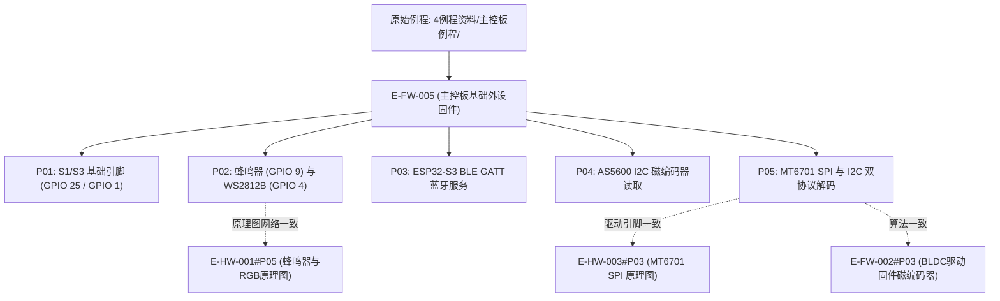

# E-FW-005 主控板基础外设与传感器通信例程固件

## 证据元数据
- **证据唯一标识**：`E-FW-005`
- **证据类型**：`IMPLEMENTATION`（外设测试与传感器通信源码实现）
- **认识论角色**：纯实现事实（`[IMPLEMENTED]`、`[CODE_DEFINED]`）。记录原厂为主控板双芯片（S1/ESP32 与 S3/ESP32-S3）编写的基础外设控制、状态指示、无线蓝牙通信及磁编码器驱动代码实现。
- **技术领域**：FIRMWARE / PERIPHERAL_DRIVERS / SENSOR_BUS
- **原始代码物理路径**：`CEG5003/doc/四足机器人-origin/4例程资料/主控板例程/`

---

## 原始物料工程审计概述

“4例程资料/主控板例程”提供了一套自底向上的外设验证源码，直接映射并印证了 `E-HW-001` 原理图中的引脚与外设设计：
1. **基础输入输出映射**：明确 S1 芯片测试引脚为 `GPIO 25`（板背 EA 引脚，对应驱动全桥使能脚），S3 芯片测试引脚为 `GPIO 1`。
2. **板载人机交互外设**：
   - 蜂鸣器驱动代码直接绑定 `GPIO 9`（通过 Arduino `tone()` 函数输出 C4~C5 音阶）；
   - WS2812B 炫彩灯通过 `SF_RGB` 库控制，绑定硬件 `GPIO 4`。
3. **低功耗蓝牙（BLE）服务端**：在 S3 芯片上实现了标准 GATT 服务（自定义 Service UUID 与 Characteristic UUID），提供单向状态 Notify 广播。
4. **双协议磁编码器总线读取**：
   - **AS5600 模式**：通过硬件 I2C（`TwoWire(0)`, SDA=1, SCL=2, 400kHz）读取 12 位角度；
   - **MT6701 高速 SPI 模式**：通过 HSPI（CLK=23, DATA/MISO=19, CS=22）以 1MHz 时钟拉取 24 位原始数据并进行高位对齐移位解算；
   - **MT6701 I2C 模式**：从机地址 `0x06`，读取高字节寄存器 `0x03` 与低字节寄存器 `0x04`，拼接出 14 位磁场角度。

---

## 拆解原子证据清单

### E-FW-005#P01: S1 与 S3 基础 GPIO / PWM / ADC 引脚映射与配置
- **源文件锚点**：
  - `1GPIO基本控制/GPIO_S1/src/main.cpp:3`
  - `1GPIO基本控制/GPIO_S3/src/main.cpp:3`
  - `2PWM基本控制/PWM_S1/src/main.cpp:3, 8-9`
  - `3ADC读取/ADC_S1/src/main.cpp:3`
  - `3ADC读取/ADC_S3/src/main.cpp:3`
- **代码事实**：
```cpp
// S1 基础引脚定义 (GPIO_S1, PWM_S1, ADC_S1)
#define LED_PIN 25  // 主控板背面的EA引脚
ledcSetup(0, 5000, 8);  // 频道0, 5000Hz, 8位精度
ledcAttachPin(LED_PIN, 0);

// S3 基础引脚定义 (GPIO_S3, PWM_S3, ADC_S3)
#define LED_PIN 1   // 主控板背面的1号引脚
ledcSetup(0, 5000, 8);
ledcAttachPin(LED_PIN, 0);
```
- **技术参数与认识论推导**：
  1. **S1 芯片调试引脚**：绑定至 `GPIO 25`。在全桥驱动模式下，此引脚直连 `DRV8313` 的硬件使能端 `M_EN`。
  2. **S3 芯片调试引脚**：绑定至 `GPIO 1`。此引脚可复用为 ADC1 通道或数字 I/O。
  3. **LEDC PWM 参数基准**：配置载波频率 $f_{\text{pwm}} = 5000\,\text{Hz}$，占空比分辨率为 8 位（0~255）。

---

### E-FW-005#P02: 蜂鸣器音频发生与 WS2812B 炫彩灯驱动接口
- **源文件锚点**：
  - `5蜂鸣器控制/buzzer_S3/src/main.cpp:3, 10-48`
  - `6RGB控制/RGB_S3/src/main.cpp:1-26`
- **代码事实**：
```cpp
// 蜂鸣器驱动代码
const int buzzerPin = 9;  // 蜂鸣器连接的GPIO引脚
void loop() {
  tone(buzzerPin, 262); delay(500); noTone(buzzerPin); delay(100); // C4
  tone(buzzerPin, 294); delay(500); noTone(buzzerPin); delay(100); // D4
  tone(buzzerPin, 330); delay(500); noTone(buzzerPin); delay(100); // E4
  tone(buzzerPin, 349); delay(500); noTone(buzzerPin); delay(100); // F4
  tone(buzzerPin, 392); delay(500); noTone(buzzerPin); delay(100); // G4
  tone(buzzerPin, 440); delay(500); noTone(buzzerPin); delay(100); // A4
  tone(buzzerPin, 494); delay(500); noTone(buzzerPin); delay(100); // B4
  tone(buzzerPin, 523); delay(500); noTone(buzzerPin); delay(100); // C5
}

// WS2812B 驱动代码
#include "SF_RGB.h"
SF_RGB inBoard_RGB = SF_RGB();
void setup(){
  inBoard_RGB.begin(); 
  inBoard_RGB.setGlobalBrightness(100);
  inBoard_RGB.setColor(0,255,0,0); inBoard_RGB.show(); // 红色
  inBoard_RGB.setColor(0,0,255,0); inBoard_RGB.show(); // 绿色
  inBoard_RGB.setColor(0,0,0,255); inBoard_RGB.show(); // 蓝色
}
```
- **技术参数与认识论推导**：
  1. **蜂鸣器硬件绑定**：代码严格使用 `buzzerPin = 9`，与 `E-HW-001#P05` 中的 `Ex_IO9` 直连 S8050 驱动无源蜂鸣器的硬件原理图完全吻合。
  2. **WS2812B 灯控**：通过专用静态库 `SF_RGB` 输出高精定时归零码脉冲（数据引脚为 `Ex_IO4`）。

---

### E-FW-005#P03: ESP32-S3 BLE GATT 蓝牙服务端通信接口
- **源文件锚点**：`7蓝牙通信/Bluet_S3/src/main.cpp:7-8, 30-58`
- **代码事实**：
```cpp
#define SERVICE_UUID        "4fafc201-1fb5-459e-8fcc-c5c9c331914b"
#define CHARACTERISTIC_UUID "beb5483e-36e1-4688-b7f5-ea07361b26a8"

BLEDevice::init("ESP32_BLE_Server");
BLEServer *pServer = BLEDevice::createServer();
BLEService *pService = pServer->createService(SERVICE_UUID);
pCharacteristic = pService->createCharacteristic(
                    CHARACTERISTIC_UUID,
                    BLECharacteristic::PROPERTY_READ   |
                    BLECharacteristic::PROPERTY_WRITE  |
                    BLECharacteristic::PROPERTY_NOTIFY |
                    BLECharacteristic::PROPERTY_INDICATE
                  );
```
- **技术参数与认识论推导**：
  1. **蓝牙广播设备名**：广播 SSID 为 `"ESP32_BLE_Server"`。
  2. **GATT 特征值权限**：支持读（READ）、写（WRITE）、通知（NOTIFY）与指示（INDICATE），可作为外部手机 App 或调试终端的无线遥测通道。

---

### E-FW-005#P04: AS5600 磁编码器 I2C 轮询读取与角度解析
- **源文件锚点**：`8AS5600-IIC/AS5600_IIC_S3/src/main.cpp:4-14`
- **代码事实**：
```cpp
#include "AS5600.h"
Sensor_AS5600 S0 = Sensor_AS5600(0);
TwoWire S0_I2C = TwoWire(0);

void setup() {
  Serial.begin(115200);
  S0_I2C.begin(1, 2, 400000UL); // SDA=1, SCL=2, 400kHz
  S0.Sensor_init(&S0_I2C);
}

void loop() {
  S0.Sensor_update(); 
  Serial.println(S0.getAngle());
}
```
- **技术参数与认识论推导**：
  1. **I2C 物理引脚分配**：`SDA = GPIO 1`, `SCL = GPIO 2`，通信速率为 400 kHz 快速模式（Fast Mode）。
  2. **12 位原生分辨率**：AS5600 在单圈内输出 4096 计数（LSB 对应角度 $\approx 0.088^\circ$）。

---

### E-FW-005#P05: MT6701 磁编码器高速 SPI/SSI 模式与 I2C 模式实现
- **源文件锚点**：
  - `9MT6701-SSI/MT6701_SSI_S1/src/main.cpp:4-53`
  - `10MT6701-IIC/MT6701_IIC_S3/src/main.cpp:3-33`
- **代码事实**：
```cpp
// 1. MT6701 SSI/SPI 高速模式 (S1芯片)
#define CLK_PIN 23
#define DATA_PIN 19
#define CS_PIN 22
#define SSI_CLOCK_FREQ 1000000 // 1 MHz

uint32_t readAngle() {
  digitalWrite(CS_PIN, LOW);
  spi.beginTransaction(MT6701SSISettings);
  uint32_t angle = spi.transfer32(0x83ffffff);
  spi.endTransaction();
  digitalWrite(CS_PIN, HIGH);

  angle <<= 1; // 去掉最高位
  angle >>= 8; // 取出有效24位
  return (angle >> 10) / 16384.0f * 6.28318530718f; // 转换为弧度 [0, 2π)
}

// 2. MT6701 I2C 模式 (S3芯片)
#define MT6701_I2C_ADDRESS 0x06
byte highByte = readAngle(0x03);
byte lowByte = readAngle(0x04);
float angle = (highByte << 6) | (lowByte >> 2);
angle = (angle / 8192.0) * 360.0 / 2;
angle = angle * (3.141592653589793 / 180.0);
```
- **技术参数与数学推导**：
  1. **SPI 模式数据帧解码**：
     - SPI 时钟 1.0 MHz，传输 32 位原始帧；
     - 剔除最高标志位并截取 24 位载荷，低 14 位（高 14 位有效角）归一化至 16384（$2^{14}$），乘 $2\pi$ 转换为弧度；
     - 引脚为 `CLK=23, DATA=19, CS=22`，与 `E-HW-003#P03` 硬件原理图完全一致。
  2. **I2C 模式寄存器拼接**：
     - 从机设备地址为 `0x06`；
     - 高字节读取自 `0x03`（高 8 位中的 8 位），低字节读取自 `0x04`（取高 6 位）；
     - 拼接公式：$\text{Raw} = (\text{Byte}_{03} \ll 6) \mid (\text{Byte}_{04} \gg 2)$，分辨率同样为 14 位（8192 级半圆 / 16384 级整圆）。

---

## 认识论状态判定 (Epistemic Status)

| 证据项编号 | 事实断言内容 | 认识论判定 | 严谨边界与审计说明 |
|---|---|---|---|
| `E-FW-005#P01` | S1(GPIO 25)与 S3(GPIO 1)的 GPIO/PWM/ADC 基础参数 | `[IMPLEMENTED]` | 源码确立 5kHz/8-bit PWM 载波与 ADC 采样接口 |
| `E-FW-005#P02` | 蜂鸣器绑定 GPIO 9，WS2812B 炫彩灯绑定 GPIO 4 | `[IMPLEMENTED]` | 代码与 `E-HW-001` 原理图物理网络完全吻合 |
| `E-FW-005#P03` | S3 芯片提供标准 BLE GATT 广播服务及特定 UUID | `[IMPLEMENTED]` | 源码明确配置特定 Service 与 Characteristic UUID |
| `E-FW-005#P04` | AS5600 磁编码器 I2C 模式（SDA=1, SCL=2, 400kHz） | `[IMPLEMENTED]` | 源码定义 400kHz 快速 I2C 总线并轮询提取角度 |
| `E-FW-005#P05` | MT6701 SPI(1MHz, 24-bit移位)与 I2C(0x06地址)解码算法 | `[CODE_DEFINED]` | 源码逐行确立两套物理总线的二进制位移与弧度换算公式 |

---

## 交叉索引与依赖图


