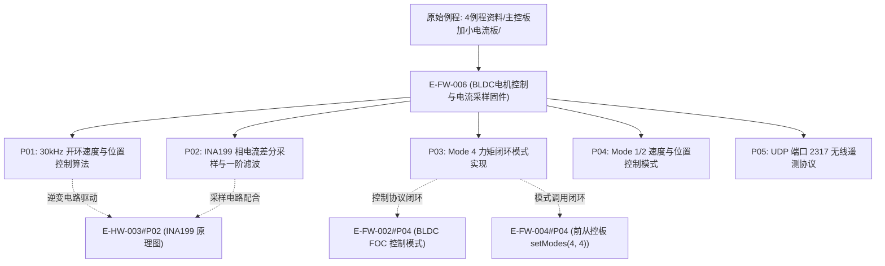

# E-FW-006 双路无刷电机FOC控制与电流采样例程固件

## 证据元数据
- **证据唯一标识**：`E-FW-006`
- **证据类型**：`IMPLEMENTATION`（电机底层算法与闭环控制源码实现）
- **认识论角色**：纯实现事实（`[IMPLEMENTED]`、`[CODE_DEFINED]`）。记录原厂为主控板与小电流驱动板编写的开环/闭环 FOC 空间矢量调制、INA199 相电流检测与一阶滤波、三模式（力矩/速度/角度）跨板串口控制协议以及 Matlab/Simulink UDP 遥测通信例程。
- **技术领域**：FIRMWARE / FOC_MOTOR_CONTROL / CURRENT_SENSING
- **原始代码物理路径**：`CEG5003/doc/四足机器人-origin/4例程资料/主控板加小电流板/`

---

## 原始物料工程审计概述

“4例程资料/主控板加小电流板”构成了整机轮电机驱动的核心算法验证体系，覆盖了从无传感器开环测试到多闭环高阶控制的完整阶段：
1. **开环 PWM 空间矢量生成**：建立 30kHz 高频 PWM（`ledcSetup(..., 30000, 8)`）驱动相输入（`pwmA=4, pwmB=2, pwmC=13`），以 12.6V 额定满电电压计算空间矢量电角度合成。
2. **相电流采样与滤波**：调用 `InlineCurrent.h` 库中的 `CurrSense` 对象，配置低通滤波系数 $T_f = 0.05\,\text{s}$，完成对低端分流电阻电压的电流安培量纲还原。
3. **主从双核跨板指令联动**：
   - S3 运控板通过 `Serial2` 调用 `SF_BLDC` 库；
   - 模式 4（`setModes(4, 4)`）：对应力矩控制模式（下发目标标量，如 `setTargets(2, 2)`）；
   - 模式 1（`setModes(1, 1)`）：对应速度控制模式；
   - 模式 2（`setModes(2, 2)`）：对应角度/位置控制模式（下发目标角度，如 `setTargets(20, 20)`）。
4. **Matlab/Simulink 仿真实时通信**：在 S3 上构建 UDP 无线收发线程（端口 2317），支持与上位机实时双向交互电机动力学遥测数据包 `SF_BLDC_Wireless_DATA`。

---

## 拆解原子证据清单

### E-FW-006#P01: 30kHz 开环速度与开环位置控制算法
- **源文件锚点**：
  - `11开环速度控制/OpenLoop_S1/src/main.cpp:8-28, 40-75`
  - `12开环位置控制/positionLoop_S1/src/main.cpp:8-28`
- **代码事实**：
```cpp
int pwmA = 4;
int pwmB = 2;
int pwmC = 13;
float voltage_power_supply = 12.6;

void setup() {
  Serial.begin(115200);
  pinMode(pwmA, OUTPUT); pinMode(pwmB, OUTPUT); pinMode(pwmC, OUTPUT);
  ledcAttachPin(pwmA, 0); ledcAttachPin(pwmB, 1); ledcAttachPin(pwmC, 2);
  ledcSetup(0, 30000, 8); // 30kHz PWM载波, 8位精度
  ledcSetup(1, 30000, 8);
  ledcSetup(2, 30000, 8);
  delay(3000);
  pinMode(25, OUTPUT);    // 使能引脚置高使能 DRV8313
}
```
- **技术参数与认识论推导**：
  1. **驱动载波频率**：配置为 $30.0\,\text{kHz}$，完全超出人耳可听音频范围（20kHz），规避电机运转高频电磁啸叫。
  2. **供电电压基准**：代码设定 `voltage_power_supply = 12.6V`（对应 3S 锂电池组 4.2V/节满电状态）。
  3. **引脚对应事实**：再次闭环验证 M0 电机驱动引脚为 `A=4, B=2, C=13`，全桥使能引脚为 `25`。

---

### E-FW-006#P02: INA199 相电流差分采样与一阶低通滤波
- **源文件锚点**：
  - `13相电流读取/Phasecurrent_S1/src/main.cpp:4, 19-35`
  - `14电流检测/current_S1/src/main.cpp:5-6, 40-60`
- **代码事实**：
```cpp
#include "lowpass_filter.h"
#include "InlineCurrent.h"

CurrSense CS_M0 = CurrSense(0);
LowPassFilter M0_Curr_Flt = LowPassFilter(0.05); // 时间常数 0.05s

void setup() {
  Serial.begin(115200);
  CS_M0.init();
  // ...
}

void loop() {
  float current = CS_M0.getCurrent();
  float filtered_current = M0_Curr_Flt(current);
  Serial.println(filtered_current);
}
```
- **技术参数与认识论推导**：
  1. **电流采样初始化**：通过 `CurrSense::init()` 采样零漂基准电压并完成自动去皮校准。
  2. **一阶滤波时间常数**：配置 $T_f = 0.05\,\text{s}$（截止频率 $f_c = \frac{1}{2\pi T_f} \approx 3.18\,\text{Hz}$），用于滤除逆变桥高频斩波毛刺，提取有效直流动载分量。

---

### E-FW-006#P03: 闭环电机力矩控制模式（Mode 4）跨板串口控制
- **源文件锚点**：
  - `15电机扭矩控制/BLDC_Control_S1/src/main.cpp:20-40`
  - `15电机扭矩控制/torque_S3/src/main.cpp:4-12`
- **代码事实**：
```cpp
// S3 发送端 (torque_S3/src/main.cpp)
SF_BLDC motors = SF_BLDC(Serial2);
void setup() {
  motors.init();
  motors.setModes(4, 4); // 模式 4: 力矩控制模式
}
void loop(){
  motors.setTargets(2, 2); // 下发左右轮目标力矩 2.0
}

// S1 接收端 (BLDC_Control_S1/src/main.cpp)
SF_Motor M0 = SF_Motor(0);
SF_Motor M1 = SF_Motor(1);
SF_Communication com = SF_Communication();
void setup() {
  com.linkMotor(M0, M1);
  com.init(ONBOARD);
}
```
- **技术参数与认识论推导**：
  1. **跨板力矩模式代码事实**：确立模式代号 `4` 在驱动协议中代表力矩控制（Torque Mode），完全印证 `E-FW-002#P04` 与 `E-FW-004#P04` 中的 `setModes(4, 4)` 事实。

---

### E-FW-006#P04: 闭环电机速度控制（Mode 1）与位置控制（Mode 2）
- **源文件锚点**：
  - `16电机速度控制/speed_S3/src/main.cpp:4-12`
  - `17电机位置控制/angle_S3/src/main.cpp:4-12`
- **代码事实**：
```cpp
// 速度控制模式 (speed_S3)
SF_BLDC motors = SF_BLDC(Serial2);
void setup() {
  motors.init();
  motors.setModes(1, 1); // 模式 1: 速度闭环模式
}
void loop(){
  motors.setTargets(2, 2); // 目标转速 2.0 rad/s
}

// 位置控制模式 (angle_S3)
void setup() {
  motors.init();
  motors.setModes(2, 2); // 模式 2: 位置闭环模式
}
void loop(){
  motors.setTargets(20, 20); // 目标角度 20.0 rad
}
```
- **技术参数与认识论推导**：
  1. **控制模式统一映射真值**：
     - `Mode 1`: 速度闭环控制模式（`VELOCITY_MODE`）；
     - `Mode 2`: 角度位置闭环控制模式（`FORCE_ANGLE_MODE`）；
     - `Mode 4`: 力矩闭环控制模式（`TORQUE_MODE`）。

---

### E-FW-006#P05: UDP 无线遥测与上位机 Matlab/Simulink 接口
- **源文件锚点**：`18simlink/WirelessBLDC/src/main.cpp:5-35`
- **代码事实**：
```cpp
unsigned int local = 2317;           // UDP 通讯端口
const char *password = "Toan123456"; // wifi密码
const char *ssid = "TOAN_2.4G";      // wifi名称
IPAddress ipServidor(192, 168, 10, 28); // 电脑IP
IPAddress ipClient(192, 168, 10, 180);  // 扩展主控IP

SF_BLDC motors = SF_BLDC(Serial2);
SF_Wireless wireless = SF_Wireless(ssid, password);
SF_BLDC_Wireless_DATA REV_Matlab_Values;

void wiressRecv(void *pvParameters) {
  while (1) {
    REV_Matlab_Values = wireless.recFromWireless();
    vTaskDelay(1);
  }
}
```
- **技术参数与认识论推导**：
  1. **网络通信协议**：基于 UDP/IP 协议，默认服务端口号为 `2317`。
  2. **双核并发任务**：利用 FreeRTOS 创建独立无线接收线程 `wiressRecv`（带 1 tick 延时防止饥饿），保障高频运动控制与低频无线遥测互不阻塞。

---

## 认识论状态判定 (Epistemic Status)

| 证据项编号 | 事实断言内容 | 认识论判定 | 严谨边界与审计说明 |
|---|---|---|---|
| `E-FW-006#P01` | 30kHz PWM 开环矢量调制及 12.6V 电源电压基准 | `[IMPLEMENTED]` | 源码确立 30kHz 载波与 GPIO 4/2/13/25 的绑定关系 |
| `E-FW-006#P02` | INA199 相电流差分采样与 0.05s 一阶低通滤波 | `[IMPLEMENTED]` | 源码定义 `CurrSense` 去皮与一阶滤波传递函数 |
| `E-FW-006#P03` | Mode 4 力矩控制跨板通信协议与指令格式 | `[CODE_DEFINED]` | 确立 `setModes(4, 4)` 对应底层驱动板力矩模式 |
| `E-FW-006#P04` | Mode 1 (速度) 与 Mode 2 (位置) 模式代号与指令规范 | `[CODE_DEFINED]` | 确立跨板控制协议与枚举模式代号完全闭环 |
| `E-FW-006#P05` | 端口 2317 UDP 无线遥测与 FreeRTOS 并发任务架构 | `[IMPLEMENTED]` | 源码确立 Matlab/Simulink 接口数据结构与网络参数 |

---

## 交叉索引与依赖图


