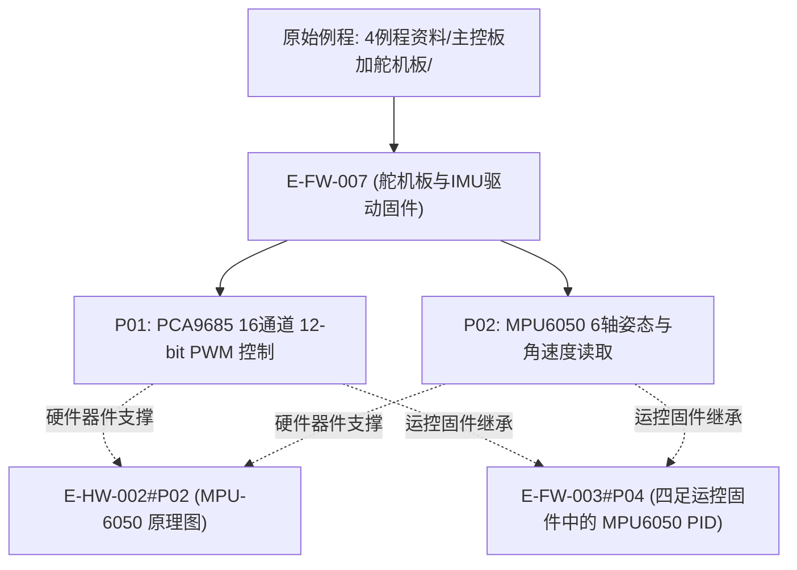

# E-FW-007 舵机扩展板PCA9685与MPU6050驱动例程固件

## 证据元数据
- **证据唯一标识**：`E-FW-007`
- **证据类型**：`IMPLEMENTATION`（外设扩展板驱动源码实现）
- **认识论角色**：纯实现事实（`[IMPLEMENTED]`、`[CODE_DEFINED]`）。记录原厂针对舵机与 IMU 扩展板编写的 PCA9685 16 通道 12 位 PWM 舵机驱动控制、以及 MPU6050 六轴惯性测量单元原始欧拉角/角速度数据流读取实现。
- **技术领域**：FIRMWARE / SERVO_CONTROL / IMU_SENSING
- **原始代码物理路径**：`CEG5003/doc/四足机器人-origin/4例程资料/主控板加舵机板/`

---

## 原始物料工程审计概述

“4例程资料/主控板加舵机板”提供了两个独立的最小验证工程：
1. **PCA9685 舵机通道驱动（`Servo`）**：调用 `SF_Servo` 专用驱动库，通过标准硬件 I2C 接口（`Wire.begin(1, 2, 400000UL)`，SDA=GPIO 1, SCL=GPIO 2）与 PCA9685PW 通信，向 0~11 号舵机通道以阶梯数值（如 100 与 200 计数值）下发 PWM 占空比脉宽。
2. **MPU-6050 姿态角与角速度采集（`IMURead`）**：调用 `SF_IMU` 封装库，以 400kHz I2C 速率轮询读取内部解算的翻滚角（roll）、俯仰角（pitch）、偏航角（yaw）以及三轴原始角速度（`gyroX, gyroY, gyroZ`），以 100ms 周期通过串口输出六自由度浮点数组。

---

## 拆解原子证据清单

### E-FW-007#P01: PCA9685 16通道 12-bit PWM 舵机驱动与占空比控制
- **源文件锚点**：`Servo/src/main.cpp:1-42`
- **代码事实**：
```cpp
#include <Arduino.h>
#include "SF_Servo.h"
#include "Wire.h"

SF_Servo servos = SF_Servo(Wire);

void setup(){
  Serial.begin(115200);
  Wire.begin(1, 2, 400000UL); // SDA=GPIO 1, SCL=GPIO 2, 400kHz
  servos.init();
}

void loop() {
  // 通道 0~11 下发 100 计数值
  servos.setPWM(0, 0, 100);
  servos.setPWM(1, 0, 100);
  // ...
  delay(1000);
  // 通道 0~11 下发 200 计数值
  servos.setPWM(0, 0, 200);
  servos.setPWM(1, 0, 200);
  // ...
}
```
- **技术参数与认识论推导**：
  1. **I2C 总线引脚配置**：SDA 绑定至 `GPIO 1`，SCL 绑定至 `GPIO 2`，通信时钟固定为 $400\,\text{kHz}$。
  2. **12 位定时器脉宽控制**：调用 `servos.setPWM(channel, on_count, off_count)`，直接向 PCA9685 的 12 位 LED 计数器（0~4095）写入上升沿与下降沿计数值，实现对舵机脉冲高电平宽度（1ms~2ms）的精确量化控制。

---

### E-FW-007#P02: MPU-6050 六轴惯导姿态角与三轴角速度实时读取
- **源文件锚点**：`IMURead/src/main.cpp:1-27`
- **代码事实**：
```cpp
#include <Arduino.h>
#include <Wire.h>
#include "SF_IMU.h"

SF_IMU mpu6050 = SF_IMU(Wire);
float roll, pitch, yaw;
float gyroX, gyroY, gyroZ;

void setup(){
  Serial.begin(115200);
  Wire.begin(1, 2, 400000UL); // SDA=GPIO 1, SCL=GPIO 2, 400kHz
  mpu6050.init();
}

void loop() {
  mpu6050.update();
  roll = mpu6050.angle[0];
  pitch = mpu6050.angle[1];
  yaw = mpu6050.angle[2];
  gyroX = mpu6050.gyro[0];
  gyroY = mpu6050.gyro[1];
  gyroZ = mpu6050.gyro[2];
  Serial.printf("%f,%f,%f,%f,%f,%f
", roll, pitch, yaw, gyroX, gyroY, gyroZ);
  delay(100); // 100ms 周期输出 (10Hz)
}
```
- **技术参数与认识论推导**：
  1. **I2C 物理通道共用**：MPU-6050 与 PCA9685 并联挂载于同一套 I2C 总线（`Wire`，引脚 1/2），通过不同硬件从机地址（0x68 与 0x40）实现时分复用。
  2. **遥测数据输出帧**：以 100ms 周期（10Hz 采样率）通过 115200 串口格式化输出 6 组单精度浮点数（`roll,pitch,yaw,gyroX,gyroY,gyroZ`），构成了上层姿态平衡闭环的数据源。

---

## 认识论状态判定 (Epistemic Status)

| 证据项编号 | 事实断言内容 | 认识论判定 | 严谨边界与审计说明 |
|---|---|---|---|
| `E-FW-007#P01` | PCA9685 12-bit PWM 控制协议与 I2C(SDA=1, SCL=2, 400kHz)配置 | `[IMPLEMENTED]` | 源码确立 `SF_Servo::setPWM` 与硬件 I2C 引脚绑定 |
| `E-FW-007#P02` | MPU6050 6轴数据提取与 10Hz 串口遥测帧格式 | `[IMPLEMENTED]` | 源码确立 6 浮点数组输出格式及共用 I2C 总线事实 |

---

## 交叉索引与依赖图


