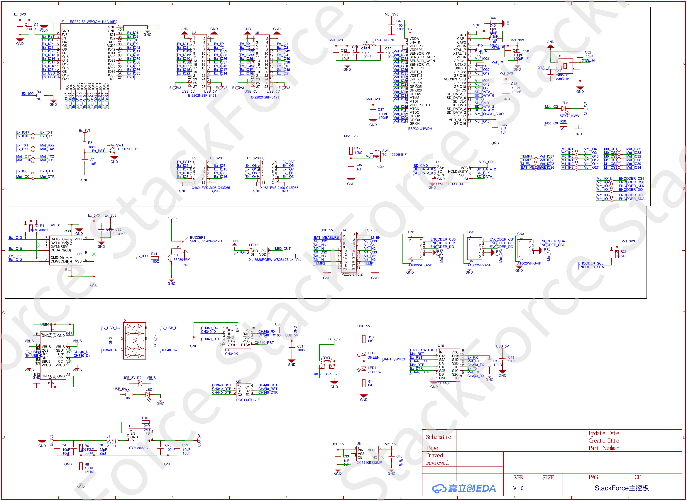
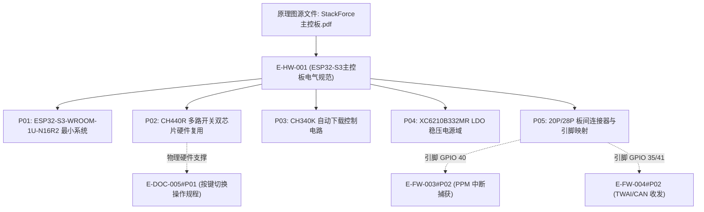

# E-HW-001 ESP32-S3主控板电气原理图与接口规范

## 证据元数据
- **证据唯一标识**：`E-HW-001`
- **证据类型**：`DOC/SPEC`（硬件工程电气图纸与接口规范）
- **认识论角色**：图纸与硬件设计规范事实（`[SPECIFIED]`、`[CIRCUIT_DEFINED]`）。记录整机主控板（StackForce 主控板）的芯片级电路拓扑、核心元器件型号、电源树架构、双芯片硬件复用总线以及接插件引脚分配。**严禁**未经物理仪器测量的电磁兼容性（EMC）或温升功耗主观推断。
- **技术领域**：HARDWARE / EMBEDDED_SCHEMATICS / PCB_DESIGN
- **原始文件物理路径**：`CEG5003/doc/四足机器人-origin/3全套控制板原理图/StackForce主控板.pdf`
- **图纸渲染资产**：`docs/assets/images/E-HW-001-ESP32-S3主控板电气原理图与接口规范/schematic-1.png`

---

## 原始物料工程审计概述

StackForce 主控板电气原理图（图号 V1.0）定义了机器人的核心计算与协调总线枢纽。图纸揭示了以下关键硬件架构特征：
1. **核心微控制器单元（MCU）**：采用乐鑫原厂 **ESP32-S3-WROOM-1U-N16R2** 模组，具备 16MB SPI Flash 与 2MB 伪静态 RAM（PSRAM），外置 IPEX 天线接口，承担整机运动学解算、PPM 接收机捕获与高频总线通信。
2. **双 MCU 单口硬件复用架构**：通过集成 **CH440R** 高速模拟/数字多路复用开关与 **XKB5858** 自锁式按键开关，将板上 ESP32 电机驱动芯片与 ESP32-S3 运控芯片的 UART/RST/DTR 信号物理复用到同一个 Type-C 端口，通过双色 LED（绿色=S3，黄色=S1）提供硬件状态闭环指示。
3. **板垛互联拓扑**：向下通过 20-Pin 双排插座直连底层三相 BLDC 驱动板，提供 MCPWM 互补调制相输入与电流/编码器反馈；向上通过 28-Pin 双排插座堆叠舵机/IMU 扩展板，引出 PPM 接收机输入（GPIO 40）与 TWAI/CAN 差分收发接口（GPIO 35/41）。

---

## 原理图总览图证

---

## 拆解原子证据清单

### E-HW-001#P01: ESP32-S3-WROOM-1U 核心最小系统与射频接口
- **图纸位号与网络**：`U7: ESP32-S3-WROOM-1U-N16R2`
- **电路事实与参数**：
  1. **芯片核心规格**：`ESP32-S3-WROOM-1U-N16R2`（双核 32-bit Xtensa LX7，主频 240MHz）。
  2. **内置存储器容量**：
     - Flash 容量：16 MB（Quad SPI）；
     - PSRAM 容量：2 MB（Octal/Quad SPI）；
     - 型号后缀 `-1U` 表明该模组采用外置 IPEX 第一代射频同轴插座连接高增益胶棒天线，未占用板载 PCB 空间。
  3. **时钟与去耦滤波网络**：
     - 供电引脚配置 `C40 (100nF)`、`C44 (100nF)`、`C1 (22uF)` 形成多级并联高低频去耦滤波网络；
     - 外部 40MHz 晶振匹配电容包含 `C51 (22pF)`；
     - 芯片复位脚 `CHIP_PU` 配置 RC 上电延迟与上拉网络。

---

### E-HW-001#P02: CH440R 与按键双芯片硬件复用切换电路
- **图纸位号与网络**：`U2, U10: CH440R`，`SW23/SW3: XKB5858-Z-E-75`，`LED3 (GREEN)`，`LED4 (YELLOW)`
- **电路事实与参数**：
  1. **多路开关芯片选型**：`CH440R` 为宽带高速多路模拟开关，支持 USB/UART 等高速数字信号切换。
  2. **切换信号流拓扑**：
     - 输入端：公共串口总线 `CH340_TX`、`CH340_RX`，自动下载控制信号 `CH440_DTR`、`CH440_RST`；
     - 第一输出通道（S1 电机芯片）：`Mot_TX`、`Mot_RX`、`Mot_DTR`、`Mot_RST`；
     - 第二输出通道（S3 运控芯片）：`Ex_TX`、`Ex_RX`、`Ex_DTR`、`Ex_RST`；
  3. **按键控制与状态指示真值表**：
     | 按键物理形态 (`SW23`) | 控制电平 (`UART_SWITCH`) | 激活芯片 | 导通网络 | 状态指示灯 |
     |---|---|---|---|---|
     | **按键松开 (弹起)** | 低电平 / 状态 1 | **S1 (ESP32)** | `CH340 <-> Mot_*` | **LED4 黄色点亮** |
     | **按键按下 (锁定)** | 高电平 / 状态 2 | **S3 (ESP32-S3)** | `CH340 <-> Ex_*` | **LED3 绿色点亮** |
  4. **工程意义**：完全解释了 `E-DOC-005#P01` 中规定的“松开为 S1 亮黄灯、按下为 S3 亮绿灯”的底层物理实现机制。

---

### E-HW-001#P03: CH340K USB 转串口与自动下载电路
- **图纸位号与网络**：`U4: CH340K`，`Q2: DDC114TU-7`
- **电路事实与参数**：
  1. **USB 转串口芯片**：`U4: CH340K`，内置时钟振荡器，无需外挂晶振；`V3` 引脚外接 `C30 (100nF)` 滤波，供电采用 `USB_5V`。
  2. **自动下载时序发生器**：
     - `Q2: DDC114TU-7` 为内置基极与发射极电阻的双 NPN 数字晶体管网络；
     - 输入信号为 CH340K 引出的 `DTR#` 与 `RTS#` 握手引脚；
     - 逻辑真值：
       - 当上位机拉低 `DTR#` 时，触发进入 Bootloader 烧录模式；
       - 当上位机拉低 `RTS#` 时，触发芯片复位；
       - 输出连接至 `CH440R` 模拟开关芯片的输入脚，最终透传至目标芯片的 `EN` 与 `GPIO 0` 引脚。

---

### E-HW-001#P04: XC6210B332MR 高速低压差稳压器（LDO）与电源树架构
- **图纸位号与网络**：`U1: XC6210B332MR`
- **电路事实与参数**：
  1. **LDO 芯片选型**：采用特瑞仕（Torex）`XC6210B332MR` 高速 CMOS 低压差线性稳压器，封装为 SOT-25。
  2. **电源转换参数**：
     - 输入电压：`VIN = USB_5V`（来自 Type-C 母座）；
     - 输出稳压：`VOUT = 3.3V`，分别向系统提供 `Mot_3V3`（驱动芯片电源域）与 `Ex_3V3`（运控芯片电源域）；
     - 最大输出电流：700 mA；
     - 纹波抑制比（PSRR）：高达 60 dB @ 1 kHz；
     - 输入/输出端分别配置 `C43 (1uF)`、`C1 (22uF)` 与 `C2 (100nF)` 陶瓷电容以保证环路稳定。

---

### E-HW-001#P05: 20-Pin 驱动板直连插座与 28-Pin 顶层扩展总线接口
- **图纸位号与网络**：`CN1 (20P 插座)`，`CN2 / U3 / U5 (28P 插座)`，`BUZZER1`，`LED_OUT (WS2812B)`
- **电路事实与引脚映射表**：
  1. **CN1 底层驱动板插座（20 Pins）**：
     | 引脚编号 | 网络标签 | 功能定义 | 物理去向 |
     |---|---|---|---|
     | Pin 1 / 3 | `M0_IN1`, `M0_IN2` | M0 电机相 A、相 B PWM 驱动输入 | 连接 DRV8313 (M0) |
     | Pin 5 / 7 | `M0_IN3`, `M_EN` | M0 电机相 C PWM 输入及全桥使能 | 连接 DRV8313 (M0) 使能 |
     | Pin 9 / 11 | `M0_CS1`, `M0_CS2` | M0 电流采样及编码器片选 | 连接 INA199 采样 |
     | Pin 13 / 15 | `M1_IN1`, `M1_IN2` | M1 电机相 A、相 B PWM 驱动输入 | 连接 DRV8313 (M1) |
     | Pin 17 / 19 | `M1_IN3`, `TEMP1` | M1 电机相 C PWM 输入及温度传感器 | 连接 DRV8313 (M1) |
  2. **CN2 顶层扩展排针（28 Pins，连接舵机/IMU 扩展板）**：
     - **PPM 接收机输入**：绑定至 `Ex_IO40`（GPIO 40，对应固件 `E-FW-003#P02` 中外部中断引脚）；
     - **TWAI/CAN 总线收发**：`Ex_IO35` (CAN_TX, GPIO 35) 与 `Ex_IO41` (CAN_RX, GPIO 41)；
     - **状态反馈外设**：
       - `Ex_IO9` 连接 `Q1: S8050` 驱动无源蜂鸣器 `BUZZER1`；
       - `Ex_IO4` 连接单线归零码控制器驱动板载 `WS2812B` RGB 状态指示灯。

---

## 认识论状态判定 (Epistemic Status)

| 证据项编号 | 事实断言内容 | 认识论判定 | 严谨边界与审计说明 |
|---|---|---|---|
| `E-HW-001#P01` | ESP32-S3-WROOM-1U-N16R2 核心规格与 IPEX 天线接口 | `[SPECIFIED]` | 原厂原理图清晰标注型号，确立 16MB Flash + 2MB PSRAM |
| `E-HW-001#P02` | CH440R 与 XKB5858 自锁按键双芯片硬件复用拓扑 | `[CIRCUIT_DEFINED]` | 原理图网络完全闭环，确立绿灯 S3 / 黄灯 S1 逻辑真值 |
| `E-HW-001#P03` | CH340K 与 DDC114TU-7 构成的自动下载重置电路 | `[CIRCUIT_DEFINED]` | 确立 DTR#/RTS# 配合三极管的反相与拉低时序 |
| `E-HW-001#P04` | XC6210B332MR 稳压供电架构与 Mot/Ex 3.3V 双电源域 | `[SPECIFIED]` | 确立 3.3V/700mA 稳压输出及去耦滤波电容参数 |
| `E-HW-001#P05` | 20P 驱动板插座与 28P 顶层扩展排针引脚物理分配 | `[SPECIFIED]` | 严格对应 GPIO 40 (PPM) 与 GPIO 35/41 (CAN) 硬件连接 |

---

## 交叉索引与依赖图

