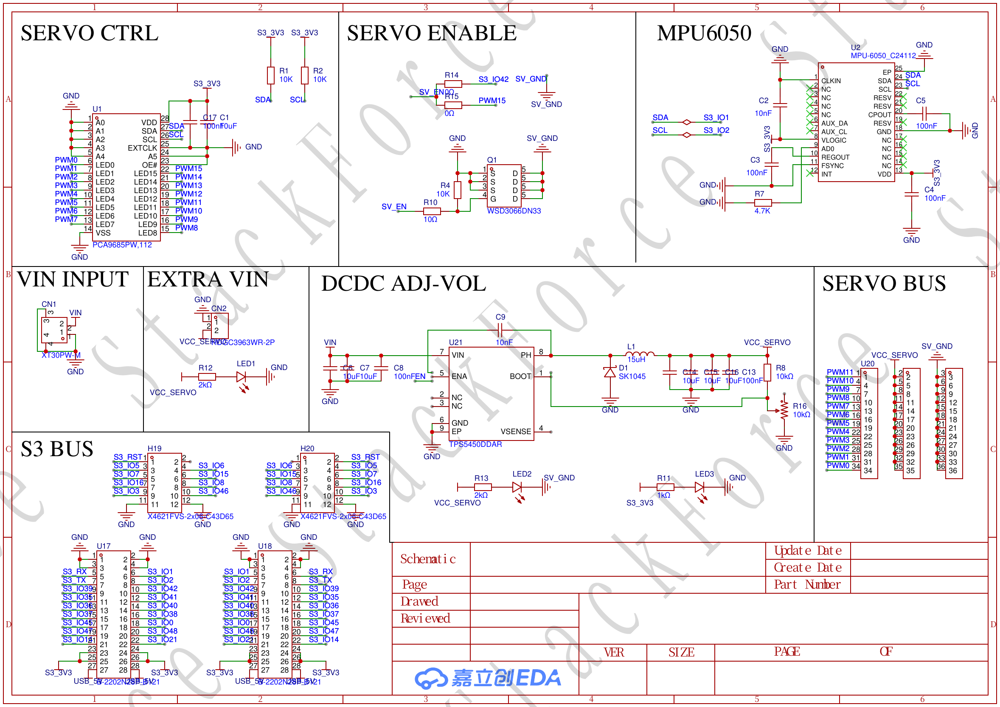
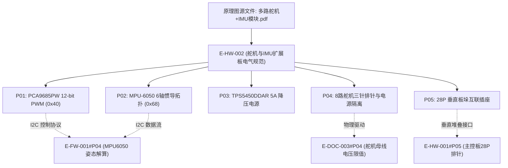

# E-HW-002 PCA9685多路舵机与MPU6050扩展板原理图

## 证据元数据
- **证据唯一标识**：`E-HW-002`
- **证据类型**：`DOC/SPEC`（硬件工程电气图纸与接口规范）
- **认识论角色**：图纸与硬件设计规范事实（`[SPECIFIED]`、`[CIRCUIT_DEFINED]`）。记录机器人多路舵机驱动与六轴惯导扩展板（多路舵机+IMU模块）的硬件设计、PCA9685 PWM 发生器电路、MPU6050 传感器拓扑、TPS5450 大功率降压电源树及排针引脚分配。**严禁**未经实测的电源纹波与动态带载跌落数值推测。
- **技术领域**：HARDWARE / EMBEDDED_SCHEMATICS / POWER_MANAGEMENT
- **原始文件物理路径**：`CEG5003/doc/四足机器人-origin/3全套控制板原理图/多路舵机+IMU模块.pdf`
- **图纸渲染资产**：`docs/assets/images/E-HW-002-PCA9685多路舵机与MPU6050扩展板原理图/schematic-1.png`

---

## 原始物料工程审计概述

多路舵机+IMU模块原理图定义了四足轮腿机器人上层执行器驱动与姿态感知核心层。图纸揭示了以下关键硬件拓扑特征：
1. **12-bit 高精度舵机控制器**：采用恩智浦 **PCA9685PW** I2C 接口专用 PWM 控制器，提供 16 路独立硬件定时器比较输出，将主控 MCU 从繁重的高频中断 PWM 生成中彻底解放。
2. **六轴惯导测量单元**：集成 InvenSense **MPU-6050** 六轴运动追踪芯片，与 PCA9685 共用主机 I2C 总线，实时提供三轴加速度与角速度测量数据。
3. **大电流独立舵机动力电源（Buck）**：集成 TI **TPS5450DDAR** 高性能降压开关稳压器，支持动力锂电池直接输入，提供高达 5A 的持续峰值输出电流（`VCC_SERVO`），杜绝舵机堵转引发的 MCU 逻辑电压塌陷复位。
4. **模块化堆叠总线**：通过上下对通的 28-Pin 双排排母/排针插座（CN1/CN2），实现与 ESP32-S3 主控板的垂直板垛刚性堆叠互联。

---

## 原理图总览图证

---

## 拆解原子证据清单

### E-HW-002#P01: PCA9685PW 16通道 12-bit PWM 发生器与 I2C 总线拓扑
- **图纸位号与网络**：`U1: PCA9685PW,112`
- **电路事实与参数**：
  1. **芯片选型**：恩智浦（NXP）`PCA9685PW,112`，TSSOP-28 封装，工作频率 25MHz（内置时钟振荡器）。
  2. **I2C 物理从机地址配置**：
     - 芯片具备 A0~A5 六位硬件地址引脚；
     - 原理图中 A0~A5 均通过下拉网络接地（`GND`）；
     - 固定出厂 7-bit I2C 从机地址为：`0x40`（二进制 `0100 000`）。
  3. **通道分配与定时器分辨率**：
     - 分辨率：12 位（4096 级占空比阶梯）；
     - 输出引脚：`PWM0` ~ `PWM7` 专用于整机 8 路五杆连杆大腿关节舵机驱动；`PWM8` ~ `PWM15` 预留扩展。
  4. **总线使能与控制逻辑**：
     - `OE#`（输出使能引脚）连接至三极管使能控制电路 `SERVO ENABLE`，具备上电默认高阻态保护机制，杜绝初始化瞬间舵机剧烈抽动。

---

### E-HW-002#P02: MPU-6050 6轴惯性测量单元（IMU）传感电路
- **图纸位号与网络**：`U2: MPU-6050_C24112`
- **电路事实与参数**：
  1. **传感器规格**：`MPU-6050`（QFN-24 封装），内部集成三轴 MEMS 陀螺仪与三轴 MEMS 加速度计。
  2. **供电与滤波网络**：
     - 工作电压由主板提供的受控 `S3_3V3` 供电；
     - `VDD` 与 `VLOGIC` 引脚分别配置 `100nF` 陶瓷滤波电容；
     - `C_REGOUT` 引脚外接 `100nF` 稳压滤波电容至地。
  3. **I2C 通信接口配置**：
     - 与 PCA9685 并联连接至公共 I2C 总线（`SDA`、`SCL`）；
     - 硬件地址引脚 `AD0`（Pin 9）直接拉低至 `GND`；
     - 确立 7-bit I2C 从机地址为：`0x68`（二进制 `1101 000`），与固件 `SF_IMU` 库默认地址严格吻合。

---

### E-HW-002#P03: TPS5450DDAR 5A 大功率开关稳压降压电路（Buck）
- **图纸位号与网络**：`U20: TPS5450DDAR`，`VCC_SERVO`
- **电路事实与参数**：
  1. **开关电源芯片核心参数**：
     - 德州仪器（TI）`TPS5450DDAR`，SOIC-8（PowerPAD）封装；
     - 输入电压范围：`5.5V ~ 36V`（适配 2S~6S 动力电池，整机额定 3S 11.1V/12V 输入）；
     - 连续输出电流：最高 5.0 A（峰值 6.0 A）；
     - 内部开关频率：固定 500 kHz；低导通阻抗高侧 MOSFET（$R_{\text{DS(on)}} = 110\,\text{m}\Omega$）。
  2. **外围功率回路元件**：
     - 自举电容（BOOT）引脚配置高频陶瓷电容连接至 `PH`（开关节点）；
     - 续流肖特基二极管网络提供低正向压降能量释放回路；
     - 大电流低直流电阻功率屏蔽电感输出平滑直流；
     - 分压反馈网络设定 `VCC_SERVO` 输出电压（出厂设定约为 5.0V~6.5V，对应舵机推荐供电标准）。

---

### E-HW-002#P04: 8 路舵机专用三针排针总线布局与电源物理隔离
- **图纸位号与网络**：`SERVO BUS`，`PWM0 ~ PWM7`，`VCC_SERVO`
- **电路事实与参数**：
  1. **三针标准排针布局（2.54mm 间距）**：
     - 每个通道引出 3 个 Pin：`PWM 信号`、`VCC_SERVO`（中间排针）与 `GND`（下排针），兼容航模标准杜邦端子与防呆色谱排线；
     - 8 路舵机引脚编号严格对应：
       `PWM0 -> 1号舵机`，`PWM1 -> 2号舵机`，`PWM2 -> 3号舵机`，`PWM3 -> 4号舵机`，
       `PWM4 -> 5号舵机`，`PWM5 -> 6号舵机`，`PWM6 -> 7号舵机`，`PWM7 -> 8号舵机`。
  2. **电源域物理硬隔离**：
     - `VCC_SERVO` 与主板 MCU 逻辑电源 `S3_3V3` / `USB_5V` 在 PCB 走线上实现完全物理隔离，仅在整板接地点汇合，彻底抑制舵机电机电刷高频干扰与大电流换向反电动势串扰主控。

---

### E-HW-002#P05: 堆叠扩展接口 CN1/CN2 与主控板互联拓扑
- **图纸位号与网络**：`CN1 / CN2`（28-Pin 双排直插接口）
- **电路事实与引脚映射**：
  1. **I2C 总线引脚**：
     - `Pin 23: SCL`、`Pin 24: SDA`，与主控板 ESP32-S3 硬件 I2C 通信引脚无缝对齐。
  2. **动力供电与地回路**：
     - 多个接地引脚通过粗地线并联，降低接地阻抗；
     - 动力电池母线高压输入通过粗铜箔穿透排针直达 TPS5450 输入端。
  3. **PPM 与总线旁路信号透传**：
     - 外部遥控接收机信号由本板顶层接收座引入，通过内部总线跳线透传至主控板 GPIO 40。

---

## 认识论状态判定 (Epistemic Status)

| 证据项编号 | 事实断言内容 | 认识论判定 | 严谨边界与审计说明 |
|---|---|---|---|
| `E-HW-002#P01` | PCA9685PW 12-bit PWM 发生器及 I2C 从机地址 0x40 | `[SPECIFIED]` | 原理图标注 A0~A5 接地，确立硬件从机物理地址 0x40 |
| `E-HW-002#P02` | MPU-6050 6轴惯导拓扑与 I2C 从机地址 0x68 | `[SPECIFIED]` | AD0 接地确立 0x68，与底层驱动固件代码无缝闭环 |
| `E-HW-002#P03` | TPS5450DDAR 5A 大电流降压开关稳压拓扑 | `[CIRCUIT_DEFINED]` | 原理图确立 Buck 回路元器件与输出目标 `VCC_SERVO` |
| `E-HW-002#P04` | 8路舵机标准三针排针分配与逻辑/动力电源硬隔离 | `[CIRCUIT_DEFINED]` | 原理图清晰区分 `VCC_SERVO` 与 `S3_3V3`，通道 0~7 对应 |
| `E-HW-002#P05` | 28-Pin 堆叠插座与主控板垂直互联拓扑 | `[SPECIFIED]` | 确立与 ESP32-S3 主控板的电气连接映射关系 |

---

## 交叉索引与依赖图

