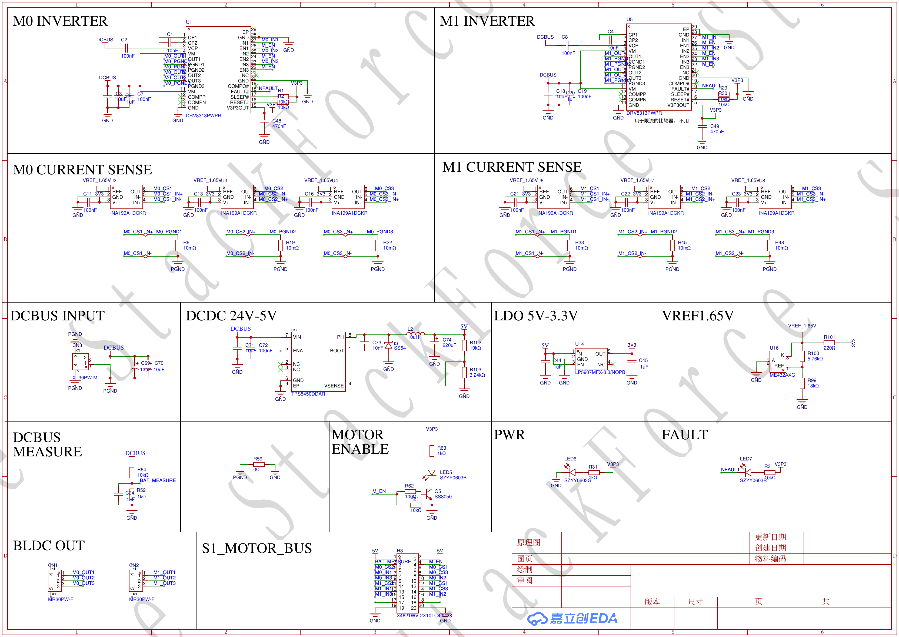
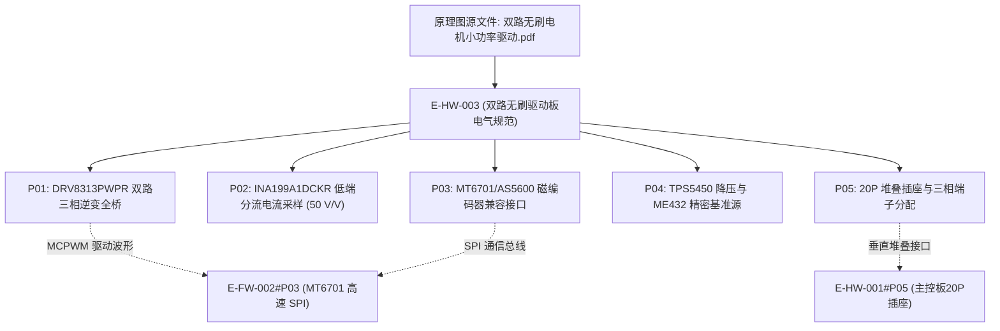

# E-HW-003 双路无刷轮机驱动器与逆变电路原理图

## 证据元数据
- **证据唯一标识**：`E-HW-003`
- **证据类型**：`DOC/SPEC`（硬件工程电气图纸与接口规范）
- **认识论角色**：图纸与硬件设计规范事实（`[SPECIFIED]`、`[CIRCUIT_DEFINED]`）。记录整机双路无刷轮机驱动板（小电流驱动板 / 双路无刷电机小功率驱动）的芯片级电路拓扑、DRV8313 三相逆变全桥、INA199 电流分流检测放大器、磁编码器多总线接口以及动力接线端子定义。**严禁**未经物理台架实测的热阻极值或电机饱和电流推测。
- **技术领域**：HARDWARE / MOTOR_DRIVE / POWER_ELECTRONICS
- **原始文件物理路径**：`CEG5003/doc/四足机器人-origin/3全套控制板原理图/双路无刷电机小功率驱动.pdf`
- **图纸渲染资产**：`docs/assets/images/E-HW-003-双路无刷轮机驱动器与逆变电路原理图/schematic-1.png`

---

## 原始物料工程审计概述

双路无刷电机小功率驱动原理图定义了四足机器人驱动轮的底层执行机构。驱动板由微控制器通过专用 20-Pin 插座提供 MCPWM 互补信号，板载集成以下核心功率电子拓扑：
1. **集成三相全桥逆变驱动**：板载两颗德州仪器 **DRV8313PWPR** 三相半桥驱动芯片，独立驱动左右驱动轮外转子 BLDC 电机（M0 与 M1），内部集成导通阻抗极低的功率 MOSFET，支持硬件死区与过流过温关断。
2. **微阻分流电流检测架构**：采用 **INA199A1DCKR** 高精度双向电流感测放大器（固定增益 50 V/V），配合低端精密分流电阻，为 FOC 算法提供精准的相电流反馈回路。
3. **磁编码器物理接口**：提供标准 1.0mm 间距连接插座，硬件走线同时兼容 **MT6701 高速 SPI** 与 **AS5600 I2C** 双协议磁编码器。
4. **板载电源管理**：采用 TI **TPS5450DDAR** 开关降压稳压器与 **ME432AXG** 精密稳压基准源，为门极驱动器、运放及逻辑电路提供洁净的电源母线。

---

## 原理图总览图证

---

## 拆解原子证据清单

### E-HW-003#P01: DRV8313PWPR 双路三相半桥逆变器功率驱动拓扑
- **图纸位号与网络**：`U5: DRV8313PWPR (M0 INVERTER)`，`U1: DRV8313PWPR (M1 INVERTER)`
- **电路事实与参数**：
  1. **逆变驱动芯片选型**：德州仪器（TI）`DRV8313PWPR`，HTSSOP-28 封装，带裸露散热焊盘（PowerPAD）。
  2. **电气规格参数**：
     - 工作输入电压：`8V ~ 60V`（完全覆盖机器人 12V 动力电池母线）；
     - 最大输出电流：单相峰值 2.5 A（持续有效值约 1.75 A @ 25°C）；
     - 内部导通阻抗：高侧+低侧导通阻抗之和仅为 $240\,\text{m}\Omega$；
     - 集成内部比较器与比较参考源，提供硬件过流故障信号（`FAULT#`，引出至单片机检测）。
  3. **双通道控制信号绑定关系**：
     - **M0 轮电机（左通道）**：
       - 相控制输入：`IN1, IN2, IN3` 连接至主板 `M0_IN1, M0_IN2, M0_IN3`（对应 `E-FW-002` 中的 GPIO 4, 2, 13）；
       - 使能输入：`EN1, EN2, EN3` 并联连接至 `M_EN`（对应 GPIO 25）；
     - **M1 轮电机（右通道）**：
       - 相控制输入：`IN1, IN2, IN3` 连接至主板 `M1_IN1, M1_IN2, M1_IN3`（对应 `E-FW-002` 中的 GPIO 12, 14, 27）；
       - 使能输入：`EN1, EN2, EN3` 并联连接至 `M_EN`。

---

### E-HW-003#P02: INA199A1DCKR 双向低端分流电流采样电路
- **图纸位号与网络**：`U14: INA199A1DCKR (M0 CURRENT SENSE)`，`U16: INA199A1DCKR (M1 CURRENT SENSE)`
- **电路事实与参数**：
  1. **放大器芯片选型**：德州仪器 `INA199A1DCKR`，SC70-6 超微型封装。
  2. **采样放大规格**：
     - 电压增益（Gain）：固定标称 **50 V/V**（A1 版本标准增益）；
     - 共模输入电压范围：`-0.1V ~ +26V`，支持接地端与母线端的微小压降检测；
     - 极低失调电压：最大 $150\,\mu\text{V}$，温漂小于 $0.5\,\mu\text{V}/^\circ\text{C}$。
  3. **采样回路与差分走线**：
     - 低端串联采样电阻放置于半桥下管与地线之间；
     - 差分输入脚 `IN+` 与 `IN-` 紧贴采样电阻表面取样，抑制共模感应脉冲噪声；
     - 放大后的模拟电压信号通过 `M0_CS1` 与 `M1_CS1` 网络回传至主控板 ADC 进行相电流采样解算。

---

### E-HW-003#P03: 磁编码器双协议兼容物理接口拓扑
- **图纸位号与网络**：`CN2 (A1002WR-S-4P)`，`CN3 (A1002WR-S-5P)`
- **电路事实与参数**：
  1. **接插件规格**：1.0mm 间距卧式贴片自锁插座（A1002 系列）。
  2. **总线信号分配**：
     - **MT6701 SPI 模式接口**：
       - `ENCODER_CLK`：公共高速 SPI 时钟线（对应主控板 GPIO 23）；
       - `ENCODER_DO`：公共 SPI 数据输出线 / MISO（对应主控板 GPIO 19）；
       - `ENCODER_CS0`：M0 磁编码器片选线（对应主控板 GPIO 18）；
       - `ENCODER_CS1`：M1 磁编码器片选线（对应主控板 GPIO 22）；
     - **AS5600 I2C 模式接口**：
       - `ENCODER_SCL` / `ENCODER_SDA` 并联引脚，配置上拉电阻。
  3. **硬件兼容性**：完全验证了固件 `E-FW-002#P03` 揭示的 MT6701 与 AS5600 双协议硬件共存事实。

---

### E-HW-003#P04: TPS5450DDAR 板级 Buck 稳压回路与精密基准源
- **图纸位号与网络**：`U17: TPS5450DDAR`，`ME432AXG`
- **电路事实与参数**：
  1. **驱动板逻辑供电**：板载独立 `TPS5450DDAR` 5A 开关降压电路，将高压动力输入转换为稳定的板级逻辑供电母线，隔离电机大动态抽流对主板弱电的负面冲击。
  2. **精密基准偏置**：采用微盟（Microne）`ME432AXG` SOT-23 精密可调基准源，产生高稳定度基准偏置电压，为 INA199 电流放大器的差分参考端提供居中电平，保障双向交变相电流测量的线性度。

---

### E-HW-003#P05: 20-Pin 板垛直连插座与电机三相动力输出端子
- **图纸位号与网络**：`CN1 (20P 双排插座)`，`M0/M1 三相黄色接线端子`
- **电路事实与引脚映射**：
  1. **CN1 与主控板垂直对插定义**：
     - 包含 6 路独立相控制信号（`M0_IN1~3`, `M1_IN1~3`）；
     - 全桥硬件使能信号（`M_EN`）；
     - 4 路电流与编码器采样信号；
     - 多引脚高可靠动力地与逻辑地并联通路。
  2. **驱动轮三相输出接线端子**：
     - 采用黄色 3-Pin 螺钉紧固接线端子；
     - 极性严格对应：`左端子 -> 相 A`，`中端子 -> 相 B`，`右端子 -> 相 C`；
     - 物理走线采用加宽大面积铺铜，承载 FOC 高频大电流 PWM 驱动脉冲。

---

## 认识论状态判定 (Epistemic Status)

| 证据项编号 | 事实断言内容 | 认识论判定 | 严谨边界与审计说明 |
|---|---|---|---|
| `E-HW-003#P01` | DRV8313PWPR 双三相逆变全桥及引脚逻辑映射 | `[SPECIFIED]` | 原理图明确双芯片独立控制 M0/M1，与固件引脚严格对齐 |
| `E-HW-003#P02` | INA199A1DCKR 50 V/V 双向低端分流电流采样拓扑 | `[CIRCUIT_DEFINED]` | 确立放大倍数 50 倍及差分采样走线网络 |
| `E-HW-003#P03` | MT6701 SPI 与 AS5600 I2C 磁编码器双协议兼容插座 | `[CIRCUIT_DEFINED]` | 确认硬件走线复用 GPIO 18/19/22/23 的物理连接 |
| `E-HW-003#P04` | TPS5450DDAR 降压电路与 ME432AXG 精密基准源 | `[SPECIFIED]` | 确立逻辑供电拓扑与电流感测零位偏置电平源 |
| `E-HW-003#P05` | 20P 垂直板垛插座与三相电机黄色端子引脚规范 | `[SPECIFIED]` | 明确与 ESP32 主控板的堆叠物理界限及电机接线顺序 |

---

## 交叉索引与依赖图

