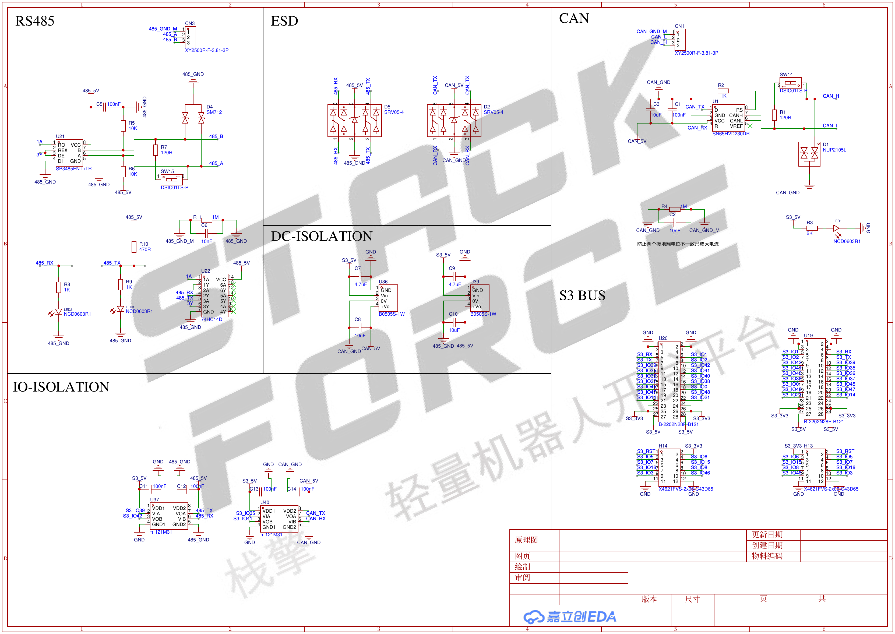
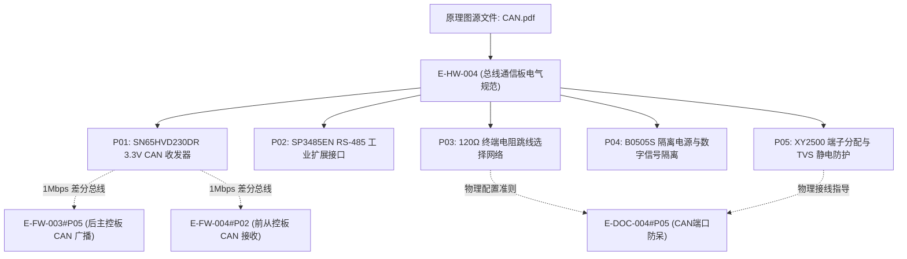

# E-HW-004 板间TWAI-CAN与RS485总线通信板原理图

## 证据元数据
- **证据唯一标识**：`E-HW-004`
- **证据类型**：`DOC/SPEC`（硬件工程电气图纸与接口规范）
- **认识论角色**：图纸与硬件设计规范事实（`[SPECIFIED]`、`[CIRCUIT_DEFINED]`）。记录机器人前后板垛间高速工业差分总线通信板（CAN.pdf 原理图）的电路设计、SN65HVD230 CAN 收发器电路、SP3485 RS-485 收发器电路、120Ω 终端电阻跳线网络、电源/数字信号电气隔离架构以及外部端口防护设计。**严禁**未经物理网络分析仪测量的差分共模抑制比（CMRR）与误码率推断。
- **技术领域**：HARDWARE / INDUSTRIAL_BUS / ISOLATED_COMMUNICATION
- **原始文件物理路径**：`CEG5003/doc/四足机器人-origin/3全套控制板原理图/CAN.pdf`
- **图纸渲染资产**：`docs/assets/images/E-HW-004-板间TWAI-CAN与RS485总线通信板原理图/schematic-1.png`

---

## 原始物料工程审计概述

CAN 通信板原理图定义了前后板垛分布式控制系统的核心通信介质转换层。图纸揭示了以下关键硬件拓扑特征：
1. **3.3V 原生高速 CAN 收发核心**：板载德州仪器 **SN65HVD230DR** 3.3V CAN 收发芯片，输入端直连 ESP32-S3 的 TWAI 控制器逻辑电平（TX=GPIO 35, RX=GPIO 41），省去外部电平转换芯片，最高支持 1.0 Mbps 差分传输。
2. **多协议工业总线集成**：除 TWAI/CAN 总线外，板载还集成了 **SP3485EN** 半双工 RS-485 工业收发器，为外接第三方机械臂、雷达或工业总线传感器提供硬件通道。
3. **反射抑制与阻抗匹配**：分别在 CAN 与 RS-485 差分回路上设计了标准的 **120Ω 终端匹配电阻**，并通过贴片拨码/微动开关（SW14、SW15）实现现场按需使能/旁路。
4. **工业级电气隔离与 ESD 防护**：通过板载 **B0505S** 隔离式 DC-DC 电源模块与专用数字隔离器（`IO-ISOLATION`），切断主控制箱与远端外设之间的接地环路；在输出端子处设计了双向 TVS/ESD 瞬态抑制阵列。

---

## 原理图总览图证

---

## 拆解原子证据清单

### E-HW-004#P01: SN65HVD230DR 3.3V 高速 CAN 收发器电路
- **图纸位号与网络**：`U1: SN65HVD230DR`，`CAN_TX`，`CAN_RX`，`CAN_H`，`CAN_L`
- **电路事实与参数**：
  1. **芯片选型**：德州仪器（TI）`SN65HVD230DR`，SOIC-8 封装。
  2. **电气特性规格**：
     - 单 `3.3V` 稳压电源供电（直接适配 ESP32-S3 原生 I/O 电平标准）；
     - 总线传输速率：最高支持 1.0 Mbps（与固件配置的 `TWAI_TIMING_CONFIG_1MBITS()` 严格对齐）；
     - 高达 $\pm 36\,\text{V}$ 的总线引脚过压故障保护；
     - 具备低电流待机模式（`Rs` 模式选择引脚接地配置为高速传输模式）。
  3. **差分驱动网络**：
     - 输出端分别驱动 `CAN_H`（高电平差分线）与 `CAN_L`（低电平差分线），具备良好的共模抗扰特性。

---

### E-HW-004#P02: SP3485EN 3.3V 半双工 RS-485 工业收发扩展电路
- **图纸位号与网络**：`U19: SP3485EN-L/TR`，`485_TX`，`485_RX`，`485_A`，`485_B`
- **电路事实与参数**：
  1. **芯片选型**：MaxLinear / Exar `SP3485EN-L/TR`，SOIC-8 封装。
  2. **收发规格**：
     - 单 `3.3V` 逻辑供电；
     - 最大数据传输速率：高达 10 Mbps；
     - 驱动器/接收器使能引脚（`DE` / `RE#`）相连，通过单 GPIO 实现半双工收发方向硬件快速切换；
     - 输出端连接 `485_A` 与 `485_B` 差分总线。

---

### E-HW-004#P03: 120Ω 终端匹配电阻与拨码开关选择网络
- **图纸位号与网络**：`SW14 (CAN 终端)`，`SW15 (485 终端)`，`R8 (120R)`，`R11 (120R)`
- **电路事实与参数**：
  1. **终端阻抗匹配准则**：
     - CAN 差分回路中，在 `CAN_H` 与 `CAN_L` 之间跨接 120Ω 精密贴片电阻（`R8: 120R`），与 `SW14` 串联；
     - RS-485 差分回路中，在 `485_A` 与 `485_B` 之间跨接 120Ω 精密贴片电阻（`R11: 120R`），与 `SW15` 串联。
  2. **物理匹配工程规则**：
     - 当通信板位于总线物理拓扑的最远两端（如前后主从双板）时，闭合开关接入 120Ω 终端电阻，吸收电磁驻波反射；
     - 当挂接在总线中间分支节点时，断开开关，防止由于多点并联造成总线等效阻抗过低而拉垮收发器差分摆幅。

---

### E-HW-004#P04: B0505S 隔离电源模块与数字信号隔离网络
- **图纸位号与网络**：`B0505S-1W`，`IO-ISOLATION`，`DC-ISOLATION`
- **电路事实与参数**：
  1. **隔离电源发生器**：
     - 采用定压输入隔离稳压输出模块 `B0505S-1W`（或同规格隔离 DC-DC）；
     - 输入为系统 `USB_5V` / 主板电源，输出产生完全浮空的独立隔离电源 `CAN_5V` 与 `485_5V`；
     - 隔离耐压等级：标称 1000V DC / 1500V DC。
  2. **数字信号隔离阻断**：
     - 配置高速光耦或电容式数字隔离器芯片；
     - 将 MCU 端弱电地（`GND`）与通信物理端隔离地（`CAN_GND`、`485_GND`、`CAN_GND_M`）彻底切断，消除了两套主板之间由于地线电位差引起的共模地电平倒灌与地环路噪声。

---

### E-HW-004#P05: TVS/ESD 工业级瞬态防护与接线端子定义
- **图纸位号与网络**：`CN1 (CAN 端子)`，`CN3 (485 端子)`，`D1, D2, D4, D5 (ESD 保护)`
- **电路事实与端子定义**：
  1. **XY2500 螺钉自锁插头（3.81mm 间距）**：
     - **CN1（CAN 差分端口）**：
       | 端子 Pin | 网络标签 | 功能定义 | 接线规范 |
       |---|---|---|---|
       | Pin 1 | `CAN_H` | CAN 差分信号高电平端 | 对接双绞线橙色/白色 |
       | Pin 2 | `CAN_L` | CAN 差分信号低电平端 | 对接双绞线绿色/蓝色 |
       | Pin 3 | `CAN_GND_M` | CAN 隔离屏蔽地 | 对接外部总线屏蔽层 |
     - **CN3（RS-485 差分端口）**：
       | 端子 Pin | 网络标签 | 功能定义 | 接线规范 |
       |---|---|---|---|
       | Pin 1 | `485_A` | RS-485 差分正信号 | 对接外设 A/D+ |
       | Pin 2 | `485_B` | RS-485 差分负信号 | 对接外设 B/D- |
       | Pin 3 | `485_GND_M` | RS-485 隔离屏蔽地 | 对接外设屏蔽地 |
  2. **TVS 防护网络**：
     - 差分信号线对隔离地并联双向瞬态抑制二极管（ESD/TVS），提供接触放电与浪涌泄放通道，保护收发器不被插拔静电击穿。

---

## 认识论状态判定 (Epistemic Status)

| 证据项编号 | 事实断言内容 | 认识论判定 | 严谨边界与审计说明 |
|---|---|---|---|
| `E-HW-004#P01` | SN65HVD230DR 3.3V CAN 收发器拓扑与 1.0Mbps 速率 | `[SPECIFIED]` | 原理图明确芯片选型，支持原生 3.3V 逻辑对接 ESP32-S3 |
| `E-HW-004#P02` | SP3485EN 半双工 3.3V RS-485 扩展接口拓扑 | `[SPECIFIED]` | 确立 485_A/485_B 差分引脚与收发方向硬件控制 |
| `E-HW-004#P03` | 120Ω 终端匹配电阻与贴片开关选择网络 | `[CIRCUIT_DEFINED]` | 原理图清晰展示 120R 电阻及 SW14/SW15 串联使能关系 |
| `E-HW-004#P04` | B0505S 隔离电源与数字信号隔离地电平切断拓扑 | `[CIRCUIT_DEFINED]` | 确认系统地与总线隔离地物理解耦，抑制接地环路 |
| `E-HW-004#P05` | XY2500 3.81mm 接线端子引脚定义与 TVS 防护阵列 | `[SPECIFIED]` | 明确 CAN_H/CAN_L/GND 与 485_A/485_B/GND 端口接线规范 |

---

## 交叉索引与依赖图

