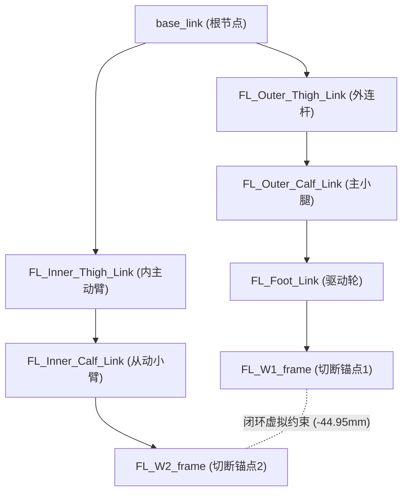

# E-SIM-001 闭链四足轮腿机器人单父树URDF资产

> **认识论角色说明**：本文件属于 `CONFIG`（资产配置与模型定义），忠实归档自 `/home/kytolly/Project/IsaacProject/sf_quad/source/sf_quad/sf_quad/assets/robots/stackforce_quadrupedal_wheeled_robot/urdf/stackforce_quadrupedal_wheeled_robot.urdf`。本文件严格限定于机器人 URDF 资产的机械拓扑、单父树结构、关节自由度划分与几何网格绑定的事实审计；其闭环重构的几何不变量与 PhysX 后处理脚本分别归档于 [`E-SIM-002`](./E-SIM-002-双支链闭环几何装配不变量与参考系配置.md) 与 [`E-SIM-003`](./E-SIM-003-PhysX闭环副自动重构与USD后处理实现.md)。

---

## 1. 资产清单与哈希校验

| 资产相对路径 | 资产类型 | 规模统计 | SHA-256 校验和 |
|---|---|---|---|
| `stackforce_quadrupedal_wheeled_robot.urdf` | URDF 机器人描述文件 | 29 Links, 28 Joints | `eb9f93dabd675f62d6e7336f11efc2d1ebe9c63f57f10092ba7917b27b16a302` |

---

## 2. 拓扑架构与运动学树

---

## 3. 原子工程事实与资产规范（Parts）

### Part 01: 29 Links 与 28 Joints 单父有向无环树拓扑 (`P01`)

1. **单父树严格约束**：
   - 资产包含 1 个基座连杆 `base_link` 与 4 条对称对称轮腿分支；
   - 每条腿包含 7 个连杆（外侧主动臂、主小腿、轮端、内侧主动臂、从动小臂以及 2 个切断点参考系），全机共有 29 个 Link 与 28 个 Joint；
   - 每一个子 Link 拥有且仅拥有一个父 Link，完全符合 Featherstone 铰接体算法（Articulated Body Algorithm, ABA）对无环有向树（Directed Acyclic Graph）的输入要求。

---

### Part 02: Loop-Cut 闭环切断策略与虚参考系定义 (`P02`)

1. **切断选点**：
   - 五连杆机构包含外侧支链（`thigh -> calf -> foot`）与内侧支链（`inner_upper -> Inner_Calf_Link`）；
   - 闭环物理切断点选定在内侧从动小臂末端与轮端连接处（`W2` 锚点）；
2. **定标参考系（Frames）注入**：
   - `FL_W1_frame` 通过固定关节 `FL_W1_joint` 刚性固连于 `FL_Foot_Link`；
   - `FL_W2_frame` 通过固定关节 `FL_W2_joint` 刚性固连于 `FL_Inner_Calf_Link`；
   - 两个参考系提供精确的局部坐标原点与旋转基准，为下游 PhysX 闭环副自动重构提供了不可篡改的数学锚点。

---

### Part 03: 关节类型划分与驱动维度映射 (`P03`)

1. **关节类型统计**：
   - 20 个旋转关节（`revolute`）：包含 4 个 `Outer_Hip_Joint`（外侧髋关节）、4 个 `Inner_Hip_Joint`（内侧髋关节）、4 个 `Outer_Knee_Joint`（膝关节）、4 个 `Inner_Knee_Joint`（内侧弯头关节）以及 4 个 `Wheel_Joint`（驱动轮旋转轴）；
   - 8 个固定关节（`fixed`）：包含 4 个 `W1_joint` 与 4 个 `W2_joint`；
2. **驱动与被动自由度隔离**：
   - 12 个自由度为实际电机可控（4个大腿外侧舵机 + 4个大腿内侧舵机 + 4个BLDC轮电机）；
   - 8 个旋转关节为机构被动从动关节（`Outer_Knee_Joint` 与 `Inner_Knee_Joint`），其力矩输入由物理闭环约束传递。

---

### Part 04: 惯性张量与 STL 网格引用规范 (`P04`)

1. **质量与惯性矩阵**：
   - 每个 Link 显式定义 `<inertial>` 块，包括三维质心偏移 `<origin xyz="..." rpy="..."/>`、质量 `<mass value="..."/>` 与六自由度转动惯量张量 `<inertia ixx="..." ixy="..." ixz="..." iyy="..." iyz="..." izz="..."/>`；
2. **网格资源路径对齐**：
   - `<visual>` 与 `<collision>` 标签通过 `package://` 或相对路径精准挂载原厂轻量化 STL 实体网格；
   - 碰撞体保持凹凸分解或包围盒简化，确保物理引擎接触解算不发生网格穿透。

---

### Part 05: 轮机驱动关节与末端运动学链结构 (`P05`)

1. **外转子轮电机轴线约定**：
   - `Wheel_Joint` 沿驱动轮横向旋转轴定义，无机械角度上下限（`continuous` 语义映射为 $]-\infty, +\infty[$ 旋转）；
2. **足端接触基准**：
   - 轮外径胎面作为机器人与地面的唯一接触几何，五杆腿的伸缩运动直接改变 `Foot_Link` 相对 `base_link` 的空间坐标 $(x, z)$。

---

## 4. 技术关联与交叉索引

- **闭环几何装配不变量**：[`E-SIM-002 双支链闭环几何装配不变量与参考系配置`](./E-SIM-002-双支链闭环几何装配不变量与参考系配置.md)
- **PhysX 闭环自动重建实现**：[`E-SIM-003 PhysX闭环副自动重构与USD后处理实现`](./E-SIM-003-PhysX闭环副自动重构与USD后处理实现.md)
- **静态执行器划分测试**：[`E-VAL-001 仿真资产静态执行器与被动关节空间划分校验报告`](./E-VAL-001-仿真资产静态执行器与被动关节空间划分校验报告.md)
