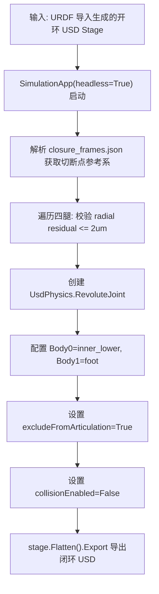

# E-SIM-003 PhysX闭环副自动重构与USD后处理实现

> **认识论角色说明**：本文件属于 `IMPLEMENTATION`（工程脚本与自动化管线实现），忠实归档自 `/home/kytolly/Project/IsaacProject/sf_quad/source/sf_quad/sf_quad/assets/robots/stackforce_quadrupedal_wheeled_robot/scripts/recover_closed_loops.py`。本文件严格限定于通过 Python 自动化操控 USD Stage、构建并注入 PhysX 动力学闭环副的代码逻辑与运行事实；其输入的几何装配不变量契约见 [`E-SIM-002`](./E-SIM-002-双支链闭环几何装配不变量与参考系配置.md)。

---

## 1. 源码清单与哈希校验

| 脚本相对路径 | 源码类型 | 代码行数 | SHA-256 校验和 |
|---|---|---|---|
| `recover_closed_loops.py` | Python 3 后处理脚本 | 138 行 | `950b910f4aaaa8c9b2ebdef1448deef54fe5bbc6946261ba7ac9b1a8a450cd75` |

---

## 2. 闭环副自动重构处理流程

---

## 3. 原子工程事实与脚本语义（Parts）

### Part 01: Isaac Sim 无头环境与 USD Stage 挂载 (`P01`)

1. **环境初始化**：
   - 脚本通过 `SimulationApp({"headless": True, "fast_shutdown": False})` 启动轻量级无头仿真进程；
   - 载入 `pxr.Usd`, `pxr.UsdGeom`, `pxr.UsdPhysics` 等核心 Pixar 通用场景描述（USD）API 模块；
2. **Stage 打开与合法性前置断言**：
   - 调用 `Usd.Stage.Open(str(input_path))`；
   - 检查 `stage.GetDefaultPrim().IsValid()`，确保输入的机器人具有顶层根 Prim。

---

### Part 02: `closure_joints` 独立作用域管理与幂等清理 (`P02`)

1. **作用域（Scope）隔离**：
   - 在 Default Prim 下创建独立子作用域 `config["closure_joint_scope"]`（即 `closure_joints`）；
2. **幂等性清理**：
   - 若当前 Stage 中已存在同名 `closure_joints` 节点，脚本自动调用 `stage.RemovePrim(scope_path)` 予以彻底清除，确保脚本支持反复多次执行而不产生重复冗余约束。

---

### Part 03: `UsdPhysics.RevoluteJoint` 闭环副定义与位姿变换解算 (`P03`)

1. **目标刚体绑定**：
   - 为每条腿创建旋转闭环副 `UsdPhysics.RevoluteJoint.Define(stage, .../{leg}_W2_closure_joint)`；
   - 约束主副体通过 `CreateBody0Rel().SetTargets([inner_lower])` 与 `CreateBody1Rel().SetTargets([foot])` 建立关联；
2. **世界系向局部系坐标投影**：
   - 通过 `local_pose(common_world, body)` 算法：
     $$\mathbf{T}_{\text{local}} = \mathbf{T}_{\text{joint\_world}} \cdot \mathbf{T}_{\text{body\_world}}^{-1}$$
   - 分解出平移向量 `Gf.Vec3f` 与旋转四元数 `Gf.Quatf`，分别写入 `CreateLocalPos0Attr`、`CreateLocalRot0Attr`、`CreateLocalPos1Attr` 与 `CreateLocalRot1Attr`；
3. **径向误差刚性断言**：
   - 脚本强制检查 `radial > 2e-6`（$2\,\mu\text{m}$），一旦发现几何残差超标立即抛出 `RuntimeError` 终止导出，防范坏资产流入仿真管线。

---

### Part 04: `excludeFromArticulation` 与碰撞解耦关键属性 (`P04`)

1. **解耦 Featherstone 关节树**：
   - 显式配置 `joint.CreateExcludeFromArticulationAttr(True)`；
   - **核心物理机理**：PhysX 内部对闭环机构采用“主树使用 Featherstone 算法 + 闭环副使用拉格朗日乘子约束（Lagrange Multiplier Constraint）”的混合求解架构。若不排除出 Articulation，物理引擎将尝试把有环图当作开环树求解，引发奇异矩阵崩溃；
2. **关闭闭环副局部碰撞**：
   - 配置 `joint.CreateCollisionEnabledAttr(False)`，防止关节自身连接的两个刚体网格在旋转重叠时发生接触自激振荡。

---

### Part 05: USD Flatten 扁平化导出与重构完整性验证 (`P05`)

1. **解除资产依赖引用**：
   - 调用 `stage.Flatten().Export(str(output_path))`；
   - 将所有 payload、sublayer 与 composition arc 烘焙为完全独立内聚的单一 USD 文件，确保后续迁移或在集群多节点渲染时不丢失连杆材质与物理属性；
2. **重新载入完整性断言**：
   - 导出后重新执行 `Usd.Stage.Open(str(output_path))`，遍历检查所有 4 条腿的 `inner_lower_link` 与 `w2_frame` 节点均唯一存在。

---

## 4. 技术关联与交叉索引

- **URDF 开环输入源**：[`E-SIM-001 闭链四足轮腿机器人单父树URDF资产`](./E-SIM-001-闭链四足轮腿机器人单父树URDF资产.md)
- **几何配置参数源**：[`E-SIM-002 双支链闭环几何装配不变量与参考系配置`](./E-SIM-002-双支链闭环几何装配不变量与参考系配置.md)
- **强化学习闭环收敛校验报告**：[`E-VAL-002 强化学习闭环约束收敛与悬空重力烟囱测试报告`](./E-VAL-002-强化学习闭环约束收敛与悬空重力烟囱测试报告.md)
