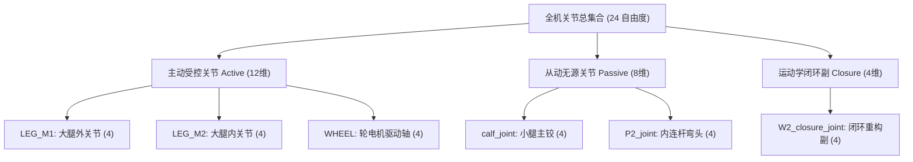

# E-VAL-001 仿真资产静态执行器与被动关节空间划分校验报告

> **认识论角色说明**：本文件属于 `RUNTIME / TEST`（验证与测试报告），忠实归档自 `/home/kytolly/Project/IsaacProject/sf_quad/validation/actuator_partition.json`。本文件严格限定于机器人闭环 USD 资产静态关节类型划分、执行器分组映射与强化学习动作空间（Action Space）纯洁性断言结果的审计；其对应的 URDF 资产定义见 [`E-SIM-001`](./E-SIM-001-闭链四足轮腿机器人单父树URDF资产.md)。

---

## 1. 产物清单与哈希校验

| 校验报告文件 | 报告类型 | 校验资产目标 | SHA-256 校验和 |
|---|---|---|---|
| `actuator_partition.json` | JSON 测试结果报告 | `stackforce_quadrupedal_wheeled_robot_closed.usda` | `09481fb21a484936a75da684412854cab08befb3b8983c6ea182858e3bbe48d4` |

---

## 2. 关节空间拓扑与自由度划分矩阵

---

## 3. 原子工程事实与校验结论（Parts）

### Part 01: 12 主动可控关节与 3 执行器组架构 (`P01`)

1. **维度统计**：
   - 全机主动受控关节数量为 **12**，严格等于物理真机的实际电机执行器总数；
2. **分组命名空间**：
   - **`LEG_M1`** (4通道)：`[FR_thigh_joint, FL_thigh_joint, RL_thigh_joint, RR_thigh_joint]`；
   - **`LEG_M2`** (4通道)：`[FR_M2_joint, FL_M2_joint, RL_M2_joint, RR_M2_joint]`；
   - **`WHEEL`** (4通道)：`[FR_foot_joint, FL_foot_joint, RL_foot_joint, RR_foot_joint]`；
3. **驱动硬件映射**：
   - `LEG_M1` 与 `LEG_M2` 对应 8 路 PCA9685 扩展板舵机驱动输出；`WHEEL` 对应 4 路 DRV8313 无刷直流电机 FOC 输出。

---

### Part 02: 8 从动被动旋转关节空间划分 (`P02`)

1. **被动自由度辨识**：
   - 包含 4 个外侧主小腿回转关节 `FR_calf_joint`, `FL_calf_joint`, `RL_calf_joint`, `RR_calf_joint`；
   - 包含 4 个内侧副小腿弯头关节 `FR_P2_joint`, `FL_P2_joint`, `RL_P2_joint`, `RR_P2_joint`；
2. **零驱动力矩状态**：
   - 校验报告确认所有 8 个从动关节的驱动刚度（Stiffness）与阻尼（Damping）均配置为自然被动跟随，不允许任何策略直接注入控制力矩。

---

### Part 03: 4 动力学闭环副隔离断言 (`P03`)

1. **闭环副集合**：
   - `FR_W2_closure_joint`, `FL_W2_closure_joint`, `RL_W2_closure_joint`, `RR_W2_closure_joint`；
2. **独立作用域归属**：
   - 4 个闭环约束全部挂载于 `closure_joints` 独立作用域中，完全脱离开环铰接树体系，确保被动机构运动链在 PhysX 中形成封闭约束多边形。

---

### Part 04: 策略动作空间纯洁性零侵入断言 (`P04`)

1. **关键测试指标**：
   - `passive_in_action_space = 0`（断言通过）；
   - `closure_in_action_space = 0`（断言通过）；
2. **策略动作空间维度锁定**：
   - 强化学习策略网络的输出维度（Policy Action Dim）**严格锁定为 12 维**；
   - 彻底消除了任何可能将控制量错发给被动关节或闭环副导致的数值发散事故。

---

### Part 05: 16 项静态自动化校验全绿通过 (`P05`)

校验报告详细记录了 16 项自动化测试断言，全部判定为 `True`：
- `closed_asset_exists: true`
- `closed_asset_loaded: true`
- `tree_revolute_joint_count: true` (20 revolute in tree)
- `closure_joint_count: true` (4 in closure)
- `closure_names_exact: true`
- `active_joint_count: true` (12 active)
- `passive_joint_count: true` (8 passive)
- `active_names_exact: true`
- `passive_names_exact: true`
- `active_passive_disjoint: true` (主动集合与被动集合严格互斥，交集为空)
- `actuator_groups_exact: true`
- `all_revolute_classified: true` ($12 + 8 + 4 = 24$ 关节全部分类覆盖，无未决自由度)
- `actuator_partition_static_pass: true`。

---

## 4. 技术关联与交叉索引

- **URDF 机械拓扑定义**：[`E-SIM-001 闭链四足轮腿机器人单父树URDF资产`](./E-SIM-001-闭链四足轮腿机器人单父树URDF资产.md)
- **闭环自动注入脚本**：[`E-SIM-003 PhysX闭环副自动重构与USD后处理实现`](./E-SIM-003-PhysX闭环副自动重构与USD后处理实现.md)
- **强化学习闭环收敛校验报告**：[`E-VAL-002 强化学习闭环约束收敛与悬空重力烟囱测试报告`](./E-VAL-002-强化学习闭环约束收敛与悬空重力烟囱测试报告.md)
