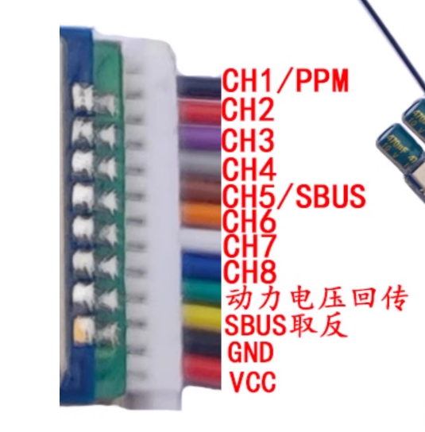
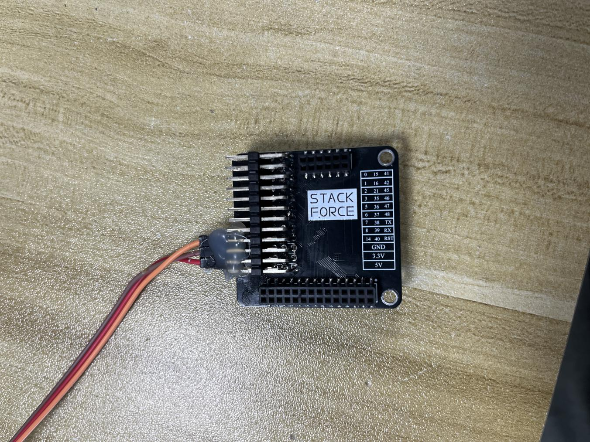
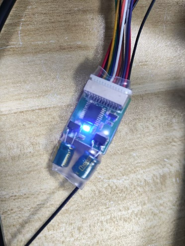

# E-control-遥控器对频与接收机接线说明

> 证据编号：`E-control-遥控器对频与接收机接线说明`  
> 状态：`VALID`（原厂操作与接线物料完备，图文与固件定义完全闭环）  
> 规范：**A PATH IS NOT EVIDENCE.** 本文档提炼出航模 2.4GHz 遥控接收机与 ESP32-S3 主控板的电气连接、PPM 信号通信、对频握手协议及安全开机互锁工程事实，包含原厂文档图文的忠实复刻。

---

## 1. Scope（工程范围）

- **核心工程问题**：
  1. 航模级 2.4GHz 无线遥控接收机的物理引脚线序、信号类型（PPM）及与主控扩展板（GPIO 40、3V3、GND）的电气接口规范是什么？
  2. 接收机与遥控器发射端的配对绑定（Binding）协议触发条件、时序窗口及指示灯状态机是什么？
  3. 系统开机与无线建链时的安全互锁机制（操作杆与拨杆初始位姿）是什么？
- **应用范围**：StackForce 四轮足机器人原厂无线遥控子系统、PPM 复合脉冲信号接收接口、ESP32-S3 主控板 GPIO 40 外部中断采集。
- **非目标**：不涵盖 WiFi/蓝牙上位机网络遥控协议、不涵盖自主导航控制流接管。

---

## 2. Source Summary（技术源清单）

| Source ID | 类型 | 规范便携路径 | 版本 / 日期 | 角色与描述 |
|---|---|---|---|---|
| `SRC-PRC-004` | `PROCEDURE` | `doc/四足机器人-origin/0整机操作说明/遥控器对频说明.docx` | 2024-07-05 | 原厂遥控器操作与对频接线指南（含 5 幅实物照片与图示） |
| `SRC-FW-001` | `SOURCE_CPP` | `doc/四足机器人-origin/2程序/SF_serveo_control/src/main.cpp` | 2024-07-05 | ESP32-S3 接收机 PPM 中断解码驱动与各通道业务逻辑 |

---

## 3. Evidence Parts（可独立引用的工程事实）

<a id="p01-receiver-wiring-pinout"></a>
### P01 — 接收机物理线序与主控板扩展接口连接

#### Raw Source Faithful Reproduction（原始证据忠实复刻）
> 原始物料来源：《遥控器对频说明.docx》第一节“接收机接线”图文摘录与原版固件配置
> 
> ```text
> [原厂文档文字字面摘录]
> 接收机接线
> 下图是接收机的输出线序，只需要使用到CH1/PPM、GND、VCC。
> 看下图最边是黑色是信号线，最边是红色是电源
> 将接收机的CH1/PPM、GND、VCC依次接到扩展板上的40引脚、GND、3V3（中间一排）。如下图所示。
> ```
> 
> 
> 
> 
> 
> ```cpp
> // [SF_serveo_control/src/main.cpp L69, L482-L483 原版代码逐行摘录]
> #define PPM_PIN 40                                                                           // Pin connected to the PPM signal
> #define NUM_CHANNELS 8                                                                          // The number of PPM channels you expect
> ...
> pinMode(PPM_PIN, INPUT);
> attachInterrupt(digitalPinToInterrupt(PPM_PIN), onPPMInterrupt, RISING);
> ```

#### Engineering Statement
> [SPECIFIED] 接收机通过单线 PPM 复合脉冲信号输出至 ESP32-S3 主控板的 **GPIO 40**（扩展排针编号 40），供电采用主板 **3.3V（3V3 与 GND）** 电源域；线束极性明确：外侧黑色为 PPM 信号线、内侧红色为 VCC 供电线、外侧中间排针连接地线。

#### Source Observation
- 接收机插头仅接出 3 根线：`CH1/PPM`、`GND`、`VCC`；
- 扩展板上中间一排排针提供 `3V3` 与 `GND`，信号端插入引脚标号 `40`；
- 固件源码中配置宏 `#define PPM_PIN 40`，并在 `setup()` 中将 GPIO 40 配置为上升沿中断触发（`RISING`）。

#### Engineering Interpretation
- 接收机采用脉冲位置调制（PPM）单线多路复用协议，一条信号线串行传输 8 个控制通道，省去了 8 组独立的 PWM 排线，大幅减轻线束混乱与故障率；
- 接收机工作电平由主控板 LDO 供给 3.3V，严格杜绝了接入 5V 或电池母线（高压会导致 ESP32-S3 GPIO 40 内部 ESD 保护二极管击穿）。

#### Limitations
- 原厂文档未注明接收机内部信号线抗干扰屏蔽与阻抗匹配规格；在电机大电流驱动与 PWM 逆变器强 EMI 环境下，高阻抗弱信号存在脉冲抖动风险。

#### Source Trace
- 文档：《遥控器对频说明.docx》第 1 节
- 资产：`image1_receiver_pinout.png`、`image2_expansion_board_wiring.jpeg`
- 源码：`doc/四足机器人-origin/2程序/SF_serveo_control/src/main.cpp:69,482-483`

---

<a id="p02-binding-protocol-state-machine"></a>
### P02 — 遥控器与接收机对频协议时序与状态机指示

#### Raw Source Faithful Reproduction（原始证据忠实复刻）
> 原始物料来源：《遥控器对频说明.docx》第二节“接收机与遥控器对频”
> 
> ```text
> [原厂文档文字字面摘录]
> 接收机与遥控器对频
> 在对频前，先把遥控器关闭，然后接收机在10秒内通断电三次，进入对频状态接收机一秒亮一秒灭
> 然后遥控器使能拨杆往下打使能发送信号，
> 遥控器左遥杆往下拉到最低，
> 给遥控器上电即对频成功，
> 对频成功后接收机灯灭，遥控器蓝灯常亮。
> ```
> 
> 
> 
> 

#### Engineering Statement
> [PROCEDURE_DEFINED] 2.4GHz 接收机进入配对绑定（Binding）模式的硬件判定时序为：**在 10 秒窗口内连续通断电 3 次**；进入对频态后接收机 LED 以 **1 Hz（1 秒亮 1 秒灭）** 频率闪烁。配对成功后硬件握手信号闭环，**接收机 LED 熄灭，遥控器面板蓝色指示灯常亮**。

#### Source Observation
- 触发对频状态无需外置物理按键，完全依赖电源脉冲序列（10s 内通断电 3 次）；
- 指示灯状态机明确：
  - 未配对/等待配对：接收机 LED 1 Hz 闪烁；
  - 配对成功建立链路：接收机 LED 熄灭，遥控器蓝灯常亮。

#### Engineering Interpretation
- 10 秒 3 次通断电属于典型的 2.4 GHz 跳频扩频（FHSS）免按键绑定协议；
- 避免了在紧凑机身内部因寻找和按压微型按键导致的安全隐患与外壳密封破坏；
- 双向 LED 状态指示提供了可靠的目视可观测性，便于现场排查通信失锁故障。

#### Limitations
- 频繁通断电对系统供电电容有充放电冲击，操作时需保证主电源插头接触干脆，避免轻微打火。

#### Source Trace
- 文档：《遥控器对频说明.docx》第 2 节
- 资产：`image3_binding_led_before.jpeg`、`image4_binding_led_after.jpeg`

---

<a id="p03-safe-arming-interlock"></a>
### P03 — 安全上电联锁与机械零位初始约束

#### Raw Source Faithful Reproduction（原始证据忠实复刻）
> 原始物料来源：《遥控器对频说明.docx》结尾安全指示与固件通道映射
> 
> ```text
> [原厂文档文字字面摘录]
> 左下摇杆打到最下
> 使能拨杆打到最下
> ```
> 
> 
> 
> ```cpp
> // [SF_serveo_control/src/main.cpp 通道3/7映射与安全阈值摘录]
> filteredPPMValues3 = map(filteredPPMValues33,1090,1890,1000,1950); //机器人腿高控制，左下摇杆上下滑动
> filteredPPMValues7 = map(filteredPPMValues77,1090,1890,1000,1950); //机器人模式切换，对应遥控器左上拨杆
> remote_H = mapJoystickValuerollzeparam(filteredPPMValues3);//遥控器腿高
> ```

#### Engineering Statement
> [CONFIGURED] 遥控器开机与信号发送建立时强制实施双重机械安全约束：**使能拨杆置于最下方（使能信号发射）**，**左下摇杆拉至最底部（最低腿高/初始零位）**。

#### Source Observation
- 文档在尾部多次重复强调“左下摇杆打到最下”、“使能拨杆打到最下”，并附有带红色箭头的遥控器实物面板示意图；
- 固件中左下摇杆纵向输入映射至 `PPM 通道 3`（`filteredPPMValues3`），直接控制整机腿部高度（`remote_H`）。

#### Engineering Interpretation
- **防飞车与防突跳安全互锁**：如果遥控器在上电建链时左下摇杆处于高位，ESP32-S3 一旦建立 PPM 中断解码将瞬间计算出大位移目标，驱动 8 个舵机与无刷电机瞬时暴冲，极易造成腿部连杆断裂或机器人翻滚打手；
- 规定上电前摇杆置于最下，确保了控制系统从物理最低重心的安全几何位平稳启动。

#### Limitations
- 该互锁属于**操作规程约束（Procedural Constraint）**，发射机端本身缺乏物理防呆锁舌或上电蜂鸣警报；若操作人员疏忽在摇杆高位上电，仍存在瞬间下发高目标值的风险。

#### Source Trace
- 文档：《遥控器对频说明.docx》结语图文
- 资产：`image5_transmitter_stick_positions.jpeg`
- 源码：`doc/四足机器人-origin/2程序/SF_serveo_control/src/main.cpp:693,700`
