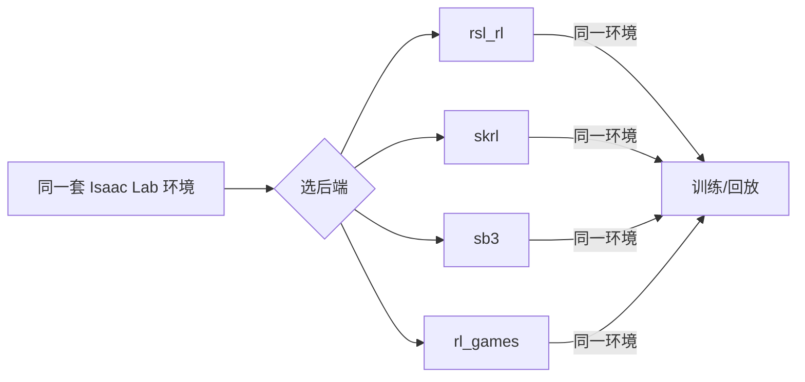

# RL后端对比与选型

> 本页属于：advance 进阶方向
> 前置知识：[[训练调参与调试]]
> 预计阅读时间：20 分钟

## 🎯 为什么需要这个？

同样一个任务，换一个 **RL 后端（训练库）**，体验可能很不一样：有的默认配置就好用（rsl_rl），有的支持更多算法（skrl/sb3），有的能多智能体（rl_games/torchrl）。本页给一张**后端对比表 + 切换方法 + 常见坑**，让你"知道该用哪个、怎么换、换完注意什么"。

## 💡 一个类比

RL 后端 = **不同的教练风格**：有的稳重（rsl_rl，默认配置好）、有的多才多艺（skrl，算法多）、有的上手快（sb3，API 简单）、有的适合多智能体（rl_games/torchrl）。教练可以换，但训练环境（Isaac Lab 环境）保持一致。

## 🐍 支持的后端（官方文档口径）

| 后端 | 主要算法 | 特点 | 适合 |
|------|---------|------|------|
| **rsl_rl** | PPO | Isaac Lab 官方默认示例，配置稳、文档多 | 绝大多数单智能体连续控制任务 |
| **skrl** | PPO, SAC, A2C 等 | 算法更多、可读性好 | 想换算法/对比实验 |
| **sb3 (stable-baselines3)** | PPO, SAC, A2C | 生态熟、API 简洁 | 想用统一经典接口/上手快 |
| **rl_games** | PPO 等 | 高效、支持多智能体 | 大规模/多智能体 |
| **torchrl** | PPO 等 | PyTorch 官方 RL 库，灵活 | 想深度定制、研究性 |
| **cleanrl** | PPO / DQN 等 | 单文件清晰实现，适合学原理 | 教学/看懂算法 |
| **vla / 多智能体支持** | — | 近年新增的 VLA/多智能体能力 | 前沿/特定任务 |

> 上面是官方 RL 库对比页列出的"支持库"；具体以你所用 Isaac Lab 版本为准。

## 🖼️ 图解：后端切换

图 1 在 Isaac Lab 里切换训练库（来源：结合官方 RL frameworks 文档整理，本地预览渲染；GitHub Wiki 上以代码块显示；访问于 2026-09-01）



## 📝 切换方法（3.0 新 CLI 示例）

```bash
# 用 --rl_library 指定后端（Isaac Lab 3.0 新入口）
./isaaclab.sh train --rl_library rsl_rl --task Isaac-Humanoid --max_iterations 500
./isaaclab.sh train --rl_library skrl    --task Isaac-Humanoid --max_iterations 500
./isaaclab.sh train --rl_library sb3     --task Isaac-Humanoid --max_iterations 500
./isaaclab.sh train --rl_library rl_games --task Isaac-Humanoid --max_iterations 500

# uv 方式（3.0 常见）
uv run --extra skrl isaaclab train --rl_library skrl --task Isaac-Humanoid --max_iterations 500
```

> 2.x 传统写法是 `python scripts/reinforcement_learning/<backend>/train.py`；切后端本质是换脚本目录 + 对应的算法配置。**注意**：换后端时你的环境（观测/奖励/动作空间）不变，变的只是"怎么训练"。

## 🗒️ 常见问题 FAQ

**Q1：新手默认选哪个？**
rsl_rl。它是官方示例默认、配置成熟、教程多，能跑通大多数任务；后面想对比算法再换 skrl/sb3。

**Q2：换后端后结果变差？**
后端默认超参不同（lr、rollout、batch、GAE 等）。换后端要重新对一组合理超参，不要直接沿用另一个后端的配置；先用默认，再按 [[训练调参与调试]] 微调。

**Q3：想同时支持多智能体/多机器人？**
优先看 rl_games/torchrl 是否支持多智能体（以版本文档为准）；Isaac Lab 的单环境向量化本身支持多个体，训练后端的"多智能体算法"需对应选型。

**Q4：sb3 能跑视觉/复杂任务吗？**
可以，但 sb3 更偏经典接口，复杂视觉/大规模可能要自己调；需要更强控制时用 rsl_rl/skrl/torchrl。

**Q5：cleanrl 能直接用于 Isaac Lab 训练吗？**
cleanrl 主打可读单文件实现，常用于学原理；实际接入 Isaac Lab 需要桥接 Gymnasium 接口，适合教学/定制，不一定是默认后端。

## ✏️ 小练习

**1.** 想快速跑通第一版、文档/示例最多，选哪个后端？

<details>
<summary>查看答案</summary>

rsl_rl。官方默认示例，配置稳、教程多。
</details>

**2.** 换后端后训练变差，第一反应该做什么？

<details>
<summary>查看答案</summary>

不要沿用旧后端的超参；用该后端默认配置起步，再根据 TensorBoard 曲线按 [[训练调参与调试]] 微调 lr/minibatch/rollout 等。
</details>

**3.** 判别"要不要换后端"的合理标准是什么？

<details>
<summary>查看答案</summary>

看需求：是否要特定算法（SAC 等）、是否要多智能体、是否要可读/教学、是否要大厂级效率；而"换后端"通常不解决"任务/奖励/观测"本身的问题。
</details>

## 本章小结

- 后端 = 训练算法库，和"任务环境"解耦：环境一样，换后端只改"怎么训练"。
- 默认 rsl_rl；按算法/多智能体/可读性需求换 skrl/sb3/rl_games/torchrl/cleanrl。
- 换后端要对一组合理超参，别直接搬旧配置；用 TensorBoard 对比。

## 下一步

- 上一页：[[模仿学习与数据采集]]
- 下一页：[[容器化与Docker复现]]（可复现环境）
- 返回：[[Home]]

## 更新日志

- 2026-09-01：新增本页（进阶方向）。来源：Isaac Lab RL 库对比（<https://isaac-sim.github.io/IsaacLab/develop/source/overview/reinforcement-learning/rl_frameworks.html>）、RL 框架源码文档（<https://github.com/isaac-sim/IsaacLab/blob/main/docs/source/overview/reinforcement-learning/rl_frameworks.rst>）（访问于 2026-09-01）。
