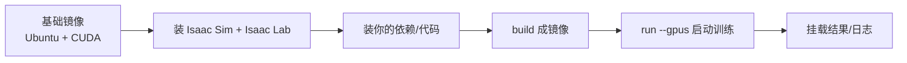

# 容器化与Docker复现

> 本页属于：advance 进阶方向
> 前置知识：[[安装与环境配置]]、[[版本与API速查]]
> 预计阅读时间：20 分钟

## 🎯 为什么需要这个？

"在我机器上能跑"不等于"在别人/服务器/云端也能跑"。**Isaac Lab 依赖 Isaac Sim、CUDA、PyTorch、扩展，环境极易不一致**。用 **Docker 容器**把整套环境打包，能解决三个问题：**可复现、团队协作、云端/边缘部署**。本页讲怎么用官方容器/自建 Dockerfile 复现训练，以及 GPU 透传等关键点。

## 💡 一个类比

容器 = **一个"自包含的移动实验室"**：里面装好 Ubuntu + CUDA + Isaac Sim + Isaac Lab + 你的代码，拿到哪台有 GPU 的机器都能原样开箱。

## 🐍 最小必要知识

| 概念 | 是什么 | 类比 |
|------|--------|------|
| **Docker 镜像 (Image)** | 封装环境+依赖+代码的只读包 | 实验室的"装箱清单+材料" |
| **容器 (Container)** | 镜像的运行实例（可读写） | 打开实验室干活 |
| **Dockerfile** | 从零构建镜像的剧本 | 装箱步骤说明书 |
| **NGC 容器 / 官方镜像** | NVIDIA 提供的预装 Isaac 容器 | 官方预制实验室 |
| **GPU 透传** | `--gpus` 让容器用宿主机 NVIDIA GPU | 把显卡借给实验室用 |
| **volume 挂载** | 把宿主目录挂进容器（如代码/日志/资产） | 从外面搬资料进去 |
| **Compose** | 多容器编排（可选） | 多个实验室一起管 |

## 🖼️ 图解：容器化流程

图 1 Docker 复现训练环境（来源：自绘 Mermaid，本地预览渲染；GitHub Wiki 上以代码块显示；访问于 2026-09-01）



## 📝 使用官方/自建容器（思路）

**方式一：用官方 Isaac Lab 容器 / NGC 镜像**
NVIDIA 提供预装好 Isaac / Isaac Lab 的容器。拉下来后基本开箱即用，重点是把你的代码/资产挂载进去（volume），并用 `--gpus` 透传 GPU。

**方式二：自建 Dockerfile（最小思路）**

```dockerfile
# 以一个带 CUDA 的 Ubuntu 为基础（具体可用 NVIDIA 官方基础镜像）
FROM nvidia/cuda:12.8.0-runtime-ubuntu22.04

# 1. 装系统依赖与 Python
RUN apt-get update && apt-get install -y python3.11 python3-pip git     && rm -rf /var/lib/apt/lists/*

# 2. 装 PyTorch（cu128）与 Isaac Sim / Isaac Lab（按官方 Quickstart）
RUN pip install --upgrade pip \
    && pip install torch==2.7.0 torchvision==0.22.0 --index-url https://download.pytorch.org/whl/cu128

# 3. 克隆并安装 Isaac Lab（源码方式）
RUN git clone https://github.com/isaac-sim/IsaacLab.git /root/IsaacLab

# 4. 设置工作目录与默认入口
WORKDIR /root/IsaacLab
CMD ["bash"]
```

**运行（GPU 透传 + 挂载）**

```bash
# --gpus all：让容器用宿主机 N 卡；-v 把代码/日志/资产挂进来
docker run --gpus all --rm -it \
  -v "$PWD":/workspace \
  my-isaaclab-image /bin/bash
# 容器内再跑训练
cd /workspace && ./isaaclab.sh train --rl_library rsl_rl --task Isaac-Cartpole-v0 --max_iterations 500
```

> 关键点：**GPU 必须透传**（NVIDIA 容器工具包），否则容器里看不到 GPU；**资产/代码用 volume 挂载**，避免每次重打包镜像。

## 🗒️ 常见问题 FAQ

**Q1：为什么要容器化，虚拟环境不够吗？**
venv/conda 只隔离 Python 包，不隔离 CUDA/驱动/系统库。Isaac 依赖的底层栈多，容器能把"系统+CUDA+Python+库"整体打包，换机器更稳。

**Q2：容器里跑不了 GPU？**
确认宿主机装了 NVIDIA 驱动 + **NVIDIA Container Toolkit**，并加 `--gpus all`（或 `--runtime=nvidia`）。用 `nvidia-smi` 在容器内验证。

**Q3：镜像很大/构建慢？**
Isaac 系镜像通常几 GB~十几 GB，属正常。尽量用官方预装镜像再加少量层；把大资产放 volume 而不是塞进镜像；必要时用镜像分层的 `cache`。

**Q4：想给团队用/复用？**
把 Dockerfile 与依赖锁（requirements/pyproject）进 git；构建好镜像推注册表（如 Docker Hub / 私有仓库）。团队拉镜像即可复现。

**Q5：容器和 [[真机部署]] 什么关系？**
容器常用于"训练/复现/预处理"；真机部署更多把导出的策略（ONNX/TensorRT）跑在边缘/控制器上，可以用轻量容器/运行时承载推理，两者不同层次。

## ✏️ 小练习

**1.** 容器里看不到 GPU，最常见原因是什么？

<details>
<summary>查看答案</summary>

没用 `--gpus`（或宿主机缺 NVIDIA Container Toolkit）；装好驱动+工具包后加 `--gpus all`，并用 `nvidia-smi` 验证。
</details>

**2.** 不想每次改代码都重新 build 镜像，该怎么做？

<details>
<summary>查看答案</summary>

把代码/资产用 `-v` 挂载进容器（volume），而不是 COPY 进镜像；镜像只含"稳定"的环境与依赖。
</details>

**3.** 为什么 conda/venv 不足以完全"复现 Isaac 环境"？

<details>
<summary>查看答案</summary>

venv/conda 只管 Python 包，不封装 CUDA/驱动/系统库与扩展依赖；Isaac 底层栈复杂，需容器整体封装才能跨机器稳定复现。
</details>

## 本章小结

- 容器解决"可复现 + 协作 + 云端/边缘部署"；用官方 NGC/Isaac 镜像或自建 Dockerfile。
- 运行关键：`--gpus` 透传 GPU、`-v` 挂载代码/资产/日志。
- 把 Dockerfile 与依赖锁入 git，镜像推到注册表即可给团队复用。

## 下一步

- 上一页：[[RL后端对比与选型]]
- 下一页：返回 [[Home]]（advance 级尝鲜方向完成；后续可继续深入部署/前沿任务）
- 返回：[[Home]]

## 更新日志

- 2026-09-01：新增本页（进阶方向）。来源：Isaac Lab 容器部署文档（<https://isaac-sim.github.io/IsaacLab/develop/source/deployment/index.html>、<https://isaac-sim.github.io/IsaacLab/release/3.0.0-beta2/source/deployment/index.html>）（访问于 2026-09-01）。
