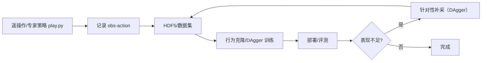

# 模仿学习与数据采集

> 本页属于：advance 进阶方向
> 前置知识：[[真机部署]]、[[端到端实战案例]]
> 预计阅读时间：25 分钟

## 🎯 为什么需要这个？

纯强化学习靠"奖励试错"，但有些任务**奖励很难定义**（比如"动作自然、像人一样握杯"），或**探索空间太大**（灵巧手、人形）。**模仿学习（Imitation Learning）** 改从"专家演示"学：先采集人类/已有策略的操作数据，再用**行为克隆（BC）**或 **DAgger** 训练，绕开手工奖励。本页讲"数据从哪来 → 怎么记录 → 怎么训练"。

## 💡 一个类比

- **RL** = 自己摸索拿奖（无人带）。
- **模仿学习** = 老师示范，你照着学（BC 是"看录像学"，DAgger 是"边做边让老师纠正"）。
- **数据采集** = 把老师的示范录下来：用遥操作/键盘/VR、或让一个好策略在仿真里 play 并记录。

## 🐍 最小必要知识

| 概念 | 是什么 | 类比 |
|------|--------|------|
| **行为克隆 (BC)** | 直接用演示数据做监督学习：输入观测 → 输出动作 | 抄老师作业 |
| **DAgger** | 在策略当前困惑处让专家补演示，反复迭代 | 边做边让老师纠错 |
| **遥操作 (teleop)** | 人远程控制机器人录演示 | 老师手把手示范 |
| **数据回放 (play/record)** | 在 Isaac Lab 里让策略/脚本跑并记录观测-动作 | 录像回放 |
| **HDF5 / 数据集** | 存储观测-动作序列的格式 | 装录像带 |
| **robomimic / 开源数据集** | 常用模仿学习数据工具与基准 | 现成教案 |

## 🖼️ 图解：模仿学习数据流

图 1 采集演示 → 存数据 → 训练策略 → 迭代（来源：自绘 Mermaid，本地预览渲染；GitHub Wiki 上以代码块显示；访问于 2026-09-01）



## 📝 数据采集思路（Isaac Lab / 仿真）

1. **用现有策略或脚本回放记录**：在有环境的项目里，让策略在仿真里 `play`，同时把每一步的观察与动作写入数据集（常见用 `data_collector`/HDF5）。
2. **遥操作采集**：用控制器（键盘/手柄/VR/外骨骼）驱动机器人录演示，适合无人能写好策略、但人能示范的任务。
3. **真实机器人采集**：真机遥操作 + 采集传感器/关节数据；注意频率、单位、传感器标定要和策略一致（见 [[真机部署]]）。
4. **数据结构**：每条样本通常是 `(obs, action)` 或轨迹序列；BC 把 `obs→action` 当监督学习，DAgger 则在"策略当前失败处"再补演示。

## 📝 训练一个小演示

```text
# 伪代码（以常见模仿学习库/脚本示意）
1) 加载数据集 (obs, action)
2) 定义策略网络（输入 obs 维度 → 输出 action 维度）
3) 监督训练：loss = MSE(策略(obs), action)
4) 评测：在环境里跑策略，看是否能复现演示
5) 若在某状态失败 → 在该状态附近请专家再演示 → 加入数据集 → 再训练
```

> 现实中有 `robomimic`、`rlpd`、`diffusion policy` 等库/算法；本页讲概念，具体 API 以你所用工具与版本文档为准。

## 🗒️ 常见问题 FAQ

**Q1：BC 和 DAgger 什么区别？**
BC 一次性用固定演示做监督学习，简单但"分布偏移"（策略跑出演示覆盖范围就崩）；DAgger 在策略当前状态让专家补演示，逐步覆盖探索到的区域，更鲁棒但要反复采集。

**Q2：数据量要多少？**
视任务复杂度与多样性。先从小数据集起步看能不能复现；不够再加。多样性（不同初始条件/光照/负载）比纯数量更重要，配合域随机化（[[Domain随机化与Sim2Real]]）。

**Q3：仿真里采集的演示能直接上真机吗？**
最好采集时就贴近真机的观测/标定；仿真采集适合做大量合成演示，真机采集更能反映真实分布。可"仿真预训练 + 真机微调/补采"。

**Q4：模仿学习有哪几个代表性算法？**
BC（最简）、DAgger、以及较新的 Diffusion Policy、Action Chunking 等（把动作序列建模）；具体选型看任务（连续动作/多模态/平滑性）。

## ✏️ 小练习

**1.** 任务奖励难写、但人能手把手示范，最适合用哪种学习方法？

<details>
<summary>查看答案</summary>

模仿学习（BC/DAgger）：采集演示，用监督学习学 `obs→action`，绕开奖励设计。
</details>

**2.** BC 训练后在某状态老是崩，为什么、怎么办？

<details>
<summary>查看答案</summary>

分布偏移：策略进入了演示覆盖不到的状态。用 DAgger 在该状态附近补采专家演示，逐步覆盖探索区域。
</details>

**3.** `play.py` 的"回放"和"数据采集"有什么联系？

<details>
<summary>查看答案</summary>

回放是"让策略/脚本在环境里跑并看结果"；数据采集是在回放/遥操作过程中把每一步 `(obs, action)` 记录下来，存成数据集用于模仿学习或后续分析。
</details>

## 本章小结

- 模仿学习从演示学，适合奖励难写/探索空间大的任务；BC（监督学习）简单，DAgger 靠"在困惑处补演示"更稳。
- 数据采集三条路：回放记录、遥操作、真机采集；数据结构为 `(obs, action)` 序列。
- 实际可用 robomimic、Diffusion Policy 等工具；重点是演示覆盖度与多样性。

## 下一步

- 上一页：[[进阶方向概览]]
- 下一页：[[RL后端对比与选型]]（换/选训练后端）
- 返回：[[Home]]

## 更新日志

- 2026-09-01：新增本页（进阶方向）。来源：Isaac Lab 模仿学习/人形数据生成示例（<https://isaac-sim.github.io/IsaacLab/develop/source/overview/imitation-learning/humanoids_imitation.html>、<https://isaac-sim.github.io/IsaacLab/develop/source/overview/imitation-learning/index.html>）（访问于 2026-09-01）。
