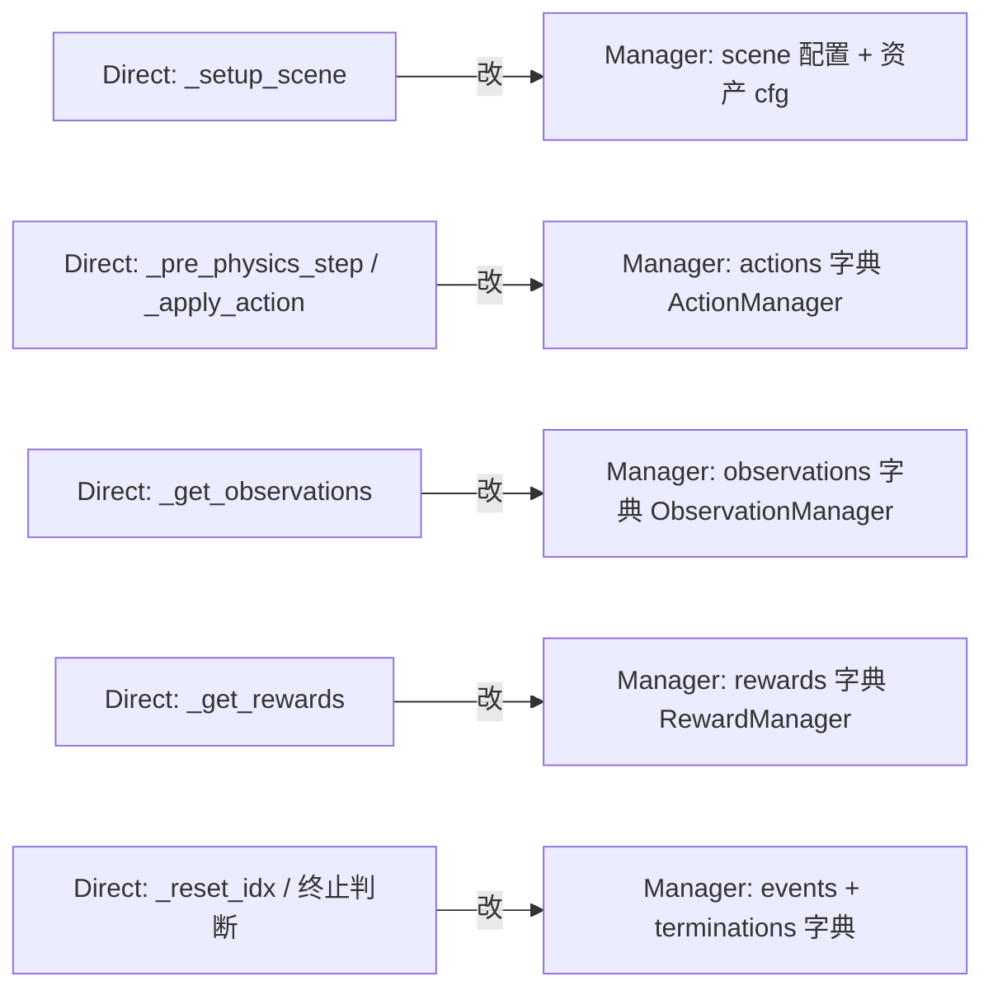

# Direct与Manager-Based对比迁移

> 本页属于：build 自建环境进阶
> 前置知识：[[Manager-Based工作流入门]]
> 预计阅读时间：20 分钟

## 🎯 为什么需要这个？

你已经见过 **Direct**（手写 5 个方法）和 **Manager**（管理器拼装）两种工作流。到底什么时候用哪个？想把一个 Direct 任务改成 Manager（或反过来）要动哪些地方？本页给一张**决策表 + 迁移步骤**，让你不再纠结。

## 💡 一个类比

- **Direct** = 手写剧本（编剧+导演+场记一人包办）。适合快速试、小众任务。
- **Manager** = 剧组分工（剧本、导演、摄影、道具、评委各司其职）。适合正式产出、频繁改动。
- 从 Direct → Manager 就像"**把一个人的活拆成部门**"：把每个环节抽出来，填进对应的管理器。

## 🐍 最小必要知识（一张表看懂）

| 维度 | Direct | Manager-Based |
|------|--------|---------------|
| **环境类** | `DirectRLEnv`，重写 `_setup_scene/_pre_physics_step/_get_observations/_get_rewards/_reset_idx` | `ManagerBasedRLEnv`，基本不用重写方法，逻辑都在 `Cfg` |
| **动作/观测/奖励** | 在方法与 `cfg` 里手写张量 | `ActionManager/ObservationManager/RewardManager` 字典配置 |
| **可复用性** | 低（逻辑耦合在类里） | 高（可替换单个 term） |
| **改造成本** | 低（直改一个文件） | 低但需懂 `*TermCfg` 声明 |
| **调试** | 需手动看每步张量 | 各 term 可在 TensorBoard 分开看 |
| **官方任务** | 少量 demo（如 Direct Cartpole） | 大多数官方任务（四足/机械臂等） |
| **适合** | 快速原型、自定义小众、教学 | 通用开发、复杂任务、复用与消融 |

## 🖼️ 图解：迁移映射

图 1 Direct → Manager 的方法/定义映射（来源：自绘 Mermaid，本地预览渲染；GitHub Wiki 上以代码块显示；访问于 2026-09-01）

## 📝 迁移步骤（Direct → Manager）

1. **把场景搭建拆成 scene cfg**：`_setup_scene` 里的 `Ground`/机器人/传感器，移到 `Cfg` 的 `scene` 与对应 `*Cfg`（如 `ArticulationCfg`、`RayCasterCfg`）。
2. **把动作拆成 ActionManager**：`_pre_physics_step` 里的 `set_joint_position_target` 改成 `actions = {"joint_pos": JointPositionActionCfg(asset_name="robot")}`。
3. **把观测拆成 ObservationManager**：`_get_observations` 的每个量，变成一个 `ObservationTermCfg`（`joint_pos`、`base_lin_vel`、`ray_distance`...）。
4. **把奖励拆成 RewardManager**：`_get_rewards` 的每个 `rew_scale_*` 项，变成一个 `RewardTermCfg`（`func=...`，`params=...`）。
5. **把 reset/随机化/终止拆成 events + terminations**：`_reset_idx` 对应的 `reset` 相关函数放 `EventTermCfg(mode="reset")`；终止逻辑放 `TerminationTermCfg`。
6. **继承 `ManagerBasedRLEnv`**，删掉重写的方法，环境类基本只剩继承与必要字段。

> 反向（Manager → Direct）就是把每个 term 的 `func` 手动拼回对应方法，通常只在"想彻底手控/加速调试"时做。

## 🗒️ 常见问题 FAQ

**Q1：新手该先学哪个？**
先 Direct（[[Direct环境类深入]]）跑通、建立"环境=循环"直觉，再切 Manager（[[Manager-Based工作流入门]]）做正式项目。官方多数任务用 Manager，学会看 Cfg 很重要。

**Q2：迁移后训练结果会不一样吗？**
如果奖励/观测/动作定义完全一致，理论等价。但 Manager 的 `term` 可能有细微默认值（如某些函数带内部状态），迁移后建议先小步 benchmark 对比。

**Q3：哪些情况适合保留 Direct？**
快速验证想法、动作/奖励逻辑非常定制、想在单个文件里看清全部逻辑、做教学 demo。大规模/多人协作/频繁换机器人传感器，用 Manager。

**Q4：Direct 里 `state_space` 在 Manager 里放哪？**
Manager 分 `observations["policy"]` 与 `observations["critic"]`（特权组）。`critic` 组对应 Direct 的 `state_space` 那种"上帝观测"。

**Q5：能两个工作流放同一个项目吗？**
可以，不同任务分别用 `ManagerBasedRLEnv` 或 `DirectRLEnv` 子类即可，`gym.register` 各自注册。

## ✏️ 小练习

**1.** 一个任务"奖励逻辑会频繁改、还要做消融实验"，更该用哪种工作流？

查看答案

Manager-Based。奖励拆成独立 `RewardTermCfg`，逐个/组合开关方便，TensorBoard 也能分开看。

**2.** Direct 的 `_reset_idx` 对应 Manager 的什么？

查看答案

对应 `EventManager` 里 `mode="reset"` 的事件（如 `reset_joints`/随机化），在每次重置时执行。

**3.** 迁移时发现观测定义没变但结果略有差异，最可能的来源？

查看答案

某个 term 函数的默认参数/内部状态不同，或观测拼接顺序/归一化不一致。应先对齐观测张量与 reward 公式，再做小规模 A/B。

## 本章小结

- Direct：手写循环、耦合、适合原型/教学；Manager：管理器拼装、模块化、适合正式/复杂项目。
- 迁移本质是"把 5 个方法里的逻辑，拆到对应的 `*Cfg` 字典"。
- 决定工作流看：要不要复用、要不要频繁改奖励/传感器、要不要多人协作。

## 下一步

- 上一页：[[Manager-Based工作流入门]]
- 下一页：[[自定义机器人资产导入]]（把自己的 USD/URDF 机器人装进环境）
- 返回：[[Home]]

## 更新日志

- 2026-09-01：新增本页（补齐 build 级）。来源：Isaac Lab 向导 `concepts_env_design` / `technical_env_design`（<https://isaac-sim.github.io/IsaacLab/main/source/setup/walkthrough/concepts_env_design.html>、<https://isaac-sim.github.io/IsaacLab/main/source/setup/walkthrough/technical_env_design.html>）、Direct 与 Manager 教程（<https://isaac-sim.github.io/IsaacLab/main/source/tutorials/03_envs/index.html>）（访问于 2026-09-01）。
