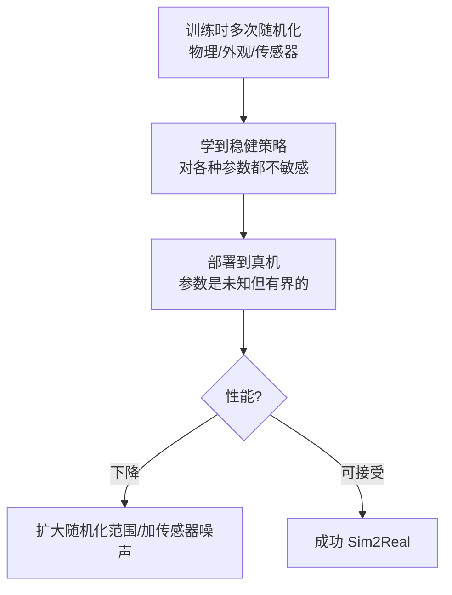

# Domain随机化与Sim2Real

> 本页属于：build 自建环境进阶
> 前置知识：[[Isaac Sim扩展开发入门]]、[[物理仿真设置]]
> 预计阅读时间：25 分钟

## 🎯 为什么需要这个？

策略在仿真里跑得好好的，一上真机就"翻车"——因为仿真永远无法完全复刻物理、传感器噪声、外观差异。**域随机化（Domain Randomization）** 是缩小这个"仿真到现实差距（Sim2Real Gap）"最实用的手段：训练时故意把物理/外观/传感器参数随机化，让策略学到一个"对各种参数都稳健"的策略，从而对真机的不确定性更鲁棒。

## 💡 一个类比

把它想成**在"考场"里故意换题**：每次开考，地面摩擦、光照、体重、传感器噪声都不一样。考出来的学生（策略）因为见过各种"变体"，到了现实中（另一个考场）也不会蒙。

## 🐍 最小必要知识

| 概念 | 是什么 | 类比 |
|------|--------|------|
| **Sim2Real Gap** | 仿真与真机的差异（物理、感知、延迟） | 排练场与真正舞台的差别 |
| **域随机化 (DR)** | 训练时随机化环境参数，让策略鲁棒 | 考场换题 |
| **随机化项** | `randomize_rigid_body_properties`（质量）、`randomize_material`（摩擦）、`randomize_joint` 等 | 每门考的变数 |
| **`EventTermCfg`** | 在 `EventManager` 里声明随机化事件与时机 | 排"变题"的日程 |
| **`mode`** | 随机化时机：`reset`/on_episode_start/on_interval | 什么时候换题 |
| **Curriculum** | 随进度逐渐增强随机化/难度 | 由易到难加变数 |

## 🖼️ 图解：DR 在训练中的作用

图 1 域随机化让策略泛化到真机（来源：自绘 Mermaid，本地预览渲染；GitHub Wiki 上以代码块显示；访问于 2026-09-01）



## 📝 配置示例：常用随机化项

```python
from isaaclab.managers import EventTermCfg
from isaaclab.envs.mdp.events import (
    randomize_rigid_body_properties,
    randomize_material_properties,
    randomize_joint_parameters,
)

@configclass
class MyEnvCfg(ManagerBasedRLEnvCfg):
    events = {
        # ① 每次 reset 随机化刚体质量/重心（逼真模拟负载变化）
        "randomize_rigid": EventTermCfg(
            func=randomize_rigid_body_properties,
            mode="reset",
            params={
                "asset_cfg": "robot",
                "rigid_body_properties": {
                    "mass": {"x_min": 0.8, "x_max": 1.2, "operation": "scale"},
                },
            },
        ),
        # ② 每回合开始随机化摩擦（地面滑/糙都见）
        "randomize_material": EventTermCfg(
            func=randomize_material_properties,
            mode="on_episode_start",
            params={
                "asset_cfg": "robot",
                "material_properties": {
                    "static_friction": {"x_min": 0.5, "x_max": 1.5, "operation": "scale"},
                },
            },
        ),
        # ③ 随机化关节阻尼（模拟老化/不同电机）
        "randomize_damping": EventTermCfg(
            func=randomize_joint_parameters,
            mode="on_episode_start",
            params={
                "asset_cfg": "robot",
                "joint_damping": {"x_min": 0.0, "x_max": 1.0},
            },
        ),
    }
```

**几个常用随机化项**：

- `randomize_rigid_body_properties`：质量、重心、惯量。
- `randomize_material_properties`：静/动摩擦、弹性（地面/物体表面）。
- `randomize_joint_parameters`：关节阻尼/刚度/摩擦/限位。
- `randomize_initial_joint_pos`：初始关节角扰动（起跑姿势不同）。
- 传感器噪声（相机曝光、光度扰动可用 `randomize_camera_properties` 或 Replicator 的随机化）。

## 🗒️ 常见问题 FAQ

**Q1：随机化范围怎么定？**
从真机估值/经验取一个**有界区间**（如质量 ±20%、摩擦 0.5~1.5），先小范围保证能学会，再逐步扩大。范围太大任务难学、范围太小泛化不足。

**Q2：什么时候用 `mode="reset"` vs `on_episode_start`？**
想"每回合重新抽一次"用 `on_episode_start`；想"每 reset 都换"（更频繁、噪声大）用 `reset`；也行 `on_interval` 按周期切换。

**Q3：随机化后训练变难/变慢？**
正常。可先在小范围跑通，再扩大；配合更多 `num_envs`、合理 `decimation` 与调参（[[训练调参与调试]]）来平衡难度与稳定。

**Q4：只随机化物理够吗？**
不一定。视觉任务还要随机化光照/相机视角/外观（合成数据配合 Replicator）；感知任务加传感器噪声。物理+感知+外观一起才更贴近真机。

**Q5：除了 DR 还有别的 Sim2Real 手段吗？**
有：系统辨识校准、更真实的传感/执行器建模、课程化（Curriculum）渐进、以及仿真回放与真机闭环微调（见 [[真机部署]]）。DR 是其中通用且易落地的一支。

## ✏️ 小练习

**1.** 想让四足机器人对"地面滑/糙"都稳，你会随机化哪个参数？用什么 mode？

<details>
<summary>查看答案</summary>

随机化地面/脚掌的静摩擦与动摩擦（`randomize_material_properties`），用 `on_episode_start` 每回合换一次，范围如 0.5~1.5 倍。
</details>

**2.** 随机化范围设得太大导致策略学不会，怎么办？

<details>
<summary>查看答案</summary>

先缩小范围让任务可学，稳定后再逐渐扩大；或配合 Curriculum 从易到难、加大 `num_envs` 与合理调参。
</details>

**3.** 除了物理随机化，视觉策略还要随机化什么？

<details>
<summary>查看答案</summary>

光照/曝光、相机视角/位置、物体外观/材质/摆放，以及传感器噪声；配合 Replicator 合成数据（[[传感器与合成数据]]）一起做。
</details>

## 本章小结

- Sim2Real Gap 来自物理/感知/延迟差异；域随机化让策略对"有界不确定"更鲁棒。
- 在 `EventManager` 里用 `EventTermCfg` 声明随机化项，`mode` 控制时机。
- 范围从真机估值取有界区间，先小后大；物理+感知+外观一起随机化效果最好。

## 下一步

- 上一页：[[Isaac Sim扩展开发入门]]
- 下一页：[[端到端实战案例]]（把前面所有环节串成一个完整项目）
- 返回：[[Home]]

## 更新日志

- 2026-09-01：新增本页（补齐 build 级）。来源：Isaac Lab 事件/随机化文档与 Domain Randomization（<https://isaac-sim.github.io/IsaacLab/main/source/overview/core-concepts/randomization.html>、<https://isaac-sim.github.io/IsaacLab/main/source/api/lab/isaaclab.managers.html>）（访问于 2026-09-01）。
