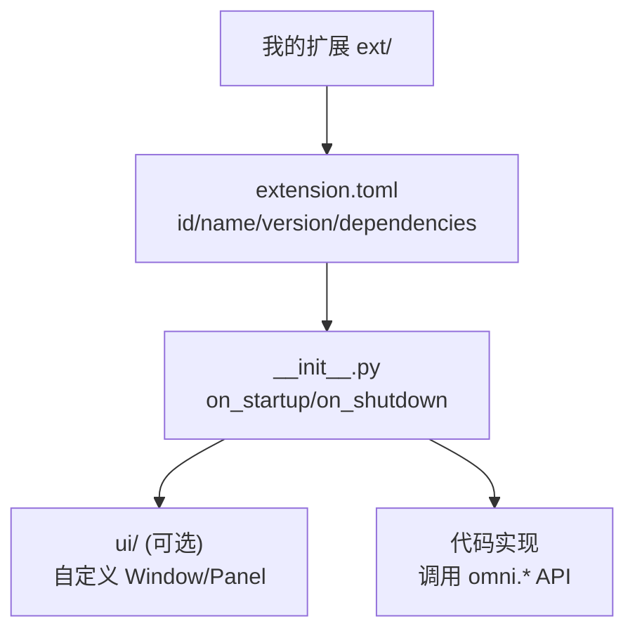

# Isaac Sim扩展开发入门

> 本页属于：build 自建环境进阶
> 前置知识：[[自定义机器人资产导入]]、[[Isaac Sim架构与核心概念]]
> 预计阅读时间：25 分钟

## 🎯 为什么需要这个？

Isaac Sim 是"一堆扩展拼起来的 Kit 应用"（见 [[Isaac Sim架构与核心概念]]）。**要定制 UI、写工具、封装自己的资产/传感器、做自动化流程，就得会写 Extension**。本页带你从扩展模板起步，做一个最小可加载的扩展，并讲清它的目录结构。

## 💡 一个类比

Extension = **给剧院装一个新的"功能包厢"**：有门牌（`extension.toml`）、有接待（`__init__.py`）、有上电入口（`on_startup`），装好后剧院就能提供这项新功能。Isaac Sim 本体也是这么拼出来的。

## 🐍 最小必要知识

| 概念 | 是什么 | 类比 |
|------|--------|------|
| **Kit App** | Omniverse Kit 上的应用（Isaac Sim 是其一） | 剧院 |
| **Extension** | Kit 的可装载模块（能提供 UI/工具/程序化接口） | 功能包厢 |
| **`extension.toml`** | 扩展的"身份 + 元数据 + 依赖"清单 | 包厢的门牌与水电单 |
| **`__init__.py`** | 扩展的 Python 入口，定义启动/关闭钩子 | 包厢的迎宾/送客 |
| **`on_startup`/`on_shutdown`** | 扩展启动/退出时执行的回调 | 开门/关门 |
| **OmniGraph** | 节点的可视化数据流（可写自定义节点） | 灯光音响连线的控制台 |
| **`omni.*` 命名空间** | Kit 提供的跨模块 API（`omni.kit.app`、`omni.usd` 等） | 剧院的公共水电系统 |

## 🖼️ 图解：一个扩展的最小结构

图 1 Isaac Sim 扩展文件树（来源：自绘 Mermaid，本地预览渲染；GitHub Wiki 上以代码块显示；访问于 2026-09-01）



## 📝 最小扩展示例

**1. 目录结构**

```text
ext/my_extension/
├── config/extension.toml
├── __init__.py
└── README.md
```

**2. 写 `extension.toml`（身份声明）**

```toml
[package]
id = "my.company.my_extension"     # 全局唯一扩展 id
name = "My Extension"
version = "0.1.0"

[dependencies]
"omni.kit.app" = ">=1.0"            # 依赖的 Kit 模块
```

**3. 写入口 `__init__.py`（启动/关闭钩子）**

```python
import omni.kit.app

def on_startup(ext_id):
    """扩展被加载时执行：注册回调、做初始化。"""
    # 获得当前仿真 App，向它的 update 循环挂一个回调
    app = omni.kit.app.get_app()
    app.add_post_execute_callback(_on_update)

def _on_update(step):
    """每个帧被调用，可以做自定义逻辑（例如打印帧号）。"""
    print("my extension tick", step)

def on_shutdown(ext_id):
    """退出时清理。"""
    app = omni.kit.app.get_app()
    app.remove_post_execute_callback(_on_update)
```

**4. 加载扩展**：把扩展路径加入 Isaac Sim 的扩展搜索路径（如 `--ext-folder` 或放进 `exts` 目录），启动 Kit App 后即可看到它被加载。

> **小目标**：能打印出 tick 说明扩展已被 Kit 装载、生命周期钩子生效。后续再加 UI / OmniGraph 节点 / 程序化 API。

## 🗒️ 常见问题 FAQ

**Q1：扩展 id 冲突？**
`id` 要全局唯一，通常用 `公司.产品.功能` 的命名；冲突会导致加载失败或覆盖。

**Q2：怎么让 My Extension 的 UI 出现？**
加载后在 Kit 菜单/工具栏注册 `omni.kit.window` 或自定义 Window/Panel；UI 是一种扩展能力，不是必须的。

**Q3：想对特定 USD 场景做操作？**
用 `omni.usd.get_context().get_stage()` 拿到 stage，再用 `pxr`（UsdGeom 等）读改 prim——和 [[USD场景入门]] 里用 Python 操作 scene 是同一套。

**Q4：扩展开发 vs 直接在环境里写脚本？**
扩展适合"会被多处复用/要提供界面/要给团队用"的功能；一次性实验脚本写在 Isaac Lab 环境里更省事。扩展多了再收敛成扩展。

**Q5：和 Isaac Lab 的关系？**
Isaac Lab 本身就是架在 Isaac Sim 之上的框架/扩展生态。你写扩展可复用 Isaac Sim 的传感器/物理/USD，也能被 Isaac Lab 环境调用（例如封装一个自定义传感器扩展到 Lab 里用）。

## ✏️ 小练习

**1.** 扩展的"身份 + 依赖"信息写在哪里？

<details>
<summary>查看答案</summary>

`extension.toml`。里面声明 `package.id`、`name`、`version` 和 `[dependencies]`。
</details>

**2.** 想让扩展在每个仿真帧跑一点逻辑，该用哪个钩子/API？

<details>
<summary>查看答案</summary>

在 `on_startup` 里 `app.add_post_execute_callback(...)` 注册一个每帧回调，`on_shutdown` 里移除。
</details>

**3.** 扩展要操作当前 USD 场景，怎么拿到 stage？

<details>
<summary>查看答案</summary>

`omni.usd.get_context().get_stage()`，再用 `pxr` 的 `Usd`/`UsdGeom` API 读写 prim。
</details>

## 本章小结

- 写扩展 = 做一个"可装载的 Kit 模块"：`extension.toml` 声明身份，`__init__.py` 挂生命周期钩子。
- 用 `omni.*` API 访问 App/USD/UI；自定义功能可以做成扩展复用。
- 先做到"能被加载、能打印 tick"，再逐步加 UI / OmniGraph / 程序化接口。

## 下一步

- 上一页：[[自定义机器人资产导入]]
- 下一页：[[Domain随机化与Sim2Real]]（用随机化缩小仿真到现实的差距）
- 返回：[[Home]]

## 更新日志

- 2026-09-01：新增本页（补齐 build 级）。来源：Isaac Sim 扩展模板教程（<https://docs.isaacsim.omniverse.nvidia.com/latest/advanced_tutorials/tutorial_extension_templates.html>）、Kit/Extensions 文档（<https://docs.isaacsim.omniverse.nvidia.com/latest/extension_development/index.html>）（访问于 2026-09-01）。
