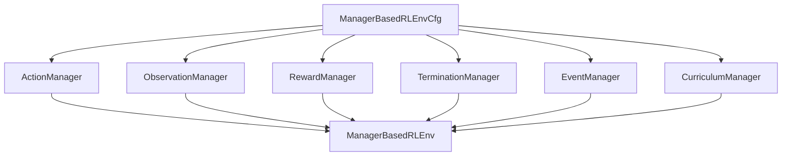

# Manager-Based工作流入门

> 本页属于：build 自建环境进阶
> 前置知识：[[训练调参与调试]]
> 预计阅读时间：25 分钟

## 🎯 为什么需要这个？

[[Direct环境类深入]] 那种"全部手写在一个类里"的方式，任务一复杂就难维护：动作、观测、奖励、终止、随机化全混在一起。**Isaac Lab 的官方任务（Cartpole、Ant、四足、机械臂）用的都是 Manager-Based 工作流**——把环境拆成若干**可插拔的管理器（Manager）**，像乐高一样拼装。本页讲清楚这套"管理器拼装"是怎么工作的。

## 💡 一个类比

Direct = **一体成型的小作坊**（一个人包办一切）。
Manager-Based = **分工明确的剧组**（导演管调度、场记管观测、评委管奖励、道具组管随机化），每个部门可独立换人/换方案。

## 🐍 最小必要知识

| 管理器 | 负责什么 | 类比 | 常用 `*Cfg` |
|--------|----------|------|--------------|
| **ActionManager** | 定义动作空间与如何应用（关节位置/速度/力矩） | 导演怎么"喊动作" | `JointPositionActionCfg` 等 |
| **ObservationManager** | 组合观测（关节/基座/传感器） | 场记记录什么 | `ObservationTermCfg` |
| **RewardManager** | 组合奖励项并加权 | 评委打分 | `RewardTermCfg` |
| **TerminationManager** | 决定何时结束回合 | 裁判喊停 | `TerminationTermCfg` |
| **EventManager** | 随机化/重置事件 | 道具组换布景 | `EventTermCfg` |
| **CurriculumManager** | 随训练进度改变难度（如逐步加障碍） | 循序渐进加难度 | `CurriculumTermCfg` |
| **初始化事件** | 在回合开始/结束批量执行 reset/随机化 | 开场布置 | `EventCfg` 里的 `on_episode_start` 等 |

## 🖼️ 图解：Manager 环境的结构

图 1 Manager-Based 环境：一个环境类挂多个管理器（来源：自绘 Mermaid，本地预览渲染；GitHub Wiki 上以代码块显示；访问于 2026-09-01）



## 📝 一个精简的 Manager 配置骨架

```python
from isaaclab.envs import ManagerBasedRLEnvCfg
from isaaclab.managers import (
    ActionTermCfg, ObservationTermCfg, RewardTermCfg,
    TerminationTermCfg, EventTermCfg, CurriculumTermCfg,
)
from isaaclab.envs.mdp.actions import JointPositionActionCfg
from isaaclab.envs.mdp.observations import joint_pos, joint_vel, base_lin_vel
from isaaclab.envs.mdp.rewards import alive_reward
from isaaclab.envs.mdp.terminations import time_out

@configclass
class MyEnvCfg(ManagerBasedRLEnvCfg):
    # ... sim / scene / robot_cfg 同 Direct ...

    actions = {
        "joint_pos": ActionTermCfg(class_type=JointPositionActionCfg,
                                   asset_name="robot"),
    }
    observations = {
        "policy": {
            "joint_pos": ObservationTermCfg(func=joint_pos, params={"asset_cfg": "robot"}),
            "base_lin_vel": ObservationTermCfg(func=base_lin_vel, params={"asset_cfg": "robot"}),
        },
        "critic": {},
    }
    rewards = {
        "alive": RewardTermCfg(func=alive_reward, weight=1.0),
    }
    terminations = {
        "time_out": TerminationTermCfg(func=time_out, time_out=True),
    }
    events = {
        "reset_robot": EventTermCfg(func=reset_joints, mode="reset",
                                     params={"asset_cfg": "robot"}),
        "randomize_physics": EventTermCfg(func=randomize_rigid_body_properties,
                                           mode="on_episode_start",
                                           params={...}),
    }
    curriculum = {}   # 可选
```

**关键点**：

- 每个管理器就是一个 **字典**：键是"名字"，值是 `*TermCfg`，`func` 指向 mdp 或你自己的函数。
- `mode`/事件时机：`"reset"`（每次 reset）、`"on_episode_start"`（回合开始）、`"on_episode_end"`、`"on_interval"`（按周期）。
- 环境类本体通常**只需继承 `ManagerBasedRLEnv`，很少重写方法**——逻辑都在 `Cfg` 里声明。

## 🗒️ 常见问题 FAQ

**Q1：Manager 环境类是空的？那逻辑在哪？**
逻辑在 `Cfg` 的管理器字典里。`ManagerBasedRLEnv` 会在 `step/reset` 时自动调用各管理器，你几乎不用重写方法。

**Q2：想让某个事件"只在开局随机一次"？**
用 `mode="on_episode_start"`（或 `on_interval` 配合 `interval` 参数）；`"reset"` 则每次 reset 都执行。

**Q3：如何新增一个奖励项？**
在 `rewards` 字典加一行 `RewardTermCfg`。奖励函数可以是官方 `mdp.rewards` 或你自己写在环境文件里的 `def your_reward(...)`。

**Q4：Manager 和 Direct 能混用吗？**
可以。`ManagerBasedRLEnv` 内部也调 `scene`/资产，但"怎么定义任务"用管理器；社区也有把 Direct 方法迁移成 Manager 的实践（见对比页）。

**Q5：为什么官方任务多数用 Manager？**
可复用、可组合、易读：改一个传感器/奖励不动其他部分；也方便做奖励/观测的消融实验。

## ✏️ 小练习

**1.** 想"每次回合开始随机化地面摩擦"，该用哪个管理器、什么模式？

<details>
<summary>查看答案</summary>

用 `EventManager` 的 `EventTermCfg`，`mode="on_episode_start"`（每次开回合执行）。
</details>

**2.** 动作/观测/奖励各由哪个管理器管？

<details>
<summary>查看答案</summary>

动作=ActionManager；观测=ObservationManager；奖励=RewardManager。其它如终止=TerminationManager、随机化=EventManager、难度=CurriculumManager。
</details>

**3.** 在 Manager 里加一个自定义奖励函数，需要改环境类吗？

<details>
<summary>查看答案</summary>

通常不用改基类。在 `rewards` 字典加 `RewardTermCfg(func=你的函数)`；你的函数写在环境文件里、按 mdp reward 签名接收（如 `env` 等）。
</details>

## 本章小结

- Manager-Based 用一组**可插拔管理器**把环境逻辑模块化：Action/Observation/Reward/Termination/Event/Curriculum。
- 配置都用 `*Cfg` 字典声明，环境类几乎不需要重写方法，逻辑在 Cfg。
- 事件时机（reset / on_episode_start / on_interval / on_episode_end）是关键开关。

## 下一步

- 上一页：[[训练调参与调试]]
- 下一页：[[Direct与Manager-Based对比迁移]]（两种工作流何时选谁、如何迁移）
- 返回：[[Home]]

## 更新日志

- 2026-09-01：新增本页（补齐 build 级）。来源：Isaac Lab 教程 `create_manager_base_env` / `create_manager_rl_env`（<https://isaac-sim.github.io/IsaacLab/main/source/tutorials/03_envs/create_manager_base_env.html>、<https://isaac-sim.github.io/IsaacLab/main/source/tutorials/03_envs/create_manager_rl_env.html>）、Manager API（<https://isaac-sim.github.io/IsaacLab/main/source/api/lab/isaaclab.managers.html>）（访问于 2026-09-01）。
