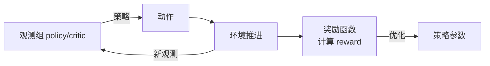

# 奖励设计与观测修改

> 本页属于：build 自建环境进阶
> 前置知识：[[Direct环境类深入]]、[[传感器与合成数据]]
> 预计阅读时间：20 分钟

## 🎯 为什么需要这个？

环境建好了，机器人还是"不会学"——**90% 的原因在奖励函数和观测**：奖励给得稀疏，策略学不到；观测缺了关键量，策略"看不见"。本页把"改打分"和"改看到什么"这两件事讲成套路，让你把模板改造成自己的任务。

## 💡 一个类比

- **奖励** = 教练的**奖惩规则**：做得对给零食、走歪了扣，规则越清晰，学得越快。
- **观测** = 教练**能看的数据**：只看"速度"没看"位置"，就不知道往哪跑。
- **稀疏奖励** = 走完全程才给一次零食：太难学；改成"每走一步给一点"（密集奖励/dense reward）才现实。

## 🐍 最小必要知识

| 概念 | 是什么 | 类比 |
|------|--------|------|
| **奖励函数** | 从状态/动作算出标量回馈的函数 | 教练的打分器 |
| **稀疏 vs 密集奖励** | sparse：终点才给；dense：每步都给小奖励 | 期末考 vs 平时分 |
| **奖励成型 (reward shaping)** | 用中间量引导（如走得更远 +），但别与真目标矛盾 | 用"期中小测"引导学习 |
| **观测组 (observation group)** | 把观测分组：`policy`（可部署）/ `critic`（特权） | 给"上台"和"排练"分开的数据 |
| **`cfg.rew_scale_*`** | 各奖励项的权重（可被命令行/Hydra 覆盖） | 各科的学分权重 |
| **事件随机化** | 在开回合/阶段随机改物理/材质/初始状态 | 考试换题、场地变数 |

## 🖼️ 图解：奖励与观测怎么进出环境

图 1 观测 → 策略 → 动作 → 奖励 的闭环（来源：自绘 Mermaid，本地预览渲染；GitHub Wiki 上以代码块显示；访问于 2026-09-01）



## 📝 改奖励（以 Manager 配置 / Direct 方法为例）

### 写法 A：Config 里声明权重（Manager 居多，用 `RewardManager`）

```python
from isaaclab.envs import ManagerBasedRLEnvCfg
from isaaclab.managers import RewardTermCfg
from isaaclab.envs.mdp.rewards import joint_pos_error_l2, alive_reward

@configclass
class MyEnvCfg(ManagerBasedRLEnvCfg):
    rewards = {
        # ① 活着给分（权重小，好调）
        "alive": RewardTermCfg(func=alive_reward, weight=1.0),
        # ② 与目标的关节角度差越小越好，权重更大
        "tracking": RewardTermCfg(func=joint_pos_error_l2, weight=-1.0,
                                  params={"target": ...}),
    }
```

### 写法 B：Direct 里直接写 `_get_rewards`

```python
def _get_rewards(self):
    # 机器人速度前向投影
    lin_vel = self.robot.data.root_lin_w
    forward = torch.sum(self.facing_w[:, :2] * lin_vel[:, :2], dim=1)
    # ① 前向速度奖励
    reward_forward = forward * self.cfg.rew_scale_forward
    # ② 姿态惩罚（不要翻倒）
    reward_upright = 1.0 / (1.0 + torch.abs(self.robot.data.projected_gravity_b[:, 2])) * self.cfg.rew_scale_upright
    # ③ 动作惩罚（不要狂抖）
    reward_actions = -torch.sum(self.actions ** 2, dim=1) * self.cfg.rew_scale_actions
    return reward_forward + reward_upright + reward_actions
```

> **建议**：一开始把 reward 归一化到 ±1 量级，再通过 `rew_scale_*` 调权重，避免某项过大喧宾夺主。

## 📝 改观测

### 加一个"旋转角"进观测（Direct）

```python
def _get_observations(self):
    # 机器人本体速度 + 关节角/速度 + 投影重力（判姿态）
    obs = torch.cat([
        self.robot.data.root_lin_w[:, :3],       # 线速度
        self.robot.data.root_ang_w[:, :3],       # 角速度
        self.robot.data.joint_pos,                # 关节角
        self.robot.data.joint_vel,                # 关节速度
        self.robot.data.projected_gravity_b,      # 体坐标系下的重力方向（判倾角）
    ], dim=1)
    return {"policy": obs, "critic": obs}
```

### Manager 里加观测（`ObservationManager` + 传感器）

```python
from isaaclab.managers import ObservationTermCfg
from isaaclab.envs.mdp.observations import joint_pos, joint_vel, base_lin_vel

@configclass
class MyEnvCfg(ManagerBasedRLEnvCfg):
    observations = {
        "policy": {
            "joint_pos": ObservationTermCfg(func=joint_pos, params={"asset_cfg": "robot"}),
            "base_lin_vel": ObservationTermCfg(func=base_lin_vel, params={"asset_cfg": "robot"}),
            "ray_caster": ObservationTermCfg(func=ray_distance, params={"sensor_cfg": "ray_caster"}),
        },
    }
```

> **观测维度原则**：少而精。能说明"是否需要动作"的量才放进去；用不到的维度白白拉长网络输入、翻倍采样成本。

## 🗒️ 常见问题 FAQ

**Q1：reward 总也不收敛？**
先看曲线：reward 是否在上升但没到目标？→ 调权重/加密集奖励；reward 恒为 0？→ 观测没体现任务差异，或 reward 函数 bug；任务从来完不成？→ 观测缺了关键量。

**Q2：`policy` 和 `critic` 观测该一样吗？**
不一定。`policy` 是部署能提供的；`critic` 可加"特权"（真值位置/目标）。训练用特权能加速，但部署只给 `policy`，两端观测要能对上。

**Q3：改观测后训练明显变慢？**
观测维度↑ → 网络输入↑ → 采样/显存↑。检查是否重复/冗余，尽量只留物理相关的量；视觉观测用低分辨率（见 [[仿真加速与性能优化]]）。

**Q4：奖励里出现 NaN？**
常见：除以接近 0 的量、终端状态是 NaN、reward 无界。加 `torch.clamp`/eps、检查 `terminated` 状态的重置。

**Q5：怎么知道哪个奖励项在起作用？**
用 TensorBoard 看各 reward term 的曲线（Manager 会按 term 名记录），定位是哪一项压住了训练；一次只调一个权重。

## ✏️ 小练习

**1.** 想让机械臂"抓得准且不猛砸"，你会设计哪几个奖励项？

<details>
<summary>查看答案</summary>

① 末端与目标距离越小越加分（tracking）；② 动作/力矩平方惩罚（防止猛砸、节能）；③ 成功抓住给大奖励（稀疏奖励）。三者按需加权，dense 引导 + sparse 终局。
</details>

**2.** `policy` 观测少了末端执行器位置，可能发生什么？

<details>
<summary>查看答案</summary>

策略"看不见"手在哪，就没法收敛抓取任务——观测必须包含完成任务所需的最小充分状态。
</details>

**3.** 奖励权重 `rew_scale_forward=1.0`、`rew_scale_actions=-0.5`，含义是什么？

<details>
<summary>查看答案</summary>

向前速度每单位 +1 分（希望跑快）、动作平方每单位 -0.5 分（抑制乱动）。权重比决定"跑快"和"稳"的偏好。
</details>

## 本章小结

- 奖励是学会任务的关键：密集+成型+权重可调；常用"活着的奖/目标追踪奖/动作惩罚"三件套。
- 观测分 `policy`/`critic` 组；加传感器读数是扩展观测的常见方式，但"少而精"。
- 用 TensorBoard 按 term 看奖励，一次调一个权重，避免互相干扰。

## 下一步

- 上一页：[[Direct环境类深入]]
- 下一页：[[训练调参与调试]]（用曲线定位问题、调超参、排错）
- 返回：[[Home]]

## 更新日志

- 2026-09-01：新增本页（补齐 build 级）。来源：Isaac Lab 奖励/观测配置教程（<https://isaac-sim.github.io/IsaacLab/main/source/tutorials/03_envs/configuring_rl_training.html>）、Observation/Action/Reward 配置与 mdp API（<https://isaac-sim.github.io/IsaacLab/main/source/overview/workspace.html>、<https://isaac-sim.github.io/IsaacLab/main/source/api/lab/isaaclab.envs.mdp.html>）（访问于 2026-09-01）。
