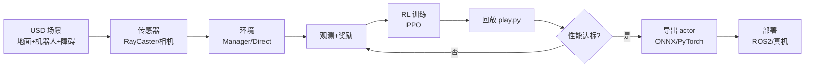

# 端到端实战案例

> 本页属于：build 自建环境进阶
> 前置知识：[[Domain随机化与Sim2Real]]、[[自定义机器人资产导入]]
> 预计阅读时间：30 分钟

## 🎯 为什么需要这个？

前面学了很多"零件"：场景、物理、传感器、奖励、两种工作流、随机化、部署。但**把它们串成一个能跑的真项目**，才是 build 级的**毕业设计**。本页用一个具体案例（**四足机器人随机化环境里"走到目标点并避障"**）走一遍 场景→观测→奖励→训练→回放→部署 的完整链路，并给出每一步的检查清单。

## 💡 一个类比

这就像**从零拍一部短片**：先搭摄影棚（场景+物理），给演员（机器人）写剧本（观测+奖励），排练（训练），看样片（回放），最后正式上映（部署）。前面每页都是"部门"，本页是**把各部门串起来的制片流程**。

## 🖼️ 图解：端到端项目数据流

图 1 从场景到部署的完整链路（来源：自绘 Mermaid，本地预览渲染；GitHub Wiki 上以代码块显示；访问于 2026-09-01）

## 📝 案例：四足避障导航（步骤）

### 第 0 步：明确任务与评估指标
- **目标**：从起点走到目标点，避开随机障碍，不翻倒。
- **成功**：到达目标（或接近）；**失败**：翻车/超时/频繁撞墙。
- **指标**：成功率、平均步数、平均追踪误差、能耗。

### 第 1 步：搭场景（USD + 物理）
用 `InteractiveSceneCfg` 摆地面、机器人、若干随机障碍；在 `SimulationCfg` 设 `dt`、`gravity`，必要时 `replicate_physics`。（见 [[USD场景入门]]、[[物理仿真设置]]、[[自定义机器人资产导入]]）

### 第 2 步：加传感器（感知）
给机器人加 `RayCasterCfg`（避障）与可选深度相机（视觉）；设置合理的 `max_distance`/射线数，避免拖慢训练。（见 [[渲染与LiDAR感知]]、[[传感器与合成数据]]）

### 第 3 步：定义观测与奖励
- 观测：基座速度、投影重力（判姿态）、关节状态、射线距离、目标方向/距离。
- 奖励：前向/接近目标速度 +，姿态惩罚、动作惩罚、撞墙惩罚、到达目标奖励。（见 [[奖励设计与观测修改]]）

### 第 4 步：建立环境（建议 Manager-Based）
用 `ManagerBasedRLEnv` 把动作/观测/奖励/终止/事件都放进 `Cfg` 字典；用 `gym.register` 注册任务。（见 [[Manager-Based工作流入门]]、[[Direct与Manager-Based对比迁移]]）

### 第 5 步：域随机化
随机化地面摩擦、障碍位置、初始关节角、光相机曝光等，增强泛化。（见 [[Domain随机化与Sim2Real]]）

### 第 6 步：训练与调参
`python scripts/reinforcement_learning/<backend>/train.py --task <id> --num_envs 4096 --headless`，用 TensorBoard 看 reward/成功率，按"一次改一个"调 lr/num_envs/随机化范围。（见 [[训练调参与调试]]、[[仿真加速与性能优化]]）

### 第 7 步：回放验证
`play.py --task <id>` 看行为；多 seed 跑几次，确认不是"碰运气"。（见 [[运行第一个Demo]]）

### 第 8 步：导出与部署
提取 actor，导出 ONNX/TensorRT 或用 LEAPP；对接 ROS2 / 真机控制器，核对频率、单位、观测预处理。（见 [[真机部署]]、[[多卡与分布式训练]]）

## 🗒️ 常见问题 FAQ

**Q1：成功率达不到要求？**
按"观测缺量 → 奖励畸形 → 随机化过强/过弱 → 超参"排查。先保证**无随机化**时能学到 80%，再加 DR；DR 范围从小开始。

**Q2：回放很好，上真机不行？**
核对观测预处理一致、频率/单位、执行器映射；再补传感器噪声/更大 DR 范围；必要时真机闭环采集微调。（见 [[真机部署]]）

**Q3：训练很慢？**
先 `--headless`、加大 `num_envs`、降相机/射线开销、开 `replicate_physics`；若仍慢查是否 GPU 利用率低（见 [[仿真加速与性能优化]]）。

**Q4：想复用大部分代码换任务？**
把"任务相关"的观测/奖励/事件抽成可配置项，用 Curriculums 或不同 `Cfg`；Manager 工作流天然利于"换奖励/传感器"。

**Q5：这个案例能直接部署吗？**
本页是教学演示。真机部署还涉及控制器、安全策略、真实传感器标定、硬件接口——务必在真实机器人上由工程师验证后再闭环。

## ✏️ 小练习

**1.** 一个端到端项目，你最希望先看到哪张曲线来判定"有没有学会"？

查看答案

成功率（reach success rate）或"到达目标比例"。它直接对应任务目标；reward 可作为辅助，但成功率最直观。

**2.** 训练前"无随机化能跑通"这一步为什么重要？

查看答案

它把"任务可学"与"随机化难度"解耦。若基础版本都学不会，先修观测/奖励而不是加复杂度；基础过关再加 DR 才有意义。

**3.** 回放 100 分但真机 40 分，除了调参还要核对哪几类"一致性"？

查看答案

观测预处理（顺序/归一化）、控制频率/decimation、单位与坐标系、执行器映射、传感器噪声；这些是 Sim2Real 最常见差异源。

## 本章小结

- 端到端案例把 build 级所有环节串起来：场景→感知→环境→奖励→训练→回放→导出→部署。
- 先做"无随机化可学"，再加 DR；用成功率作为首要指标。
- 训练、回放、部署三阶段各有检查清单；真机部署前务必做一致性核对。

## 下一步

- 上一页：[[Domain随机化与Sim2Real]]
- 下一页：[[多卡与分布式训练]]（build 收尾，进入部署与性能）
- 返回：[[Home]]

## 更新日志

- 2026-09-01：新增本页（补齐 build 级，作为毕业案例）。来源：综合 Isaac Lab 教程与环境设计文档（<https://isaac-sim.github.io/IsaacLab/main/source/setup/walkthrough/concepts_env_design.html>、<https://isaac-sim.github.io/IsaacLab/main/source/overview/core-concepts/index.html>）（访问于 2026-09-01）。
