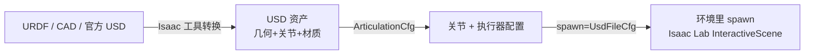

# 自定义机器人资产导入

> 本页属于：build 自建环境进阶
> 前置知识：[[Direct与Manager-Based对比迁移]]、[[USD场景入门]]
> 预计阅读时间：25 分钟

## 🎯 为什么需要这个？

内置机器人不够用，你要**把自己的机械臂、四足、人形或是从 CAD/URDF 转换来的机器人**放进仿真。这要解决三件事：**资产从哪来 → 怎么描述关节/执行器 → 怎么在环境里 spawn**。本页讲清 `ArticulationCfg` + `UsdFileCfg` 的用法，和 URDF→USD 的导入思路。

## 💡 一个类比

导入机器人 = **给新演员建档**：

- **USD/URDF 文件** = 演员的"外观 + 骨架"（几何 + 关节）。
- **`ArticulationCfg`** = 演员的"履历表"（哪条关节、能怎么动）。
- **执行器（Actuator）** = 肌肉：位置控制/速度控制/力矩控制。
- **`UsdFileCfg`** = 把档案挂进舞台的方式（spawn 引用，而不是复制）。

## 🐍 最小必要知识

| 概念 | 是什么 | 类比 |
|------|--------|------|
| **USD 资产** | Isaac Sim 原生格式，含几何/物理/材质 | 演员的深度档案 |
| **URDF** | ROS 系机器人描述格式（XML），可转 USD | 演员的简易简历 |
| **`ArticulationCfg`** | 描述关节、执行器、初始状态的配置 | 履历表 |
| **`UsdFileCfg`** | 通过 USD 路径 spawn 资产（可加 `scale`、`default_joint_pos`） | 上舞台的"入场券" |
| **`ActuatorCfg`** | 每条关节的驱动方式（`ImplicitActuatorCfg`/DCMotorCfg...） | 肌肉类型 |
| **`joint_names`** | 机器人的关节名集合 | 演员每个关节的名字 |
| **URDF 转换** | 用 Isaac 资产工具把 URDF 转成 USD 并加物理 | 简历转成档案 |

## 🖼️ 图解：资产导入的可视化

图 1 从 URDF/CAD → USD → ArticulationCfg → 环境 spawn（来源：自绘 Mermaid，本地预览渲染；GitHub Wiki 上以代码块显示；访问于 2026-09-01）



## 📝 配置示例：`ArticulationCfg` + `UsdFileCfg`

```python
from isaaclab.assets import ArticulationCfg, RigidObjectCfg, DeformableObjectCfg
from isaaclab.assets.actuators import ImplicitActuatorCfg
from isaaclab.sim import UsdFileCfg

@configclass
class MyEnvCfg(ManagerBasedRLEnvCfg):
    # 机器人资产：spawn 一块 USD
    robot = ArticulationCfg(
        prim_path="{ENV_REGEX_NS}/Robot",                    # 在哪个 prim 下
        spawn=UsdFileCfg(
            usd_path="assets/robots/my_robot.usd",           # ① USD 路径（相对项目 assets）
            scale=(1.0, 1.0, 1.0),                           # ② 缩放（单位/尺寸不对就调）
            default_joint_pos={                               # ③ 默认关节角（初始姿态）
                "joint_0": 0.0,
                "joint_1": 1.2,
            },
        ),
        # ④ 执行器：声明每条关节的驱动方式与增益
        actuators={
            "legs": ImplicitActuatorCfg(
                joint_names=["joint_0", "joint_1"],          # 哪个关节
                stiffness={"joint_0": 100.0, "joint_1": 50.0},  # 刚度（位置控制）
                damping={"joint_0": 5.0, "joint_1": 3.0},    # 阻尼
            ),
        },
        joint_pos_limits={...},
        joint_effort_limits={...},
    )
```

> 关键坑：**`default_joint_pos`、`joint_effort_limits`、`stiffness/damping` 一定要设**，否则机器人初始会乱动或塌地。

## 📝 URDF 导入思路（把 ROS 机器人拿进来）

1. 拿到 URDF（含 mesh/`.dae`/`.stl`、joint 定义）。
2. 用 Isaac/Isaac Lab 工具**转成 USD**：常见做法有 Omniverse 的 URDF importer，或 `isaacsim.asset` 里的转换接口，转换后通常得到带关节与质量的 USD。
3. 检查关节类型（revolute/prismatic）、轴方向与**质量/惯量**（URDF 常缺质量，物理会怪）。
4. 在 `ArticulationCfg` 里按转换后的关节名配执行器（不同 importer 命名可能变化，先打印 `robot.joint_names` 核对）。
5. 用官方资产库：很多现成机器人已在 `isaaclab_assets`，直接引用 `usd_path` 即可。

## 🗒️ 常见问题 FAQ

**Q1：URDF 转来的机器人"塌地上/乱飞"？**
多半是质量/惯量缺失或初始关节角不对。转换后补质量与惯量，设好 `default_joint_pos`，必要时调 `scale`，并降低 `stiffness` 起步。

**Q2：报错关节找不到 / joint name mismatch？**
打印 `self.robot.joint_names` 与你的 `joint_names` 对齐；不同 URDF importer 命名规则不同。

**Q3：机器人动得很慢/软绵绵？**
调大 `stiffness`/`damping`（位置控制）或改用更合适的 `ActuatorCfg`（如 DC motor 模拟真实电机）。

**Q4：想一次加载多个同款机器人？**
用 `prim_path="{ENV_REGEX_NS}/Robot"` + `count`/复制，或在 `InteractiveSceneCfg` 里配置多资产（见 multi_asset_spawning）。

**Q5：刚体/可形变物体怎么导？**
刚性物体用 `RigidObjectCfg`（箱子、障碍）；布料/软体用 `DeformableObjectCfg`；配置思路与 `ArticulationCfg` 类似，只是没有关节。

## ✏️ 小练习

**1.** URDF 转出来的四足机器人一动就散架，最可能缺什么？

<details>
<summary>查看答案</summary>

关节质量/惯量或执行器增益（stiffness/damping）缺失或不合理；先把质量补全、设合理初始姿态与低增益起步，再逐步调。
</details>

**2.** `default_joint_pos` 要不要设？为什么？

<details>
<summary>查看答案</summary>

要。它决定机器人起始姿态；不设会导致机器人以随机/错误姿态开始，容易塌地或与环境碰撞，影响训练初期的稳定性。
</details>

**3.** 想让机械臂"跟着指令精准到位"，执行器该选位置控制还是力矩控制？

<details>
<summary>查看答案</summary>

想让末端"到位"用位置控制（`ImplicitActuatorCfg` 高 `stiffness`/`damping`）；想学"柔顺交互/抓握"可考虑力/位混合。先位置控制跑通。
</details>

## 本章小结

- 机器人资产三要素：**USD 文件（几何+关节）+ `ArticulationCfg`（关节+执行器）+ `UsdFileCfg`（spawn）**。
- URDF 通常缺质量/惯量，导入后务必补全并核对关节名。
- `default_joint_pos`、`joint_effort/pos_limits`、`stiffness/damping` 是让机器人"稳"的关键配置。

## 下一步

- 上一页：[[Direct与Manager-Based对比迁移]]
- 下一页：[[Isaac Sim扩展开发入门]]（给 Isaac Sim 写自己的扩展/工具）
- 返回：[[Home]]

## 更新日志

- 2026-09-01：新增本页（补齐 build 级）。来源：Isaac Lab 教程 `add_new_robot` / `write_articulation_cfg` / `import_new_asset`（<https://isaac-sim.github.io/IsaacLab/main/source/tutorials/01_assets/add_new_robot.html>、<https://isaac-sim.github.io/IsaacLab/main/source/how-to/write_articulation_cfg.html>、<https://isaac-sim.github.io/IsaacLab/main/source/how-to/import_new_asset.html>）（访问于 2026-09-01）。
