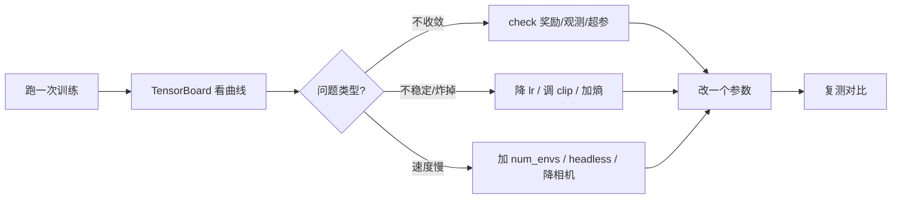

# 训练调参与调试

> 本页属于：build 自建环境进阶
> 前置知识：[[奖励设计与观测修改]]
> 预计阅读时间：20 分钟

## 🎯 为什么需要这个？

训练跑起来不等于能收敛。**同样一个任务，超参不同，结果可能天差地别**：学习率太大直接炸、minibatch 太小噪声大、num_envs 不够 GPU 空转。本页讲一套"**先看曲线 → 再动一个参数 → 复测**"的调参纪律，以及 TensorBoard 里最常看的几张图。

## 💡 一个类比

调超参 = **给教练调"教学策略"**：

- 学习率 = 每次纠正的力度：太大（猛改）容易教坏，太小（墨迹）学得慢。
- minibatch = 每次上课人数：人太多噪声大、人太少吃不饱。
- 更新步数 = 每轮补几次：太频繁浪费、太稀疏吃不透。

## 🐍 最小必要知识

| 概念 | 是什么 | 类比 |
|------|--------|------|
| **PPO 超参** | `learning_rate` / num_mini_batches / `clip_param` / `entropy_coef` 等 | 教练的教学参数 |
| **TensorBoard** | 训练可视化：reward、loss、entropy、视频 | 训练的"成绩单" |
| **WandB** | 云端实验跟踪，可对比多次运行 | 翻成绩单做对比 |
| **学习率调度** | 随训练步数衰减 lr | 越后期越小步改 |
| **熵 (entropy)** | 策略的"不确定/探索程度" | 教练要不要鼓励"多试" |
| **checkpoint** | `model_<iter>.pt` / best 权重 | 存档点 |
| **fps / 吞吐** | 每秒环境步数，衡量训练速度 | 上课效率 |

## 🖼️ 图解：调参循环

图 1 训练调参的闭环（来源：自绘 Mermaid，本地预览渲染；GitHub Wiki 上以代码块显示；访问于 2026-09-01）



## 📝 看 TensorBoard 的几个关键图

训练后用官方可视化跑起来（rsl_rl 默认写 tensorboard 事件）：

```bash
# 训练时指定日志目录（rsl_rl 在 train.py 有 --log_dir 等；skrl 自动建 logs/）
tensorboard --logdir logs/rsl_rl/<task>
```

打开后重点看：

| 图 | 正常表现 | 出问题 |
|----|----------|--------|
| **Total Reward** | 平滑上升并稳定 | 剧烈振荡=lr 大/噪声大；长期不动=稀疏或观测缺量 |
| **Mean Episode Length** | 任务越做越长（能坚持） | 一直短=没学会；骤降=重置/终止逻辑 bug |
| **Entropy** | 缓慢下降（越来越自信） | 过早归零=探索不足/加 `entropy_coef`；不降=没在学 |
| **Policy/Value Loss** | 小且稳定 | 爆炸=lr 大或 reward 未归一化 |
| **fps** | 稳定 | 掉帧=num_envs 太满/渲染开着 |

## 📝 常见 PPO 超参（rsl_rl 的 AgentCfg 例）

```python
# 通常在 source/你的项目/<agents>/rsl_rl_ppo_cfg.py 里
class PPO_RunnerCfg(PPORunnerCfg):
    num_steps_per_env = 24          # 每次采集多少步（类 rollout 长度）
    num_learning_epochs = 5         # 每轮用这批数据更新几次
    num_mini_batches = 4            # 分成几小批更新（越大噪声越小、越慢）
    learning_rate = 1.0e-3          # 学习率（经典起点；太大炸、太小慢）
    clip_param = 0.2                # PPO 裁剪阈值：限制单步更新幅度
    entropy_coef = 0.0              # 熵奖励系数：鼓励探索（一般很小）
    gamma = 0.99                    # 折扣因子：看重多少多远的未来
    lam = 0.95                      # GAE 参数
```

> **调参铁律**：一次只改一个，并且改完用 TensorBoard 对比；不要拍脑袋同时改 3 个。

## 🗒️ 常见问题 FAQ

**Q1：reward 一直上不去？**
先确认 reward 函数本身有梯度（不是常数 0/1）；再看观测是否包含任务差异；若都正常，尝试降 lr、加大 num_envs、加密集奖励。

**Q2：训练"炸了"（loss → NaN / reward → -inf）？**
常见：lr 太大、reward 未归一化、观测含 NaN、除以接近 0。先降 lr 一个量级、check 观测是否 NaN、给 reward 加 clamp，再看 `gamma`/投影。

**Q3：ppo 训练很慢？**
按 [[仿真加速与性能优化]]：先 `--headless`、加大 `num_envs`（直到 GPU 满载）、减小 `decimation` 相关开销、降相机分辨率。fps 上不去再谈调参。

**Q4：想恢复上次训练如何做？**
rsl_rl 加 `--resume`（配合 `--checkpoint`/日志目录）；skrl 从 `last_agent.pt` 继续。接续前先确认超参与迭代数一致。

**Q5：seed 影响大吗？**
同 seed 可复现，但不同 seed 起跑线不同。调参前固定 seed（`--seed`），对比时才公平；上线前用多个 seed 验证鲁棒性。

## ✏️ 小练习

**1.** reward 剧烈振荡但整体没涨，最可能先调哪个参数？

<details>
<summary>查看答案</summary>

先降学习率（如 1e-3 → 3e-4）或调小 `clip_param`，减小每步更新幅度；也可增大 `num_mini_batches` 降噪声。一次只改一个，用 TensorBoard 对比。
</details>

**2.** Entropy 很早归零，说明什么？怎么办？

<details>
<summary>查看答案</summary>

策略过早"自信"、探索不足（陷入局部最优）。调大 `entropy_coef`，或对状态做随机初始化/加入更多域随机化逼迫探索。
</details>

**3.** 训练 5 分钟 fps 稳定但 reward 不动，优先查什么？

<details>
<summary>查看答案</summary>

fps 高说明算力在跑，问题在"学什么"：查 reward 是否可区分、观测是否含任务差异、是否稀疏。速度问题（fps）与学习问题（reward）分开排查。
</details>

## 本章小结

- 调参纪律：先看曲线定位问题类型，再"一次改一个 + 复测对比"。
- 重点看图：Total Reward、Episode Length、Entropy、Loss、fps。
- 常见坑：lr 大/reward 未归一化/观测缺量/探索不足；从降 lr、加密集、加熵、加环境数逐个排查。

## 下一步

- 上一页：[[奖励设计与观测修改]]
- 下一页：[[Manager-Based工作流入门]]（官方任务采用的模块化工作流）
- 返回：[[Home]]

## 更新日志

- 2026-09-01：新增本页（补齐 build 级）。来源：Isaac Lab 配置 RL 训练教程（<https://isaac-sim.github.io/IsaacLab/main/source/tutorials/03_envs/configuring_rl_training.html>）、rsl_rl 训练配置（<https://isaac-sim.github.io/IsaacLab/main/source/overview/learning-tools.html>）（访问于 2026-09-01）。
