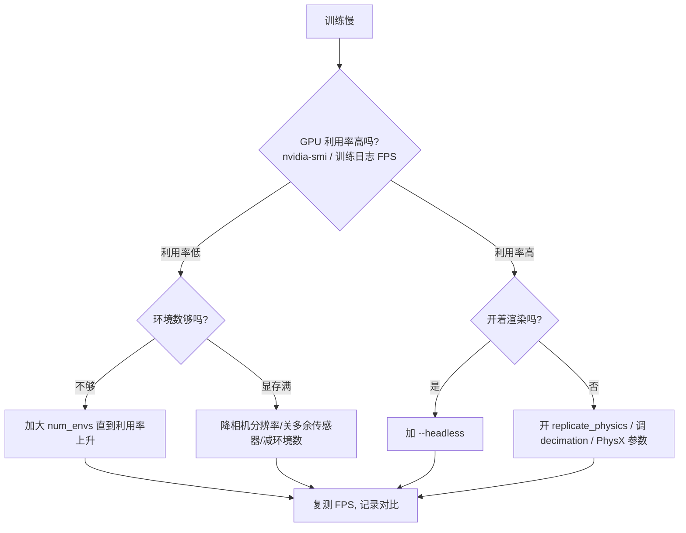

# 仿真加速与性能优化

> 本页属于：deploy 部署与性能
> 前置知识：[[多卡与分布式训练]]
> 预计阅读时间：20 分钟

## 🎯 为什么需要这个？

多卡解决了"横向扩展"，但单卡内还有大量可榨取的提速空间——很多新手"训练慢"不是卡不行，而是**配置没到点子上**：渲染开着、环境数太少、物理没复制、相机分辨率太高。本页给出一套**先量化、后优化**的提速清单，按性价比排序。

## 💡 一个类比

把训练速度想成**餐厅出餐速度**：

- 渲染 = 每道菜都摆盘拍照（`--headless` 就是"不拍照只做菜"）。
- `num_envs` = 灶台数量（并行度是最大杠杆）。
- `decimation` = 每道菜试吃几次才端出（决策频率）。
- `replicate_physics` = 把"一道菜的配方"复制成 N 份同时做，而不是逐份研究。

**先找瓶颈，再动手**：看到底是 GPU 利用率低、显存不够，还是单步仿真本身就慢。

## 🐍 最小必要知识（按性价比排序）

| 手段 | 配置位置 | 收益 | 代价 |
|------|----------|------|------|
| **`--headless` 无渲染** | 训练命令行 | 大（渲染很贵） | 看不到画面（回放时再开） |
| **加大 `num_envs`** | 命令行/配置 | 最大（喂饱 GPU） | 显存占用线性上升 |
| **`replicate_physics=True`** | `InteractiveSceneCfg` | 大（复制物理而非逐份求解，新特性） | 部分资产/传感器组合有限制 |
| **调 `decimation`** | `SimulationCfg` 相关 | 中（减少决策频率） | 频率太低控制变糙 |
| **降相机分辨率/关闭多余传感器** | `CameraCfg`/传感器配置 | 中（视觉是显存与带宽大户） | 观测信息变少 |
| **PhysX 线程/求解器设置** | `SimulationCfg(physx=...)` | 视场景而定 | 参数组合需要实测 |

## 🖼️ 图解：性能优化决策流程

图 1 训练慢时的排查与优化流程（来源：自绘 Mermaid，本地预览渲染；GitHub Wiki 上以代码块显示；访问于 2026-08-31）



## 📝 操作示例：常见提速组合

**组合 1：训练时无渲染 + 物理复制**

```bash
# 无渲染训练（渲染留给回放）
python scripts/reinforcement_learning/rsl_rl/train.py \
  --task Isaac-Cartpole-v0 --num_envs 4096 --headless
```

```python
# 配置里开物理复制（场景配置，能开则开）
@configclass
class MyEnvCfg(ManagerBasedRLEnvCfg):
    scene = InteractiveSceneCfg(
        num_envs=4096,
        env_spacing=4.0,
        replicate_physics=True,      # 复制物理，多个环境共用一份物理求解
    )
```

**组合 2：降相机开销（视觉任务）**

```python
camera = CameraCfg(
    prim_path="{ENV_REGEX_NS}/Robot/head",
    height=64, width=64,             # 64×64 比 224×224 快一个量级
    update_period=0.0,               # 每帧都更新会非常贵，按需调大
    data_types=["rgb"],              # 只要用得到的通道
)
```

> 相机 `update_period` 与 `data_types` 是视觉任务最常踩的性能坑：全帧率 + 全通道会直接拖垮训练。

**组合 3：PhysX 参数（进阶，需实测）**

```python
from isaaclab.sim import SimulationCfg, PhysxCfg

sim = SimulationCfg(
    dt=1/120,
    physx=PhysxCfg(
        use_gpu=True,                # GPU 物理加速
        num_threads=8,               # CPU 线程（GPU 求解时意义有限）
        solver_type=1,               # 求解器类型（TGS），视任务试
    ),
)
```

> PhysX 参数对结果有影响，**只在实际瓶颈确认后调整**，并且每次只动一个、记录对比（同 [[训练调参与调试]] 的调参纪律）。

## 🗒️ 常见问题 FAQ

**Q1：怎么量化"慢"？**
训练日志通常打印吞吐（FPS/SPT）；再配合 `nvidia-smi` 看 GPU 利用率与显存。先记录基线，再逐项优化对比。

**Q2：`replicate_physics` 是什么时候加的？**
Isaac Sim 5.x 起支持的特性（`InteractiveSceneCfg` 新增参数），多个环境共享物理求解以提速。用不了时回退 `replicate_physics=False` 并检查资产/传感器兼容性。

**Q3：环境数加多少合适？**
加到"GPU 利用率接近满载且不爆显存"为止；每个任务拐点不同，用二分法试。视觉任务显存紧张时先降相机再减环境数。

**Q4：`decimation` 调大安全吗？**
决策频率 = 物理频率 ÷ decimation。调大会降低控制频率，可能让任务更难学或行为变糙；通常从默认值小幅上调测试，同时观察收敛与回放质量。

## ✏️ 小练习

**1.** 训练卡顿，`nvidia-smi` 显示 GPU 利用率只有 20%，最先该调什么？

<details>
<summary>查看答案</summary>

加大 `num_envs`（环境数太少，GPU 喂不饱），直到利用率明显上升；若显存先满，再降相机分辨率/传感器开销。
</details>

**2.** 视觉任务训练极慢、显存爆，除了减环境数还能做什么？

<details>
<summary>查看答案</summary>

降相机分辨率（如 224→64）、关掉用不到的 `data_types`（只留 rgb 或 depth）、调大 `update_period` 降低更新频率。
</details>

**3.** `--headless` 和 `replicate_physics` 分别解决什么问题？

<details>
<summary>查看答案</summary>

`--headless` 关掉渲染管线（省 GPU 与带宽）；`replicate_physics` 让多环境共享物理求解（省算力）。两者可叠加，但都以"能开则开、开了复测"为准。
</details>

## 本章小结

- 提速先量化：看 FPS/GPU 利用率/显存，记录基线再逐项优化。
- 性价比排序：`--headless` → 加大 `num_envs` → `replicate_physics` → 降相机开销 → PhysX 参数。
- 视觉任务的相机分辨率/更新频率是最常见的隐性瓶颈。
- 每次只改一个配置并复测，避免多个变量互相干扰。

## 下一步

- 上一页：[[多卡与分布式训练]]
- 下一页：[[真机部署]]（把训练好的策略拿到真实机器人上跑起来）
- 返回：[[Home]]

## 更新日志

- 2026-08-31：新增本页。来源：Isaac Sim/Isaac Lab 关于 `replicate_physics`、性能与仿真的讨论与文档（<https://github.com/isaac-sim/IsaacLab/discussions/2024>、<https://isaac-sim.github.io/IsaacLab/source/api/isaaclab/isaaclab.sim.html>，访问于 2026-08-31）。
