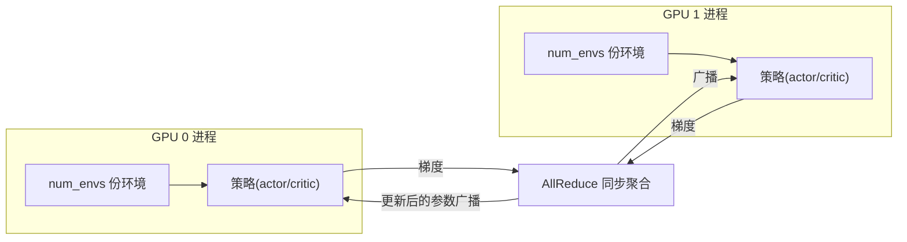

# 多卡与分布式训练

> 本页属于：deploy 部署与性能
> 前置知识：[[Domain随机化与Sim2Real]]
> 预计阅读时间：20 分钟

## 🎯 为什么需要这个？

单张 GPU 训练机器人任务，`num_envs` 加到几千就顶不住了（显存/算力不够）。机器人和视觉任务往往需要**更多并行环境**才能喂饱 GPU、缩短训练时间。多卡/分布式训练就是把采样负载分到多张卡上，让"环境总数 = 每卡环境数 × 卡数"。

## 💡 一个类比

- **单卡** = 一个厨师同时炒 4 口锅（num_envs=4）。
- **多卡** = 4 个厨师各炒 4 口锅（总 16 口）。每口锅的菜谱一样，但**每完成一轮，4 个厨师要把各自的"学到的经验"汇总同步一下**（梯度 AllReduce），再继续。

关键是：**仿真和采样在各自卡上独立跑，只有梯度更新时做一次全局同步**。

## 🐍 最小必要知识

| 概念 | 是什么 | 类比 |
|------|--------|------|
| **数据并行（Data Parallelism）** | 每卡一份完整环境副本 + 一份策略副本，采样独立、梯度聚合 | 4 个厨师并行炒菜，经验互相通报 |
| **`torchrun`** | PyTorch 官方多进程启动器，Isaac Lab 用它拉起每卡一个进程 | 排班系统：给每个厨师发任务 |
| **`--nproc_per_node`** | 每台机器用几张卡（进程数） | 每班几个厨师 |
| **AllReduce 梯度同步** | 每步更新前把各卡梯度求和取平均 | 收盘后汇总各灶台经验 |
| **每进程 `num_envs`** | 每个进程（每卡）各自的环境数 | 每个厨师管几口锅 |

关键事实（核对自官方 Multi-GPU 文档）：

- Isaac Lab 的多卡支持基于 **rsl_rl**（官方示例）与 rl_games，通过 `torchrun` 启动；**总环境数 ≈ 每进程 `num_envs` × 进程数**。
- 各进程**独立跑仿真与采样**，训练时梯度做全局同步——所以多卡主要赢在"采样吞吐"，而不是单步更快。
- 多节点（多台机器）同理，但需要集群环境（NCCL 网络通信），新手先从单机多卡开始。

## 🖼️ 图解：多卡训练的数据流

图 1 多卡分布式训练的数据流（来源：自绘 Mermaid，本地预览渲染；GitHub Wiki 上以代码块显示；访问于 2026-08-31）



## 📝 快速上手：单机多卡训练

**第 1 步：确认环境与卡数**

```bash
nvidia-smi          # 看有几张卡、显存占用
```

**第 2 步：用 torchrun 启动训练（rsl_rl 后端示例）**

```bash
# 2 卡训练：每进程 128 个环境，总环境数 ≈ 256
torchrun --nproc_per_node=2 \
  scripts/reinforcement_learning/rsl_rl/train.py \
  --task Isaac-Cartpole-v0 \
  --num_envs 128 \
  --headless
```

逐项理解：

- `--nproc_per_node=2`：本机开 2 个进程，各自绑定一张 GPU。
- `--num_envs 128`：**每个进程**的环境数（不是总数！）。
- `--headless`：分布式仿真几乎必须无渲染，否则显存/带宽都撑不住。

**第 3 步：看日志确认多卡生效**

训练日志/日志目录里应能看到进程编号与各卡分配；`logs/rsl_rl/<task>/` 下每个进程各写一份。若只看到单进程，说明 torchrun 参数没生效。

## 🗒️ 常见问题 FAQ

**Q1：多卡后速度没提升？**
先确认瓶颈：如果单卡时 GPU 利用率已接近 100%，多卡提升的是"总吞吐"；如果单卡利用率低，说明环境数太少——多卡前先把单卡 `num_envs` 加满，再考虑扩展卡数。

**Q2：每卡 `num_envs` 怎么定？**
按单卡显存/算力试：先跑单卡找一个"利用率接近满载"的 `num_envs`，多卡时保持这个值不变、只加卡数。**不要为了多卡把所有环境塞进一张卡**。

**Q3：minibatch 大小怎么调？**
总环境数变大后，若 batch/minibatch 不变，每卡梯度更碎。可相应调大 `num_minibatches`（rsl_rl 的 `num_mini_batches`）或学习率调度，但**一次只改一个**（见 [[训练调参与调试]]）。

**Q4：skrl 后端支持多卡吗？**
以你所用版本文档为准；官方多卡示例基于 rsl_rl/rl_games。想用 skrl 多卡，先查该版本 release notes 或 GitHub issues。

## ✏️ 小练习

**1.** 单卡 `num_envs=256` 利用率已 100%，想再提速，第一步该做什么？

<details>
<summary>查看答案</summary>

加卡（`--nproc_per_node=2`，每进程保持 256），总环境数翻倍，采样吞吐接近翻倍。此时注意梯度同步通信开销，实测为准。
</details>

**2.** `--num_envs 128 --nproc_per_node=4` 的总环境数大约是多少？如果这个数超出你的任务需要，会有什么问题？

<details>
<summary>查看答案</summary>

约 512（128×4）。环境太多会拖慢单次迭代（每轮 rollout 更长）、显存更紧张；如果任务本身简单，单卡就够，多卡反而有通信开销。
</details>

**3.** 多卡训练的"同步"发生在哪个环节？为什么不是每步都全量通信？

<details>
<summary>查看答案</summary>

梯度聚合（AllReduce）发生在策略更新前：各进程在本地采样、算梯度，更新时同步一次再广播新参数。采样/仿真全程并行无通信，所以吞吐主要取决于采样量。
</details>

## 本章小结

- 多卡 = 每卡一份环境+策略副本，采样并行、梯度 AllReduce 同步；总环境数 ≈ 每进程 `num_envs` × 进程数。
- 启动用 `torchrun --nproc_per_node=N ... --headless`（rsl_rl 官方示例）。
- 先保证单卡利用率接近满载，再加卡；minibatch/lr 随总环境数适当调整。

## 下一步

- 上一页：[[端到端实战案例]]
- 下一页：[[仿真加速与性能优化]]（多卡之外，单卡内的提速手段）
- 返回：[[Home]]

## 更新日志

- 2026-08-31：新增本页。来源：Isaac Lab 官方文档"Multi-GPU and Multi-Node Training"（<https://isaac-sim.github.io/IsaacLab/source/features/multi_gpu.html>，访问于 2026-08-31）。
