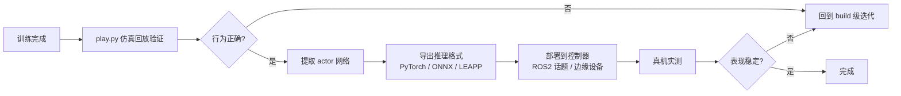

# 真机部署

> 本页属于：deploy 部署与性能
> 前置知识：[[仿真加速与性能优化]]
> 预计阅读时间：25 分钟

## 🎯 为什么需要这个？

训练收敛只是第一步——最终你要让**策略在真实机器人上跑起来**（或至少在实际控制回路里闭环）。从"权重文件"到"机器人动起来"，中间要解决：只取 actor 网络、观测预处理保持一致、推理引擎选择、与机器人控制器（ROS2）对接。

## 💡 一个类比

训练好比**写剧本并排练**（play.py 回放就是剧场彩排），真机部署是**正式演出**：

- 演员 = 机器人，导演指令 = 策略输出的动作。
- 你只需要"主演的台词本"（**actor 网络**），不需要"导演手册"（critic/特权观测）——那些只在排练（训练）时用。
- 台词本要**翻译成机器人听得懂的格式**（观测归一化、单位、频率）——漏一步，演出就砸了。

## 🐍 最小必要知识

| 概念 | 是什么 | 类比 |
|------|--------|------|
| **权重文件** | rsl_rl 的 `model_<iter>.pt`（含 actor/critic 的 state_dict）；skrl 的 `best_agent.pt`/`last_agent.pt`（Agent 对象） | 排练录像 |
| **Actor-only 推理** | 部署时只用策略网络，丢弃 critic/特权观测 | 只带主演台词本上台 |
| **观测预处理一致性** | 推理时的观测顺序、归一化、维度必须与训练完全一致 | 台词本必须和排练时同一版本 |
| **推理引擎** | PyTorch（简单）/ ONNX / TensorRT（快、可上边缘设备） | 演出设备的播放器 |
| **ROS2 对接** | 用 ROS2 话题把观测送进策略、把动作发给机器人驱动 | 后台对讲机 |
| **LEAPP** | Isaac Lab 官方的策略导出/优化工具链（面向部署的导出管线） | 官方舞台灯光师 |

## 🖼️ 图解：从训练到真机的部署管线

图 1 策略部署全流程（来源：自绘 Mermaid，本地预览渲染；GitHub Wiki 上以代码块显示；访问于 2026-08-31）



## 📝 操作一：仿真里回放（部署前必做）

```bash
# 加载最新权重回放（skrl 后端示例）
python scripts/reinforcement_learning/skrl/play.py \
  --task Template-isaaclabtutorial_env-v0 --num_envs 16
# 指定某个 checkpoint（rsl_rl 后端有 --checkpoint 参数）
# python scripts/reinforcement_learning/rsl_rl/play.py --task ... --checkpoint logs/rsl_rl/.../model_1000.pt
```

回放确认行为正确后，再进行导出与对接。

## 📝 操作二：只取 actor 并导出 ONNX（思路示例）

```python
import torch

# 1) 加载训练权重（rsl_rl 的 state_dict 为例：键含 actor/critic）
ckpt = torch.load("logs/rsl_rl/<task>/<时间戳>/model_1000.pt", map_location="cpu")
actor_state = {k: v for k, v in ckpt["model_state_dict"].items() if k.startswith("actor.")}

# 2) 重建 actor 网络并加载（网络结构要与训练配置一致）
#    这里以 rsl_rl 的 ActorCritic 为例，具体以你后端为准
# actor = ActorCritic(...)   # 从训练脚本里复用的类
# actor.load_state_dict(actor_state)
# actor.eval()

# 3) 导出 ONNX：固定输入形状 (batch, obs_dim)
# dummy = torch.zeros(1, obs_dim)
# torch.onnx.export(actor, dummy, "policy.onnx",
#                   input_names=["obs"], output_names=["action"],
#                   dynamic_axes={"obs": {0: "batch"}, "action": {0: "batch"}})
```

要点：

- **只导出 actor**：critic、特权观测（`"critic"` 观测组）不参与推理。
- **观测预处理必须与训练一致**：同一顺序、同一归一化（若训练时归一化了 obs，推理也要做同样的归一化）。
- 更省事的路径：用官方 LEAPP 导出管线（<https://isaac-sim.github.io/IsaacLab/source/policy_deployment/05_leapp/exporting_policies_with_leapp.html>），内置优化与验证。

## 📝 操作三：ROS2 对接（真机闭环）

官方推荐路线是 **isaac_ros_deploy**（NVIDIA-ISAAC-ROS 仓库）：把 Isaac Lab 训练的策略部署到真机与仿真 ROS2 环境，内置策略节点、话题接口与示例。整体对接模式：

```text
机器人传感器数据(观测)
        │  ROS2 话题(如 /observation)
        ▼
策略推理节点(加载 policy.onnx / PyTorch)
        │  ROS2 话题(如 /action)
        ▼
机器人驱动(执行器控制器)
```

要点：

- **频率匹配**：推理频率要与训练时的决策频率一致（`物理频率 ÷ decimation`），否则行为漂移。
- **单位与坐标系**：观测/动作的单位、坐标轴方向必须与训练配置一致，是"训练 100 分、真机 40 分"的最常见原因。
- 仿真端可用 `omni.isaac.ros2_bridge` 在 Isaac Sim 里起 ROS2 节点做闭环联调，先在仿真里跑通 ROS2 管线再上真机。

## 🗒️ 常见问题 FAQ

**Q1：部署时该用哪个权重？**
先看回放效果：`best_agent.pt`/`model_<最优迭代>.pt`（训练中评估最好的一版），而不是最后一步的权重（末步可能过拟合/发散）。

**Q2：真机表现差，仿真却很好？**
排查顺序：观测预处理是否一致（顺序/归一化）→ 控制频率与单位 → 传感器噪声差异 → 需要域随机化（[[Domain随机化与Sim2Real]]）补鲁棒性 → 数据采集闭环迭代。

**Q3：ONNX 导出的动作和训练时不一致？**
检查导出时是否 `eval()`、动作是否经过同样的 `action_scale` 映射、输出是否 clip 过（策略输出通常在 ±1 附近，控制端要按训练配置缩放）。

**Q4：不想用 ROS2 可以吗？**
可以：直接在真机控制器里加载 PyTorch/ONNX 推理即可。ROS2 的好处是话题解耦、便于联调与复用组件；简单项目直接内嵌推理更省事。

## ✏️ 小练习

**1.** 训练时用了 `"critic"` 特权观测，部署时要不要提供？

<details>
<summary>查看答案</summary>

不要。特权观测只给价值网络在训练时用，推理只用 `"policy"` 观测与 actor 网络。部署端提供不了真值，也是设计上不允许提供的。
</details>

**2.** "训练回放 100 分、真机 40 分"，按排查顺序说出前三个要核对的项目。

<details>
<summary>查看答案</summary>

① 观测预处理一致性（顺序、归一化、维度）；② 控制频率/单位/坐标系是否与训练一致；③ 传感器与执行器的真实噪声差异（必要时用域随机化补强）。
</details>

**3.** 部署推理频率应该设成多少？依据是什么？

<details>
<summary>查看答案</summary>

训练时的决策频率 = 物理频率 ÷ decimation（如 120Hz ÷ 2 = 60Hz）。推理频率应与之一致，否则策略看到的"时间感"和训练时不同，行为会漂移。
</details>

## 本章小结

- 部署三步走：play.py 回放验证 → 提取 actor 并导出（PyTorch/ONNX/LEAPP）→ 对接控制器（ROS2 或内嵌推理）。
- 部署只带 actor，特权观测与 critic 都不出场；观测预处理必须与训练严格一致。
- 频率、单位、坐标系是"仿真行、真机崩"的高频原因；配合域随机化做真机迭代闭环。

## 下一步

- 上一页：[[仿真加速与性能优化]]
- 下一页：返回 [[Home]]（deploy 级完成；全部五级共 26 页）
- 返回：[[Home]]

## 更新日志

- 2026-08-31：新增本页。来源：NVIDIA isaac_ros_deploy（<https://github.com/NVIDIA-ISAAC-ROS/isaac_ros_deploy>）、Isaac Lab 策略部署文档（<https://isaac-sim.github.io/IsaacLab/source/policy_deployment/index.html>、LEAPP 导出 <https://isaac-sim.github.io/IsaacLab/develop/source/policy_deployment/05_leapp/exporting_policies_with_leapp.html>）（访问于 2026-08-31）。
