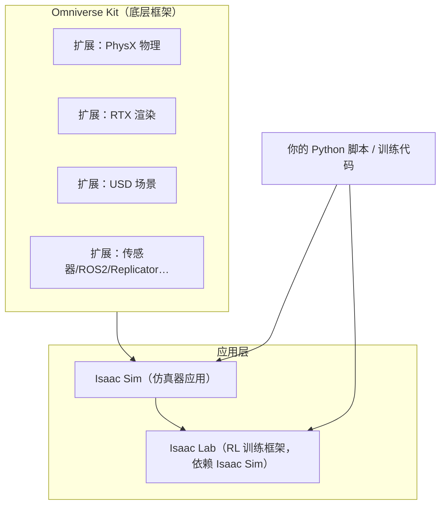

# Isaac Sim架构与核心概念

> 本页属于：intro 概念启蒙
> 前置知识：[[Isaac-Lab是什么]]
> 预计阅读时间：15 分钟

## 🎯 为什么需要这个？

[[Isaac-Sim是什么]] 讲了 Isaac Sim"是什么、解决什么问题"，但没讲清**它由什么组成、怎么启动**。你会听到一堆词——Kit、Extension、USD、PhysX、RTX、App…… 本页把这些"零件"摆上桌，让你看明白：Isaac Sim 不是一个大黑盒，而是**一套可以按需组装的模块化系统**。

## 💡 一个类比

把 Isaac Sim 想成一座**数字剧院**：

- **Omniverse Kit** = 剧院本身（场地、水电、管理系统）。Isaac Sim 是"租下这座剧院演机器人剧"的应用。
- **Extension（扩展）** = 可装卸的"功能包厢"：物理包厢（PhysX）、灯光包厢（RTX 渲染）、剧本包厢（USD 场景）、外联包厢（ROS2 桥接）……需要哪个装哪个。
- **USD** = 剧本 + 道具清单，描述台上有什么、怎么摆。
- **App** = 一场演出的启动入口（`python app.py` 拉起 Kit 并挂载需要的扩展）。

## 🐍 最小必要知识

| 概念 | 是什么 | 类比 |
|------|--------|------|
| **Omniverse Kit** | NVIDIA 的 3D 应用开发框架，Isaac Sim 的底层 | 剧院的场地与管理系统 |
| **Extension（扩展）** | Kit 上的功能模块，按需加载（物理/渲染/传感器/ROS2…） | 可装卸的功能包厢 |
| **USD** | 场景描述格式，Isaac Sim 的"世界文件" | 剧本 + 道具清单 |
| **PhysX** | 物理引擎扩展：刚体、关节、碰撞、重力 | 物理规则包厢 |
| **RTX 渲染** | GPU 光线追踪渲染扩展 | 灯光摄影包厢 |
| **SimulationApp** | Python 入口：启动 Kit App 并可选无头模式 | 演出的总开关 |
| **AppLauncher** | Isaac Lab 里的启动封装（自动拉起 Isaac Sim App） | 机器人剧组的总控台 |

## 🖼️ 图解：Isaac Sim 的分层架构

图 1 Isaac Sim 分层架构（来源：自绘 Mermaid，本地预览渲染；GitHub Wiki 上以代码块显示；访问于 2026-08-31）



关键点：**Isaac Sim 本身就是"一堆扩展组装成的 Kit 应用"**；Isaac Lab 又是架在 Isaac Sim 之上的另一层。你写训练代码时，其实在同时使用这三层。


> 图 2 官方 Isaac Sim GUI 平台示意（来源：<https://docs.isaacsim.omniverse.nvidia.com/latest/overview.html>，访问于 2026-09-01）

## 📝 启动方式对比（pip 版 vs 独立版）

| | **pip 版（推荐）** | **独立桌面版（弃用中）** |
|---|---|---|
| 安装方式 | `pip install isaacsim` 系列包 | Omniverse Launcher 安装 |
| 界面 | 可无头/可开 UI | 完整 UI |
| 适合 | 编程驱动、CI、Isaac Lab 训练 | 图形化编辑场景 |
| 现状 | 官方主推 | Omniverse Launcher 2025-10 起逐步弃用 |

本教程（[[安装与环境配置]]）采用 pip 版路线。

## 📝 最小启动示例：用 Python 拉起一个仿真 App

```python
# 1. 导入 SimulationApp 并启动（headless=True：不要画面，只算物理）
from isaacsim import SimulationApp

simulation_app = SimulationApp({"headless": True})   # ① 这是"演出总开关"

# 2. 此时 Kit 已启动、按需扩展已挂载，可以创建场景/传感器了
#    （本页先不展开，后续页会讲场景与物理）

# 3. 步进若干帧后关闭
for _ in range(100):
    simulation_app.update()                          # ② 每帧推进仿真

simulation_app.close()                               # ③ 收场
```

对照着读：

- **`SimulationApp`** 必须**在任何其他 isaacsim 导入之前**创建——这是 pip 版最著名的"铁律"，顺序错了会报错。
- `{"headless": True}` 是无头模式：不渲染画面，省 GPU/带宽，适合训练。
- 在 Isaac Lab 里你不直接写这些，而是用 `AppLauncher`（训练脚本顶部 `app_launcher = AppLauncher(arbitrary_envs=...)`），它会替你完成"拉起 App + 挂扩展"。

## 🤝 与 Isaac Lab 的联系

- Isaac Lab 通过 `AppLauncher` 复用本页讲的 App 启动机制（pip 版 + headless），见 [[安装与环境配置]] 与 [[运行第一个Demo]]。
- Lab 的训练循环就运行在"Kit + 扩展"之上：环境、物理、传感器都是 Isaac Sim 的能力，两工具协作总览见 [[Isaac-Sim与Isaac-Lab如何协作]]。

## ✏️ 小练习

**1.** 想给 Isaac Sim 加"ROS2 通信"能力，按模块化思想应该怎么做？

<details>
<summary>查看答案</summary>

加载对应的 Extension（如 ROS2 桥接扩展），而不是重新装一个 Isaac Sim。Kit 的扩展机制就是为"按需拼装"设计的。
</details>

**2.** `SimulationApp({"headless": True})` 里的 `headless` 关闭了什么？为什么训练常用它？

<details>
<summary>查看答案</summary>

关闭了渲染管线（不生成画面）。训练时画面不是必需的，关掉能省大量 GPU 与带宽，让算力留给物理与策略。
</details>

**3.** AppLauncher 和 SimulationApp 是什么关系？

<details>
<summary>查看答案</summary>

AppLauncher 是 Isaac Lab 对 SimulationApp 的封装：在你导入其他 isaacsim 模块前完成 App 启动与扩展挂载，并读取训练脚本的命令行参数（如 headless）。
</details>

## 本章小结

- Isaac Sim = 基于 Omniverse Kit 的应用，功能靠 Extension 按需组装（PhysX/RTX/USD/传感器等）。
- pip 版是官方主推路线，用 `SimulationApp` 启动，支持无头模式；独立版弃用中。
- Isaac Lab 的 AppLauncher 封装了 App 启动；本页建立了"三层结构"心智模型（Kit → Isaac Sim → Isaac Lab）。

## 下一步

- 上一页：[[Isaac-Lab是什么]]
- 下一页：[[Isaac-Sim与Isaac-Lab如何协作]]（两工具如何配合的全景）
- 返回：[[Home]]

## 更新日志

- 2026-08-31：新增本页。来源：NVIDIA 官方入门教程（<https://docs.nvidia.com/learning/physical-ai/getting-started-with-isaac-sim/latest/>）、Isaac Sim 文档（<https://docs.isaacsim.omniverse.nvidia.com/>）、Isaac Lab AppLauncher 源码（<https://github.com/isaac-sim/IsaacLab/blob/main/source/isaaclab/isaaclab/app/app_launcher.py>）（访问于 2026-08-31）。
