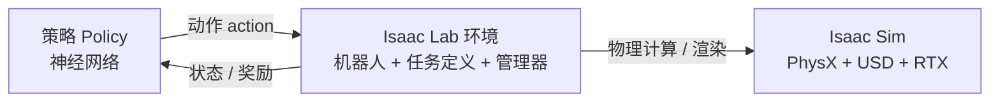

# Isaac-Lab是什么

> 本页属于：intro 概念启蒙
> 前置知识：[[Isaac-Sim是什么]]
> 预计阅读时间：10 分钟

## 🎯 为什么需要这个？

有了 Isaac Sim 这个"虚拟世界"，还差两样东西才能"让机器人学会技能"：

1. 一套把"机器人在环境里做动作、拿反馈"组织成标准接口的**训练环境**；
2. 一套把强化学习算法、并行训练、结果回放、导出策略都接好的**流水线**。

如果每次都从头搭，研究者会把大量时间浪费在重复劳动上。**Isaac Lab 就是把这套流水线做好、做模块化、开源的框架。**

## 💡 一个类比

- **Isaac Sim** = 健身房里的**场地 + 器械 + 物理规则**（地面、杠铃、重力）。
- **Isaac Lab** = **教练 + 训练计划 + 数据记录仪**：告诉机器人"现在该试什么动作、这次做得好不好、下一轮怎么调整"，并且能同时管理成千上万个"学员分身"。

一句话：**Isaac Sim 负责"这个世界怎么运转"，Isaac Lab 负责"机器人怎么在这个世界里学本领"。**

## 🐍 最小必要知识

| 术语 | 是什么 | 类比 |
|------|--------|------|
| **强化学习 (RL)** | 让智能体通过"试错 + 奖励"学习策略的方法 | 训练小狗：做对给零食，做错没零食 |
| **环境 (Environment)** | 智能体所处的世界 + 交互规则（给状态、收动作、回奖励） | 一局有规则的游戏 |
| **策略 (Policy)** | 从"看到的状态"到"做出的动作"的映射，通常是一个神经网络 | 机器人的"大脑/习惯" |
| **向量化/并行环境** | 同时开很多份相同环境，一次收集大量经验 | 同时开 4096 个考场，一起交卷批改 |
| **Gymnasium API** | 强化学习环境的标准接口（reset/step 等） | 统一"插座标准"，让不同电器都能插 |
| **模块化** | 把环境拆成动作、观测、奖励等可替换模块 | 乐高积木，零件可换 |

## 🤖 真实场景

你想让一个四足机器人学会"往前走"。用 Isaac Lab 的流程是：

1. 用 USD 把机器人加载进 Isaac Sim 场景；
2. 定义一个"任务"：状态是关节角度/速度，动作是关节目标，走得好加分、摔倒扣分；
3. 启动训练，Isaac Lab 同时开几百几千个环境并行采样；
4. 强化学习算法（如 PPO）更新策略，越练走得越稳；
5. 训练完把策略导出，回放看效果，或部署到真实机器人。

## 🖼️ 图解：训练闭环

> 策略看到状态 → 输出动作 → 环境在 Isaac Sim 里执行动作并推进物理 → 返回新状态和奖励 → 算法用奖励更新策略。循环往复，策略越来越聪明。

## ✏️ 小练习

**1.** 用一句话说清 Isaac Lab 和 Isaac Sim 的分工。

查看答案

Isaac Sim 提供物理仿真世界（舞台 + 物理引擎），Isaac Lab 提供强化学习训练框架（教练 + 流水线），负责定义环境、管理训练、更新策略。

**2.** "向量化环境"解决了什么问题？

查看答案

强化学习需要海量试错数据。向量化让同一环境同时运行很多份，并行收集经验，大幅缩短训练时间。

**3.** "策略"在 Isaac Lab 里通常是什么形式？

查看答案

通常是一个神经网络：输入当前观测（状态），输出要执行的动作；训练就是不断调整它的参数。

## 本章小结

- Isaac Lab 是开源、模块化的机器人学习框架，建立在 Isaac Sim 之上。
- 它把强化学习训练流水线化：环境定义、并行采样、算法训练、回放导出。
- 关键概念：强化学习、环境、策略、向量化、Gymnasium API、模块化。
- 两大工作流：Manager-Based（模块化）与 Direct（直接手写），train 会展开。

## 下一步

- 上一页：[[Isaac-Sim是什么]]
- 下一页：[[Isaac Sim架构与核心概念]]（深入 Isaac Sim 的组成与启动方式）
- 返回：[[Home]]

## 更新日志

- 2026-08-31：新增本页。来源：<https://isaac-sim.github.io/IsaacLab/main/index.html>（访问于 2026-08-31）。
