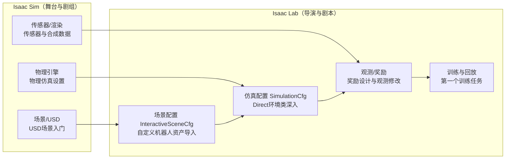

# Isaac-Sim与Isaac-Lab如何协作

> 本页属于：intro 概念启蒙
> 前置知识：[[Isaac Sim架构与核心概念]]
> 预计阅读时间：15 分钟

## 🎯 为什么需要这个？

前面几页分别认识了 Isaac Sim（仿真器）和 Isaac Lab（训练框架）。但真实项目里它们**不是两个孤立的软件**，而是一条流水线上的上下环节：Isaac Sim 提供"世界"，Isaac Lab 在这世界里"教机器人"。

本页是两条学习轨道的**合流点**：一张图看清"一个训练任务里，每一环由谁负责、去哪一页学"，并在每页之间搭好"桥"——之后你在 Isaac Lab 里看到的每个配置，都能对应回 Isaac Sim 里的一个概念。

## 💡 一个类比

- **Isaac Sim** = 舞台剧组（场景、物理、灯光、摄影、道具）。
- **Isaac Lab** = 导演团队（剧本：环境定义、奖励、训练流程）。
- 导演不亲自搬道具，而是**通过清单指挥剧组**：Isaac Lab 不直接"摆物体"，而是给 Isaac Sim 一份配置清单（`InteractiveSceneCfg`、`ArticulationCfg`），由 Isaac Sim 去实现。
- 训练脚本里 `AppLauncher` 拉起的，正是 Isaac Sim 这个"剧场"。

## 🖼️ 图解：一个训练任务的完整数据流

图 1 两工具在训练任务中的分工全景（来源：自绘 Mermaid，本地预览渲染；GitHub Wiki 上以代码块显示；访问于 2026-08-31）

## 🧩 逐环节对应表（本教程最重要的表）

| 环节 | Isaac Sim 侧（怎么建） | Isaac Lab 侧（怎么用） | 对应页面 |
|------|----------------------|----------------------|---------|
| **场景/资产** | Stage 里摆 USD prim、Reference 资产 | `InteractiveSceneCfg` + `ArticulationCfg(usd_path=...)` 声明式建场景 | [[USD场景入门]] ↔ [[自定义机器人资产导入]] |
| **物理** | Physics 面板：dt、重力、求解器 | `SimulationCfg(dt, gravity, physx=...)` | [[物理仿真设置]] ↔ [[Direct环境类深入]] |
| **传感器** | 相机/LiDAR/接触传感器扩展 | `CameraCfg`/`ContactSensorCfg`/`RayCasterCfg` → 观测 | [[传感器与合成数据]] ↔ [[奖励设计与观测修改]] |
| **启动** | `SimulationApp` 拉起 Kit App | `AppLauncher` 封装 + `train.py` | [[Isaac Sim架构与核心概念]] ↔ [[安装与环境配置]] |
| **视觉/渲染** | RTX 渲染、RTX LiDAR | 相机观测、合成数据喂 RL | [[渲染与LiDAR感知]] ↔ [[传感器与合成数据]] |
| **随机化** | 物理材质/初始状态手动随机 | `events` 字典 `RandomizationTermCfg` | [[物理仿真设置]] ↔ [[Domain随机化与Sim2Real]] |
| **部署** | 仿真回放、ROS2 桥接 | `play.py`、策略导出、isaac_ros_deploy | [[真机部署]] |

> 读法：横着看每一行，先学 Sim 侧"世界怎么造"，再看 Lab 侧"怎么配置进训练"——两条轨道逐环节咬合，不是两条平行线。

## 💡 同一概念，两种视角

很多概念在两边各有一副面孔，认出"是同一个东西"是关键：

| 概念 | Isaac Sim 视角 | Isaac Lab 视角 |
|------|---------------|----------------|
| 时间步 | Fixed Timestep（Physics 面板） | `SimulationCfg.dt` + `decimation`（决策频率） |
| 场景 | Stage / USD prim 树 | `InteractiveSceneCfg`（声明式） |
| 传感器 | 扩展/场景里的 sensor prim | `*Cfg` 配置类 → `data` 张量 |
| 随机化 | 手动改属性 | EventManager 的 `RandomizationTermCfg` |
| 渲染 | RTX 渲染器 | 相机观测张量 / 回放画面 |

## 🧭 学习心法：怎么"来回跳着学"

1. **先认概念，再认配置**：看到 Lab 配置（`SimulationCfg`、`UsdFileCfg`）时，回 Sim 页复习它对应的"物理/USD"概念——本页表格就是索引。
2. **改动前问一句**：我要改的是"世界"（Sim 侧）还是"训练逻辑"（Lab 侧）？改场景/物理/传感器→Sim 概念页；改奖励/观测/训练流程→Lab 页。
3. **跟着数据流走**：场景（Sim）→ 环境封装（Lab）→ 观测奖励（Lab）→ 训练回放（Lab + Sim 渲染）→ 部署（Lab + Sim 仿真），哪里断了回哪一页。

## ✏️ 小练习

**1.** 你想"把地面摩擦调小让机器人打滑"，应该去改哪一侧？对应哪两页？

查看答案

改"世界参数"→ Isaac Sim 侧（Physics Material/物理设置），对应 [[物理仿真设置]]；若在 Isaac Lab 训练中改，则是 `SimulationCfg`/材质绑定，可参考同页与 [[Domain随机化与Sim2Real]]。

**2.** 在 Isaac Lab 里写 `CameraCfg` 时，"相机"这个概念在 Isaac Sim 侧指什么？去哪里复习？

查看答案

指 Isaac Sim 场景里的传感器 prim（相机扩展）。Lab 的 `CameraCfg` 是它的声明式配置。复习 [[传感器与合成数据]] 与 [[渲染与LiDAR感知]]。

**3.** `ArticulationCfg(spawn=UsdFileCfg(usd_path=...))` 里的 `usd_path` 在 Isaac Sim 侧对应什么机制？

查看答案

对应 USD 的 Reference/Payload 复用机制（[[USD场景入门]]）：把外部 `.usd` 资产引用进场景，而不是复制内容。

## 本章小结

- Isaac Sim（舞台）与 Isaac Lab（导演）是流水线关系：Sim 造世界、Lab 教机器人。
- 本页"逐环节对应表"是两条轨道的索引：每个环节都有 Sim 页 ↔ Lab 页成对学习。
- 学会"同一概念两种视角"（时间步/场景/传感器/随机化），来回跳着学才不会迷路。

## 下一步

- 上一页：[[Isaac Sim架构与核心概念]]
- 下一页：[[安装与环境配置]]（把这一整套装好，开始动手）
- 返回：[[Home]]

## 更新日志

- 2026-08-31：新增本页（联动改造批）。来源：结合 Isaac Lab 文档（<https://isaac-sim.github.io/IsaacLab/source/overview/isaaclab.html>）与 Isaac Sim 文档（<https://docs.isaacsim.omniverse.nvidia.com/>）整理（访问于 2026-08-31）。
