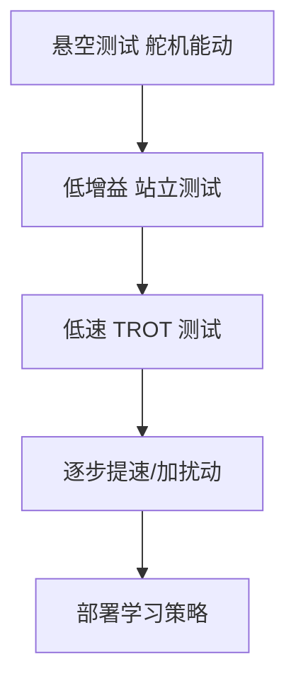

# sim2real对齐与安全

> 本页属于：robot StackForce 实战
> 前置知识：[[策略导出与真机部署]]
> 预计阅读时间：15 分钟

## 🎯 为什么需要这个？

仿真和真机永远有差异（舵机模型、摩擦、质量、IMU 噪声）。本页讲怎么缩小差距，以及真机实验的安全底线。

## 💡 一个类比

sim2real = 模拟器里练车 → 真车上路：先要对"方向盘手感/油门响应"做标定，再低速试驾。

## 核心对齐项

| 项 | 做法 |
|----|------|
| 舵机零点 | 用固件 `SERVO_OFFSET_1..8` 标定，让 0° 对应仿真初始角 |
| IMU 标定 | 上电 `calGyroOffsets()`，去零偏 |
| 力矩/刚度 | 实测舵机响应，回填 `ImplicitActuatorCfg` 的 stiffness/damping |
| 质量/惯量 | 称重后回填 URDF |
| 延迟 | 测 IMU→推理→舵机总延迟，加补偿或降频 |

## 真机实验安全流程

## 安全底线

- 每次实验前检查：急停开关、限位、低电量保护、手动接管。
- 先悬空（四脚离地）验证动作，再落地；落地先低增益。
- 真机抖振/发热立即停机，回仿真查奖励与动作平滑。

## 本章小结

- 对齐：零点、IMU、执行器、质量、延迟。
- 安全：悬空→低增益站立→低速→逐步提速；常备急停。

## 下一步

- 上一页：[[策略导出与真机部署]]
- 下一页：[[常见问题]]
- 返回：[[Home]]

## 更新日志

- 2026-08-31：新增本页。来源：本地固件 `SERVO_OFFSET`、`calGyroOffsets()`、lesson5 PID。
