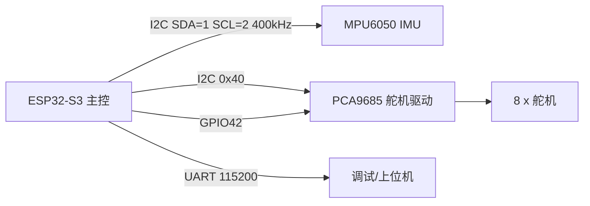

# 硬件与接口

> 本页属于：robot StackForce 实战
> 前置知识：[[Isaac-Sim是什么]]、[[Isaac-Lab是什么]]
> 预计阅读时间：15 分钟

## 🎯 为什么需要这个？

要做仿真和真机训练，先得知道**机器人由什么组成、怎么被控制**。本页把 StackForce 四轮足机器狗（仓库 `quadrupedal-wheeled-robot`）的硬件和接口讲清楚——仿真里的每一个关节、每一个传感器，都要对应真机上的一个真实设备。

## 💡 一个类比

硬件接口 = 机器人的"神经和肌肉清单"：**主控是大脑，I2C 总线是神经，舵机是肌肉，IMU 是前庭（平衡感），串口是嘴（对外说话）**。

## 🐍 最小必要知识（本机器人）

| 模块 | 型号/接口 | 作用 |
|------|-----------|------|
| 主控 | ESP32-S3-DevKitC-1（Arduino） | 跑步态/运动学/PID 控制 |
| IMU | MPU6050，I2C `0x68` | 姿态角 + 角速度（平衡反馈） |
| 舵机驱动 | PCA9685，I2C `0x40`，使能 GPIO42 | 输出 8 路 PWM 控制舵机 |
| 舵机 | 8 个（每条腿 2 个：α 肩 + β 膝） | 关节执行器，脉宽 500–2500µs，角度 0–300 |
| 通信 | UART 115200 | 当前仅调试输出 |

## 🤖 腿与舵机编号

每条腿 2 自由度，四腿共 8 舵机。固件 `setEightServoAngle` 的映射：

```text
腿        α(肩)   β(膝)   SERVO_OFFSET
右前腿     2       1         -3 / 5
左前腿     3       4        -10 / -23
右后腿     6       5         -5 / -15
左后腿     7       8         13 / -5
```

## 🖼️ 系统框图



## ✏️ 小练习

**1.** 8 个舵机分别控制什么？每条腿几个自由度？

<details>
<summary>查看答案</summary>

8 个舵机控制 4 条腿，每条腿 2 个（α 肩关节、β 膝关节），共 2 自由度/腿。
</details>

**2.** IMU 和舵机驱动分别挂在哪个 I2C 地址？

<details>
<summary>查看答案</summary>

IMU（MPU6050）地址 0x68；舵机驱动（PCA9685）地址 0x40。
</details>

## 本章小结

- 主控 ESP32-S3；IMU=MPU6050(0x68)；舵机=PCA9685(0x40)+GPIO42。
- 8 舵机、4 腿、每腿 2 自由度（α/β）。
- I2C 引脚：SDA=1、SCL=2、400kHz；串口 115200。

## 下一步

- 上一页：[[自定义机器人资产导入]]
- 下一页：[[模型与URDF]]
- 返回：[[Home]]

## 更新日志

- 2026-08-31：新增本页。来源：本地仓库 `/home/kytolly/Library/quadrupedal-wheeled-robot/课程代码`（SF_IMU.h / SF_Servo.h / main.cpp / config.h）。
