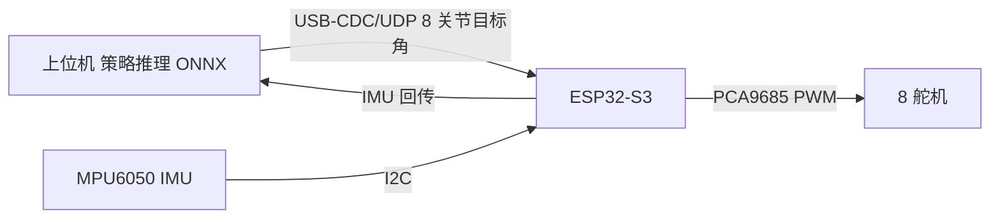

# 策略导出与真机部署

> 本页属于：robot StackForce 实战
> 前置知识：[[训练与调参]]
> 预计阅读时间：20 分钟

## 🎯 为什么需要这个？

仿真里训练好的策略是神经网络，而真机主控是 ESP32-S3（算力跑不动 NN）。本页讲怎么把策略导出来、在哪跑、怎么和舵机/IMU 通信。

## 💡 一个类比

策略 = "教练的大脑"。仿真时大脑在电脑里；真机时需要一个"随身大脑"（上位机）通过"数据线"（串口）指挥 ESP32-S3 的"肌肉"（舵机）。

## 核心结论：现阶段不需要 ROS2

- 固件是裸机 ESP32-S3 Arduino，无 ROS。
- Isaac Lab 训练走 Gymnasium，也不需要 ROS。
- **推荐方案**：上位机（PC/Jetson/RK3588）跑策略 → **USB-CDC 串口 / UDP** 把 8 关节目标角发给 ESP32-S3，ESP32-S3 只做舵机 PWM 输出与 IMU 回传。
- **ROS2 可选**：需要多传感器、可视化、多机、与 ROS 生态集成时，再引入 `micro-ROS`（板端）或上位机 `ros2` 节点。

## 🖼️ 部署架构



## 快速上手

```bash
# 导出 ONNX（Isaac Lab 提供 onnx 导出脚本/工具）
python scripts/tools/export_policy_as_onnx.py --task <Task> --checkpoint <ckpt>
```

```python
# 上位机推理 + 串口下发（伪代码）
import onnxruntime as ort, serial
sess = ort.InferenceSession("policy.onnx")
ser = serial.Serial("/dev/ttyACM0", 115200)
obs = get_obs()                    # 从 IMU/编码器组装观测
action = sess.run(None, {"obs": obs})[0]   # 8 关节目标角
ser.write(encode_cmd(action))      # 发给 ESP32-S3
```

## 关键对齐

- **控制频率**：仿真 dt 与真机下发频率一致（如 50Hz）；不一致会抖动。
- **动作范围**：把策略输出映射到舵机角度范围（0–300）与脉宽（500–2500µs）。
- **延迟**：IMU 回传 + 推理 + 串口传输的总延迟要测量并补偿。

## 本章小结

- 策略导出 ONNX；上位机推理，ESP32-S3 只管执行。
- 通信用 USB-CDC/UDP 即可；ROS2 非必须，需要时再上 micro-ROS/ros2。
- 对齐：频率、动作范围、延迟。

## 下一步

- 上一页：[[训练与调参]]
- 下一页：[[sim2real对齐与安全]]
- 返回：[[Home]]

## 更新日志

- 2026-08-31：新增本页。来源：Isaac Lab 部署文档 + 本地固件接口（PCA9685/MPU6050/串口）。
