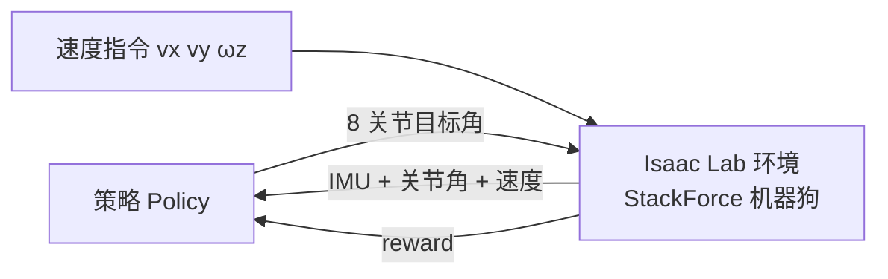

# 运动任务设计

> 本页属于：robot StackForce 实战
> 前置知识：[[导入Isaac-Lab]]、[[强化学习核心概念]]
> 预计阅读时间：20 分钟

## 🎯 为什么需要这个？

要让机器狗学会"按指令走路"，需要把"走"定义成一个强化学习任务：给什么观测、输出什么动作、做得好不好怎么打分。

## 💡 一个类比

任务设计 = 给教练写"训练大纲"：学员看到什么（观测）、能做什么（动作）、什么算做好（奖励）、什么时候算失败（终止）。

## 核心概念

| 项 | 本机器人取值 |
|----|--------------|
| 观测 observation | IMU(角速度/姿态)、base 线速度、8 关节位置/速度、上一步动作 |
| 动作 action | 8 个关节目标角（或增量），映射到舵机角度范围 |
| 指令 command | 目标 vx/vy/ωz（前向、侧向、转向） |
| 奖励 reward | 速度跟踪 + 姿态保持 + 能耗/平滑惩罚 |
| 终止 terminations | 侧翻、机身触地、超时 |

## 🖼️ 训练闭环



## 奖励设计（示例）

```python
# 速度跟踪奖励：越接近指令速度分越高
track = torch.exp(-((base_vel - cmd) ** 2).sum(-1) / 0.25)
# 姿态惩罚：机身越平越好
attitude = -0.5 * torch.square(roll) - 0.5 * torch.square(pitch)
# 能耗惩罚：动作变化越小越好
smooth = -0.01 * torch.square(action - last_action).sum(-1)
reward = track + attitude + smooth
```

## ✏️ 小练习

**1.** 观测里为什么要包含"上一步动作"？

<details>
<summary>查看答案</summary>

帮助策略感知执行滞后和动力学连续性，减少抖动、提升平滑性。
</details>

**2.** 指令里 vx/vy/ωz 分别代表什么？

<details>
<summary>查看答案</summary>

vx 前向、vy 侧向、ωz 绕竖直轴的转向角速度——这是四轮足桌面狗的核心机动能力。
</details>

## 本章小结

- 观测=IMU+速度+关节；动作=8 关节目标角；指令=vx/vy/ωz。
- 奖励=速度跟踪+姿态+平滑；终止=侧翻/触地/超时。
- 这是从"固定步态"到"学习步态"的关键一步。

## 下一步

- 上一页：[[导入Isaac-Lab]]
- 下一页：[[训练与调参]]
- 返回：[[Home]]

## 更新日志

- 2026-08-31：新增本页。来源：Isaac Lab locomotion 任务范式（velocity command）。
