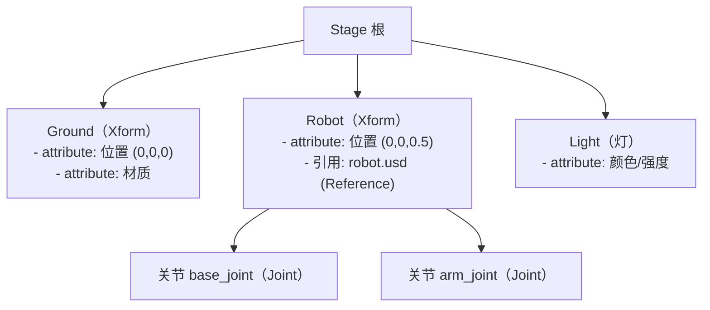

# USD场景入门

> 本页属于：setup 环境与 Demo
> 前置知识：[[运行第一个Demo]]
> 预计阅读时间：20 分钟

## 🎯 为什么需要这个？

Isaac Sim 里的"世界"就是**场景**，而场景的载体是 **USD**。想给机器人加障碍物、换地面、摆箱子、改位置——本质上都是在改 USD。不懂 USD，你连"场景里有什么、在哪改"都无从下手；懂了它，[[自定义机器人资产导入]]、[[传感器与合成数据]] 都顺理成章。

## 💡 一个类比

USD 场景文件 = **一张"带目录的巨型道具清单 + 说明书"**：

- **Stage（舞台）**：整个场景的根容器，好比剧场的大楼。
- **Prim（条目）**：清单上的一行——一个地面、一盏灯、一个机器人，都是一个 prim。类比"道具单上的每一项"。
- **Attribute（属性）**：条目的具体内容——位置、颜色、质量。类比"道具的摆放坐标、颜色备注"。
- **Relationship（关系）**：条目之间的联系（谁挂在谁下面、谁引用谁）。
- 整个清单是**文本/二进制文件**（`.usda`/`.usd`），可被多软件读取——这就是"通用场景描述"的由来。

## 🐍 最小必要知识

| 概念 | 是什么 | 类比 |
|------|--------|------|
| **USD** | Universal Scene Description（OpenUSD）：场景描述标准 | 带目录的道具清单格式 |
| **Stage** | USD 场景的根，所有 prim 都在它下面 | 剧场大楼 |
| **Prim** | 场景里的一个元素（Xform/Mesh/Sphere/RigidBody…） | 道具清单的一行 |
| **Attribute** | prim 的属性：transform（位置/旋转/缩放）、颜色、质量… | 道具的备注栏 |
| **Relationship** | prim 之间的引用/从属关系 | 道具之间的连接说明 |
| **文件格式** | `.usda`（文本可读）/ `.usd`（二进制）/ `.usdz`（打包） | 清单的纸版/电子版/压缩版 |
| **Reference / Payload** | 把外部资产"引用"进场景，可复用 | 直接引用仓库的现货 |

## 🖼️ 图解：USD 场景层级示例

图 1 一个简单场景的 USD 层级树（来源：自绘 Mermaid，本地预览渲染；GitHub Wiki 上以代码块显示；访问于 2026-08-31）



理解方式：**从上往下读就是"目录树"**；每个节点（prim）下的"attribute: …"就是它的属性。场景编辑器里看到的结构，和这个树一一对应。

## 📝 操作：用 Python 创建一个最小场景

Isaac Sim 里两种玩法：**UI 拖拽**（Stage 面板直接看树、改属性）和 **Python 编程**。下面是编程方式的最小示例（看懂结构即可，不必现在运行）：

```python
# 1. 启动 App（必须在导入其他模块之前）
from isaacsim import SimulationApp
simulation_app = SimulationApp({"headless": False})   # 开 UI 方便看效果

# 2. 创建/获取场景（Stage）：每个 App 有一个默认 stage
from pxr import Usd, UsdGeom, UsdLux
stage = Usd.Stage.CreateNew("my_scene.usda")          # ① 新建一个空场景文件

# 3. 在根下创建 prim（道具清单加一行）
ground = UsdGeom.Xform.Define(stage, "/World/Ground") # ② 定义 Ground：Xform 类型
# 4. 给 prim 加属性：设置位置（translate）
UsdGeom.XformCommonAPI(ground).SetTranslate((0, 0, 0))  # ③ 设 transform 属性

# 5. 再放一盏灯（灯光也是一种 prim）
UsdLux.DistantLight.Define(stage, "/World/Sun")        # ④ 加光源
UsdLux.DistantLight(UsdGeom.XformCommonAPI)            # （示意：光照参数略）

stage.Save()                                           # ⑤ 保存成 .usda 文件
simulation_app.close()
```

对照着读：

- `UsdGeom.Xform.Define(stage, "/World/Ground")`：在路径 `/World/Ground` 定义 prim——**路径就是它在目录树里的位置**。
- `SetTranslate((0,0,0))`：设置位置属性，`UsdGeom.XformCommonAPI` 是常用 transform 的便捷接口。
- prim 的"类型"（Xform/Mesh/RigidBody…）决定它能带什么属性、能否被物理引擎识别。

> 日常开发中你很少手写这么多行——更多是**加载现成场景/资产**（见 [[自定义机器人资产导入]]）或**用界面操作**。本页目标：读得懂 USD 树、知道属性在哪改。

## 🗒️ 常见问题 FAQ

**Q1：`.usda` 和 `.usd` 有什么区别？**
内容相同，格式不同：`.usda` 是文本（人可以读、可 diff），`.usd` 是二进制（加载快），`.usdz` 是打包压缩。调试时用 `.usda` 方便。

**Q2：场景里看不到物理效果（物体穿透/不动）？**
Prim 光"存在"还不够：物理引擎只处理有**刚体（RigidBody）与碰撞体（Collision）** 属性的 prim。这属于 [[物理仿真设置]] 的内容。

**Q3：想复用别人的机器人/资产文件？**
用 Reference/Payload 引用外部 `.usd`，而不是复制粘贴——这正是 [[自定义机器人资产导入]] 里 `spawn=UsdFileCfg(usd_path=...)` 的原理。

**Q4：在 Isaac Sim UI 里怎么看这个树？**
打开 Stage 面板即可看到 prim 树；选中 prim 后在属性面板（Property）改 attribute——和代码改的是同一个东西。

## ✏️ 小练习

**1.** 场景文件里写着 `/World/Robot/arm_joint`，这表示什么层级关系？

<details>
<summary>查看答案</summary>

在根 `/World` 下有 prim `Robot`，`Robot` 下又有 prim `arm_joint`——路径即层级，从上到下是"包含/从属"关系。
</details>

**2.** 想让地面出现在场景里，除了"放一个地面模型"，还要满足什么才能被物理引擎识别？

<details>
<summary>查看答案</summary>

要有刚体（RigidBody）与碰撞体（Collision）属性（地面常用"静态刚体+碰撞"），否则物理引擎不认识它——详见 [[物理仿真设置]]。
</details>

**3.** 复用别人做好的机器人 USD，应该"复制文件"还是"引用"？为什么？

<details>
<summary>查看答案</summary>

用 Reference/Payload 引用。好处：不重复占用、资产更新一处全部生效、场景文件更小——这也是 Isaac Lab `UsdFileCfg` 的做法。
</details>

## 本章小结

- USD 是 Isaac Sim 的场景语言：Stage 为根，Prim 为元素，Attribute 为属性，路径即层级。
- 改场景 = 改 USD（界面或代码二选一）；`.usda` 文本格式适合调试。
- 物理引擎只认"带刚体/碰撞属性"的 prim；复用资产用 Reference 而不是复制。

## 下一步

- 上一页：[[运行第一个Demo]]
- 下一页：[[物理仿真设置]]（让场景里的物体真的"动起来"且"像真的"）
- 返回：[[Home]]

## 更新日志

- 2026-08-31：新增本页。来源：Isaac Sim 文档 OpenUSD Fundamentals（<https://docs.isaacsim.omniverse.nvidia.com/latest/omniverse_usd/open_usd.html>）、Isaac Lab Spawning prims 教程（<https://github.com/isaac-sim/IsaacLab/blob/main/docs/source/tutorials/00_sim/spawn_prims.rst>）（访问于 2026-08-31）。
