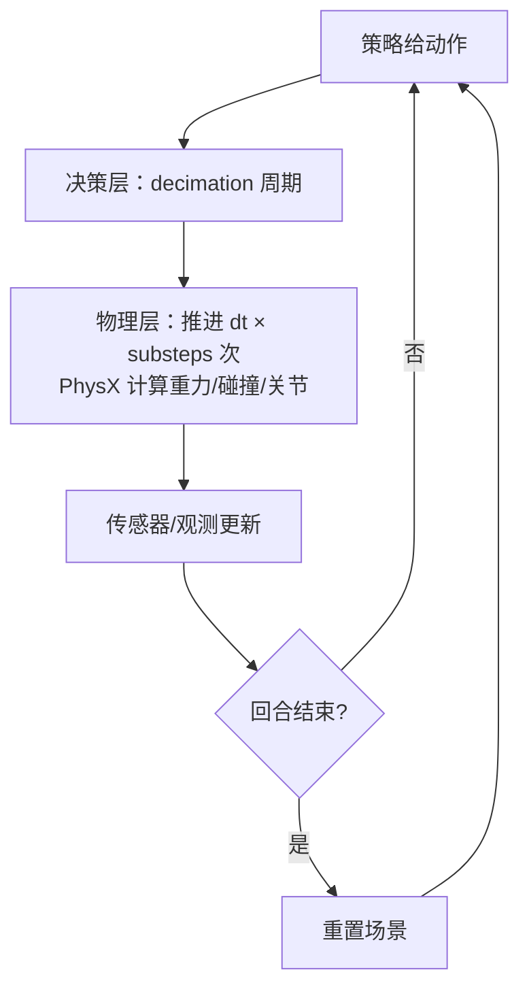

# 物理仿真设置

> 本页属于：setup 环境与 Demo
> 前置知识：[[USD场景入门]]
> 预计阅读时间：20 分钟

## 🎯 为什么需要这个？

[[USD场景入门]] 让你把物体"摆进"了场景，但它们还是"死的"——要让它**像真实世界一样下落、碰撞、受关节驱动**，靠的是物理引擎（PhysX）与一套时间/参数设置。物理参数配错了，训练出来的策略在真机上就是废的（"仿真里会走，真机上摔"的常见根源之一）。

## 💡 一个类比

物理引擎 = **世界的"自然法则执行器"**，配置参数 = **法则里的常数**：

- `dt`（时间步） = 法则的计算精度：步长越小越精确，也越贵。
- 重力、摩擦 = 法则的常数：`g=9.81`，摩擦系数决定"滑不滑"。
- 求解器（solver） = 解"碰撞方程"的算法：迭代越多越准、越慢。
- 决策频率（[[Direct环境类深入]] 的 decimation） = "法则检查"和"你下令"之间的比例。

## 🐍 最小必要知识

| 概念 | 是什么 | 类比 |
|------|--------|------|
| **PhysX** | Isaac Sim 默认物理引擎（GPU/CPU 均可） | 自然法则执行器 |
| **时间步 `dt`** | 两次物理计算之间的时间间隔（如 1/120 秒） | 法则的刷新精度 |
| **substeps（子步）** | 每帧内部多算几次物理，提高精度 | 一帧里"细算几次" |
| **`SimulationCfg`** | Isaac Lab 里的仿真配置类（dt/重力/子步/设备） | 法则参数面板 |
| **`PhysxCfg`** | 求解器细节配置（求解器类型/迭代/线程） | 算法微调旋钮 |
| **刚体/碰撞体** | prim 上声明"有质量、会碰撞"的属性 | 给道具加上"实心"标签 |
| **关节/约束（Joint）** | 连接两个刚体并限制相对运动 | 铰链、滑轨 |
| **材质（Physics Material）** | 摩擦、弹性等表面属性 | 道具表面的"滑/糙"参数 |

## 🖼️ 图解：仿真循环中的物理

图 1 一个决策周期内的物理推进（复习 + 细化，来源：自绘 Mermaid，本地预览渲染；GitHub Wiki 上以代码块显示；访问于 2026-08-31）



时间关系：**决策周期 = `dt × substeps` 的物理推进 × decimation**。调小 `dt`、调大 `substeps` 都会更"真"，但更慢。


> 图 2 官方 physics 时间步与刚体示意（来源：<https://docs.isaacsim.omniverse.nvidia.com/latest/physics/simulation_fundamentals.html>，访问于 2026-09-01）

## 📝 配置示例：Isaac Lab 里的仿真参数

训练/环境配置里通过 `SimulationCfg` 与 `PhysxCfg` 控制（以 [[Manager-Based工作流入门]] 的配置类为例）：

```python
from isaaclab.sim import SimulationCfg, PhysxCfg

@configclass
class MyEnvCfg(ManagerBasedRLEnvCfg):
    # ---- 仿真主配置 ----
    sim = SimulationCfg(
        dt=1/120,                  # ① 物理时间步：1/120 秒（常见默认）
        substeps=1,                # ② 每个物理步内子步数：1 表示不再细分
        gravity=(0.0, 0.0, -9.81), # ③ 重力：向下 9.81 m/s²
        use_fabric=True,           # ④ 使用 USD Fabric 加速数据读写
        device="cuda:0",           # ⑤ 仿真设备
        physx=PhysxCfg(
            use_gpu=True,          # ⑥ GPU 物理求解
            solver_type=1,         # ⑦ 求解器类型（1=TGS，常用）
            num_threads=8,         # ⑧ CPU 线程数（GPU 求解时影响小）
            max_position_iterations=8,  # ⑨ 位置迭代次数：越大越稳越慢
        ),
    )
```

对照着读：

- `dt` 是**物理步长**，决策频率 = `dt × substeps × decimation` 的倒数（复习 [[Direct环境类深入]]）。
- `use_fabric=True`：数据直接走 GPU 内存（Fabric），是 Isaac Sim 5.x 起的加速开关。
- `solver_type=1`（TGS）是常用选择；`max_position_iterations` 越大越防穿透，但越慢。
- 独立 Isaac Sim（非 Isaac Lab）里这些参数在 **Physics 面板** 设置，对应关系一致：Fixed Timestep、Gravity、Solver Type 等。

## 🗒️ 常见问题 FAQ

**Q1：物体穿透地面/互相穿模？**
先确认 prim 有刚体+碰撞体；再把 `dt` 调小或 `max_position_iterations` 调大；高速物体（如投掷）用 CCD（连续碰撞检测）选项。

**Q2：仿真"太滑"或"太黏"？**
调 Physics Material：摩擦系数（static/dynamic friction）太小=滑，阻尼/摩擦太大=黏。材质可绑定到具体 prim（`bind_physics_material`）。

**Q3：训练结果和真机差很多，和物理设置有关吗？**
有关：`dt`/求解精度影响动力学特性；真机与仿真参数（质量、摩擦）的差异由 [[Domain随机化与Sim2Real]] 补。先保证仿真参数贴近真机标定值。

**Q4：`dt` 调小后训练变慢怎么办？**
看 [[仿真加速与性能优化]]：先开 headless、加 `num_envs`；`substeps` 一般保持 1，用 `decimation` 控制决策频率而不是狂调 `dt`。

## ✏️ 小练习

**1.** `SimulationCfg(dt=1/120, substeps=2)` 表示一次物理计算实际推进多少时间？每秒物理次数是多少？

<details>
<summary>查看答案</summary>

一次物理计算推进 1/120 秒；子步 2 表示每帧内部连续算 2 次（合计仍是 1/120×2 的"精算"）。物理频率由 dt 决定（120Hz），substeps 是帧内细化，不影响名义 dt。
</details>

**2.** 物体老是穿透地面，按排查顺序列出三个可调项。

<details>
<summary>查看答案</summary>

① 确认有刚体+碰撞体属性；② 调小 `dt` 或调大 `max_position_iterations`；③ 高速场景开启 CCD（连续碰撞检测）。
</details>

**3.** 想让"仿真手感"贴近真实机器人，物理上要校准哪些参数？

<details>
<summary>查看答案</summary>

质量、重心、摩擦系数（材质）、关节阻尼/力矩上限、`dt` 与求解精度；校准后仍有差距再用域随机化覆盖（见 [[Domain随机化与Sim2Real]]）。
</details>

## 本章小结

- 物理引擎（PhysX）+ 时间步（dt/substeps）+ 刚体/碰撞/关节/材质，共同决定仿真"真不真"。
- Isaac Lab 用 `SimulationCfg`/`PhysxCfg` 配置；独立 Isaac Sim 在 Physics 面板对应设置。
- 时间关系：决策周期 = dt × substeps × decimation；性能与真实度要权衡。

## 下一步

- 上一页：[[USD场景入门]]
- 下一页：[[学习路线与下一步]]（串起 setup 阶段，进入训练）
- 返回：[[Home]]

## 更新日志

- 2026-08-31：新增本页。来源：Isaac Sim 文档 Physics Simulation Fundamentals（<https://docs.isaacsim.omniverse.nvidia.com/latest/physics/simulation_fundamentals.html>）、Isaac Lab PhysX 配置文档（<https://isaac-sim.github.io/IsaacLab/develop/source/overview/core-concepts/physical-backends/physx/configuration.html>）、SimulationCfg 源码（<https://isaac-sim.github.io/IsaacLab/v2.3.1/_modules/isaaclab/sim/simulation_cfg.html>）（访问于 2026-08-31）。
