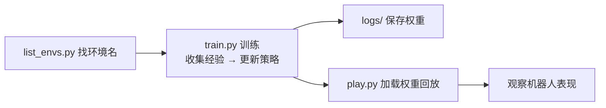

# 运行第一个Demo

> 本页属于：setup 环境与 Demo
> 前置知识：[[安装与环境配置]]
> 预计阅读时间：15 分钟

## 这是什么工具？

本页用三个官方命令带你"跑通第一个 Demo"：列环境 → 训练一个小任务 → 回放训练好的策略。类比：**先看菜单，再点一道最简单的菜，最后尝一口**。

## 核心概念

| 概念 | 是什么 | 类比 |
|------|--------|------|
| **Task / 环境名** | 一个可训练任务的注册名，如 `Isaac-Cartpole-v0` | 菜单上的菜名 |
| **RL 后端 (rsl_rl/skrl/sb3)** | 实现训练算法的库，可换 | 不同的"教练" |
| **`--headless`** | 不渲染画面，只算物理，省资源 | 关灯也能练 |
| **`--num_envs`** | 并行环境的份数 | 同时开几个考场 |
| **play.py** | 加载训练好的策略并回放 | 考试结束后的"表演录像" |

## 快速上手

进入 IsaacLab 目录后，依次运行：

```bash
cd IsaacLab

# 第 1 步：列出所有可用环境（很快，只打印列表，不训练）
./isaaclab.sh -p scripts/environments/list_envs.py

# 第 2 步：训练一个最简单的倒立摆任务（headless 无画面，收敛快）
./isaaclab.sh -p scripts/reinforcement_learning/rsl_rl/train.py \
  --task Isaac-Cartpole-v0 --num_envs 32 --headless

# 第 3 步：回放训练好的策略（带画面，看杆子被稳稳立住）
./isaaclab.sh -p scripts/reinforcement_learning/rsl_rl/play.py \
  --task Isaac-Cartpole-v0 --num_envs 32
```

> 若想换后端，把 `rsl_rl` 换成 `skrl` 即可，例如 `python scripts/reinforcement_learning/skrl/train.py --task=Isaac-Ant-v0`（Ant 四足行走，训练更久）。

## 主要功能详解

| 命令 | 作用 | 什么时候用 |
|------|------|-----------|
| `list_envs.py` | 列出 Task 名、entry point、config | 找环境、确认环境名 |
| `train.py` | 训练策略 | 开始学习一个任务 |
| `play.py` | 回放策略 | 看效果、录视频、导出演示 |

**训练过程的常见现象**：终端会打印 episode 长度、平均奖励等指标；Cartpole 这类简单任务，几十秒到几分钟内 reward 就会上升并稳定。

## 完整工作流程



## 常见问题 FAQ

**Q1：`--headless` 是什么？**
不启动渲染画面，只在后台算物理，省显存、速度快，适合服务器训练。

**Q2：训练好的权重存在哪？**
默认在 `logs/<backend>/<task>/<时间戳>/` 下，`play.py` 会自动加载最新权重。

**Q3：想少用点显存？**
减小 `--num_envs`，例如 `--num_envs 16`；或加 `--headless`。

**Q4：报错找不到 task？**
先跑 `list_envs.py` 确认任务名；任务名大小写和 `-v0` 后缀要一致。

**Q5：Cartpole 训练没收敛？**
简单任务也可能受随机种子影响；增加训练步数或换 `--task Isaac-Cartpole-v0` 再试。先确认能跑通、能回放即可。

## 速查卡片

```text
列环境: ./isaaclab.sh -p scripts/environments/list_envs.py
训练:   ./isaaclab.sh -p scripts/reinforcement_learning/rsl_rl/train.py --task Isaac-Cartpole-v0 --num_envs 32 --headless
回放:   ./isaaclab.sh -p scripts/reinforcement_learning/rsl_rl/play.py --task Isaac-Cartpole-v0 --num_envs 32
```

## 本章小结

- 三步跑通：list_envs 找环境、train.py 训练、play.py 回放。
- 后端可换（rsl_rl / skrl / sb3），环境名用 `list_envs.py` 查。
- `--headless` 与 `--num_envs` 是省资源的两个常用开关。
- 跑通本页，就完成了 setup 的"能运行官方 demo"目标。

## 下一步

- 上一页：[[安装与环境配置]]
- 下一页：[[学习路线与下一步]]
- 返回：[[Home]]

## 更新日志

- 2026-08-31：新增本页。来源：Isaac Lab Quickstart（训练/列环境命令）与源码目录结构（<https://github.com/isaac-sim/IsaacLab>）（访问于 2026-08-31）。
