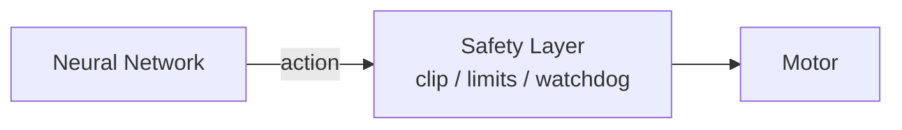

# M1-05-硬件API与安全

> 本页属于：stackforce 机器狗实战（M1 实操）
> 前置知识：[[M1-04-机械参数与重量]]
> 预计阅读时间：20 分钟

## 🎯 为什么需要这个？

把硬件封装成统一 API、建立 Logger 和安全层。这样未来 RL 代码不直接碰 can.send(...)，仿真与实机上层代码尽可能一致。

## 第四部分：建立 Hardware API

封装：

```python
class StackForceRobot:
    def enable(self): ...
    def disable(self): ...
    def emergency_stop(self): ...
    def read_joint_positions(self): ...
    def read_joint_velocities(self): ...
    def read_imu(self): ...
    def get_observation(self): ...
    def set_joint_positions(self, q): ...
    def set_wheel_velocities(self, dq): ...
```

架构：

```text
                    Policy
                       │
                     action
                       │
                       ▼
                StackForceRobot
                       │
           ┌───────────┴───────────┐
           ▼                       ▼
       Simulator                  Real
       Adapter                   Adapter
           │                       │
       Isaac Sim               CAN/MCU
```

最终追求：

```text
obs = robot.get_observation()
action = policy(obs)
robot.send_action(action)
```

## 第五部分：建立 Logger（第一天就做）

```text
logs/
```

每个控制周期记录 timestamp + IMU(roll/pitch/yaw/gyro/acc) + Joint(q[12]/dq[12]) + Command(q_des/dq_des/tau_des) + System(battery_voltage/loop_dt)。

CSV 即可：

```text
time,pitch,gyro_y,FL_hip_pos,FL_hip_cmd,...
0.000,...
0.005,...
0.010,...
```

以后 System Identification 全靠这些数据。

## 第六部分：安全系统（必须在 RL 之前完成）

至少实现：

```text
Emergency Stop
  ├── keyboard / physical button
  └── motor disable
```

软件 safety layer：

```text
q_min < q_d < q_max
|dq_d| < dq_safe
|τ|   < τ_safe
```

以及：

```text
通信超时        → disable
Policy 超时无输出 → disable
pitch/roll 超限 → safe state
异常/NaN       → disable
```

RL 的 Safety Layer **永远不能绕过**：



## M1 最终验收标准

| 层 | 验收 |
|----|------|
| 硬件层 | 知道每个 actuator/sensor 是什么、ID、通信方式 |
| 状态层 | 实时读 IMU、关节位置/速度、轮速，并解释数值物理意义与正方向 |
| 控制层 | 架空后能从 Python 安全地单独控制任意关节和轮子 |
| 建模层 | 完整 12-DOF Joint Map、轴方向、零位、限位、关键轴心尺寸 |
| 工程层 | 有 StackForceRobot API、logger、watchdog、emergency stop |

做到这里，**Milestone 1 才算真正完成**。

## ✏️ 小练习

**1.** 为什么 Safety Layer 不能被 RL 绕过？

<details>
<summary>查看答案</summary>

RL 输出不可预测，必须由独立于策略的限幅/watchdog/急停兜底，否则异常动作会直接损坏机器人。
</details>

## 本章小结

- 封装 StackForceRobot API + Sim/Real Adapter。
- 第一天建 Logger（CSV）。
- 安全系统：急停 + 限幅 + watchdog + NaN 检测，RL 不可绕过。
- 按 5 层验收标准判定 M1 完成。

## 下一步

- 上一页：[[M1-04-机械参数与重量]]
- 下一页：[[M2-URDF建模]]
- 返回：[[Home]]

## 更新日志

- 2026-09-02：新增本页。来源：用户 M1 实操路线（第四/五/六部分 + 验收标准）。
