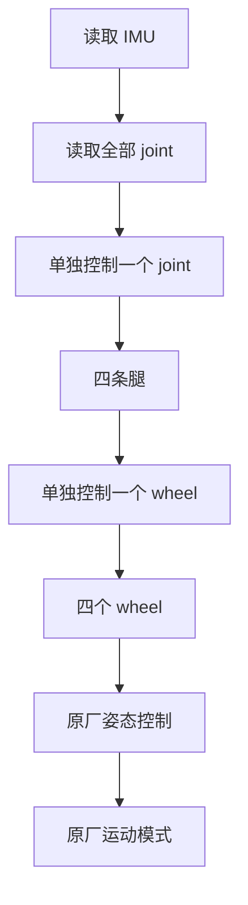

# M1-硬件吃透

> 本页属于：stackforce 机器狗实战
> 前置知识：[[Roadmap与里程碑]]
> 预计阅读时间：20 分钟

## 🎯 为什么需要这个？

不先吃透硬件，仿真里"positive=forward"、实机"positive=backward"，RL 策略一上实机就是灾难。M1 的目标是：**能独立读所有传感器、控制所有 actuator**，并且把每个"?"都确认成确定值。

## Phase 0：吃透官方资料

```bash
git clone https://gitee.com/StackForce/quadrupedal-wheeled-robot.git
```

官方仓库目前有：

```text
Structure/       3D 打印 STL
课程代码/        PlatformIO 项目（随课程更新）
README.md
```

> StackForce 平台本身提供主控、FOC、电机、IMU、CAN/RS485 等模块，并支持 Python 接入外部计算平台；课程代码是随课更新的教学入口。

## Hardware Interface Table（第一张必须做出来）

**所有 "?" 都要从代码/实验确认，不要猜。**

| Component | State | Command | Rate |
|-----------|-------|---------|------|
| wheel FL | velocity | torque/velocity | ? Hz |
| wheel FR | velocity | torque/velocity | ? Hz |
| wheel RL | velocity | torque/velocity | ? Hz |
| wheel RR | velocity | torque/velocity | ? Hz |
| leg joints | position | position | ? Hz |
| IMU | quat/gyro/acc | — | ? Hz |

## Phase 1：实机原厂控制（按顺序通关）

```text
读取 IMU
   ↓
读取全部 joint
   ↓
单独控制一个 joint
   ↓
四条腿
   ↓
单独控制一个 wheel
   ↓
四个 wheel
   ↓
原厂姿态控制
   ↓
原厂运动模式
```

## 必须确认的清单

- **Joint ID / Joint zero / Joint direction / Joint limits**
- **Wheel direction / Motor limits**
- **Control frequency / Communication protocol**

## ⚠️ 尤其重要：joint direction

如果仿真 `positive = forward`、实机 `positive = backward`，RL 策略一上实机就是灾难。这是 M1 最不能省的检查项。

## 🖼️ 原厂控制金字塔



## 从开源课程代码已确认的部分（供核对，仍需实机复核）

| 项 | 课程代码里是 | 注意 |
|----|--------------|------|
| 主控 | ESP32-S3（PlatformIO/Arduino） | 平台完整版可能有更多模块 |
| IMU | MPU6050（I2C 0x68） | 确认是否与实机一致 |
| 舵机 | PCA9685（I2C 0x40）+ 8 舵机（每腿 α/β） | 平台版可能改为 FOC 电机 |
| 通信 | UART 115200 | 平台版可能为 CAN/RS485 |

> 课程代码可能只是教学简化版，与"StackForce 平台完整版"（FOC、电机、CAN/RS485、轮速闭环）可能有差异，**以实机/官方平台资料为准**。

## ✏️ 小练习

**1.** Hardware Interface Table 里 "?" 为什么不能猜？

<details>
<summary>查看答案</summary>

因为频率、方向、限位等直接影响后续 URDF、动力学和 RL 训练；猜错会在 Sim2Real 阶段集中爆发。
</details>

**2.** joint direction 对不上会怎样？

<details>
<summary>查看答案</summary>

策略输出的"前进"在实机变成"后退"，动作完全错误，可能直接损坏机器人。
</details>

## 本章小结

- Phase 0：clone 仓库、盘点 Structure/课程代码/README。
- 做 Hardware Interface Table，所有 "?" 从代码/实验确认。
- Phase 1：IMU→joints→单关节→四腿→单轮→四轮→姿态→运动模式。
- 重点：joint/wheel 的 ID、零位、方向、限位、频率、协议。

## 下一步

- 上一页：[[Roadmap与里程碑]]
- 下一页：[[M2-URDF建模]]
- 返回：[[Home]]

## 更新日志

- 2026-09-02：新增本页。来源：用户 Roadmap + 本地仓库 `quadrupedal-wheeled-robot/课程代码`。
