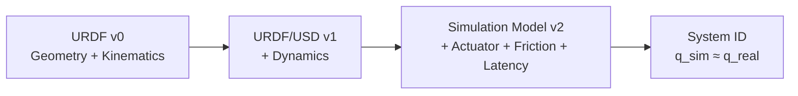

# M2-05-到Isaac-Lab与系统辨识

> 本页属于：stackforce 机器狗实战（M2 实操）
> 前置知识：[[M2-04-视觉碰撞与动力学]]
> 预计阅读时间：20 分钟

## 🎯 为什么需要这个？

URDF 完成 ≠ 模型完成。本页串起最后三步：URDF→USD→Isaac Lab Asset，并建立"几何/动力学/仿真模型"三层认知，最后用系统辨识把仿真和实机对齐。

## 阶段 12：URDF 到 Isaac Sim

```text
stackforce_quadruped.urdf + meshes/
      ↓ Isaac Sim → File / Import → URDF
生成 USD
```

先只验证 Stage 结构：

```text
Stage
└── StackForce
    ├── base
    ├── FL... FR... RL... RR...
```

再检查 articulation。

## 阶段 13：建立 Isaac Lab Asset

```python
STACKFORCE_CFG = ArticulationCfg(
    spawn=sim_utils.UsdFileCfg(
        usd_path="stackforce_quadruped.usd",
    ),
    actuators={
        "legs": ImplicitActuatorCfg(
            joint_names_expr=[".*_hip_joint", ".*_knee_joint"],
            stiffness=..., damping=..., effort_limit=..., velocity_limit=...,
        ),
        "wheels": ImplicitActuatorCfg(
            joint_names_expr=[".*_wheel_joint"],
            ...
        ),
    },
)
```

命名规范的好处在这里体现：`.*_hip_joint`、`.*_knee_joint`、`.*_wheel_joint` 可自动匹配四条腿。

## 阶段 14：URDF 完成 ≠ 模型完成

| 版本 | 内容 | 回答的问题 |
|------|------|-----------|
| **URDF v0** | Geometry + Kinematics | 长得对不对？关节位置对不对？ |
| **URDF/USD v1** | + Dynamics | 质量、COM、惯量是否合理？ |
| **Simulation Model v2** | + Actuator + Friction + Latency | 动起来是否像真实机器人？ |

最后做 **System Identification**：

```text
Real Robot ──same command──► q_real(t)
Isaac Sim ──same command──► q_sim(t)
           ↓ compare
调整：mass / COM / inertia / damping / friction / Kp / Kd / motor strength / latency
直到：q_sim(t) ≈ q_real(t)
```

## 🖼️ 模型分层



## ✏️ 小练习

**1.** URDF v0 / v1 / v2 分别回答什么问题？

<details>
<summary>查看答案</summary>

v0 几何与运动学对不对；v1 质量/COM/惯量合理吗；v2 动起来像不像真机（执行器/摩擦/延迟）。
</details>

**2.** System Identification 的本质是什么？

<details>
<summary>查看答案</summary>

同一命令分别驱动实机与仿真，对比 q(t) 并调整动力学/执行器参数，直到两者响应基本重合。
</details>

## 本章小结

- URDF→USD→ArticulationCfg，用 regex 分组 legs/wheels。
- 三层模型认知：v0 几何 → v1 动力学 → v2 执行器/摩擦/延迟。
- 系统辨识让 q_sim(t) ≈ q_real(t)。

## 下一步

- 上一页：[[M2-04-视觉碰撞与动力学]]
- 下一页：[[M3-动力学对齐]]（进入 Sim/Real 对齐）
- 返回：[[Home]]

## 更新日志

- 2026-09-02：新增本页。来源：用户 URDF 路线（阶段 12–14）。
