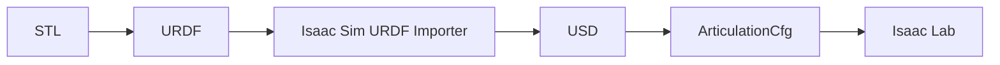

# M2-URDF建模

> 本页属于：stackforce 机器狗实战
> 前置知识：[[M1-硬件吃透]]
> 预计阅读时间：20 分钟

## 🎯 为什么需要这个？

吃透硬件后，才建立机器人的"数字孪生"——URDF。M2 目标：**Isaac Sim 中所有 joint / mesh 正确**。先求运动学正确，再补动力学。

## 💡 一个类比

URDF = 机器人的"骨骼说明书"。先让骨头数量、关节轴、转向都对（运动学），再填每块骨头的重量（动力学）。

## Phase 2：从 STL 建 link 树与 joint 树

从官方 `Structure/*.stl` 建立 link：

```text
base_link
front_left_hip / front_left_thigh / front_left_lower_leg / front_left_wheel
front_right_...
rear_left_...
rear_right_...
```

概念上的 joint tree：

```text
                      base_link
            ┌────────────┼────────────┐
            │            │            │
           FL           FR           ...
            │
         hip joint
            │
          thigh
            │
        knee joint
            │
        lower leg
            │
       wheel joint
            │
          wheel
```

> **具体自由度数量和拓扑必须根据 StackForce 四轮足实机/代码确认，不要凭视频猜。**

## Phase 3：URDF v0.1 只追求运动学正确

Version 0.1 先保证：

```text
mesh ✓   link ✓   joint ✓
joint axis ✓   joint origin ✓   joint limits ✓
```

导入 Isaac Sim 后**逐个拖动每个 joint** 检查方向：

```text
FL joint +1 rad → 实机对应方向？
FR joint +1 rad → 对吗？
RL? RR? wheel?
```

目标是：

```text
q_sim = q_real   （定义和方向一致）
```

## Phase 4：动力学 URDF（第二版）

第二版加入 inertial：`m`（质量）、`r_COM`（质心）、`I`（惯量）：

```xml
<inertial>
    <origin xyz="0 0 0" rpy="0 0 0"/>
    <mass value="0.2"/>
    <inertia ixx="..." ixy="0" ixz="0" iyy="..." iyz="0" izz="..."/>
</inertial>
```

STL 可帮 CAD 算 volume / center of geometry / inertia，但 **STL 不知道真实质量**——里面还有电机、轴承、螺丝、电池、PCB、线缆、舵机。所以最好实测：**整机重量、每条腿重量、轮子重量、body 重量**，再校正 CAD 模型。

## Phase 5：Isaac Lab Asset

URDF 验证后转 USD，再写 Isaac Lab 配置：

```python
STACKFORCE_CFG = ArticulationCfg(
    spawn=sim_utils.UsdFileCfg(
        usd_path="stackforce.usd",   # URDF → USD 后的资产
    ),
    # init_state、actuators 等见 M4
)
```

## 🖼️ 资产管线



## ✏️ 小练习

**1.** URDF v0.1 和动力学 URDF 的区别？

<details>
<summary>查看答案</summary>

v0.1 只求运动学正确（mesh/link/joint/axis/origin/limits）；动力学版再补 inertial（质量/质心/惯量）。
</details>

**2.** STL 能直接给出真实质量吗？

<details>
<summary>查看答案</summary>

不能。STL 只有几何，可算体积/质心/惯量，但真实质量要实测（电机、电池、线缆等都在里面）。
</details>

## 本章小结

- 先建 link 树 + joint 树，DOF/拓扑按实机确认。
- v0.1 只做运动学，逐个 joint 检查 +1 rad 方向，目标 q_sim = q_real。
- 第二版补 inertial，质量以实测为准。
- 最后 STL→URDF→USD→ArticulationCfg→Isaac Lab。

## 下一步

- 上一页：[[M1-硬件吃透]]
- 下一页：[[M2-01-自由度与命名]]（M2 实操手册，5 页）
- 返回：[[Home]]

## 更新日志

- 2026-09-02：新增本页。来源：用户 Roadmap（Phase 2–5）。
