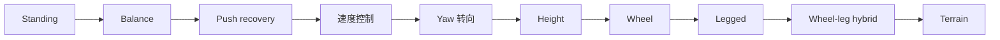

# M4-Isaac-Lab训练

> 本页属于：stackforce 机器狗实战
> 前置知识：[[M3-动力学对齐]]
> 预计阅读时间：20 分钟

## 🎯 为什么需要这个？

动力学对齐后，才开始 RL。M4 目标：**仿真稳定 balance + velocity tracking**。第一版不要做"万能机器狗"。

## 第一个任务只做：Stand / Balance

```text
Stand / Balance
```

## Observation（观测）

```text
projected gravity
base angular velocity
joint position
joint velocity
wheel velocity
previous action
```

> **最重要原则：Actor observation 只能用将来实机能获得的信息，不要让 Actor 偷看 Isaac Sim 的完美世界坐标。**

## Action 设计（两条路线）

**路线 A：RL → position target（推荐第一版）**

```text
Policy → desired joint position → PD Controller → motor
```

安全很多。

**路线 B：RL → torque**

```text
a_t → τ
```

更接近直接动力学控制，但更难训练、更难 Sim-to-Real、实机风险更高。**第一版不要用。**

## Curriculum（课程式训练，按顺序）

```text
1. Standing
2. Balance
3. Push recovery
4. Forward velocity
5. Backward velocity
6. Yaw turning
7. Height control
8. Wheel locomotion
9. Legged locomotion
10. Wheel-leg hybrid
11. Terrain
```

> 不要第一天就 `stairs + wheel + walking + jumping + turning` 一起训练。

## 🖼️ Curriculum 阶梯



## ✏️ 小练习

**1.** 为什么第一版用 position target 而不是 torque？

<details>
<summary>查看答案</summary>

position target + PD 更安全、更好训练、更好 Sim-to-Real；torque 直接控制更接近动力学但风险高。
</details>

**2.** 为什么 curriculum 不能第一天全训？

<details>
<summary>查看答案</summary>

任务过难、奖励信号混杂，策略难收敛；由易到难才能逐步学会。
</details>

## 本章小结

- 第一个任务只做 Stand/Balance。
- 观测只放实机能获得的量。
- 动作先 position target；curriculum 从 Standing 到 Terrain 逐步来。

## 下一步

- 上一页：[[M3-动力学对齐]]
- 下一页：[[M5-鲁棒性]]
- 返回：[[Home]]

## 更新日志

- 2026-09-02：新增本页。来源：用户 Roadmap（Phase 7–9）。
